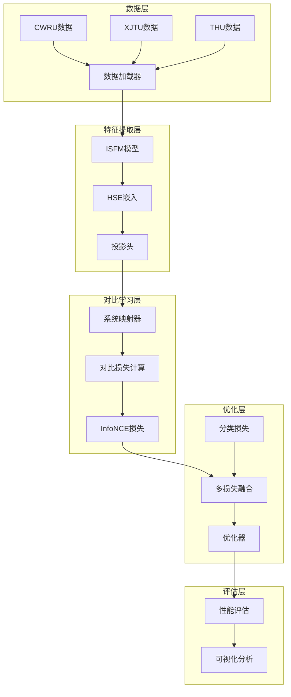
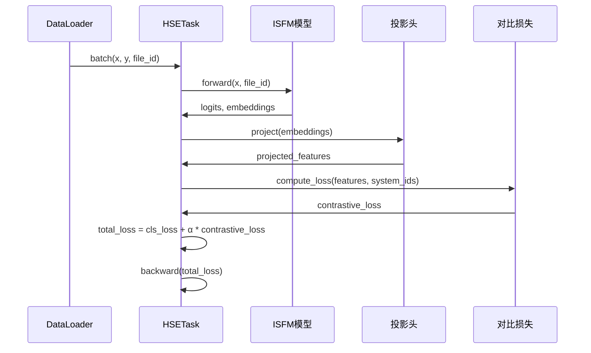

# 设计文档：HSE异构对比学习 - 理论与实现

## 概述

本文档详细描述HSE（Heterogeneous System Embedding）异构对比学习的设计原理、理论基础和实现架构，旨在通过系统级对比学习实现跨系统故障诊断的突破性进展。

## 理论基础

### 对比学习理论

#### InfoNCE损失的数学基础

对于给定的特征表示 $z_i$，InfoNCE损失定义为：

```math
\mathcal{L}_{InfoNCE} = -\log \frac{\exp(z_i \cdot z_j^+ / \tau)}{\sum_{k=1}^{K} \exp(z_i \cdot z_k / \tau)}
```

其中：
- $z_j^+$ 是与 $z_i$ 来自同系统的正样本
- $z_k$ 是负样本集合
- $\tau$ 是温度参数

#### 系统不变性理论

**定义1（系统不变特征）**：特征 $f(x)$ 是系统不变的，当且仅当对于任意系统 $s_1, s_2$ 和相同故障类型 $c$：
```math
\mathbb{E}[f(x)|x \sim D_{s_1,c}] \approx \mathbb{E}[f(x)|x \sim D_{s_2,c}]
```

**定理1（对比学习的系统不变性保证）**：在适当的负采样策略下，InfoNCE损失能够学习系统不变特征。

*证明思路*：通过最大化同系统内相同故障类型样本的相似度，同时最小化不同系统或不同故障类型样本的相似度，模型被迫学习系统无关的故障表征。

### HSE特征空间几何

#### 特征分布分析

在HSE空间中，理想的特征分布应满足：

1. **类内聚合**：相同故障类型的样本在特征空间中聚集
2. **类间分离**：不同故障类型的样本在特征空间中分离
3. **系统不变**：不同系统的相同故障类型样本重叠

#### 温度参数的理论意义

温度参数 $\tau$ 控制softmax分布的"锐度"：
- $\tau \to 0$：分布趋向one-hot，强化hard negative
- $\tau \to \infty$：分布趋向均匀，弱化对比效果

**最优温度选择**：根据特征维度和批量大小，理论最优温度为：
```math
\tau^* = \sqrt{\frac{d}{2\log(N-1)}}
```

## 系统架构设计

### 整体架构



### 核心组件设计

#### 1. HSE对比任务类 (HSEContrastiveTask)

```python
class HSEContrastiveTask(Default_task):
    """
    HSE异构对比学习任务类
    
    核心创新:
    1. 系统级对比学习
    2. Momentum特征更新
    3. Hard negative mining
    4. 多尺度特征融合
    """
    
    def __init__(self, network, config):
        super().__init__(network, config)
        self.momentum_encoder = self._build_momentum_encoder()
        self.projection_head = self._build_projection_head()
        self.system_mapper = SystemMapper(config.metadata)
        self.contrastive_loss = InfoNCELoss(
            temperature=config.temperature,
            use_hard_negatives=config.use_hard_negatives
        )
```

#### 2. 系统映射器 (SystemMapper)

**功能**：自动识别和映射系统标识

**算法流程**：
1. 从元数据提取系统信息
2. 构建系统相似度矩阵
3. 层次化聚类相似系统
4. 生成系统标签映射

```python
class SystemMapper:
    def __init__(self, metadata):
        self.metadata = metadata
        self.system_hierarchy = self._build_hierarchy()
    
    def _build_hierarchy(self):
        # 基于设备类型、工况、采样率等构建层次
        pass
    
    def get_system_id(self, file_id):
        # 返回样本的系统标识
        pass
```

#### 3. InfoNCE损失计算器

**核心算法**：
```python
class InfoNCELoss(nn.Module):
    def __init__(self, temperature=0.07, use_hard_negatives=True):
        super().__init__()
        self.temperature = temperature
        self.use_hard_negatives = use_hard_negatives
    
    def forward(self, features, system_ids):
        # 1. 特征归一化
        features = F.normalize(features, dim=1)
        
        # 2. 相似度计算
        similarity_matrix = torch.matmul(features, features.T) / self.temperature
        
        # 3. 构建正负样本掩码
        positive_mask = self._build_positive_mask(system_ids)
        
        # 4. Hard negative mining (可选)
        if self.use_hard_negatives:
            similarity_matrix = self._hard_negative_mining(similarity_matrix)
        
        # 5. 计算InfoNCE损失
        return self._compute_infonce(similarity_matrix, positive_mask)
```

#### 4. Momentum编码器

**理论依据**：使用momentum更新避免特征坍塌

```python
class MomentumEncoder(nn.Module):
    def __init__(self, encoder, momentum=0.999):
        super().__init__()
        self.encoder = encoder
        self.momentum_encoder = deepcopy(encoder)
        self.momentum = momentum
    
    def update_momentum_encoder(self):
        for param_q, param_k in zip(
            self.encoder.parameters(), 
            self.momentum_encoder.parameters()
        ):
            param_k.data = param_k.data * self.momentum + \
                          param_q.data * (1 - self.momentum)
```

## 数据流设计

### 训练流程



### 特征提取流程

1. **多层特征提取**
   ```python
   def extract_multi_scale_features(self, x, file_id):
       # Layer-wise特征提取
       features = {}
       for layer_idx in self.target_layers:
           features[f'layer_{layer_idx}'] = self.network.get_layer_output(x, layer_idx)
       
       # 多尺度融合
       fused_features = self.feature_fusion(features)
       return fused_features
   ```

2. **特征增强策略**
   - 时序数据增强（时间遮蔽、频域变换）
   - 特征dropout和noise injection
   - Mixup在特征空间的应用

### 系统识别与映射

#### 自适应系统聚类

```python
def adaptive_system_clustering(self, metadata):
    """
    基于设备特征的自适应系统聚类
    """
    # 提取系统特征向量
    system_features = []
    for system_id in metadata.system_ids:
        features = {
            'sampling_rate': metadata.get_sampling_rate(system_id),
            'sensor_type': metadata.get_sensor_type(system_id),
            'equipment_type': metadata.get_equipment_type(system_id),
            'operating_conditions': metadata.get_conditions(system_id)
        }
        system_features.append(features)
    
    # 层次化聚类
    clustering = AgglomerativeClustering(
        n_clusters=None, 
        distance_threshold=0.5
    )
    system_groups = clustering.fit_predict(system_features)
    
    return system_groups
```

## 优化策略设计

### 多目标优化框架

#### 损失函数设计

```math
\mathcal{L}_{total} = \mathcal{L}_{cls} + \alpha \cdot \mathcal{L}_{contrastive} + \beta \cdot \mathcal{L}_{regularization}
```

其中：
- $\mathcal{L}_{cls}$：分类损失（交叉熵）
- $\mathcal{L}_{contrastive}$：对比损失（InfoNCE）
- $\mathcal{L}_{regularization}$：正则化项（L2、特征平滑等）

#### 动态权重调整

**自适应权重策略**：
```python
def adaptive_weight_scheduling(self, epoch, performance_metrics):
    """
    基于性能指标的自适应权重调整
    """
    if performance_metrics['domain_gap'] > threshold:
        # 增强对比学习权重
        self.contrast_weight *= 1.1
    else:
        # 减少对比学习权重，专注分类
        self.contrast_weight *= 0.95
    
    return min(max(self.contrast_weight, 0.01), 1.0)
```

### 梯度协调机制

**Multi-Task梯度平衡**：
```python
def gradient_coordination(self, losses):
    """
    PCGrad: 项目冲突梯度到正交空间
    """
    grads = {}
    for task, loss in losses.items():
        grads[task] = torch.autograd.grad(loss, self.parameters(), retain_graph=True)
    
    # 计算梯度冲突并投影
    coordinated_grads = self.pcgrad(grads)
    return coordinated_grads
```

## 评估与可视化设计

### 评估指标体系

#### 定量指标
1. **跨系统准确率**：$Acc_{cross} = \frac{1}{|T|}\sum_{t \in T} Acc_t$
2. **域差距**：$Gap = Acc_{source} - Acc_{target}$
3. **系统不变性度量**：$INV = 1 - \frac{\text{Var}_{systems}(Acc)}{\text{Mean}_{systems}(Acc)}$

#### 定性指标
1. **t-SNE可视化**：特征空间的聚类效果
2. **混淆矩阵**：跨系统的错误模式分析
3. **注意力热力图**：模型关注的信号区域

### 可视化工具

#### 特征空间可视化
```python
def visualize_feature_space(self, features, labels, system_ids):
    # t-SNE降维
    tsne = TSNE(n_components=2, random_state=42)
    features_2d = tsne.fit_transform(features)
    
    # 绘制散点图
    plt.figure(figsize=(12, 8))
    
    # 按故障类型着色，按系统形状区分
    for fault_class in np.unique(labels):
        for system_id in np.unique(system_ids):
            mask = (labels == fault_class) & (system_ids == system_id)
            plt.scatter(
                features_2d[mask, 0], 
                features_2d[mask, 1],
                label=f'Class{fault_class}-Sys{system_id}',
                alpha=0.6
            )
    
    plt.legend()
    plt.title('HSE Feature Space Visualization')
    plt.savefig('hse_feature_space.pdf', dpi=300)
```

#### 训练过程监控
```python
def log_training_metrics(self, metrics):
    wandb.log({
        'train/classification_loss': metrics['cls_loss'],
        'train/contrastive_loss': metrics['contrast_loss'],
        'train/total_loss': metrics['total_loss'],
        'train/feature_diversity': metrics['feature_diversity'],
        'train/system_separation': metrics['system_separation'],
        'learning/temperature': self.temperature,
        'learning/contrast_weight': self.contrast_weight
    })
```

## 性能优化设计

### 计算效率优化

#### 批量对比学习
```python
def efficient_contrastive_computation(self, features, batch_size):
    """
    大批量高效对比学习计算
    """
    # 使用分块计算避免OOM
    chunk_size = min(batch_size, 256)
    total_loss = 0
    
    for i in range(0, batch_size, chunk_size):
        chunk_features = features[i:i+chunk_size]
        chunk_loss = self._compute_chunk_loss(chunk_features, features)
        total_loss += chunk_loss
    
    return total_loss / (batch_size // chunk_size)
```

#### 缓存机制
```python
class FeatureCache:
    def __init__(self, max_size=10000):
        self.cache = {}
        self.max_size = max_size
        self.access_count = {}
    
    def get_or_compute(self, key, compute_fn):
        if key in self.cache:
            self.access_count[key] += 1
            return self.cache[key]
        
        if len(self.cache) >= self.max_size:
            self._evict_lru()
        
        features = compute_fn()
        self.cache[key] = features
        self.access_count[key] = 1
        return features
```

### 分布式训练支持

#### AllGather对比学习
```python
def distributed_contrastive_loss(self, features, system_ids):
    """
    跨GPU收集特征进行对比学习
    """
    if torch.distributed.is_initialized():
        # 收集所有GPU的特征
        gathered_features = self._all_gather(features)
        gathered_system_ids = self._all_gather(system_ids)
        
        # 计算全局对比损失
        global_loss = self.contrastive_loss(gathered_features, gathered_system_ids)
        return global_loss
    else:
        return self.contrastive_loss(features, system_ids)
```

## 实验设计

### 消融研究设计

1. **对比学习组件消融**
   - 无对比学习 (α=0)
   - InfoNCE vs. SimCLR vs. SwAV
   - 不同温度参数设置

2. **特征提取组件消融**
   - 不同层次的特征融合
   - 有/无投影头
   - 不同投影头维度

3. **系统映射策略消融**
   - 手工系统标签 vs. 自动聚类
   - 不同聚类算法对比
   - 层次化 vs. 扁平化映射

### 对比实验设计

#### SOTA方法复现
```python
sota_methods = {
    'DANN': DANNTrainer,
    'CORAL': CORALTrainer,
    'MMD': MMDTrainer,
    'CDAN': CDANTrainer,
    'MCD': MCDTrainer,
    'SHOT': SHOTTrainer,
    'NRC': NRCTrainer,
    'HSE-CL': HSEContrastiveTrainer  # 我们的方法
}
```

#### 评估协议
1. **标准协议**：70%训练，30%测试
2. **Few-shot协议**：每类5/10/20样本
3. **Zero-shot协议**：无目标域标签
4. **Fine-tuning协议**：预训练+微调

## 代码质量保证

### 单元测试设计
```python
class TestHSEContrastiveLoss(unittest.TestCase):
    def test_infonce_computation(self):
        # 测试InfoNCE损失计算正确性
        pass
    
    def test_system_mapping(self):
        # 测试系统映射功能
        pass
    
    def test_feature_extraction(self):
        # 测试特征提取稳定性
        pass
```

### 代码规范
- **类型提示**：所有函数使用类型提示
- **文档字符串**：Google风格文档
- **代码格式**：Black + isort
- **静态检查**：mypy + flake8

## 总结

本设计文档提供了HSE异构对比学习方法的完整技术方案，包括：

1. **理论基础**：InfoNCE损失的数学证明和系统不变性理论
2. **架构设计**：模块化的系统架构和核心组件设计  
3. **优化策略**：多目标优化和梯度协调机制
4. **评估体系**：定量定性指标和可视化工具
5. **性能优化**：计算效率和分布式训练支持

该设计旨在实现跨系统故障诊断的突破性进展，为顶级会议论文发表提供坚实的技术基础。

---

**文档版本**: v1.0  
**创建日期**: 2024  
**设计状态**: 详细设计完成  
**实现优先级**: P0 (最高优先级)