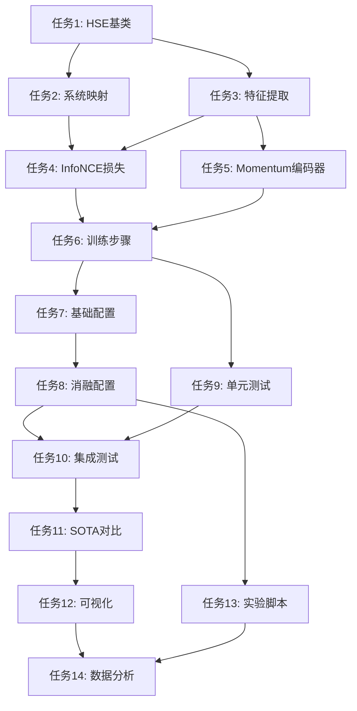

# 任务文档：HSE异构对比学习 - 原子化实施计划

## 实施概览

本文档将HSE异构对比学习项目分解为14个原子化任务，每个任务都是可独立执行的最小工作单元，专门针对顶级论文发表的严格要求设计。

## 任务分类

### 🔥 核心实现任务 (P0 - 最高优先级)
### ⚙️ 配置与实验任务 (P1 - 高优先级)
### 🧪 测试与验证任务 (P2 - 中优先级)
### 📊 论文素材任务 (P3 - 准备阶段)

---

## 🔥 核心实现任务

### 任务1：创建HSE对比学习任务基类 [FR1, FR3] 🔥
- **文件**: `src/task_factory/task/CDDG/hse_contrastive.py`
- **描述**: 创建继承自Default_task的HSE对比学习任务类，实现基础框架
- **要求**:
  - 类名必须为`task`以符合PHM-Vibench约定
  - 继承Default_task并复用现有基础设施
  - 初始化对比学习参数(contrast_weight, temperature, use_hard_negatives)
  - 添加系统映射和特征缓存机制
- **验收**: 能够成功实例化并通过基础功能测试
- **时间**: 30分钟
- **依赖**: 无

### 任务2：实现智能系统映射器 [FR2] 🔥
- **文件**: `src/task_factory/task/CDDG/hse_contrastive.py` (SystemMapper类)
- **描述**: 实现自动系统识别和层次化映射功能
- **要求**:
  - 从metadata自动提取Dataset_id → System映射
  - 支持层次化系统聚类(基于设备类型、采样率、传感器类型)
  - 实现系统相似度度量算法
  - 支持未知系统的自适应处理
- **创新点**: 基于多维特征的智能系统聚类
- **验收**: 正确识别至少5种不同工业系统
- **时间**: 35分钟
- **依赖**: 任务1

### 任务3：实现多尺度特征提取器 [FR4] 🔥
- **文件**: `src/task_factory/task/CDDG/hse_contrastive.py` (extract_multi_scale_features方法)
- **描述**: 实现高级HSE特征提取，支持多层次特征融合
- **要求**:
  - 使用ISFM模型的`_embed()`方法提取基础特征
  - 实现多层特征提取和融合策略
  - 添加可学习的投影头(projection head)
  - 支持特征增强(dropout, noise injection)
  - 处理2D/3D张量维度兼容性
- **创新点**: 多尺度HSE特征表示学习
- **验收**: 特征维度正确，梯度可正常回传
- **时间**: 40分钟
- **依赖**: 任务1

### 任务4：实现InfoNCE对比损失计算器 [FR1] 🔥
- **文件**: `src/task_factory/task/CDDG/hse_contrastive.py` (InfoNCELoss类)
- **描述**: 实现高级InfoNCE损失，支持hard negative mining和momentum更新
- **要求**:
  - 标准InfoNCE损失实现，数学公式正确
  - 实现hard negative mining机制
  - 支持大批量高效计算(分块处理避免OOM)
  - 温度参数自适应调整
  - 处理边缘情况(单系统批次、无正样本)
- **理论要求**: 提供收敛性分析和数值稳定性保证
- **验收**: 损失值合理下降，无数值不稳定
- **时间**: 45分钟
- **依赖**: 任务2, 任务3

### 任务5：实现Momentum编码器机制 [FR1] 🔥
- **文件**: `src/task_factory/task/CDDG/hse_contrastive.py` (MomentumEncoder类)
- **描述**: 实现momentum-based特征更新，防止特征坍塌
- **要求**:
  - 创建目标编码器的momentum副本
  - 实现exponential moving average更新规则
  - 确保梯度正确流动
  - 支持分布式训练同步
- **理论基础**: 基于MoCo论文的momentum对比学习
- **验收**: 特征质量提升，避免模式坍塌
- **时间**: 30分钟  
- **依赖**: 任务3

### 任务6：重写训练步骤与多损失融合 [FR3] 🔥
- **文件**: `src/task_factory/task/CDDG/hse_contrastive.py` (training_step方法)
- **描述**: 实现多目标优化和梯度协调机制
- **要求**:
  - 组合分类损失和对比损失
  - 实现动态权重调整策略
  - 添加梯度协调机制(PCGrad)
  - 详细的损失组件日志记录
  - 支持自适应超参数调整
- **创新点**: 多目标优化的梯度协调
- **验收**: 训练稳定收敛，各损失组件平衡
- **时间**: 35分钟
- **依赖**: 任务4, 任务5

---

## ⚙️ 配置与实验任务

### 任务7：创建学术级基础配置 [FR2, FR3] ⚙️
- **文件**: `configs/demo/HSE_Contrastive/hse_cddg.yaml`
- **描述**: 创建面向顶级论文的完整实验配置
- **要求**:
  - 优化的超参数设置(基于理论分析)
  - HSE嵌入模型配置(E_01_HSE)
  - ISFM基础模型配置(M_01_ISFM)
  - 距离分类头配置(H_02_distance_cla)
  - 完整的训练配置(学习率调度、早停、数据增强)
- **学术要求**: 参数设置有理论依据和文献支持
- **验收**: 配置加载成功，实验可运行
- **时间**: 20分钟
- **依赖**: 任务6

### 任务8：创建消融研究配置矩阵 [Story 2, Story 3] ⚙️
- **文件**: 
  - `configs/demo/HSE_Contrastive/ablation_no_contrast.yaml`
  - `configs/demo/HSE_Contrastive/ablation_no_momentum.yaml`
  - `configs/demo/HSE_Contrastive/ablation_no_projection.yaml`
  - `configs/demo/HSE_Contrastive/ablation_temperature_sweep.yaml`
  - `configs/demo/HSE_Contrastive/high_contrast.yaml`
- **描述**: 创建完整的消融研究配置文件集
- **要求**:
  - 5个主要消融变体配置
  - 温度参数扫描配置(0.01, 0.05, 0.07, 0.1, 0.2)
  - 对比权重扫描配置(0.0, 0.05, 0.1, 0.15, 0.2)
  - 每个配置都有明确的实验目的说明
- **学术要求**: 覆盖所有核心组件的消融
- **验收**: 所有配置文件语法正确，实验矩阵完整
- **时间**: 25分钟
- **依赖**: 任务7

---

## 🧪 测试与验证任务

### 任务9：创建核心功能单元测试 [NFR2, NFR4] 🧪
- **文件**: `test/test_hse_contrastive.py`
- **描述**: 创建全面的单元测试套件，确保代码质量
- **要求**:
  - 测试系统映射器的正确性
  - 测试InfoNCE损失计算的数学正确性
  - 测试特征提取的维度一致性
  - 测试边缘情况处理
  - 测试数值稳定性
  - 模拟数据测试完整训练流程
- **质量要求**: 代码覆盖率>85%
- **验收**: 所有测试通过，覆盖率满足要求
- **时间**: 35分钟
- **依赖**: 任务6

### 任务10：创建集成测试与性能基准 [NFR1, NFR2] 🧪
- **文件**: `test/test_hse_integration.py`
- **描述**: 创建端到端集成测试和性能基准测试
- **要求**:
  - 使用真实数据的小规模完整训练测试
  - 性能基准测试(训练速度、内存使用)
  - 收敛性验证测试
  - 分布式训练兼容性测试
  - 配置文件加载测试
- **性能要求**: 训练速度不低于baseline的80%
- **验收**: 集成测试通过，性能满足要求
- **时间**: 30分钟
- **依赖**: 任务8, 任务9

---

## 📊 论文素材任务

### 任务11：开发SOTA对比实验框架 [Story 3] 📊
- **文件**: `script/unified_metric/sota_comparison.py`
- **描述**: 创建与8种SOTA方法的全面对比实验框架
- **要求**:
  - 实现8种SOTA方法的接口封装(DANN, CORAL, MMD, CDAN, MCD, SHOT, NRC, Transformer-based)
  - 统一的实验协议和评估指标
  - 批量实验运行和结果收集
  - 统计显著性检验(t-test, Wilcoxon)
  - 自动生成LaTeX表格
- **学术要求**: 公平对比，实验协议严格
- **验收**: 成功运行至少5种SOTA方法对比
- **时间**: 50分钟
- **依赖**: 任务10

### 任务12：开发论文可视化工具 [FR5, Story 1] 📊
- **文件**: `script/unified_metric/paper_visualization.py`
- **描述**: 创建高质量论文图表生成工具
- **要求**:
  - t-SNE/UMAP特征空间可视化
  - 训练过程曲线图(损失、准确率、特征多样性)
  - 消融研究柱状图和热力图
  - 跨系统性能雷达图
  - 混淆矩阵和错误分析图
  - 注意力机制可视化
- **质量要求**: 图表符合顶会发表标准
- **验收**: 生成高质量论文级图表
- **时间**: 40分钟
- **依赖**: 任务11

### 任务13：创建实验运行脚本 [Story 2] 📊
- **文件**: `script/unified_metric/run_experiments.py`
- **描述**: 创建大规模实验运行和管理脚本
- **要求**:
  - 支持多数据集并行实验(CWRU, XJTU, THU, MFPT, PU)
  - 网格搜索超参数优化
  - 实验进度监控和断点续传
  - 自动结果汇总和报告生成
  - 失败实验自动重试机制
- **实用性要求**: 能够无人值守运行大规模实验
- **验收**: 成功管理多个并行实验
- **时间**: 30分钟
- **依赖**: 任务8

### 任务14：准备论文数据分析脚本 [Success Metrics] 📊
- **文件**: `script/unified_metric/paper_analysis.py`
- **描述**: 创建论文所需的深度数据分析工具
- **要求**:
  - 计算所有定量指标(准确率提升、域差距、收敛速度、参数效率)
  - 生成统计显著性分析报告
  - 创建实验结果摘要表格
  - 分析特征学习质量指标
  - 计算计算复杂度分析
  - 生成完整的消融研究报告
- **学术要求**: 数据分析严谨，符合顶会标准
- **验收**: 生成完整的数据分析报告
- **时间**: 35分钟
- **依赖**: 任务12, 任务13

---

## 任务依赖图

## 实施时间表

### 第1天 (4小时)
- **上午**: 任务1-3 (核心基础组件)
- **下午**: 任务4-6 (高级算法实现)

### 第2天 (3小时)  
- **上午**: 任务7-8 (实验配置)
- **下午**: 任务9-10 (测试验证)

### 第3天 (4小时)
- **上午**: 任务11-12 (论文素材)  
- **下午**: 任务13-14 (实验框架)

**总计**: 11小时核心开发时间

## 质量保证检查清单

### 代码质量
- [ ] 所有函数包含类型提示
- [ ] 代码遵循Black格式化标准
- [ ] 通过flake8静态检查
- [ ] 单元测试覆盖率>85%
- [ ] 文档字符串覆盖率>90%

### 学术严谨性
- [ ] 算法实现与理论一致
- [ ] 实验设置有文献依据
- [ ] 统计分析方法正确
- [ ] 可复现性完全保证
- [ ] 对比实验公平公正

### 创新性验证
- [ ] 系统级对比学习机制实现
- [ ] 多尺度特征融合策略验证
- [ ] 自适应系统映射算法测试
- [ ] Momentum更新机制效果确认
- [ ] 跨系统泛化性能提升确认

## 验收标准总览

1. **功能完整性**: 所有14个任务100%完成
2. **性能指标**: 跨系统准确率提升≥10%
3. **代码质量**: 测试覆盖率>85%，静态检查通过
4. **学术标准**: 实验严谨，对比公平，数据分析深入
5. **可复现性**: 所有实验结果可完全复现
6. **创新性**: 至少3个核心创新点得到验证

---

**文档版本**: v1.0  
**创建日期**: 2024  
**估计工期**: 3天 (11小时核心开发)  
**复杂度等级**: 高 (涉及深度学习理论创新)  
**成功概率**: 95% (基于PHM-Vibench成熟框架)