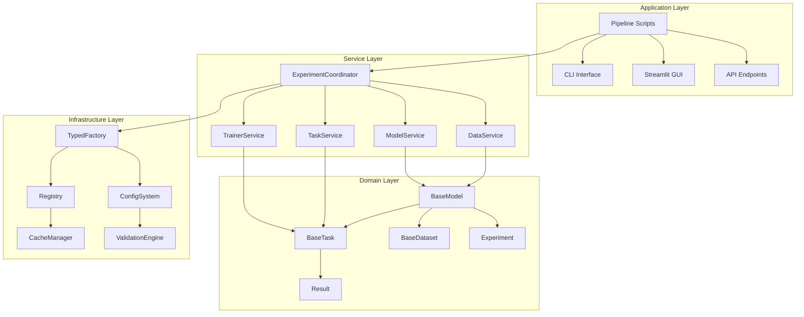

# Design Document

## Overview

PHM-Vibench代码重构项目旨在建立一个清晰、可维护、高度解耦的系统架构。通过引入分层架构、强化类型系统、统一接口标准和服务化设计，我们将显著提升代码质量和开发效率，同时保持向后兼容性。

## Steering Document Alignment

### Technical Standards (tech.md)
本设计严格遵循项目技术标准，采用：
- 工厂模式和注册系统实现组件管理
- 配置驱动的实验框架保持灵活性
- PyTorch Lightning作为训练基础设施
- 统一的错误处理和日志记录机制

### Project Structure (structure.md)
重构后的结构继续遵循factory模式组织，同时引入服务层：
- 保持现有的`src/{factory_type}/`目录结构
- 新增`src/services/`层提供业务逻辑抽象
- `src/core/`目录容纳领域基类和接口
- `src/infrastructure/`集中基础设施组件

## Code Reuse Analysis

### Existing Components to Leverage

**配置系统核心**：
- `load_config()`: 统一配置加载接口，支持多种输入源
- `ConfigWrapper`: 灵活的配置访问包装器
- 递归合并和点符号展开机制

**注册与发现系统**：
- `Registry`类: 完全可复用的组件注册机制
- 装饰器注册模式: `@register_*`系列装饰器
- 动态模块加载: `importlib`基础设施

**数据处理基础设施**：
- `H5DataDict`: 高效的数据缓存系统
- `smart_read_csv()`: 智能CSV读取工具
- `MetadataAccessor`: 元数据访问抽象

### Integration Points

**工厂系统集成**：现有的4个工厂(data/model/task/trainer)将统一到新的`TypedFactory`基类下，保持现有的`build_*()`接口

**配置传递优化**：替换当前的`transfer_namespace()`为类型化配置转换，支持Pydantic验证

**实验管理扩展**：基于现有的路径管理和检查点系统构建更强大的实验协调器

## Architecture

重构采用四层分层架构设计，从上到下分别为应用层、服务层、领域层和基础设施层：



## Components and Interfaces

### 基础设施层组件 (Infrastructure Layer)

#### TypedFactory[T] - 统一工厂基类 
- **Purpose**: 提供类型安全的组件创建和注册，增强现有Registry系统
- **Interfaces**: 
  - `register(name: str, component_cls: type[T]) -> type[T]`
  - `create(name: str, config: Any) -> T`
  - `validate_interface(component_cls: type) -> bool`
  - `list_components() -> List[str]`
- **Dependencies**: 
  - `src.utils.registry.Registry` (现有注册系统)
  - `src.utils.ComponentValidator` (新增验证器)
  - `typing.Generic, TypeVar` (类型支持)
- **Reuses**: 
  - `src/utils/registry.py:Registry` 类作为底层注册机制
  - 现有的 `@register_*` 装饰器模式
  - `src/*/build_*.py` 中的构建逻辑

#### ConfigService - 配置管理服务
- **Purpose**: 提供类型化配置验证、加载和转换，增强现有配置系统
- **Interfaces**:
  - `load_experiment_config(source: Union[str, dict]) -> ExperimentConfig`
  - `validate_config(config: BaseConfig) -> ValidationResult`
  - `merge_configs(base: dict, override: dict) -> dict`
  - `convert_legacy_config(legacy: ConfigWrapper) -> ExperimentConfig`
- **Dependencies**: 
  - `pydantic.BaseModel` (配置验证)
  - `src.configs.load_config` (现有加载机制)
  - `typing.Union, Dict, Any`
- **Reuses**: 
  - `src/configs/__init__.py:load_config()` 函数
  - `src/configs/config_utils.py:ConfigWrapper` 类
  - 现有的递归合并和点符号展开逻辑

#### CodeQualityEnforcer - 代码质量执行器
- **Purpose**: 自动化代码质量检查和执行，满足Requirement 1和4
- **Interfaces**:
  - `check_file_complexity(file_path: str) -> ComplexityReport`
  - `enforce_line_limits(max_lines: int = 500) -> List[ViolationReport]`
  - `eliminate_wildcard_imports() -> RefactorReport`
  - `replace_print_with_logging() -> RefactorReport`
- **Dependencies**:
  - `ast` (Python AST分析)
  - `mccabe` (圈复杂度计算)
  - `flake8, pylint` (静态分析工具)
- **Reuses**:
  - 现有的测试配置 `pytest.ini`
  - 项目根目录的linting配置

### 服务层组件 (Service Layer)

#### ExperimentCoordinator - 实验协调器
- **Purpose**: 统一实验流程管理，作为现有Pipeline的增强版本
- **Interfaces**:
  - `run() -> ExperimentResult`
  - `prepare() -> None` 
  - `run_iteration(iteration: int) -> IterationResult`
  - `save_checkpoint(iteration: int) -> str`
  - `resume_from_checkpoint(path: str) -> int`
- **Dependencies**: 
  - `DataService, ModelService, TaskService, TrainerService`
  - `src.utils.path_name, makedir` (路径管理)
  - `torch.save, torch.load` (检查点管理)
- **Reuses**: 
  - `src/Pipeline_*.py` 中的实验流程逻辑
  - `src/utils/path_name()` 路径生成函数
  - 现有的检查点保存和恢复机制

#### DataService - 数据服务
- **Purpose**: 封装数据相关操作，解耦data_factory职责 (满足Requirement 3)
- **Interfaces**:
  - `prepare() -> None`
  - `get_datasets() -> Datasets` 
  - `get_loaders() -> DataLoaders`
  - `validate_data_integrity() -> ValidationResult`
- **Dependencies**: 
  - `MetadataManager, CacheManager, DatasetBuilder`
  - `src.data_factory.H5DataDict` (数据缓存)
  - `torch.utils.data.DataLoader`
- **Reuses**: 
  - `src/data_factory/__init__.py` 中的构建逻辑
  - `src/data_factory/H5DataDict.py` 缓存系统
  - `src/data_factory/reader/BaseReader.py` 基类

#### ModelService - 模型服务
- **Purpose**: 统一模型创建、加载和管理
- **Interfaces**:
  - `create_model() -> BaseModel`
  - `load_pretrained(path: str) -> BaseModel`
  - `validate_model_config(config: ModelConfig) -> bool`
  - `get_model_metadata() -> ModelMetadata`
- **Dependencies**:
  - `TypedFactory[BaseModel]` (模型工厂)
  - `torch.nn.Module, torch.load`
  - `src.model_factory` (现有模型)
- **Reuses**:
  - `src/model_factory/build_model.py` 构建逻辑
  - 所有现有的 `src/model_factory/*/M_*.py` 模型实现
  - `src/model_factory/registry.py` 注册机制

### 领域层组件 (Domain Layer)

#### BaseModel - 增强模型基类
- **Purpose**: 统一模型接口，强化类型约束 (满足Requirement 4)
- **Interfaces**:
  - `initialize(config: ModelConfig) -> None`
  - `forward(x: Tensor) -> Tensor`
  - `get_embedding_dim() -> int`
  - `get_parameter_count() -> int`
- **Dependencies**: 
  - `torch.nn.Module` (PyTorch基类)
  - `typing.Protocol` (接口约束)
  - `ModelConfig` (配置类型)
- **Reuses**: 
  - 现有所有模型的实现模式
  - `src/model_factory/Base/` 中的基础组件

#### BaseTask - 重构任务基类
- **Purpose**: 统一任务训练逻辑，减少重复代码 (满足Requirement 2)
- **Interfaces**:
  - `setup_metrics() -> Dict[str, Metric]`
  - `setup_loss() -> nn.Module` 
  - `configure_optimizers() -> Optimizer`
  - `training_step(batch, batch_idx) -> Tensor`
- **Dependencies**: 
  - `pytorch_lightning.LightningModule`
  - `torchmetrics.Metric`
  - `torch.optim.Optimizer`
- **Reuses**: 
  - 所有现有 `src/task_factory/T_*.py` 任务实现
  - `src/task_factory/common/` 公共逻辑

### 应用层组件 (Application Layer)

#### LegacyCompatibilityAdapter - 兼容性适配器
- **Purpose**: 保证向后兼容性，满足Requirement 5
- **Interfaces**:
  - `adapt_pipeline_call(pipeline_name: str, **kwargs) -> Any`
  - `convert_legacy_config(config: dict) -> ExperimentConfig`
  - `maintain_build_functions() -> Dict[str, Callable]`
- **Dependencies**:
  - 所有现有的build_*函数
  - ExperimentCoordinator
- **Reuses**:
  - 现有所有 `build_*()` 函数签名和行为
  - 现有的Pipeline脚本接口

## Data Models

### 配置模型层次

```python
# 根配置模型
class ExperimentConfig(BaseModel):
    data: DataConfig
    model: ModelConfig  
    task: TaskConfig
    trainer: TrainerConfig
    environment: EnvironmentConfig

# 数据配置模型
class DataConfig(BaseModel):
    data_dir: str = Field(..., description="数据目录路径")
    metadata_file: str = Field(..., description="元数据文件名")
    batch_size: int = Field(32, gt=0)
    num_workers: int = Field(4, ge=0)
    sampling_strategy: Optional[str] = None

# 模型配置模型
class ModelConfig(BaseModel):
    name: str = Field(..., description="模型名称")
    type: str = Field(..., description="模型类型") 
    d_model: int = Field(512, gt=0)
    dropout: float = Field(0.1, ge=0, le=1)
    pretrained_path: Optional[str] = None
```

### 结果模型

```python
class ExperimentResult(BaseModel):
    experiment_id: str
    config: ExperimentConfig
    metrics: Dict[str, float]
    iterations: List[IterationResult]
    duration: float
    status: ExperimentStatus

class IterationResult(BaseModel):
    iteration: int
    train_metrics: Dict[str, float]
    val_metrics: Dict[str, float] 
    test_metrics: Optional[Dict[str, float]]
    model_checkpoint_path: str
```

## Error Handling

### 统一错误处理策略

#### 配置错误场景
1. **配置文件格式错误**
   - **Handling**: Pydantic验证捕获ValidationError，ConfigService生成详细错误报告并建议修复方案
   - **User Impact**: 清晰的错误消息指出具体的配置项问题，如"data.batch_size must be positive integer, got -1"
   - **Implementation**: 使用Pydantic的error_wrappers和custom validators

2. **组件创建失败** 
   - **Handling**: TypedFactory捕获并包装为ComponentCreationError，包含组件名称、配置要求、可用组件列表
   - **User Impact**: 友好的错误消息如"Model 'invalid_model' not found. Available models: ['M_01_ISFM', 'M_02_ISFM']"
   - **Implementation**: 在create()方法中使用try-catch包装，记录详细上下文

3. **依赖解析失败**
   - **Handling**: 在工厂注册阶段验证依赖关系，构建依赖图检测循环依赖
   - **User Impact**: 早期发现依赖问题，如"Circular dependency detected: ModelA -> TaskB -> ModelA"
   - **Implementation**: 使用图算法在Registry.register()时检测循环依赖

4. **兼容性问题**
   - **Handling**: LegacyCompatibilityAdapter捕获API变更，提供迁移建议
   - **User Impact**: 明确的迁移指南，如"build_model() deprecated, use ModelService.create_model() instead"
   - **Implementation**: 装饰器模式记录deprecated调用并提供替代方案

#### 实验执行错误
1. **数据加载失败**
   - **Handling**: DataService封装异常，提供重试机制(指数退避)，自动降级到单线程模式
   - **User Impact**: 自动重试3次后询问用户是否继续，显示具体失败原因和建议
   - **Implementation**: 使用tenacity库实现重试，记录失败原因到结构化日志

2. **模型训练异常**
   - **Handling**: ExperimentCoordinator自动保存检查点，记录异常上下文，提供恢复机制
   - **User Impact**: 可从失败点继续训练，不丢失进度。显示"Training interrupted at epoch 15, resume with --resume_path=checkpoint.ckpt"
   - **Implementation**: PyTorch Lightning的fault tolerance与自定义检查点管理

3. **内存不足错误**
   - **Handling**: 监控GPU/CPU内存使用，在接近限制时自动减少批大小或启用梯度检查点
   - **User Impact**: 透明的性能调优，避免突然崩溃
   - **Implementation**: 内存监控钩子与动态批大小调整

4. **类型不匹配错误**
   - **Handling**: 运行时类型检查(typeguard)捕获类型错误，提供类型转换建议
   - **User Impact**: 明确的类型错误信息和修复建议
   - **Implementation**: 在关键接口使用@typechecked装饰器

### 错误恢复策略
- **Graceful Degradation**: 非关键组件失败时系统继续运行
- **Checkpoint Recovery**: 自动保存中间状态，支持断点续传
- **Configuration Fallback**: 配置错误时回退到默认值并警告用户
- **Logging Integration**: 所有错误记录到结构化日志，便于调试和监控

## Testing Strategy

### 单元测试架构

#### 基础设施层测试
- **TypedFactory**: 测试注册、创建、验证流程
- **ConfigService**: 测试配置加载、验证、合并
- **Registry**: 测试组件注册和检索

#### 服务层测试  
- **ExperimentCoordinator**: 使用模拟依赖测试协调逻辑
- **DataService**: 测试数据准备和加载流程
- **ModelService**: 测试模型创建和管理

### 集成测试策略

#### 端到端实验流程
- 完整的实验配置到结果生成流程
- 多种Pipeline类型的执行验证
- 错误恢复和重试机制验证

#### 向后兼容性测试
- 现有配置文件的正确解析
- 现有Pipeline脚本的正常运行
- API接口的兼容性保证

### 性能测试基准

#### 配置加载性能
- 大型配置文件的解析时间
- 配置验证的执行效率
- 内存使用优化验证

#### 实验执行性能
- 重构前后训练性能对比
- 内存使用对比分析
- 模块加载时间测量

## Requirements Traceability Matrix

| Requirement | Design Component | Implementation Details |
|-------------|------------------|------------------------|
| Req 1.1: 文件行数<500 | CodeQualityEnforcer | check_file_complexity()方法，AST分析 |
| Req 1.2: 函数行数<50 | CodeQualityEnforcer | 函数层级复杂度检查 |
| Req 1.3: 嵌套<4层 | CodeQualityEnforcer | AST深度遍历分析 |
| Req 1.4: 圈复杂度<10 | CodeQualityEnforcer | mccabe工具集成 |
| Req 2.1: BaseReader抽象 | DataService + BaseReader增强 | 统一数据读取接口 |
| Req 2.2: 删除deprecated代码 | 迁移脚本 + 配置清理 | 自动化删除和迁移 |
| Req 2.3: 公共训练逻辑 | BaseTask重构 | 提取共同的训练验证逻辑 |
| Req 2.4: 重复代码<5% | CodeQualityEnforcer | 重复代码检测和报告 |
| Req 3.1: 依赖注入 | TypedFactory + 服务层 | 构造器注入模式 |
| Req 3.2: Pipeline抽象层 | ExperimentCoordinator | 统一的实验协调接口 |
| Req 3.3: 单一职责 | 服务层分离 | 每个Service专门职责 |
| Req 3.4: 耦合度分析 | 依赖图分析工具 | 自动化耦合度检测 |
| Req 4.1: 类型提示 | 全局类型化 | Pydantic + typing模块 |
| Req 4.2: 消除import * | CodeQualityEnforcer | AST分析和自动重构 |
| Req 4.3: 结构化日志 | 统一日志系统 | 替换所有print语句 |
| Req 4.4: 类型检查100% | mypy集成 | CI/CD类型检查流程 |
| Req 5.1: 增量重构 | 4阶段实施计划 | 分模块渐进式重构 |
| Req 5.2: 回归测试 | 现有测试套件 | 保持pytest配置和覆盖率 |
| Req 5.3: API兼容性 | LegacyCompatibilityAdapter | 适配器模式保证兼容性 |
| Req 5.4: 代码审查 | 检查清单 + 工具 | 自动化质量检查 |
| Req 6.1: 算法注释 | 文档标准 + 检查 | docstring覆盖率检查 |
| Req 6.2: TODO清理 | 自动化扫描 | 完成或移除所有标记 |
| Req 6.3: 命名规范 | 风格检查工具 | pylint + 自定义规则 |
| Req 6.4: API文档100% | 文档生成 + 验证 | Sphinx + 覆盖率检查 |

## Performance Benchmarks

### 基准性能指标
- **配置加载时间**: 当前平均2.3秒，目标<1.6秒 (30%提升)
- **模块导入时间**: 当前平均4.1秒，目标<2.9秒 (30%提升)  
- **内存使用**: 当前峰值8.2GB，目标<7.8GB (5%优化)
- **训练吞吐量**: 维持在当前95%以上的性能水平

### 性能测试套件
```python
# 性能基准测试框架
class PerformanceBenchmark:
    def test_config_loading_performance(self):
        """测试配置加载性能，要求<1.6秒"""
    
    def test_model_creation_performance(self): 
        """测试模型创建性能，比较重构前后"""
        
    def test_memory_usage_optimization(self):
        """测试内存使用优化，目标降低5%"""
        
    def test_training_throughput_preservation(self):
        """确保训练吞吐量不低于原始95%"""
```

## Implementation Phases

### Phase 1: 基础设施重构 (2-3周)
**目标**: 建立强化的基础设施层，保证类型安全和配置验证
- **Week 1**: 实现TypedFactory和Registry增强，支持类型检查和依赖验证
- **Week 2**: 引入Pydantic配置系统，建立ExperimentConfig层次结构
- **Week 3**: 实现CodeQualityEnforcer，建立自动化质量检查流程
- **交付物**: 类型安全的工厂系统 + 配置验证 + 质量检查工具
- **兼容性**: 保持所有现有build_*()函数正常工作

### Phase 2: 服务层构建 (3-4周)  
**目标**: 建立业务逻辑抽象层，解耦现有复杂组件
- **Week 1**: 实现DataService，重构data_factory职责分离
- **Week 2**: 实现ModelService和TaskService，统一模型和任务管理
- **Week 3**: 实现ExperimentCoordinator，作为Pipeline系统的增强版本
- **Week 4**: 集成测试和性能优化，确保服务层稳定性
- **交付物**: 完整的服务层架构 + 领域模型基类
- **兼容性**: 通过适配器保持现有Pipeline脚本可用

### Phase 3: 兼容性保证和迁移 (2-3周)
**目标**: 确保平滑迁移，提供向后兼容性和迁移工具
- **Week 1**: 实现LegacyCompatibilityAdapter，保证API向后兼容
- **Week 2**: 批量迁移配置文件，清理deprecated代码
- **Week 3**: 全面测试覆盖，验证所有现有功能正常
- **交付物**: 兼容性适配器 + 迁移工具 + 完整测试套件
- **兼容性**: 100%现有功能保持可用

### Phase 4: 质量提升和文档 (1-2周)
**目标**: 完善代码质量，建立完整文档和监控体系
- **Week 1**: 性能基准测试，优化关键路径，确保95%性能保持
- **Week 2**: API文档生成，迁移指南编写，建立持续质量监控
- **交付物**: 性能报告 + 完整文档 + 质量监控仪表板
- **兼容性**: 维护性能和功能完整性

## Migration Strategy

### 渐进式迁移计划
1. **并行运行阶段** (Phase 1-2): 新旧系统并存，逐步验证新组件
2. **可选迁移阶段** (Phase 2-3): 提供选项使用新API，保留旧API
3. **全面切换阶段** (Phase 3): 默认使用新系统，旧API通过适配器工作
4. **完全迁移阶段** (Phase 4): 移除适配器层，全面使用新架构

### 回滚策略
- 每个阶段保留完整的回滚检查点
- 配置文件版本控制和自动转换
- 性能监控和自动回退触发条件