# Flow Pretraining Task - Technical Design

**Feature Name**: flow-pretraining-task  
**Design Version**: 1.0  
**Creation Date**: 2025-09-01  
**Status**: Design Phase

## Design Overview

This document presents the technical design for implementing a Flow-based pretraining task within the PHM-Vibench framework. The design leverages the existing M_04_ISFM_Flow implementation and integrates it with contrastive learning for enhanced representation learning in industrial vibration signal analysis.

### Design Principles

1. **Leverage Existing Assets**: Build upon M_04_ISFM_Flow and ContrastiveSSL implementations
2. **Maintain PHM-Vibench Patterns**: Follow established task factory and configuration patterns
3. **Research-Grade Quality**: Ensure reproducibility and publication-ready experimental capabilities
4. **Scalable Architecture**: Support both small-scale validation and large-scale multi-dataset training
5. **Modular Design**: Enable component reuse and easy extension

## Architecture Design

### System Architecture


### Component Architecture

```mermaid
graph LR
    subgraph "FlowPretrainTask (PyTorch Lightning Module)"
        A[training_step] --> B[validation_step]
        B --> C[configure_optimizers]
        C --> D[on_epoch_end]
    end
    
    subgraph "FlowContrastiveLoss"
        E[Flow Loss Weight λ_flow]
        F[Contrastive Loss Weight λ_contrastive]
        G[Gradient Balancing]
    end
    
    subgraph "M_04_ISFM_Flow Integration"
        H[Forward Pass]
        I[Sample Generation]
        J[Anomaly Detection]
    end
    
    subgraph "FlowMetrics"
        K[Loss Tracking]
        L[Sample Quality Assessment]
        M[Downstream Performance]
    end
```



## Code Reuse Analysis

### Existing Components to Leverage

**M_04_ISFM_Flow Implementation**:
- **Location**: `src/model_factory/ISFM/M_04_ISFM_Flow.py`
- **Reuse Strategy**: Direct integration as the core generative model
- **Interface**: `forward()`, `sample()`, `compute_anomaly_score()` methods
- **Integration Points**: PyTorch Lightning module wrapper, loss computation interface

**ContrastiveSSL Components**:
- **Location**: `src/model_factory/ISFM/ContrastiveSSL.py`
- **Components to Reuse**:
  - `TimeSeriesAugmentation`: For contrastive pair generation
  - `ContrastiveEncoder`: For representation learning
  - `ProjectionHead`: For contrastive loss computation
- **Integration Strategy**: Compose with Flow model in joint loss function

**Default_task Base Class**:
- **Location**: `src/task_factory/Default_task.py`
- **Inheritance**: FlowPretrainTask extends Default_task
- **Inherited Methods**: `__init__()`, metrics management, hyperparameter saving
- **Override Points**: `forward()`, `training_step()`, `validation_step()`

**Existing Pretrain Task Patterns**:
- **Reference**: `src/task_factory/task/pretrain/masked_reconstruction.py`
- **Pattern**: Registration with `@register_task(task_type, name)`
- **Configuration**: YAML-driven parameter loading
- **Metrics**: Integration with PHM-Vibench metrics system

### Integration Points

**Task Factory Integration**:
```python
# Following observed pattern from masked_reconstruction.py
@register_task("masked_reconstruction", "pretrain")  # Corrected pattern
class FlowPretrainTask(Default_task):
```

**Configuration System Integration**:
```python
# Leverage existing configuration patterns from Default_task
self.mask_ratio = getattr(args_task, 'mask_ratio', 0.15)  # Pattern from existing code
self.flow_loss_weight = getattr(args_task, 'flow_loss_weight', 1.0)
```

## Data Models

### FlowPretrainBatch Schema
```python
@dataclass
class FlowPretrainBatch:
    """Structured batch data for Flow pretraining."""
    x: torch.Tensor          # Shape: (B, L, C) - vibration signals
    file_ids: List[str]      # File identifiers for conditional generation
    metadata: Dict[str, Any] # Domain/dataset information
    
    def to_device(self, device: torch.device) -> 'FlowPretrainBatch':
        return FlowPretrainBatch(
            x=self.x.to(device),
            file_ids=self.file_ids,
            metadata=self.metadata
        )
```

### FlowLossComponents Schema
```python
@dataclass
class FlowLossComponents:
    """Loss components for Flow pretraining."""
    flow_reconstruction_loss: torch.Tensor
    contrastive_loss: torch.Tensor
    total_loss: torch.Tensor
    loss_weights: Dict[str, float]
    
    def to_dict(self) -> Dict[str, torch.Tensor]:
        return {
            'flow_loss': self.flow_reconstruction_loss,
            'contrastive_loss': self.contrastive_loss,
            'total_loss': self.total_loss
        }
```

### FlowMetricsState Schema
```python
@dataclass
class FlowMetricsState:
    """Training metrics state tracking."""
    epoch: int
    step: int
    loss_history: List[float]
    gradient_norms: List[float]
    generation_quality_scores: Dict[str, float]
    memory_usage_mb: float
    
    def update(self, loss: float, grad_norm: float, 
              quality_scores: Dict[str, float]) -> None:
        self.loss_history.append(loss)
        self.gradient_norms.append(grad_norm)
        self.generation_quality_scores.update(quality_scores)
```

### Configuration Schema


## Detailed Component Design

### 1. FlowPretrainTask Class

**File**: `src/task_factory/task/pretrain/flow_pretrain.py`

```python
@register_task("pretrain", "flow_pretrain")
class FlowPretrainTask(Default_task):
    """
    Flow-based pretraining task with optional contrastive learning.
    
    Integrates M_04_ISFM_Flow with joint Flow reconstruction and 
    contrastive learning objectives for enhanced representation learning.
    """
```

**Key Responsibilities**:
- Integrate M_04_ISFM_Flow model with PyTorch Lightning training loop
- Manage joint Flow-contrastive loss computation
- Handle both conditional and unconditional generation modes
- Support multi-scale validation (quick/medium/full)
- Provide comprehensive metrics tracking and visualization

**Core Methods**:
```python
def __init__(self, network, args_data, args_model, args_task, args_trainer, args_environment, metadata)
def forward(self, batch) -> Dict[str, torch.Tensor]
def training_step(self, batch, batch_idx) -> torch.Tensor
def validation_step(self, batch, batch_idx) -> Dict[str, torch.Tensor]
def configure_optimizers(self) -> torch.optim.Optimizer
def on_epoch_end(self) -> None
```

### 2. FlowContrastiveLoss Module

**File**: `src/task_factory/task/pretrain/flow_contrastive_loss.py`

```python
class FlowContrastiveLoss(nn.Module):
    """
    Joint loss function combining Flow reconstruction and contrastive learning.
    
    Supports configurable loss weighting and gradient balancing for stable
    joint training of generative and contrastive objectives.
    """
```

**Architecture**:


**Key Features**:
- Configurable loss weighting (`lambda_flow`, `lambda_contrastive`)
- Gradient balancing mechanisms (GradNorm, uncertainty weighting)
- Support for loss component monitoring and logging
- Adaptive weighting based on training dynamics

### 3. FlowMetrics Module

**File**: `src/task_factory/task/pretrain/flow_metrics.py`

```python
class FlowMetrics(nn.Module):
    """
    Comprehensive metrics for Flow pretraining evaluation.
    
    Provides generation quality assessment, training progress monitoring,
    and publication-ready visualization tools.
    """
```

**Metrics Categories**:

1. **Training Metrics**:
   - Flow reconstruction loss convergence
   - Contrastive loss progression  
   - Joint loss stability
   - Gradient norms and variance

2. **Generation Quality Metrics**:
   - Statistical similarity to real data (KS test, MMD)
   - Signal quality assessment (SNR, spectral analysis)
   - Conditional generation accuracy
   - Sample diversity measurements

3. **Downstream Performance Metrics**:
   - Linear probe accuracy on frozen features
   - Few-shot learning performance
   - Domain adaptation capability
   - Classification improvement over baseline

### 4. Configuration Templates

**Files**: `configs/demo/Pretraining/Flow/`

#### Basic Configuration (`flow_pretrain_basic.yaml`)
```yaml
task:
  type: "pretrain"
  name: "flow_pretrain"
  
  # Flow configuration
  use_conditional: true
  flow_loss_weight: 1.0
  
  # Optional contrastive learning
  use_contrastive: false
  contrastive_loss_weight: 0.1
  
  # Training parameters
  epochs: 100
  lr: 1e-4
  batch_size: 32
  
  # Validation settings
  validation_scale: "small"  # small/medium/full
```

#### Small Dataset Configuration (`flow_pretrain_small.yaml`)
```yaml
task:
  type: "pretrain"
  name: "flow_pretrain"
  
  # Enhanced Flow + Contrastive
  use_conditional: true
  use_contrastive: true
  flow_loss_weight: 1.0
  contrastive_loss_weight: 0.3
  
  # Training parameters
  epochs: 200
  lr: 5e-4
  batch_size: 64
  
  # Advanced features
  gradient_clipping: 1.0
  early_stopping: true
  lr_scheduler: "cosine"
```

#### Full Multi-Dataset Configuration (`flow_pretrain_full.yaml`)
```yaml
task:
  type: "pretrain"
  name: "flow_pretrain"
  
  # Production-scale configuration
  use_conditional: true
  use_contrastive: true
  flow_loss_weight: 1.0
  contrastive_loss_weight: 0.2
  
  # Multi-dataset training
  datasets: ["CWRU", "XJTU", "PU", "HUST"]
  domain_adaptation: true
  
  # Distributed training
  epochs: 1000
  lr: 1e-3
  batch_size: 128
  accumulate_grad_batches: 4
  
  # Advanced optimization
  optimizer: "adamw"
  weight_decay: 1e-4
  lr_scheduler: "warmup_cosine"
  warmup_epochs: 50
```

## Data Flow Design

### Training Pipeline Data Flow


### Multi-Scale Validation Flow


## Integration Points

### 1. Task Factory Integration

**Registration Pattern**:
```python
# src/task_factory/task/pretrain/flow_pretrain.py
from ... import register_task

@register_task("pretrain", "flow_pretrain")
class FlowPretrainTask(Default_task):
    pass
```

**Factory Resolution**:
```python
# task_factory.py resolves: pretrain.flow_pretrain -> 
# src.task_factory.task.pretrain.flow_pretrain
```

### 2. Model Factory Integration

**Flow Model Loading**:
```python
# FlowPretrainTask leverages existing model factory
def __init__(self, network, ...):
    # network is already instantiated M_04_ISFM_Flow
    self.flow_model = network
    
    # Additional contrastive components if needed
    if self.use_contrastive:
        self.contrastive_encoder = ContrastiveEncoder(...)
```

### 3. Pipeline Integration

**Pipeline_02_pretrain_fewshot Compatibility**:
```yaml
# Pipeline configuration
pipeline: "Pipeline_02_pretrain_fewshot"

# Stage 1: Flow Pretraining
pretrain_config:
  task:
    type: "pretrain"
    name: "flow_pretrain"
    epochs: 500

# Stage 2: Few-shot Fine-tuning  
fewshot_config:
  task:
    type: "FS"
    name: "prototypical_network"
    pretrained_checkpoint: "${pretrain_checkpoint}"
```

## Performance Optimization

### Memory Optimization Strategies

1. **Gradient Accumulation**:
   ```python
   # Support large effective batch sizes with limited GPU memory
   accumulate_grad_batches = self.args_task.accumulate_grad_batches
   effective_batch_size = batch_size * accumulate_grad_batches
   ```

2. **Mixed Precision Training**:
   ```python
   # Automatic mixed precision for memory efficiency
   @torch.cuda.amp.autocast()
   def forward(self, batch):
       return self.flow_model(batch)
   ```

3. **Gradient Checkpointing**:
   ```python
   # Trade computation for memory in deep Flow models
   if self.args_task.gradient_checkpointing:
       self.flow_model.enable_checkpointing()
   ```

### Training Stability Mechanisms

1. **Gradient Clipping**:
   ```python
   def configure_optimizers(self):
       optimizer = torch.optim.AdamW(...)
       return {
           'optimizer': optimizer,
           'gradient_clip_val': self.args_task.gradient_clip_val
       }
   ```

2. **Loss Scaling**:
   ```python
   # Automatic loss scaling for numerical stability
   scaler = torch.cuda.amp.GradScaler()
   ```

3. **Learning Rate Scheduling**:
   ```python
   def configure_optimizers(self):
       scheduler = torch.optim.lr_scheduler.CosineAnnealingLR(...)
       return [optimizer], [scheduler]
   ```

## Error Scenarios and Handling

### Error Scenario 1: Flow Model Training Instabilities

**Error Type**: NaN Loss or Gradient Explosion
**Triggers**: 
- Numerical instabilities in Flow model ODEs
- Learning rate too high
- Batch normalization issues with small batches

**Handling Strategy**:
```python
class FlowTrainingStabilityHandler:
    def __init__(self, max_grad_norm=1.0, loss_patience=10):
        self.max_grad_norm = max_grad_norm
        self.loss_patience = loss_patience
        self.unstable_steps = 0
        
    def handle_training_step(self, loss, model_params):
        # NaN detection and recovery
        if torch.isnan(loss):
            self.logger.warning("NaN loss detected, loading last stable checkpoint")
            self.load_last_stable_checkpoint()
            return "checkpoint_rollback"
            
        # Gradient explosion handling
        grad_norm = torch.nn.utils.clip_grad_norm_(model_params, self.max_grad_norm)
        if grad_norm > self.max_grad_norm * 2:
            self.logger.warning(f"Large gradient norm {grad_norm}, reducing learning rate")
            self.reduce_learning_rate(factor=0.5)
            return "lr_reduction"
            
        return "stable"
```

**User Impact**: Automatic recovery with minimal training interruption, detailed logging for debugging

### Error Scenario 2: GPU Memory Exhaustion

**Error Type**: CUDA OutOfMemoryError
**Triggers**:
- Large batch sizes with joint Flow-contrastive training
- Multi-dataset loading consuming excessive memory
- Gradient accumulation overflow

**Handling Strategy**:
```python
class MemoryManagementHandler:
    def __init__(self, initial_batch_size, min_batch_size=4):
        self.current_batch_size = initial_batch_size
        self.min_batch_size = min_batch_size
        self.memory_pressure_threshold = 0.85
        
    def handle_oom_error(self, error):
        if self.current_batch_size > self.min_batch_size:
            new_batch_size = max(self.current_batch_size // 2, self.min_batch_size)
            self.logger.info(f"OOM detected, reducing batch size from {self.current_batch_size} to {new_batch_size}")
            self.current_batch_size = new_batch_size
            self.enable_gradient_accumulation()
            return "batch_size_reduction"
        else:
            self.logger.error("Cannot reduce batch size further, switching to gradient checkpointing")
            self.enable_gradient_checkpointing()
            return "gradient_checkpointing"
```

**User Impact**: Graceful degradation with maintained effective batch size through gradient accumulation

### Error Scenario 3: Corrupted Data Samples

**Error Type**: Invalid tensor shapes or corrupted signal data
**Triggers**:
- Incomplete H5 file reads
- Network interruptions during data loading
- Inconsistent metadata-signal mapping

**Handling Strategy**:
```python
class DataValidationHandler:
    def __init__(self, expected_shape, signal_range):
        self.expected_shape = expected_shape  # (B, L, C)
        self.signal_range = signal_range      # (min_val, max_val)
        
    def validate_batch(self, batch):
        issues = []
        
        # Shape validation
        if batch['x'].shape[1:] != self.expected_shape[1:]:
            issues.append(f"Invalid shape: {batch['x'].shape} vs expected {self.expected_shape}")
            
        # Range validation
        if batch['x'].min() < self.signal_range[0] or batch['x'].max() > self.signal_range[1]:
            issues.append(f"Signal out of range: [{batch['x'].min():.3f}, {batch['x'].max():.3f}]")
            
        # NaN/Inf detection
        if torch.isnan(batch['x']).any() or torch.isinf(batch['x']).any():
            issues.append("NaN or Inf values detected in signal data")
            
        if issues:
            self.logger.warning(f"Batch validation failed: {issues}")
            return False, issues
        return True, []
```

**User Impact**: Data quality assurance with detailed error reporting, automatic batch skipping

### Error Scenario 4: Checkpoint Corruption

**Error Type**: Corrupted or incomplete checkpoint files
**Triggers**:
- System interruptions during checkpoint saving
- Disk space exhaustion
- File system errors

**Handling Strategy**:
```python
class CheckpointManager:
    def __init__(self, checkpoint_dir, keep_n_checkpoints=5):
        self.checkpoint_dir = checkpoint_dir
        self.keep_n_checkpoints = keep_n_checkpoints
        self.checkpoint_queue = []
        
    def save_checkpoint_safely(self, state_dict, epoch):
        temp_path = f"{self.checkpoint_dir}/temp_checkpoint_{epoch}.ckpt"
        final_path = f"{self.checkpoint_dir}/checkpoint_{epoch}.ckpt"
        
        try:
            # Save to temporary file first
            torch.save(state_dict, temp_path)
            
            # Verify checkpoint integrity
            loaded_state = torch.load(temp_path)
            assert 'epoch' in loaded_state
            assert 'model_state_dict' in loaded_state
            
            # Move to final location
            os.rename(temp_path, final_path)
            self.checkpoint_queue.append(final_path)
            
            # Cleanup old checkpoints
            self.cleanup_old_checkpoints()
            
        except Exception as e:
            self.logger.error(f"Checkpoint save failed: {e}")
            if os.path.exists(temp_path):
                os.remove(temp_path)
            raise
```

**User Impact**: Reliable checkpoint management with integrity verification

## Error Recovery and Monitoring

### Comprehensive Error Monitoring
```python
class FlowPretrainErrorMonitor:
    def __init__(self):
        self.error_counts = defaultdict(int)
        self.recovery_actions = []
        
    def log_error(self, error_type, details, recovery_action):
        self.error_counts[error_type] += 1
        self.recovery_actions.append({
            'timestamp': datetime.now(),
            'error_type': error_type,
            'details': details,
            'recovery_action': recovery_action,
            'success': True  # Updated after recovery attempt
        })
        
    def get_error_summary(self):
        return {
            'total_errors': sum(self.error_counts.values()),
            'error_breakdown': dict(self.error_counts),
            'recovery_success_rate': self.calculate_recovery_rate()
        }
```

### Checkpoint and Recovery System

```python
def on_train_epoch_end(self):
    # Automatic checkpoint saving
    if self.current_epoch % self.checkpoint_interval == 0:
        checkpoint = {
            'epoch': self.current_epoch,
            'model_state_dict': self.state_dict(),
            'optimizer_state_dict': self.optimizers().state_dict(),
            'loss_history': self.loss_history,
            'config': self.hparams
        }
        torch.save(checkpoint, f"checkpoint_epoch_{self.current_epoch}.ckpt")
```

## Testing Strategy

### Unit Testing

**Component Tests** (`test_flow_pretrain_components.py`):
```python
class TestFlowPretrainTask:
    def test_task_initialization(self):
        """Test FlowPretrainTask initialization with various configurations."""
        # Test basic initialization
        task = FlowPretrainTask(network, args_data, args_model, args_task, 
                              args_trainer, args_environment, metadata)
        assert task.flow_loss_weight == 1.0
        assert task.use_contrastive == False
        
    def test_forward_pass(self):
        """Test forward pass with Flow model integration."""
        batch = {'x': torch.randn(2, 1024, 1), 'file_id': ['test1', 'test2']}
        output = task.forward(batch)
        assert 'reconstructions' in output
        assert output['reconstructions'].shape == batch['x'].shape
        
    def test_loss_computation(self):
        """Test joint loss computation with configurable weights."""
        # Test Flow-only loss
        loss_components = task.compute_loss(batch, flow_only=True)
        assert 'flow_loss' in loss_components
        assert 'contrastive_loss' not in loss_components
        
        # Test joint loss
        task.use_contrastive = True
        loss_components = task.compute_loss(batch)
        assert 'flow_loss' in loss_components
        assert 'contrastive_loss' in loss_components
        assert 'total_loss' in loss_components

class TestFlowContrastiveLoss:
    def test_gradient_balancing(self):
        """Test gradient balancing mechanisms."""
        loss_fn = FlowContrastiveLoss(flow_weight=1.0, contrastive_weight=0.3)
        # Test with mock gradients showing different scales
        flow_grads = [torch.tensor([1.0, 2.0, 1.5])]
        contrastive_grads = [torch.tensor([0.1, 0.2, 0.15])]
        
        balanced_weights = loss_fn.balance_gradients(flow_grads, contrastive_grads)
        # Verify balancing reduces gradient scale mismatch
        assert balanced_weights['flow'] < 1.0
        assert balanced_weights['contrastive'] > 0.3

class TestFlowMetrics:
    def test_generation_quality_metrics(self):
        """Test generated sample quality assessment."""
        real_samples = torch.randn(100, 1024, 1)
        generated_samples = torch.randn(100, 1024, 1) 
        
        metrics = FlowMetrics()
        quality_scores = metrics.assess_generation_quality(real_samples, generated_samples)
        
        assert 'statistical_similarity' in quality_scores
        assert 'spectral_similarity' in quality_scores
        assert 0.0 <= quality_scores['statistical_similarity'] <= 1.0
```

### Integration Testing

**Task Factory Integration** (`test_flow_pretrain_integration.py`):
```python
class TestTaskFactoryIntegration:
    def test_task_registration(self):
        """Test proper registration with task factory."""
        # Verify task can be instantiated through factory
        from src.task_factory.task_factory import task_factory
        
        args_task = Namespace(type="pretrain", name="flow_pretrain")
        task = task_factory(args_task, network, args_data, args_model, 
                          args_trainer, args_environment, metadata)
        
        assert isinstance(task, FlowPretrainTask)
        assert task.args_task.type == "pretrain"
        
    def test_configuration_loading(self):
        """Test YAML configuration parsing and validation."""
        config_path = "configs/demo/Pretraining/Flow/flow_pretrain_basic.yaml"
        config = load_config(config_path)
        
        # Validate required fields
        assert 'task' in config
        assert config['task']['type'] == 'pretrain'
        assert config['task']['name'] == 'flow_pretrain'
        assert 'flow_loss_weight' in config['task']
        
    def test_pipeline_compatibility(self):
        """Test Pipeline_02_pretrain_fewshot integration."""
        # Mock pipeline execution
        pretrain_config = load_config("configs/demo/Pretraining/Flow/flow_pretrain_small.yaml")
        fewshot_config = load_config("configs/demo/GFS/GFS_demo.yaml")
        
        # Test checkpoint compatibility
        pretrain_task = create_task_from_config(pretrain_config)
        train_for_epochs(pretrain_task, 5)  # Short training
        
        # Verify checkpoint can be loaded by downstream task
        checkpoint_path = pretrain_task.get_checkpoint_path()
        assert os.path.exists(checkpoint_path)
        
        # Test loading in few-shot task
        fewshot_task = create_task_from_config(fewshot_config)
        fewshot_task.load_pretrained_checkpoint(checkpoint_path)
        assert fewshot_task.pretrained_features_available()

class TestDistributedTraining:
    @pytest.mark.skipif(torch.cuda.device_count() < 2, reason="Requires multiple GPUs")
    def test_multi_gpu_training(self):
        """Test distributed training across multiple GPUs."""
        # Setup distributed environment
        world_size = 2
        mp.spawn(run_distributed_training, args=(world_size,), nprocs=world_size)
        
    def test_gradient_synchronization(self):
        """Test gradient synchronization in distributed mode."""
        # Mock distributed gradients
        # Verify synchronization maintains training stability
        pass
```

### End-to-End Testing

**System Integration** (`test_flow_pretrain_e2e.py`):
```python
class TestEndToEndTraining:
    def test_small_dataset_complete_training(self):
        """Test complete training cycle on CWRU dataset."""
        config_path = "configs/demo/Pretraining/Flow/flow_pretrain_basic.yaml" 
        
        # Load config and create task
        config = load_config(config_path)
        task = create_flow_pretrain_task(config)
        
        # Run training for specified epochs
        trainer = pl.Trainer(max_epochs=10, gpus=1 if torch.cuda.is_available() else 0)
        trainer.fit(task)
        
        # Validate training outcomes
        assert task.current_epoch == 10
        assert len(task.loss_history) > 0
        assert task.loss_history[-1] < task.loss_history[0]  # Loss should decrease
        
        # Test generation capability
        generated_samples = task.generate_samples(num_samples=10)
        assert generated_samples.shape == (10, 1024, 1)
        
    def test_checkpoint_save_restore_cycle(self):
        """Test checkpoint saving and restoration."""
        # Train for some epochs
        task1 = create_flow_pretrain_task()
        train_for_epochs(task1, 5)
        
        # Save checkpoint
        checkpoint_path = "test_checkpoint.ckpt"
        task1.save_checkpoint(checkpoint_path)
        
        # Create new task and restore
        task2 = create_flow_pretrain_task()
        task2.load_checkpoint(checkpoint_path)
        
        # Verify state restoration
        assert task2.current_epoch == task1.current_epoch
        assert torch.allclose(task2.loss_history[-1], task1.loss_history[-1])
        
        # Continue training and verify consistency
        train_for_epochs(task2, 2)
        assert task2.current_epoch == 7
        
    def test_generation_quality_validation(self):
        """Test generated sample quality meets research standards."""
        # Train Flow model
        task = create_and_train_flow_task(epochs=20)
        
        # Generate samples
        num_samples = 100
        generated = task.generate_samples(num_samples)
        real_samples = get_real_samples_from_dataset(num_samples)
        
        # Quality assessment
        quality_metrics = assess_sample_quality(real_samples, generated)
        
        # Research-grade quality thresholds
        assert quality_metrics['statistical_similarity'] > 0.8
        assert quality_metrics['spectral_similarity'] > 0.7
        assert quality_metrics['diversity_score'] > 0.6
        
    def test_downstream_task_improvement(self):
        """Test that pretraining improves downstream classification."""
        # Baseline: no pretraining
        classifier_no_pretrain = train_classifier(pretrained_features=None)
        baseline_accuracy = evaluate_classifier(classifier_no_pretrain)
        
        # With Flow pretraining
        pretrained_task = create_and_train_flow_task(epochs=50)
        pretrained_features = extract_features(pretrained_task)
        
        classifier_with_pretrain = train_classifier(pretrained_features=pretrained_features)
        pretrained_accuracy = evaluate_classifier(classifier_with_pretrain)
        
        # Verify improvement
        improvement = pretrained_accuracy - baseline_accuracy
        assert improvement > 0.03  # At least 3% improvement
        assert pretrained_accuracy > 0.85  # Minimum acceptable accuracy
```

### Performance Testing

**Benchmark Validation** (`test_flow_pretrain_performance.py`):
```python
class TestPerformanceBenchmarks:
    def test_training_speed_benchmark(self):
        """Verify training speed meets >50 iter/s target."""
        task = create_flow_pretrain_task(batch_size=32)
        
        # Measure training speed
        start_time = time.time()
        num_iterations = 100
        
        for _ in range(num_iterations):
            batch = create_mock_batch(batch_size=32)
            task.training_step(batch, 0)
        
        elapsed_time = time.time() - start_time
        iterations_per_second = num_iterations / elapsed_time
        
        assert iterations_per_second > 50.0, f"Training speed {iterations_per_second:.1f} iter/s below target"
        
    def test_memory_usage_benchmark(self):
        """Verify memory usage stays below 8GB target."""
        if not torch.cuda.is_available():
            pytest.skip("GPU required for memory testing")
            
        task = create_flow_pretrain_task(batch_size=32)
        torch.cuda.empty_cache()
        
        # Measure peak memory usage during training
        initial_memory = torch.cuda.memory_allocated()
        
        # Training step that should represent peak usage
        batch = create_mock_batch(batch_size=32, sequence_length=1024)
        task.training_step(batch, 0)
        
        peak_memory = torch.cuda.max_memory_allocated()
        memory_usage_gb = (peak_memory - initial_memory) / (1024**3)
        
        assert memory_usage_gb < 8.0, f"Memory usage {memory_usage_gb:.1f}GB exceeds 8GB target"
```

### Performance Testing

```python
class PerformanceBenchmark:
    def benchmark_training_speed(self):
        # Target: >50 iterations/second
        pass
        
    def benchmark_memory_usage(self):
        # Target: <8GB for standard config
        pass
        
    def benchmark_generation_quality(self):
        # Statistical similarity metrics
        pass
```

## Monitoring and Observability

### Metrics Dashboard

```python
def log_training_metrics(self, batch_idx):
    metrics = {
        'train_flow_loss': self.flow_loss,
        'train_contrastive_loss': self.contrastive_loss,
        'train_total_loss': self.total_loss,
        'train_lr': self.lr_schedulers().get_last_lr()[0],
        'train_grad_norm': self.grad_norm,
        'memory_usage_mb': torch.cuda.memory_allocated() / 1024**2
    }
    self.log_dict(metrics, on_step=True, on_epoch=True)
```

### Visualization Tools

```python
class FlowVisualization:
    def plot_loss_curves(self):
        # Training and validation loss progression
        pass
        
    def plot_generated_samples(self):
        # Real vs generated signal comparison
        pass
        
    def plot_latent_space(self):
        # t-SNE/UMAP of learned representations
        pass
        
    def plot_spectral_analysis(self):
        # Frequency domain comparison
        pass
```

## Security and Privacy Considerations

### Data Privacy
- No personally identifiable information in industrial vibration signals
- Secure handling of proprietary industrial datasets
- Configurable data anonymization options

### Model Security  
- Secure checkpoint storage and loading
- Validation of model integrity during training
- Protection against adversarial inputs during generation

## Deployment Considerations

### Environment Requirements
- PyTorch 2.6.0+ with CUDA 11.1+ support
- Python 3.8+ with required dependencies
- GPU memory: 8-24GB recommended
- Storage: 50GB+ for large multi-dataset experiments

### Scalability
- Support for distributed training across multiple GPUs
- Efficient data loading for large-scale datasets
- Cloud deployment compatibility (AWS, GCP, Azure)

## Future Extensions

### Planned Enhancements
1. **Advanced Flow Architectures**: Continuous Normalizing Flows, Neural ODEs
2. **Multi-Modal Pretraining**: Integration with temperature, pressure, acoustic signals
3. **Automated Hyperparameter Optimization**: Integration with Optuna, Weights & Biases
4. **Real-Time Inference**: Optimized deployment for edge devices
5. **Federated Learning**: Privacy-preserving distributed pretraining

### Research Directions
1. **Flow-Based Domain Adaptation**: Novel techniques for cross-domain transfer
2. **Conditional Generation**: Enhanced control over generated signal characteristics
3. **Anomaly Detection**: Improved out-of-distribution detection using Flow models
4. **Interpretability**: Understanding what Flow models learn about industrial processes

---

**Design Status**: Ready for Implementation  
**Next Steps**: Create detailed task breakdown and implementation plan