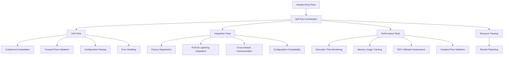
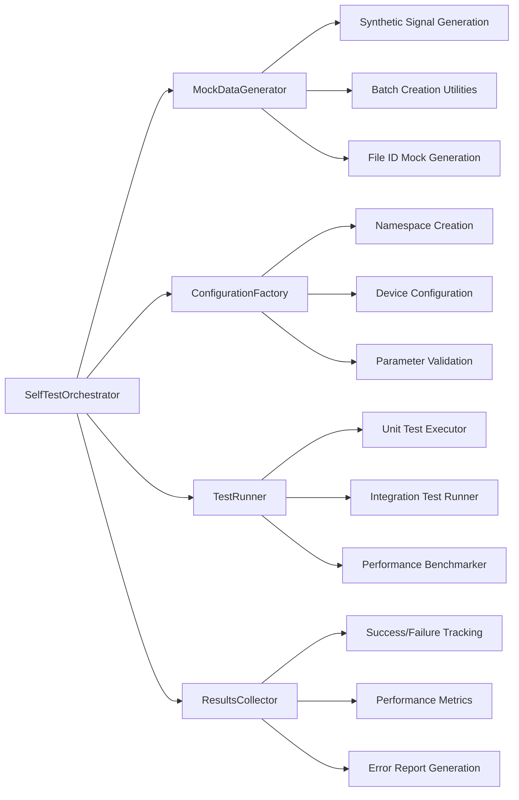

# Flow Self-Testing Module Design Document

## Overview

This design document outlines the implementation of comprehensive `if __name__ == "__main__"` self-testing capabilities for the PHM-Vibench Flow pretraining modules. The system provides immediate validation and testing capabilities for each Flow module without requiring external test framework setup, enabling rapid development feedback within a 30-second execution window.

The design leverages existing PHM-Vibench testing infrastructure patterns while ensuring independence from external test frameworks. It integrates seamlessly with the factory design pattern and PyTorch Lightning framework used throughout the codebase.

## Steering Document Alignment

### Technical Standards (tech.md)

The design adheres to PHM-Vibench technical standards:

- **Factory Pattern Integration**: Self-tests validate proper registration with PHM-Vibench factory systems
- **Configuration-Driven Architecture**: Uses existing YAML configuration patterns and argparse namespace structures
- **PyTorch Lightning Compatibility**: Maintains full compatibility with Lightning training workflows
- **Resource Management**: Implements proper CUDA memory cleanup and resource management patterns
- **Error Handling**: Follows existing error handling conventions with informative messages

### Project Structure (structure.md)

The implementation follows PHM-Vibench organizational conventions:

- **Module-Level Testing**: Each Flow module contains its own self-testing logic
- **Consistent Patterns**: Follows the existing 149+ self-testing implementations in the codebase
- **Factory Registration**: Validates proper integration with task factory patterns
- **Configuration Compatibility**: Uses existing configuration structures from `conftest.py`

## Code Reuse Analysis

### Existing Components to Leverage

- **conftest.py fixtures**: Reuse `sample_classification_data`, `basic_model_configs`, `ModelTestHelper`, and device management patterns
- **Factory registration patterns**: Leverage existing `@register_task` and factory lookup mechanisms
- **PyTorch Lightning utilities**: Use existing Lightning trainer patterns for validation
- **Configuration management**: Reuse argparse Namespace creation patterns from test fixtures
- **Mock data generation**: Extend existing synthetic dataset generation functions
- **Device management**: Use established CPU/GPU device switching patterns

### Integration Points

- **Task Factory System**: Validates proper registration and retrieval through factory mechanisms
- **Configuration System**: Integrates with existing YAML config loading and namespace creation
- **Model Factory Integration**: Tests interoperability with M_04_ISFM_Flow model instantiation
- **Metrics System**: Validates integration with existing Flow metrics and logging infrastructure

## Architecture

The self-testing architecture implements a layered validation approach with comprehensive coverage across unit, integration, and performance testing levels:



### Self-Testing Infrastructure Components



## Components and Interfaces

### SelfTestOrchestrator

- **Purpose:** Central coordinator for all self-testing operations with 30-second timeout management
- **Interfaces:** 
  - `run_all_tests() -> TestResults`: Execute complete test suite with time monitoring
  - `run_unit_tests() -> UnitTestResults`: Execute component-level validation
  - `run_integration_tests() -> IntegrationTestResults`: Execute cross-component testing  
  - `cleanup_resources()`: Ensure proper resource cleanup after testing
- **Dependencies:** MockDataGenerator, ConfigurationFactory, TestRunner, ResultsCollector
- **Reuses:** ModelTestHelper utility patterns, existing timeout management from test framework

### MockDataGenerator

- **Purpose:** Generate realistic synthetic data for Flow module testing using existing patterns
- **Interfaces:**
  - `generate_flow_batch(batch_size, seq_len, channels) -> Dict[str, torch.Tensor]`: Create Flow training batches
  - `generate_file_ids(batch_size) -> List[str]`: Generate mock file identifiers for conditional training
  - `create_synthetic_vibration_signals() -> torch.Tensor`: Generate realistic industrial vibration patterns
- **Dependencies:** PyTorch, NumPy, existing synthetic dataset patterns from conftest.py
- **Reuses:** `sample_classification_data`, `synthetic_dataset` fixture patterns, deterministic seeding

### FlowPretrainTaskTester

- **Purpose:** Comprehensive validation of FlowPretrainTask functionality
- **Interfaces:**
  - `test_task_instantiation()`: Validate proper initialization with mock configurations
  - `test_forward_pass()`: Verify forward pass with synthetic data
  - `test_training_modes()`: Test both Flow-only and joint Flow-Contrastive training
  - `test_generation_capabilities()`: Validate conditional/unconditional generation
- **Dependencies:** MockDataGenerator, ConfigurationFactory, existing ModelTestHelper patterns
- **Reuses:** Factory registration validation patterns, PyTorch Lightning testing utilities

### FlowContrastiveLossValidator  

- **Purpose:** Validate FlowContrastiveLoss computation accuracy and gradient flow
- **Interfaces:**
  - `test_loss_computation()`: Verify loss calculation with known input/output pairs
  - `test_gradient_flow()`: Validate gradients through Flow and contrastive components  
  - `test_weight_balancing()`: Test different λ_flow and λ_contrastive combinations
  - `test_projection_head()`: Validate projection head initialization and functionality
- **Dependencies:** MockDataGenerator, gradient validation utilities
- **Reuses:** ModelTestHelper gradient checking patterns, existing loss validation approaches

### FlowMetricsValidator

- **Purpose:** Validate FlowMetrics calculation accuracy with synthetic ground truth
- **Interfaces:**
  - `test_quality_metrics()`: Test KS test, spectral similarity with known distributions  
  - `test_statistical_validation()`: Verify statistical test implementations
  - `test_performance_monitoring()`: Validate speed, memory, gradient tracking
  - `test_visualization_generation()`: Test plot generation without errors
- **Dependencies:** SciPy, Matplotlib, statistical testing utilities
- **Reuses:** Existing performance monitoring patterns, visualization testing approaches

### ConfigurationFactory

- **Purpose:** Generate mock configurations compatible with existing PHM-Vibench patterns
- **Interfaces:**
  - `create_flow_task_config() -> argparse.Namespace`: Generate FlowPretrainTask configuration
  - `create_model_config() -> argparse.Namespace`: Generate M_04_ISFM_Flow model configuration
  - `create_trainer_config() -> argparse.Namespace`: Generate Lightning trainer configuration
- **Dependencies:** argparse, existing configuration patterns from conftest.py
- **Reuses:** `basic_model_configs` fixture patterns, existing namespace creation utilities

## Data Models

### TestConfiguration
```python
@dataclass
class TestConfiguration:
    """Configuration for Flow module self-testing."""
    batch_size: int = 8
    seq_len: int = 64
    input_dim: int = 3
    num_classes: int = 4
    device: str = 'auto'  # 'auto', 'cpu', or 'cuda'
    timeout_seconds: int = 30
    enable_performance_tests: bool = True
    enable_gpu_tests: bool = True  # Only if CUDA available
    mock_file_ids: Optional[List[str]] = None
```

### TestResults
```python
@dataclass
class TestResults:
    """Comprehensive test results for Flow modules."""
    module_name: str
    total_tests: int
    passed_tests: int
    failed_tests: int
    execution_time: float
    performance_metrics: Dict[str, float]
    error_messages: List[str]
    warnings: List[str]
    success_rate: float
    
    # Detailed results by category
    unit_test_results: UnitTestResults
    integration_test_results: IntegrationTestResults
    performance_test_results: PerformanceTestResults
```

### MockFlowBatch
```python
@dataclass
class MockFlowBatch:
    """Mock batch structure for Flow training."""
    x: torch.Tensor  # Shape: (B, L, C) - Input signals
    file_id: List[str]  # File identifiers for conditional encoding
    labels: Optional[torch.Tensor] = None  # For validation purposes
    metadata: Optional[Dict[str, Any]] = None  # Additional test metadata
```

### PerformanceMetrics
```python
@dataclass
class PerformanceMetrics:
    """Performance monitoring results."""
    forward_pass_time: float  # Milliseconds
    backward_pass_time: float  # Milliseconds  
    memory_usage_mb: float  # Peak memory usage
    gpu_memory_usage_mb: Optional[float] = None  # GPU memory if available
    parameter_count: int
    gradient_norm: float
    throughput_samples_per_second: float
```

## Error Handling

### Error Scenarios

1. **Configuration Validation Failures**
   - **Handling:** Catch ValueError and TypeError exceptions during configuration parsing
   - **User Impact:** Clear error messages indicating which configuration parameters are invalid
   - **Recovery:** Provide default fallback configurations and continue with remaining tests

2. **CUDA Availability Mismatches**
   - **Handling:** Detect CUDA availability and gracefully fallback to CPU testing
   - **User Impact:** Warning message about GPU tests being skipped, but CPU tests continue
   - **Recovery:** Automatic device selection with clear logging of chosen device

3. **Mock Data Generation Failures**
   - **Handling:** Catch tensor creation errors and data shape mismatches
   - **User Impact:** Detailed error messages about data generation parameters
   - **Recovery:** Fallback to simpler synthetic data patterns with reduced complexity

4. **Memory Allocation Errors**
   - **Handling:** Monitor memory usage and reduce batch sizes if OOM occurs
   - **User Impact:** Warning about reduced test complexity due to memory constraints
   - **Recovery:** Progressive batch size reduction with maintained test coverage

5. **Timeout Violations**
   - **Handling:** Implement timeout decorators for each test category
   - **User Impact:** Clear indication of which tests were interrupted due to time limits
   - **Recovery:** Prioritize critical tests and skip optional performance benchmarks

6. **Factory Registration Failures**
   - **Handling:** Verify factory registration state and provide diagnostic information
   - **User Impact:** Detailed messages about registration requirements and current state
   - **Recovery:** Manual registration attempt with error reporting for debugging

### Error Recovery Strategies

```python
class ErrorRecoveryManager:
    """Manages error recovery strategies for self-testing."""
    
    def handle_cuda_error(self, error: Exception) -> str:
        """Handle CUDA-related errors with CPU fallback."""
        return 'cpu'
    
    def reduce_complexity(self, config: TestConfiguration) -> TestConfiguration:
        """Reduce test complexity for resource-constrained environments."""
        config.batch_size = max(2, config.batch_size // 2)
        config.seq_len = max(32, config.seq_len // 2)
        return config
    
    def provide_fallback_data(self, original_shape: Tuple[int, ...]) -> torch.Tensor:
        """Generate simpler fallback data for failed mock generation."""
        return torch.randn(original_shape)
```

## Testing Strategy

### Unit Testing Approach

**FlowPretrainTask Unit Tests:**
- Task instantiation with various configuration combinations
- Forward pass validation with different input shapes and batch sizes
- Training step execution with mock optimizer and scheduler
- Configuration parameter validation and error handling
- Generation capability testing (conditional/unconditional modes)
- Contrastive learning integration validation

**FlowContrastiveLoss Unit Tests:**
- Loss computation with known input/output pairs for gradient verification
- Projection head initialization and forward pass validation
- Gradient flow testing through both Flow and contrastive components
- Loss weight balancing mechanism validation
- Time-series augmentation effects on loss computation

**FlowMetrics Unit Tests:**
- Quality metric calculations with synthetic ground truth data
- Statistical test validation (KS test, spectral similarity) with known distributions
- Performance monitoring accuracy (timing, memory usage)
- Visualization generation without runtime errors
- Metrics persistence and loading functionality

### Integration Testing Approach

**Factory Pattern Integration:**
- Validate proper registration with PHM-Vibench task factory
- Test retrieval and instantiation through factory lookup mechanisms
- Verify configuration compatibility with existing YAML templates
- Test interoperability between Flow modules using registration system

**PyTorch Lightning Integration:**
- Validate compatibility with Lightning trainer initialization
- Test training loop integration with mock data loaders
- Verify checkpoint saving and loading functionality
- Test metric logging and progress tracking integration

**Configuration System Integration:**
- Test compatibility with existing configuration loading patterns
- Validate argparse Namespace creation and parameter parsing
- Test configuration override mechanisms and default value handling
- Verify metadata integration and dataset compatibility

### End-to-End Testing Approach

**Complete Training Workflow:**
- Initialize FlowPretrainTask with realistic configurations
- Execute training steps with FlowContrastiveLoss integration
- Generate samples using conditional and unconditional modes
- Compute quality metrics using FlowMetrics validation
- Verify proper resource cleanup and memory management

**Cross-Module Communication:**
- Test data flow between FlowPretrainTask and FlowContrastiveLoss
- Validate metric computation using outputs from FlowPretrainTask
- Test configuration consistency across all Flow modules
- Verify error propagation and handling across module boundaries

### Performance Validation Strategy

**Execution Time Benchmarking:**
- Monitor forward pass execution time with various batch sizes
- Track backward pass performance for gradient computation validation
- Measure end-to-end training step execution time
- Validate generation speed for sample creation

**Memory Usage Monitoring:**
- Track peak memory usage during forward and backward passes
- Monitor GPU memory utilization when CUDA is available
- Validate memory cleanup after batch processing
- Test memory scaling with different batch sizes

**Throughput Measurement:**
- Calculate samples processed per second for performance baselines
- Monitor training throughput with different configurations
- Validate generation throughput for sample creation efficiency
- Test scaling behavior with increased model complexity

## Implementation Guidelines

### Module Self-Testing Structure

Each Flow module implements the following standardized self-testing structure:

```python
if __name__ == "__main__":
    import sys
    import time
    from typing import Dict, Any
    
    # Import testing infrastructure
    from .self_testing.orchestrator import SelfTestOrchestrator
    from .self_testing.generators import MockDataGenerator
    from .self_testing.validators import ModuleValidator
    
    def main():
        """Main self-testing entry point with 30-second timeout."""
        start_time = time.time()
        
        print(f"🧪 启动 {MODULE_NAME} 自测试...")
        print(f"⏱️  执行时间限制: 30秒")
        
        try:
            # Initialize testing infrastructure
            orchestrator = SelfTestOrchestrator(
                module_name=MODULE_NAME,
                timeout_seconds=30
            )
            
            # Run comprehensive test suite
            results = orchestrator.run_all_tests()
            
            # Report results
            execution_time = time.time() - start_time
            print(f"\n📊 测试结果:")
            print(f"   总测试: {results.total_tests}")
            print(f"   通过: {results.passed_tests}")
            print(f"   失败: {results.failed_tests}")
            print(f"   成功率: {results.success_rate:.1%}")
            print(f"   执行时间: {execution_time:.2f}秒")
            
            if results.error_messages:
                print(f"\n❌ 错误信息:")
                for error in results.error_messages:
                    print(f"   - {error}")
            
            if results.warnings:
                print(f"\n⚠️  警告信息:")
                for warning in results.warnings:
                    print(f"   - {warning}")
            
            # Exit with appropriate code
            sys.exit(0 if results.failed_tests == 0 else 1)
            
        except Exception as e:
            print(f"❌ 自测试执行失败: {e}")
            sys.exit(1)
    
    if __name__ == "__main__":
        main()
```

### Mock Data Generation Standards

Standardized mock data generation following existing conftest.py patterns:

```python
class FlowMockDataGenerator:
    """Generate mock data for Flow module testing using existing patterns."""
    
    @staticmethod
    def create_flow_training_batch(
        batch_size: int = 8,
        seq_len: int = 64,
        input_dim: int = 3,
        device: str = 'cpu'
    ) -> Dict[str, Any]:
        """Create realistic Flow training batch."""
        # Set deterministic seeds (following conftest.py patterns)
        torch.manual_seed(42)
        np.random.seed(42)
        
        # Generate synthetic vibration signals with industrial patterns
        t = np.linspace(0, 1, seq_len)
        signals = []
        file_ids = []
        
        for i in range(batch_size):
            # Create multi-frequency industrial vibration pattern
            freq_base = 10 + (i % 4) * 5  # Different patterns per sample
            freq_harmonics = freq_base * 2
            
            # Generate realistic vibration signal
            signal = (
                np.sin(2 * np.pi * freq_base * t) +
                0.3 * np.sin(2 * np.pi * freq_harmonics * t) +
                0.1 * np.random.randn(seq_len)
            )
            
            # Create multi-channel data (typical for industrial sensors)
            multi_channel = np.stack([
                signal,
                signal + 0.1 * np.random.randn(seq_len),  # Sensor variation
                0.8 * signal + 0.05 * np.random.randn(seq_len)  # Different sensor
            ], axis=1)
            
            signals.append(multi_channel)
            file_ids.append(f"mock_file_{i:03d}")
        
        # Convert to tensors
        x = torch.FloatTensor(signals).to(device)
        
        return {
            'x': x,
            'file_id': file_ids,
            'metadata': {
                'batch_size': batch_size,
                'seq_len': seq_len,
                'input_dim': input_dim,
                'generator': 'FlowMockDataGenerator'
            }
        }
```

### Configuration Factory Patterns

Reuse existing configuration patterns from conftest.py:

```python
class FlowConfigurationFactory:
    """Create mock configurations compatible with PHM-Vibench patterns."""
    
    @staticmethod
    def create_flow_pretrain_task_config(device: str = 'cpu') -> argparse.Namespace:
        """Create FlowPretrainTask configuration following existing patterns."""
        return argparse.Namespace(
            # Flow pretraining parameters
            use_conditional=True,
            generation_mode='conditional',
            num_steps=100,  # Reduced for testing
            sigma_min=0.001,
            sigma_max=1.0,
            
            # Contrastive learning parameters
            use_contrastive=True,
            flow_weight=1.0,
            contrastive_weight=0.1,
            contrastive_temperature=0.1,
            projection_dim=64,  # Reduced for testing
            contrastive_hidden_dim=128,
            use_gradient_balancing=True,
            
            # Training parameters
            lr=1e-3,  # Higher for faster convergence in testing
            weight_decay=1e-5,
            max_epochs=5,  # Limited for testing
            
            # Validation parameters
            validate_generation=True,
            generation_samples=4,  # Reduced for testing
            enable_visualization=False,  # Disabled for testing speed
            track_memory=True,
            track_gradients=True,
            
            # Testing-specific parameters
            device=device,
            testing_mode=True
        )
```

### Resource Management and Cleanup

Implement comprehensive resource cleanup following existing patterns:

```python
class ResourceManager:
    """Manage resources during self-testing with proper cleanup."""
    
    def __init__(self):
        self.allocated_tensors = []
        self.created_models = []
        self.temp_files = []
    
    def register_tensor(self, tensor: torch.Tensor):
        """Register tensor for cleanup."""
        self.allocated_tensors.append(tensor)
    
    def register_model(self, model: nn.Module):
        """Register model for cleanup."""
        self.created_models.append(model)
    
    def cleanup_all(self):
        """Comprehensive resource cleanup."""
        # Clear tensor references
        for tensor in self.allocated_tensors:
            del tensor
        self.allocated_tensors.clear()
        
        # Clear model references
        for model in self.created_models:
            del model
        self.created_models.clear()
        
        # Remove temporary files
        for temp_file in self.temp_files:
            if os.path.exists(temp_file):
                os.remove(temp_file)
        self.temp_files.clear()
        
        # Clear CUDA cache if available
        if torch.cuda.is_available():
            torch.cuda.empty_cache()
        
        # Force garbage collection
        import gc
        gc.collect()
```

### Integration with Existing CI/CD Workflows

The self-testing system integrates with existing pytest infrastructure:

```python
# Compatibility layer for pytest integration
@pytest.mark.slow
@pytest.mark.gpu
def test_flow_pretrain_self_test():
    """Pytest wrapper for FlowPretrainTask self-test."""
    from src.task_factory.task.pretrain.flow_pretrain import main as flow_pretrain_main
    
    # Execute self-test within pytest environment
    result = flow_pretrain_main()
    assert result.failed_tests == 0, f"Self-test failed: {result.error_messages}"

# Mark self-tests for CI execution
def pytest_collection_modifyitems(config, items):
    """Add markers to self-test wrappers."""
    for item in items:
        if "self_test" in item.nodeid:
            item.add_marker(pytest.mark.integration)
            if "gpu" in item.nodeid:
                item.add_marker(pytest.mark.gpu)
```

This design provides a robust, comprehensive self-testing framework that leverages existing PHM-Vibench infrastructure while providing immediate validation capabilities for Flow modules. The implementation follows established patterns and integrates seamlessly with the existing codebase architecture.