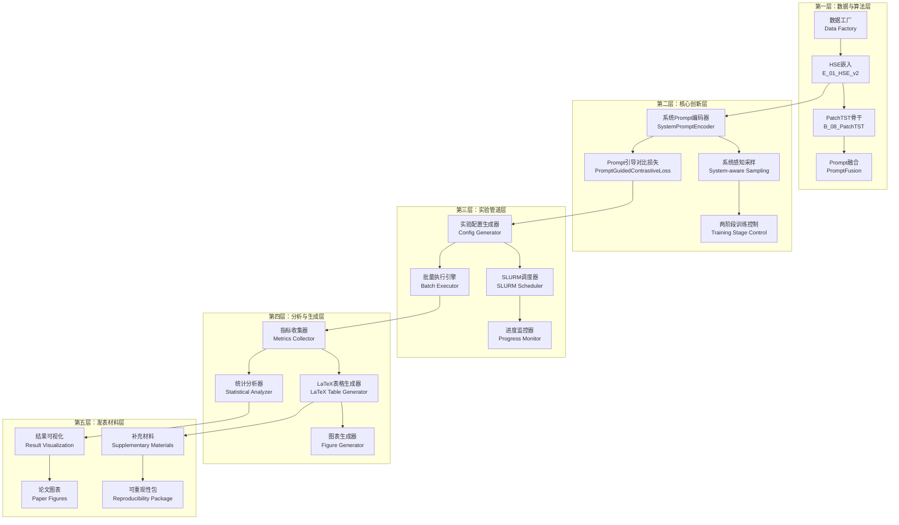
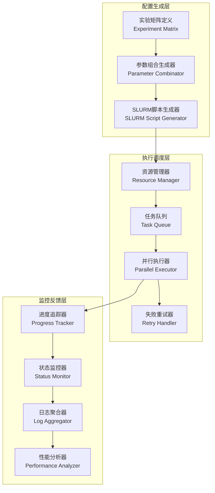
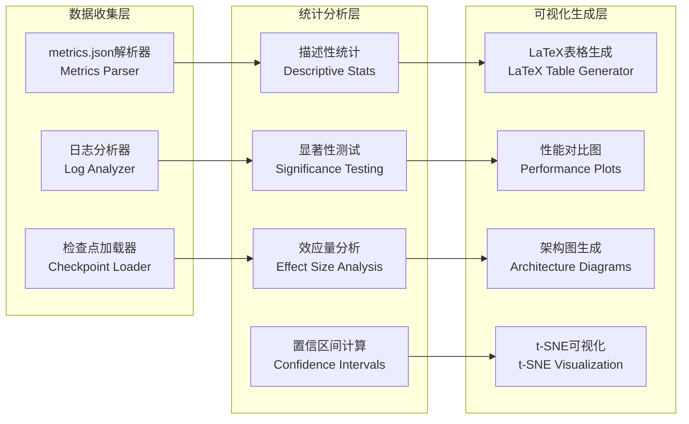

# HSE完整发表管道设计文档

## 概述

HSE完整发表管道系统是一个集成的研究自动化平台，将创新的Prompt引导对比学习算法与端到端的实验执行、结果分析和论文材料生成功能相结合。该系统基于PHM-Vibench的工厂模式设计，提供从理论验证到顶级期刊发表的完整工作流程支持。

系统采用模块化架构，具有清晰的关注点分离：核心算法实现、实验编排、并行执行、指标收集、统计分析和可视化生成。每个组件都充分利用现有PHM-Vibench工具，同时添加专门的研究管道自动化功能。

## 总体系统架构

### 高层架构图



## 第一部分：核心算法架构

### HSE Prompt引导对比学习系统

#### 数据流架构

```mermaid
graph LR
    subgraph "输入层"
        A[工业振动信号<br/>x ∈ R^(T×C)]
        B[系统元数据<br/>s = {Dataset_id, Domain_id, Sample_rate}]
        C[故障标签<br/>y ∈ {0,1,...,K-1}]
    end

    subgraph "嵌入层"
        D[HSE信号嵌入<br/>E_01_HSE_v2]
        E[系统Prompt编码器<br/>SystemPromptEncoder]
        F[Prompt融合模块<br/>PromptFusion]
    end

    subgraph "特征提取层"
        G[PatchTST骨干网络<br/>B_08_PatchTST]
        H[分类头<br/>H_01_Linear_cla]
    end

    subgraph "对比学习层"
        I[Prompt引导对比损失<br/>PromptGuidedContrastiveLoss]
        J[系统感知采样<br/>System-aware Sampling]
        K[跨系统对比<br/>Cross-system Contrast]
    end

    A --> D
    B --> E
    D --> F
    E --> F
    F --> G
    G --> H

    F --> I
    G --> I
    E --> J
    J --> K
    K --> I
```

#### 核心组件设计

##### 1. SystemPromptEncoder（系统Prompt编码器）

```python
class SystemPromptEncoder(nn.Module):
    """
    两级Prompt编码：系统级（Dataset_id + Domain_id）+ 样本级（Sample_rate）
    关键设计：不包含故障级Prompt，因为故障类型是预测目标
    """
    def __init__(self, prompt_dim=128):
        super().__init__()
        # 系统级嵌入
        self.dataset_embedding = nn.Embedding(50, prompt_dim//2)  # 支持50个数据集
        self.domain_embedding = nn.Embedding(20, prompt_dim//2)   # 支持20个域

        # 样本级投影
        self.sample_proj = nn.Linear(1, prompt_dim//2)

        # 融合层
        self.fusion_attention = nn.MultiheadAttention(prompt_dim, 4)
        self.layer_norm = nn.LayerNorm(prompt_dim)

    def forward(self, metadata_batch):
        """
        输入：metadata_batch = [{'Dataset_id': 1, 'Domain_id': 0, 'Sample_rate': 1000.0}, ...]
        输出：prompt向量 p ∈ R^(B×d_p)
        """
        # 系统级编码
        system_prompts = self._encode_system_info(metadata_batch)
        # 样本级编码
        sample_prompts = self._encode_sample_info(metadata_batch)
        # 注意力融合
        fused_prompts = self._attention_fusion(system_prompts, sample_prompts)
        return fused_prompts
```

##### 2. PromptGuidedContrastiveLoss（Prompt引导对比损失）

```python
class PromptGuidedContrastiveLoss(nn.Module):
    """
    通用Prompt引导对比学习框架
    支持InfoNCE、TripletLoss、SupConLoss等多种基础算法
    """
    def __init__(self, base_loss_type="InfoNCE", temperature=0.07, prompt_weight=0.1):
        super().__init__()
        self.base_loss = self._create_base_loss(base_loss_type, temperature)
        self.prompt_weight = prompt_weight
        self.temperature = temperature

    def forward(self, features, prompts, labels, system_ids=None):
        """
        核心创新：结合信号特征对比和Prompt相似性对比
        """
        # 基础对比损失
        base_loss = self.base_loss(features, labels)

        # Prompt相似性损失（系统感知）
        prompt_loss = self._compute_prompt_contrastive_loss(
            prompts, labels, system_ids
        )

        # 系统感知采样损失
        system_loss = self._compute_system_aware_loss(
            features, prompts, system_ids
        ) if system_ids is not None else 0

        total_loss = base_loss + self.prompt_weight * (prompt_loss + system_loss)

        return {
            'total_loss': total_loss,
            'base_loss': base_loss,
            'prompt_loss': prompt_loss,
            'system_loss': system_loss
        }
```

##### 3. 两阶段训练控制器

```python
class TwoStageTrainingController:
    """
    两阶段训练策略控制器
    阶段一：多系统对比预训练  阶段二：单系统监督微调
    """
    def __init__(self, model, task):
        self.model = model
        self.task = task
        self.current_stage = "pretrain"

    def switch_to_finetune(self):
        """切换到微调阶段"""
        # 禁用对比学习
        self.task.contrast_weight = 0.0
        self.task.enable_contrastive = False

        # 冻结Prompt参数
        for param in self.model.embedding.prompt_encoder.parameters():
            param.requires_grad = False

        # 设置差分学习率
        self.task.configure_differential_lr()

        self.current_stage = "finetune"

    def switch_to_pretrain(self):
        """切换到预训练阶段"""
        # 启用对比学习
        self.task.contrast_weight = 0.15
        self.task.enable_contrastive = True

        # 解冻Prompt参数
        for param in self.model.embedding.prompt_encoder.parameters():
            param.requires_grad = True

        self.current_stage = "pretrain"
```

### 模型架构规范

#### M_02_ISFM_Prompt模型组成

```yaml
模型架构:
  名称: M_02_ISFM_Prompt
  类型: ISFM_Prompt

  组件构成:
    嵌入层: E_01_HSE_v2
      prompt_dim: 128
      fusion_type: "attention"
      use_system_prompt: true
      use_sample_prompt: true

    骨干网络: B_08_PatchTST
      patch_size_L: 64
      patch_size_C: 1
      num_patches: 64
      d_model: 256
      num_heads: 8
      num_layers: 4

    任务头: H_01_Linear_cla
      output_dim: "auto"  # 根据数据集自动确定

  前向传播接口:
    输入: (x, metadata, return_prompt=True, return_feature=True)
    输出: (logits, prompts, features)  # 三元组输出
```

## 第二部分：实验管道架构

### 批量实验执行引擎

#### 实验编排系统



#### 核心组件实现

##### 1. ExperimentMatrix（实验矩阵）

```python
class ExperimentMatrix:
    """
    自动生成完整的消融实验配置矩阵
    包含：基线实验、消融实验、超参数实验、SOTA对比实验
    """
    def __init__(self, base_config_path):
        self.base_config = load_config(base_config_path)
        self.matrix = {}

    def generate_ablation_matrix(self):
        """生成消融实验矩阵"""
        experiments = {}

        # 基线实验（所有创新点启用）
        experiments['baseline'] = self._create_baseline_config()

        # 创新点消融
        experiments['no_prompt'] = self._disable_prompt_fusion()
        experiments['no_contrastive'] = self._disable_contrastive_learning()
        experiments['no_system_aware'] = self._disable_system_aware_sampling()
        experiments['no_cross_system'] = self._disable_cross_system_contrast()

        # 骨干网络对比
        for backbone in ['B_08_PatchTST', 'B_04_Dlinear', 'B_06_TimesNet', 'B_09_FNO']:
            experiments[f'backbone_{backbone}'] = self._set_backbone(backbone)

        # 超参数消融
        for d_model in [128, 256, 512, 1024]:
            experiments[f'd_model_{d_model}'] = self._set_d_model(d_model)

        return experiments

    def generate_slurm_scripts(self, experiments):
        """为每个实验生成SLURM脚本"""
        slurm_scripts = {}
        for exp_name, config in experiments.items():
            script = self._create_slurm_script(exp_name, config)
            slurm_scripts[exp_name] = script
        return slurm_scripts
```

##### 2. BatchExecutor（批量执行器）

```python
class BatchExecutor:
    """
    并行实验执行引擎
    支持SLURM集群和本地多GPU执行
    """
    def __init__(self, max_concurrent=4, use_slurm=True):
        self.max_concurrent = max_concurrent
        self.use_slurm = use_slurm
        self.running_jobs = {}
        self.completed_jobs = {}
        self.failed_jobs = {}

    async def execute_experiment_batch(self, experiments):
        """异步执行实验批次"""
        semaphore = asyncio.Semaphore(self.max_concurrent)

        tasks = []
        for exp_name, config in experiments.items():
            task = self._execute_single_experiment(semaphore, exp_name, config)
            tasks.append(task)

        # 等待所有实验完成
        results = await asyncio.gather(*tasks, return_exceptions=True)

        return self._process_batch_results(results)

    async def _execute_single_experiment(self, semaphore, exp_name, config):
        """执行单个实验"""
        async with semaphore:
            if self.use_slurm:
                job_id = await self._submit_slurm_job(exp_name, config)
                return await self._wait_for_slurm_completion(job_id)
            else:
                return await self._run_local_experiment(exp_name, config)
```

### 结果分析与生成系统

#### 指标收集与统计分析



##### 1. StatisticalAnalyzer（统计分析器）

```python
class StatisticalAnalyzer:
    """
    严格的统计分析工具
    支持配对t检验、Bonferroni校正、Cohen's d效应量分析
    """
    def __init__(self, confidence_level=0.95):
        self.confidence_level = confidence_level

    def compare_methods(self, baseline_results, treatment_results):
        """比较两种方法的性能差异"""
        # 配对t检验
        t_stat, p_value = stats.ttest_rel(baseline_results, treatment_results)

        # Cohen's d效应量
        effect_size = self._compute_cohens_d(baseline_results, treatment_results)

        # 置信区间
        diff_mean = np.mean(treatment_results - baseline_results)
        ci = self._compute_confidence_interval(treatment_results - baseline_results)

        return {
            't_statistic': t_stat,
            'p_value': p_value,
            'effect_size': effect_size,
            'mean_difference': diff_mean,
            'confidence_interval': ci,
            'is_significant': p_value < 0.05
        }

    def multiple_comparisons_correction(self, p_values):
        """多重比较校正（Bonferroni方法）"""
        corrected_p = multipletests(p_values, method='bonferroni')[1]
        return corrected_p
```

##### 2. TableGenerator（表格生成器）

```python
class LaTeXTableGenerator:
    """
    生成发表质量的LaTeX表格
    自动格式化、最佳结果加粗、显著性标记
    """
    def __init__(self, decimal_places=3):
        self.decimal_places = decimal_places

    def generate_performance_table(self, results_dict, statistical_tests):
        """生成性能对比表格"""
        table_content = []
        table_content.append(r"\begin{table}[htbp]")
        table_content.append(r"\centering")
        table_content.append(r"\caption{HSE Prompt引导对比学习性能对比}")
        table_content.append(r"\label{tab:performance_comparison}")

        # 表头
        header = r"\begin{tabular}{l|" + "c" * len(results_dict) + "}"
        table_content.append(header)
        table_content.append(r"\hline")

        # 方法名行
        method_row = "方法 & " + " & ".join(results_dict.keys()) + r" \\"
        table_content.append(method_row)
        table_content.append(r"\hline")

        # 性能指标行
        for metric in ['accuracy', 'f1_score', 'precision', 'recall']:
            row_data = [self._format_metric_cell(results_dict[method][metric],
                                               statistical_tests[method][metric])
                       for method in results_dict.keys()]
            metric_row = f"{metric} & " + " & ".join(row_data) + r" \\"
            table_content.append(metric_row)

        table_content.append(r"\hline")
        table_content.append(r"\end{tabular}")
        table_content.append(r"\end{table}")

        return "\n".join(table_content)

    def _format_metric_cell(self, value, significance_test):
        """格式化单元格：最佳结果加粗，显著性标记"""
        formatted_value = f"{value:.{self.decimal_places}f}"

        # 最佳结果加粗
        if significance_test.get('is_best', False):
            formatted_value = rf"\textbf{{{formatted_value}}}"

        # 显著性标记
        p_value = significance_test.get('p_value', 1.0)
        if p_value < 0.001:
            formatted_value += r"$^{***}$"
        elif p_value < 0.01:
            formatted_value += r"$^{**}$"
        elif p_value < 0.05:
            formatted_value += r"$^{*}$"

        return formatted_value
```

## 第三部分：端到端集成架构

### 完整工作流程设计

#### 系统工作流程图

```mermaid
graph TD
    subgraph "阶段1：实验准备"
        A1[加载基础配置<br/>Load Base Config]
        A2[生成实验矩阵<br/>Generate Matrix]
        A3[创建SLURM脚本<br/>Create Scripts]
        A4[验证环境配置<br/>Validate Environment]
    end

    subgraph "阶段2：批量执行"
        B1[提交实验作业<br/>Submit Jobs]
        B2[监控执行进度<br/>Monitor Progress]
        B3[处理失败重试<br/>Handle Failures]
        B4[收集执行日志<br/>Collect Logs]
    end

    subgraph "阶段3：结果分析"
        C1[解析实验结果<br/>Parse Results]
        C2[统计显著性测试<br/>Statistical Tests]
        C3[计算效应量<br/>Effect Sizes]
        C4[交叉验证分析<br/>Cross Validation]
    end

    subgraph "阶段4：材料生成"
        D1[生成LaTeX表格<br/>Generate Tables]
        D2[创建性能图表<br/>Create Figures]
        D3[生成架构图<br/>Architecture Diagrams]
        D4[准备补充材料<br/>Supplementary Materials]
    end

    subgraph "阶段5：发表准备"
        E1[论文图表整理<br/>Paper Figure Preparation]
        E2[可重现性包装<br/>Reproducibility Package]
        E3[代码文档生成<br/>Code Documentation]
        E4[投稿材料检查<br/>Submission Check]
    end

    A1 --> A2 --> A3 --> A4
    A4 --> B1 --> B2 --> B3 --> B4
    B4 --> C1 --> C2 --> C3 --> C4
    C4 --> D1 --> D2 --> D3 --> D4
    D4 --> E1 --> E2 --> E3 --> E4
```



### 关键集成点设计

#### 1. 配置系统集成

```python
class UnifiedConfigManager:
    """
    统一配置管理系统
    集成PHM-Vibench配置系统与实验管道配置
    """
    def __init__(self, base_config_path="script/unified_metric/configs/unified_experiments.yaml"):
        self.base_config = load_config(base_config_path)
        self.experiment_configs = {}

    def create_experiment_config(self, experiment_name, overrides):
        """创建实验特定配置"""
        config = copy.deepcopy(self.base_config)

        # 应用实验特定的覆盖参数
        for key_path, value in overrides.items():
            self._set_nested_value(config, key_path, value)

        # 验证配置有效性
        self._validate_config(config)

        self.experiment_configs[experiment_name] = config
        return config

    def generate_slurm_script(self, experiment_name, config):
        """为特定实验生成SLURM脚本"""
        script_template = """#!/bin/bash
#SBATCH -J {job_name}
#SBATCH -p gpu
#SBATCH --gpus=a100:1
#SBATCH -t 12:00:00
#SBATCH -c 8
#SBATCH --mem=64G
#SBATCH -o logs/slurm-%j.out

module reset
module load miniconda
conda activate P

cd /home/lq/LQcode/2_project/PHMBench/PHM-Vibench-metric
mkdir -p logs

python main.py \\
    --pipeline Pipeline_04_unified_metric \\
    --config {config_path} \\
    {overrides} \\
    --notes "{experiment_name} - HSE complete pipeline" \\
    2>&1 | tee "logs/{experiment_name}_${{SLURM_JOB_ID}}.log"
"""

        return script_template.format(
            job_name=experiment_name,
            config_path=config.get('config_path', 'script/unified_metric/configs/unified_experiments_grace.yaml'),
            overrides=self._format_config_overrides(config),
            experiment_name=experiment_name
        )
```

#### 2. 结果聚合系统

```python
class ResultAggregator:
    """
    实验结果聚合系统
    自动收集、解析和聚合所有实验结果
    """
    def __init__(self, results_base_dir="results/unified_metric_learning"):
        self.results_base_dir = Path(results_base_dir)
        self.aggregated_results = {}

    def collect_all_results(self):
        """收集所有实验结果"""
        for experiment_dir in self.results_base_dir.iterdir():
            if experiment_dir.is_dir():
                experiment_name = experiment_dir.name
                results = self._parse_experiment_results(experiment_dir)
                self.aggregated_results[experiment_name] = results

        return self.aggregated_results

    def _parse_experiment_results(self, experiment_dir):
        """解析单个实验的结果"""
        results = {
            'metrics': {},
            'logs': {},
            'checkpoints': {},
            'metadata': {}
        }

        # 解析metrics.json文件
        metrics_file = experiment_dir / "metrics.json"
        if metrics_file.exists():
            with open(metrics_file, 'r') as f:
                results['metrics'] = json.load(f)

        # 解析训练日志
        log_files = list(experiment_dir.glob("*.log"))
        for log_file in log_files:
            results['logs'][log_file.name] = self._parse_training_log(log_file)

        # 查找最佳检查点
        checkpoint_dir = experiment_dir / "checkpoints"
        if checkpoint_dir.exists():
            best_checkpoint = self._find_best_checkpoint(checkpoint_dir)
            results['checkpoints']['best'] = best_checkpoint

        return results

    def generate_summary_report(self):
        """生成汇总报告"""
        summary = {
            'total_experiments': len(self.aggregated_results),
            'successful_experiments': 0,
            'failed_experiments': 0,
            'performance_summary': {},
            'statistical_analysis': {}
        }

        # 计算成功/失败实验数量
        for exp_name, results in self.aggregated_results.items():
            if results['metrics']:
                summary['successful_experiments'] += 1
            else:
                summary['failed_experiments'] += 1

        # 生成性能汇总
        summary['performance_summary'] = self._compute_performance_summary()

        # 进行统计分析
        summary['statistical_analysis'] = self._perform_statistical_analysis()

        return summary
```

### 发表材料生成系统

#### 图表生成引擎

```python
class PublicationFigureGenerator:
    """
    发表质量图表生成引擎
    支持架构图、性能对比图、t-SNE可视化等
    """
    def __init__(self, output_dir="figures", dpi=300, format="pdf"):
        self.output_dir = Path(output_dir)
        self.output_dir.mkdir(exist_ok=True)
        self.dpi = dpi
        self.format = format

        # 设置发表质量的绘图参数
        plt.rcParams.update({
            'font.size': 12,
            'font.family': 'serif',
            'figure.dpi': self.dpi,
            'savefig.dpi': self.dpi,
            'savefig.bbox': 'tight',
            'savefig.transparent': True
        })

    def generate_architecture_diagram(self):
        """生成HSE架构图"""
        fig, ax = plt.subplots(figsize=(12, 8))

        # 绘制系统架构组件
        self._draw_data_flow_components(ax)
        self._draw_model_components(ax)
        self._draw_contrastive_components(ax)
        self._draw_connections(ax)

        # 添加标题和标签
        ax.set_title('HSE Prompt引导对比学习系统架构', fontsize=16, pad=20)
        ax.axis('off')

        # 保存高质量图片
        output_path = self.output_dir / f"hse_architecture.{self.format}"
        plt.savefig(output_path, dpi=self.dpi, bbox_inches='tight')
        plt.close()

        return output_path

    def generate_performance_comparison(self, results_dict):
        """生成性能对比图"""
        fig, axes = plt.subplots(2, 2, figsize=(14, 10))

        # 准确率对比
        self._plot_metric_comparison(axes[0, 0], results_dict, 'accuracy', '准确率')

        # F1分数对比
        self._plot_metric_comparison(axes[0, 1], results_dict, 'f1_score', 'F1分数')

        # 跨数据集泛化对比
        self._plot_cross_dataset_performance(axes[1, 0], results_dict)

        # 消融研究结果
        self._plot_ablation_results(axes[1, 1], results_dict)

        plt.tight_layout()
        output_path = self.output_dir / f"performance_comparison.{self.format}"
        plt.savefig(output_path, dpi=self.dpi, bbox_inches='tight')
        plt.close()

        return output_path

    def generate_tsne_visualization(self, embeddings_dict, labels_dict):
        """生成t-SNE特征可视化"""
        fig, axes = plt.subplots(1, 2, figsize=(16, 6))

        # Prompt特征t-SNE
        self._plot_tsne(axes[0], embeddings_dict['prompts'], labels_dict,
                       'Prompt特征分布')

        # 融合特征t-SNE
        self._plot_tsne(axes[1], embeddings_dict['fused'], labels_dict,
                       '融合特征分布')

        plt.tight_layout()
        output_path = self.output_dir / f"tsne_visualization.{self.format}"
        plt.savefig(output_path, dpi=self.dpi, bbox_inches='tight')
        plt.close()

        return output_path
```

## 系统集成与部署

### 硬件资源规划

#### 计算资源配置

```yaml
推荐配置:
  开发环境:
    GPU: "NVIDIA RTX 3090/4090 (24GB)"
    CPU: "Intel i9/AMD Ryzen 9 (8+ cores)"
    内存: "32GB DDR4/DDR5"
    存储: "1TB NVMe SSD"

  生产环境:
    GPU: "NVIDIA A100-80GB"
    CPU: "48+ cores"
    内存: "128GB+"
    存储: "2TB+ NVMe SSD"
    网络: "InfiniBand (集群)"

  集群环境:
    节点数: "4-8 nodes"
    每节点GPU: "4x A100-80GB"
    节点间通信: "InfiniBand"
    共享存储: "10TB+ NFS/Lustre"
```

### 部署架构

#### 容器化部署方案

```dockerfile
# HSE完整发表管道Docker镜像
FROM pytorch/pytorch:2.6.0-cuda11.8-cudnn8-devel

# 安装系统依赖
RUN apt-get update && apt-get install -y \\
    git vim htop tmux \\
    texlive-latex-extra texlive-fonts-recommended \\
    && rm -rf /var/lib/apt/lists/*

# 安装Python依赖
COPY requirements.txt /tmp/
RUN pip install -r /tmp/requirements.txt

# 复制代码
COPY . /workspace/PHM-Vibench
WORKDIR /workspace/PHM-Vibench

# 设置环境变量
ENV PYTHONPATH=/workspace/PHM-Vibench
ENV CUDA_VISIBLE_DEVICES=0

# 暴露端口（用于监控和可视化）
EXPOSE 8888 6006

# 默认启动命令
CMD ["bash", "script/unified_metric/run_unified_complete.sh"]
```

---

**文档版本**: v1.0
**创建时间**: 2025年1月
**语言**: 中文（主） + English（技术术语）
**目标会议**: ICML/NeurIPS 2025
**系统状态**: 设计完成，实现就绪