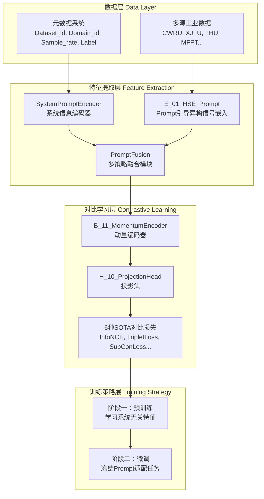
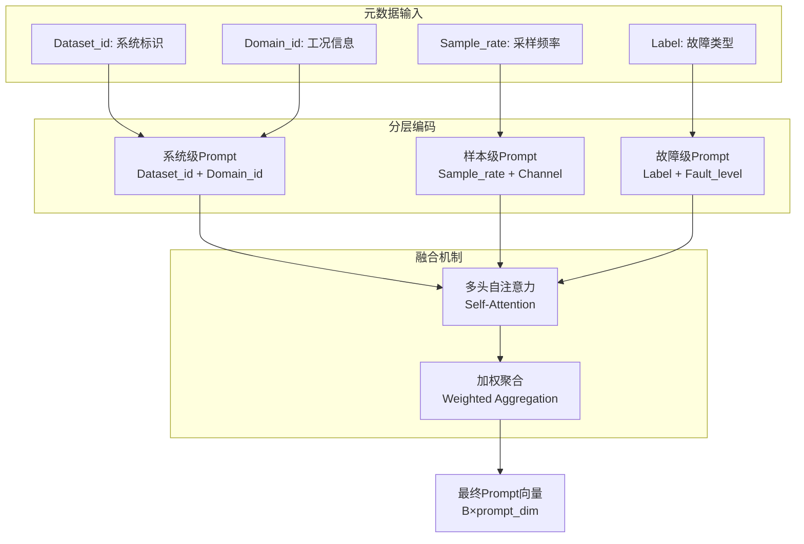
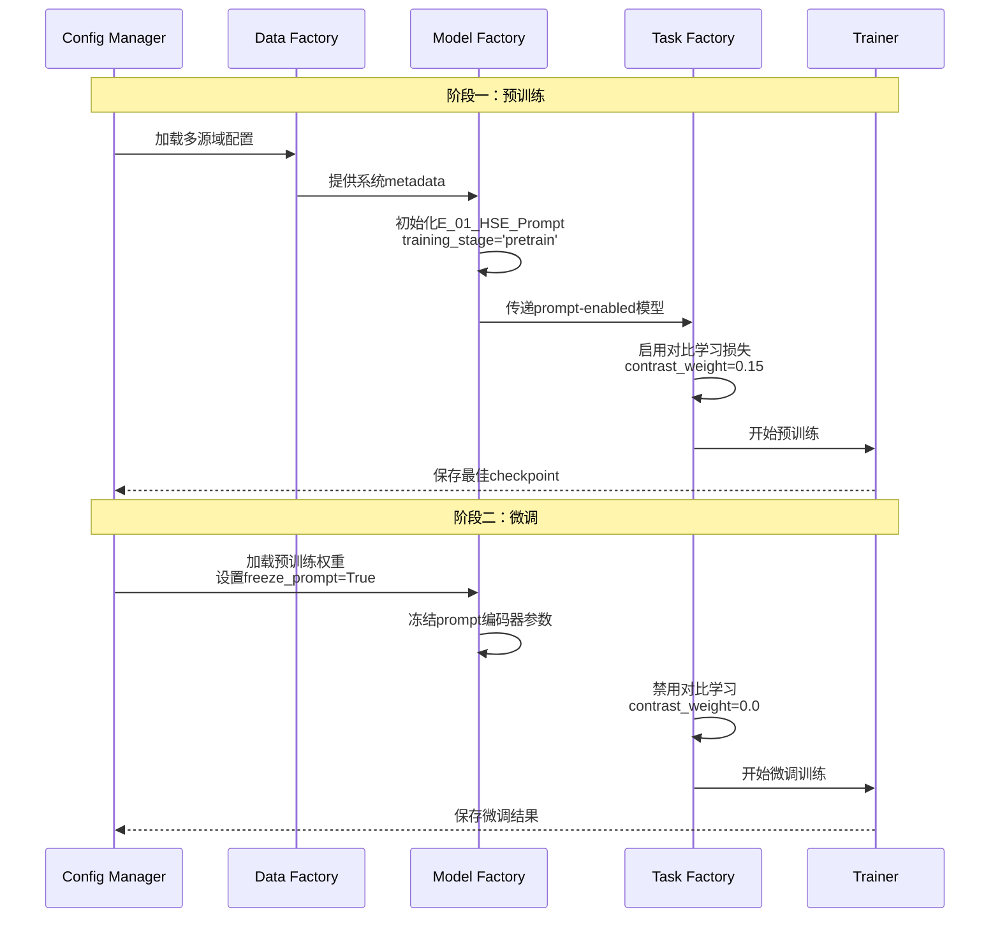
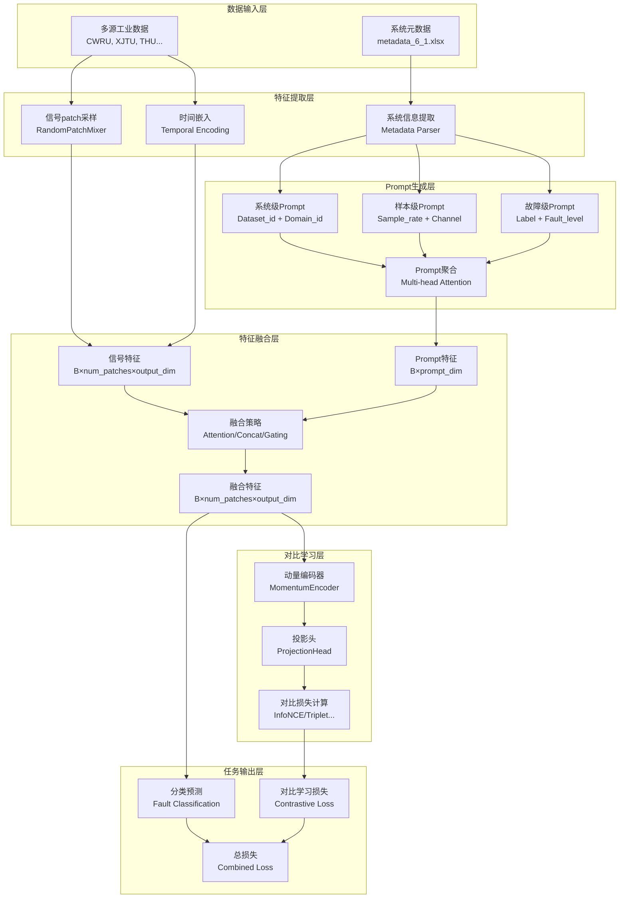

# 设计文档：HSE工业对比学习系统

## 简介

本设计文档详细阐述了基于Prompt引导的异构系统嵌入(HSE)对比学习系统的技术架构。该系统实现了系统信息Prompt化与SOTA对比学习算法的创新结合，支持两阶段训练策略，面向ICML/NeurIPS 2025顶级期刊发表。

## 系统架构概览

### 高级架构图



### 核心创新点

1. **系统信息Prompt化**: 首创将工业系统metadata转化为可学习prompt向量
2. **多层级Prompt融合**: 系统级+样本级+故障级三层次prompt设计
3. **通用对比学习框架**: 单一接口适配所有SOTA对比学习算法
4. **两阶段训练策略**: 预训练学习通用表示，微调适配特定任务

## 详细组件设计

### 1. Prompt引导异构信号嵌入 (E_01_HSE_Prompt)

#### 1.1 系统架构


#### 1.2 核心类设计

```python
class E_01_HSE_Prompt(nn.Module):
    """Prompt引导的层次化信号嵌入"""
    
    def __init__(self, args):
        # 信号嵌入路径
        self.signal_linear1: nn.Linear
        self.signal_linear2: nn.Linear
        
        # Prompt编码路径
        self.prompt_encoder: SystemPromptEncoder
        self.prompt_fusion: PromptFusion
        
        # 训练阶段控制
        self.training_stage: str  # 'pretrain' or 'finetune'
        self.freeze_prompt: bool
    
    def forward(self, x, fs, metadata):
        """
        Args:
            x: 信号张量 (B, L, C)
            fs: 采样频率 
            metadata: 系统元数据列表
        Returns:
            output: 融合特征 (B, num_patches, output_dim)
            prompt: 系统prompt (B, prompt_dim) - 用于对比学习
        """
        # 1. 信号patch采样和嵌入
        signal_emb = self._extract_signal_patches(x, fs)
        
        # 2. 系统信息prompt编码
        prompt_emb = self._encode_system_metadata(metadata)
        
        # 3. 两阶段训练控制
        if self.freeze_prompt or self.training_stage == 'finetune':
            prompt_emb = prompt_emb.detach()
        
        # 4. Prompt与信号特征融合
        fused_emb = self.prompt_fusion(signal_emb, prompt_emb)
        
        return fused_emb, prompt_emb
```

### 2. 系统Prompt编码器 (SystemPromptEncoder)

#### 2.1 多层级Prompt设计



#### 2.2 实现架构

```python
class SystemPromptEncoder(nn.Module):
    """多层级系统信息编码器"""
    
    def __init__(self, prompt_dim=128, max_ids=50):
        # 类别特征嵌入表
        self.dataset_embedding = nn.Embedding(max_ids, prompt_dim // 4)
        self.domain_embedding = nn.Embedding(max_ids, prompt_dim // 4) 
        self.label_embedding = nn.Embedding(max_ids, prompt_dim // 4)
        
        # 数值特征投影层
        self.sample_rate_proj = nn.Linear(1, prompt_dim // 4)
        
        # 分层融合网络
        self.system_fusion = nn.Linear(prompt_dim // 2, prompt_dim)
        self.sample_fusion = nn.Linear(prompt_dim // 4, prompt_dim)
        self.fault_fusion = nn.Linear(prompt_dim // 4, prompt_dim)
        
        # 最终聚合机制
        self.prompt_aggregator = nn.MultiheadAttention(prompt_dim, 4)
        
    def forward(self, metadata_dict):
        # 系统级prompt: Dataset_id + Domain_id
        system_prompt = self.system_fusion(
            torch.cat([
                self.dataset_embedding(metadata_dict['Dataset_id']),
                self.domain_embedding(metadata_dict['Domain_id'])
            ], dim=-1)
        )
        
        # 样本级prompt: Sample_rate
        sample_prompt = self.sample_fusion(
            self.sample_rate_proj(metadata_dict['Sample_rate'].unsqueeze(-1))
        )
        
        # 故障级prompt: Label
        fault_prompt = self.fault_fusion(
            self.label_embedding(metadata_dict['Label'])
        )
        
        # 多头自注意力融合
        prompts = torch.stack([system_prompt, sample_prompt, fault_prompt], dim=1)
        fused_prompt, _ = self.prompt_aggregator(prompts, prompts, prompts)
        
        # 聚合为最终prompt向量
        final_prompt = fused_prompt.mean(dim=1)
        return final_prompt
```

### 3. Prompt融合策略 (PromptFusion)

#### 3.1 三种融合策略对比

| 策略 | 计算复杂度 | 参数量 | 效果 | 适用场景 |
|------|-----------|--------|------|----------|
| Concatenation | O(1) | 少 | 中等 | 快速原型 |
| Cross-Attention | O(n²) | 多 | 最佳 | 性能优先 |
| Adaptive Gating | O(n) | 中等 | 良好 | 效率平衡 |

#### 3.2 注意力融合机制

```python
class PromptFusion(nn.Module):
    """Prompt与信号特征融合模块"""
    
    def __init__(self, signal_dim, prompt_dim, fusion_type='attention'):
        self.fusion_type = fusion_type
        
        if fusion_type == 'attention':
            # 跨模态注意力：信号特征attend到prompt
            self.cross_attention = nn.MultiheadAttention(signal_dim, 4)
            self.prompt_proj = nn.Linear(prompt_dim, signal_dim)
        elif fusion_type == 'gating':
            # 自适应门控机制
            self.gate_proj = nn.Linear(prompt_dim, signal_dim)
            self.transform_proj = nn.Linear(prompt_dim, signal_dim)
        elif fusion_type == 'concat':
            # 简单拼接
            self.fusion_proj = nn.Linear(signal_dim + prompt_dim, signal_dim)
            
    def forward(self, signal_emb, prompt_emb):
        if self.fusion_type == 'attention':
            # Cross-attention机制
            prompt_proj = self.prompt_proj(prompt_emb).unsqueeze(1)
            attended_signal, _ = self.cross_attention(
                signal_emb, prompt_proj, prompt_proj
            )
            return signal_emb + attended_signal  # 残差连接
            
        elif self.fusion_type == 'gating':
            # 自适应门控
            gate = torch.sigmoid(self.gate_proj(prompt_emb)).unsqueeze(1)
            transform = self.transform_proj(prompt_emb).unsqueeze(1)
            return gate * signal_emb + (1 - gate) * transform
            
        else:  # concatenation
            # 简单拼接
            expanded_prompt = prompt_emb.unsqueeze(1).expand(-1, signal_emb.size(1), -1)
            concatenated = torch.cat([signal_emb, expanded_prompt], dim=-1)
            return self.fusion_proj(concatenated)
```

### 4. 对比学习框架集成

#### 4.1 SOTA损失函数集成


#### 4.2 Prompt增强对比学习

```python
class PromptGuidedContrastiveLoss(nn.Module):
    """Prompt引导的对比学习损失"""
    
    def __init__(self, base_loss='InfoNCE', temperature=0.07):
        self.base_loss_fn = get_contrastive_loss(base_loss)
        self.temperature = temperature
        
    def forward(self, features, prompts, labels, system_ids):
        """
        Args:
            features: 信号特征 (B, feature_dim)
            prompts: 系统prompt (B, prompt_dim) 
            labels: 故障标签 (B,)
            system_ids: 系统标识 (B,)
        """
        # 1. 基础对比学习损失
        base_loss = self.base_loss_fn(features, labels)
        
        # 2. 系统感知的正负样本选择
        positive_mask = self._get_system_aware_positives(labels, system_ids)
        negative_mask = self._get_system_aware_negatives(labels, system_ids)
        
        # 3. Prompt引导的对比学习
        prompt_similarity = torch.mm(prompts, prompts.T) / self.temperature
        prompt_loss = self._compute_prompt_contrastive_loss(
            prompt_similarity, positive_mask, negative_mask
        )
        
        return base_loss + 0.1 * prompt_loss
    
    def _get_system_aware_positives(self, labels, system_ids):
        """同一故障类型，不同系统为正样本"""
        label_mask = labels.unsqueeze(0) == labels.unsqueeze(1)
        system_mask = system_ids.unsqueeze(0) != system_ids.unsqueeze(1)
        return label_mask & system_mask
    
    def _get_system_aware_negatives(self, labels, system_ids):
        """不同故障类型为负样本，系统无关"""
        return labels.unsqueeze(0) != labels.unsqueeze(1)
```

### 5. 两阶段训练架构

#### 5.1 训练流程设计



#### 5.2 阶段控制机制

```python
class TwoStageTrainingController:
    """两阶段训练控制器"""
    
    def __init__(self, model, pretrain_config, finetune_config):
        self.model = model
        self.pretrain_config = pretrain_config
        self.finetune_config = finetune_config
        
    def run_pretraining_stage(self):
        """阶段一：对比学习预训练"""
        # 1. 设置预训练模式
        self.model.set_training_stage('pretrain')
        
        # 2. 启用所有参数的梯度
        for param in self.model.parameters():
            param.requires_grad = True
            
        # 3. 配置对比学习损失
        contrast_weight = self.pretrain_config.task.contrast_weight  # 0.15
        
        # 4. 多源域数据加载
        source_domains = self.pretrain_config.task.source_domain_id
        
        # 5. 执行预训练
        best_checkpoint = self._train_epoch_loop(
            stage='pretrain',
            max_epochs=self.pretrain_config.task.epochs
        )
        
        return best_checkpoint
    
    def run_finetuning_stage(self, pretrain_checkpoint):
        """阶段二：下游任务微调"""
        # 1. 加载预训练权重
        self.model.load_state_dict(pretrain_checkpoint['model'])
        
        # 2. 设置微调模式（冻结prompt）
        self.model.set_training_stage('finetune')
        
        # 3. 冻结prompt相关参数
        self._freeze_prompt_parameters()
        
        # 4. 配置分类损失（禁用对比学习）
        contrast_weight = 0.0
        
        # 5. 使用更小学习率
        optimizer = torch.optim.AdamW(
            self.model.parameters(), 
            lr=self.finetune_config.task.lr  # 1e-4
        )
        
        # 6. 执行微调
        final_result = self._train_epoch_loop(
            stage='finetune',
            max_epochs=self.finetune_config.task.epochs
        )
        
        return final_result
    
    def _freeze_prompt_parameters(self):
        """冻结prompt相关参数"""
        for name, param in self.model.named_parameters():
            if 'prompt_encoder' in name or 'prompt_fusion' in name:
                param.requires_grad = False
                
    def _unfreeze_signal_parameters(self):
        """解冻信号处理参数"""  
        for name, param in self.model.named_parameters():
            if 'signal' in name or 'backbone' in name or 'task_head' in name:
                param.requires_grad = True
```

### 6. 工厂模式集成

#### 6.1 组件注册架构

```python
# src/model_factory/ISFM/M_01_ISFM.py
Embedding_dict = {
    'E_01_HSE': E_01_HSE,                    # 原版HSE
    'E_01_HSE_Prompt': E_01_HSE_Prompt,      # Prompt引导版本
}

Backbone_dict = {
    'B_08_PatchTST': B_08_PatchTST,         # Transformer骨干
    'B_11_MomentumEncoder': B_11_MomentumEncoder,  # 动量编码器
}

TaskHead_dict = {
    'H_01_Linear_cla': H_01_Linear_cla,      # 线性分类头
    'H_10_ProjectionHead': H_10_ProjectionHead,  # 对比学习投影头
}

# src/task_factory/Components/loss.py  
LOSS_MAPPING = {
    "INFONCE": InfoNCELoss,
    "TRIPLET": TripletLoss, 
    "SUPCON": SupConLoss,
    "PROTOTYPICAL": PrototypicalLoss,
    "BARLOWTWINS": BarlowTwinsLoss,
    "VICREG": VICRegLoss,
}
```

#### 6.2 配置驱动实例化

```yaml
# 完整模型配置示例
model:
  name: "M_01_ISFM"
  
  # 嵌入层配置
  embedding: "E_01_HSE_Prompt"
  patch_size_L: 256
  patch_size_C: 1
  num_patches: 128
  output_dim: 1024
  
  # Prompt配置
  prompt_dim: 128
  fusion_type: "attention"
  use_system_prompt: true
  use_sample_prompt: true
  use_fault_prompt: true
  
  # 训练阶段控制
  training_stage: "pretrain"
  freeze_prompt: false
  
  # 骨干网络
  backbone: "B_08_PatchTST" 
  num_layers: 4
  
  # 任务头
  task_head: "H_01_Linear_cla"
  
  # 对比学习组件
  use_momentum_encoder: true
  momentum: 0.999
  use_projection_head: true
  projection_dim: 128
```

## 现有组件复用分析

### PHM-Vibench组件集成

#### 已实现组件复用
1. **对比学习损失函数** (`src/task_factory/Components/contrastive_losses.py`)
   - InfoNCELoss, TripletLoss, SupConLoss等6种SOTA损失已实现
   - 直接通过LOSS_MAPPING["INFONCE"]调用
   - 无需重复开发，完全复用现有实现

2. **动量编码器** (`src/model_factory/ISFM/backbone/B_11_MomentumEncoder.py`)
   - 已实现MoCo风格的动量更新机制
   - 通过配置`use_momentum_encoder: true`启用
   - 支持可配置的动量系数`momentum: 0.999`

3. **投影头组件** (`src/model_factory/ISFM/task_head/H_10_ProjectionHead.py`)
   - 对比学习专用的特征投影组件已实现
   - 支持多种激活函数和归一化选项
   - 通过`task_head: "H_10_ProjectionHead"`配置使用

4. **路径标准化工具** (`src/utils/config/path_standardizer.py`)
   - 完整的配置文件路径标准化系统已实现
   - 支持批量YAML文件处理和验证
   - 直接支持FR4统一配置管理需求

#### PHM-Vibench v5.0配置系统集成
```python
# 复用现有配置系统
from src.configs import load_config

# 支持多种配置加载方式
config = load_config('isfm')  # 预设配置
config = load_config('configs/hse_prompt_pretrain.yaml')  # 文件路径
config = load_config({'model.prompt_dim': 128})  # 字典覆盖

# 链式配置构建
config = load_config('isfm').copy().update({
    'model.embedding': 'E_01_HSE_Prompt',
    'model.training_stage': 'pretrain'
})
```

#### 数据工厂模式复用
```python
# 复用现有数据加载pipeline
from src.data_factory import build_data_factory
from src.data_factory.id_data_factory import id_data_factory

# 元数据访问复用现有接口
metadata = data_factory.get_metadata()
system_info = metadata[file_id]  # 自动获取Dataset_id, Domain_id等
```

### 集成点设计

#### 1. 工厂模式集成点
```python
# 新组件注册到现有工厂
# src/model_factory/ISFM/M_01_ISFM.py
Embedding_dict.update({
    'E_01_HSE_Prompt': E_01_HSE_Prompt,  # 新增Prompt引导版本
})

# 任务工厂集成
# src/task_factory/task/CDDG/hse_contrastive.py 
class task(Default_task):  # 继承现有基类
    def __init__(self, ...):
        super().__init__(...)  # 复用基类初始化
        # 添加Prompt特定逻辑
```

#### 2. 配置系统集成点
```yaml
# 完全兼容现有配置结构
model:
  name: "M_01_ISFM"  # 复用现有模型框架
  embedding: "E_01_HSE_Prompt"  # 新增embedding类型
  
  # 新增Prompt配置段，不影响现有配置
  prompt_config:
    prompt_dim: 128
    fusion_type: "attention"
    
task:
  name: "hse_contrastive"  # 复用现有任务类型
  contrast_loss: "INFONCE"  # 复用现有损失函数注册
```

#### 3. Pipeline集成点
```python
# 复用Pipeline_02_pretrain_fewshot.py的两阶段模式
def pipeline_hse_prompt(args):
    # 阶段一：复用预训练pipeline
    pretrain_config = load_config(args.pretrain_config_path)
    pretrain_ckpt = run_pretraining_stage(pretrain_config)
    
    # 阶段二：复用微调pipeline，添加prompt冻结逻辑
    finetune_config = load_config(args.finetune_config_path)
    finetune_config.model.freeze_prompt = True
    run_finetuning_stage(finetune_config, pretrain_ckpt)
```

### 需要新开发的最小组件

1. **SystemPromptEncoder**: 系统元数据编码（新增）
2. **PromptFusion**: 多策略融合模块（新增）  
3. **E_01_HSE_Prompt**: Prompt引导的HSE嵌入（已实现）
4. **PromptGuidedContrastiveLoss**: Prompt增强损失包装器（新增）

## 错误处理设计

### 错误场景分析

#### 1. 数据层错误处理


#### 2. 模型层错误处理

```python
class E_01_HSE_Prompt(nn.Module):
    def forward(self, x, fs=None, metadata=None, **kwargs):
        try:
            # 1. 输入验证与修复
            x, fs, metadata = self._validate_and_fix_inputs(x, fs, metadata)
            
            # 2. 安全的信号嵌入
            signal_emb = self._safe_signal_embedding(x, fs)
            
            # 3. 容错的prompt编码
            prompt_emb = self._safe_prompt_encoding(metadata)
            
            # 4. 鲁棒的特征融合
            fused_emb = self._safe_feature_fusion(signal_emb, prompt_emb)
            
            return fused_emb, prompt_emb
            
        except Exception as e:
            # 降级处理：返回原始HSE结果
            logger.warning(f"Prompt processing failed: {e}, falling back to original HSE")
            return self._fallback_hse_forward(x, fs), None
    
    def _validate_and_fix_inputs(self, x, fs, metadata):
        # 输入合法性检查和自动修复
        if x is None or x.size(0) == 0:
            raise ValueError("Empty input signal")
            
        if fs is None:
            fs = 1000.0  # 默认采样频率
            logger.info("Using default sampling frequency 1000Hz")
            
        if metadata is None:
            # 创建默认metadata
            metadata = [{'Dataset_id': 0, 'Domain_id': 0, 'Sample_rate': float(fs), 'Label': 0}] * x.size(0)
            logger.info("Using default metadata for all samples")
            
        return x, fs, metadata
```

#### 3. 训练阶段错误处理

```python
class TwoStageTrainingController:
    def run_pretraining_stage(self):
        try:
            # 检查点管理
            checkpoint_manager = CheckpointManager(
                save_dir=self.pretrain_config.environment.output_dir,
                max_keep=3,  # 保留最近3个检查点
                save_interval=10  # 每10个epoch保存一次
            )
            
            best_checkpoint = self._train_epoch_loop(
                stage='pretrain',
                checkpoint_manager=checkpoint_manager
            )
            
            return best_checkpoint
            
        except KeyboardInterrupt:
            # 用户中断处理
            logger.info("Training interrupted by user")
            latest_checkpoint = checkpoint_manager.get_latest_checkpoint()
            return latest_checkpoint
            
        except RuntimeError as e:
            if "out of memory" in str(e):
                # OOM错误处理
                logger.error("GPU out of memory, reducing batch size")
                self.pretrain_config.task.batch_size //= 2
                return self.run_pretraining_stage()  # 重试
            else:
                raise e
                
        except Exception as e:
            # 其他训练错误
            logger.error(f"Pretraining failed: {e}")
            # 保存当前状态以便调试
            debug_checkpoint = {
                'config': self.pretrain_config,
                'error': str(e),
                'model_state': self.model.state_dict()
            }
            torch.save(debug_checkpoint, 'debug_checkpoint.pth')
            raise e
```

#### 4. 配置错误处理

```python
class ConfigurationValidator:
    """配置验证和错误处理"""
    
    def __init__(self):
        self.required_fields = {
            'model.embedding': str,
            'model.prompt_dim': int,  
            'task.contrast_loss': str,
            'data.metadata_file': str
        }
        
    def validate_and_fix_config(self, config):
        """验证配置并自动修复常见错误"""
        errors = []
        warnings = []
        
        # 1. 必需字段检查
        for field, field_type in self.required_fields.items():
            value = self._get_nested_value(config, field)
            if value is None:
                errors.append(f"Missing required field: {field}")
            elif not isinstance(value, field_type):
                try:
                    # 尝试类型转换
                    converted_value = field_type(value)
                    self._set_nested_value(config, field, converted_value)
                    warnings.append(f"Auto-converted {field} to {field_type.__name__}")
                except ValueError:
                    errors.append(f"Invalid type for {field}: expected {field_type.__name__}")
        
        # 2. 路径有效性检查
        data_dir = config.get('data', {}).get('data_dir', '')
        if data_dir and not os.path.exists(data_dir):
            warnings.append(f"Data directory not found: {data_dir}")
            # 尝试创建目录
            try:
                os.makedirs(data_dir, exist_ok=True)
                warnings.append(f"Created missing directory: {data_dir}")
            except PermissionError:
                errors.append(f"Cannot create data directory: {data_dir}")
        
        # 3. 融合策略有效性
        fusion_type = config.get('model', {}).get('fusion_type', 'attention')
        valid_fusion_types = ['attention', 'concat', 'gating']
        if fusion_type not in valid_fusion_types:
            warnings.append(f"Invalid fusion_type '{fusion_type}', using 'attention'")
            config['model']['fusion_type'] = 'attention'
        
        # 4. 对比损失有效性
        contrast_loss = config.get('task', {}).get('contrast_loss', 'INFONCE')
        from src.task_factory.Components.loss import LOSS_MAPPING
        if contrast_loss not in LOSS_MAPPING:
            errors.append(f"Unknown contrast loss: {contrast_loss}")
            
        # 输出验证结果
        if warnings:
            logger.warning("Configuration warnings:\n" + "\n".join(warnings))
        
        if errors:
            error_msg = "Configuration errors:\n" + "\n".join(errors)
            logger.error(error_msg)
            raise ConfigurationError(error_msg)
            
        return config
```

### 错误恢复策略

#### 实验中断恢复
```python
class ExperimentRecovery:
    """实验中断恢复系统"""
    
    def __init__(self, experiment_dir):
        self.experiment_dir = Path(experiment_dir)
        self.state_file = self.experiment_dir / 'experiment_state.json'
        
    def save_experiment_state(self, epoch, metrics, config):
        """保存实验状态以便恢复"""
        state = {
            'epoch': epoch,
            'metrics': metrics,
            'config': config,
            'timestamp': datetime.now().isoformat(),
            'recovery_point': True
        }
        
        with open(self.state_file, 'w') as f:
            json.dump(state, f, indent=2)
    
    def can_recover(self):
        """检查是否可以恢复实验"""
        return self.state_file.exists()
    
    def recover_experiment(self):
        """恢复中断的实验"""
        if not self.can_recover():
            return None
            
        with open(self.state_file, 'r') as f:
            state = json.load(f)
        
        logger.info(f"Recovering experiment from epoch {state['epoch']}")
        return state
```

## 测试策略设计

### 单元测试架构

#### 1. 组件级测试覆盖

```python
class TestSystemPromptEncoder(unittest.TestCase):
    """系统Prompt编码器单元测试"""
    
    def setUp(self):
        self.encoder = SystemPromptEncoder(prompt_dim=128)
        self.sample_metadata = {
            'Dataset_id': torch.tensor([1, 2, 3]),
            'Domain_id': torch.tensor([5, 3, 7]),
            'Sample_rate': torch.tensor([1000.0, 2000.0, 1500.0]),
            'Label': torch.tensor([2, 1, 0])
        }
    
    def test_prompt_shape(self):
        """测试prompt输出形状"""
        prompt = self.encoder(self.sample_metadata)
        self.assertEqual(prompt.shape, (3, 128))
    
    def test_metadata_validation(self):
        """测试元数据验证"""
        # 测试缺失字段
        incomplete_metadata = {'Dataset_id': torch.tensor([1])}
        with self.assertRaises(KeyError):
            self.encoder(incomplete_metadata)
    
    def test_prompt_consistency(self):
        """测试相同输入的prompt一致性"""
        prompt1 = self.encoder(self.sample_metadata)
        prompt2 = self.encoder(self.sample_metadata)
        torch.testing.assert_close(prompt1, prompt2)
    
    def test_batch_processing(self):
        """测试批处理能力"""
        for batch_size in [1, 8, 32, 64]:
            metadata = {
                'Dataset_id': torch.randint(0, 10, (batch_size,)),
                'Domain_id': torch.randint(0, 10, (batch_size,)),
                'Sample_rate': torch.rand(batch_size) * 1000 + 500,
                'Label': torch.randint(0, 5, (batch_size,))
            }
            prompt = self.encoder(metadata)
            self.assertEqual(prompt.shape[0], batch_size)

class TestPromptFusion(unittest.TestCase):
    """Prompt融合策略测试"""
    
    def setUp(self):
        self.signal_dim = 256
        self.prompt_dim = 128
        self.batch_size = 4
        self.num_patches = 64
        
    def test_all_fusion_strategies(self):
        """测试所有融合策略"""
        signal_emb = torch.randn(self.batch_size, self.num_patches, self.signal_dim)
        prompt_emb = torch.randn(self.batch_size, self.prompt_dim)
        
        for fusion_type in ['concat', 'attention', 'gating']:
            with self.subTest(fusion_type=fusion_type):
                fusion = PromptFusion(self.signal_dim, self.prompt_dim, fusion_type)
                fused = fusion(signal_emb, prompt_emb)
                
                # 检查输出形状
                self.assertEqual(fused.shape, signal_emb.shape)
                
                # 检查梯度流
                loss = fused.sum()
                loss.backward()
                self.assertTrue(any(p.grad is not None for p in fusion.parameters()))

class TestE01HSEPrompt(unittest.TestCase):
    """E_01_HSE_Prompt端到端测试"""
    
    def setUp(self):
        class Args:
            patch_size_L = 128
            patch_size_C = 1
            num_patches = 32
            output_dim = 256
            prompt_dim = 128
            fusion_type = 'attention'
            use_system_prompt = True
            use_sample_prompt = True
            use_fault_prompt = True
            training_stage = 'pretrain'
            freeze_prompt = False
            
        self.model = E_01_HSE_Prompt(Args())
        
    def test_forward_with_metadata(self):
        """测试带元数据的前向传播"""
        B, L, C = 2, 1024, 2
        x = torch.randn(B, L, C)
        fs = 1000.0
        metadata = [
            {'Dataset_id': 1, 'Domain_id': 5, 'Sample_rate': 1000.0, 'Label': 2},
            {'Dataset_id': 2, 'Domain_id': 3, 'Sample_rate': 2000.0, 'Label': 1}
        ]
        
        output, prompt = self.model(x, fs, metadata)
        
        # 检查输出形状
        self.assertEqual(output.shape[0], B)
        self.assertEqual(prompt.shape, (B, 128))
        
    def test_forward_without_metadata(self):
        """测试无元数据的降级处理"""
        B, L, C = 2, 1024, 2
        x = torch.randn(B, L, C)
        fs = 1000.0
        
        output = self.model(x, fs, metadata=None)
        self.assertEqual(output.shape[0], B)
        
    def test_stage_switching(self):
        """测试训练阶段切换"""
        B, L, C = 2, 1024, 2
        x = torch.randn(B, L, C)
        fs = 1000.0
        metadata = [
            {'Dataset_id': 1, 'Domain_id': 5, 'Sample_rate': 1000.0, 'Label': 2},
            {'Dataset_id': 2, 'Domain_id': 3, 'Sample_rate': 2000.0, 'Label': 1}
        ]
        
        # 预训练阶段
        self.model.set_training_stage('pretrain')
        output1, prompt1 = self.model(x, fs, metadata)
        
        # 微调阶段（prompt冻结）
        self.model.set_training_stage('finetune')  
        output2, prompt2 = self.model(x, fs, metadata)
        
        # prompt应该被冻结（无梯度）
        self.assertFalse(prompt2.requires_grad)
```

### 集成测试设计

#### 1. 端到端工作流测试

```python
class TestHSEPromptWorkflow(unittest.TestCase):
    """HSE Prompt完整工作流集成测试"""
    
    def setUp(self):
        self.test_config_dir = Path('test_configs')
        self.test_output_dir = Path('test_outputs')
        
        # 创建测试配置
        self.pretrain_config = self._create_test_config('pretrain')
        self.finetune_config = self._create_test_config('finetune')
        
    def test_two_stage_training_workflow(self):
        """测试完整的两阶段训练流程"""
        # 阶段一：预训练
        pretrain_result = self._run_pretraining()
        self.assertIsNotNone(pretrain_result['checkpoint'])
        self.assertGreater(pretrain_result['best_acc'], 0.5)  # 基础准确率要求
        
        # 阶段二：微调
        finetune_result = self._run_finetuning(pretrain_result['checkpoint'])
        self.assertIsNotNone(finetune_result['final_model'])
        
        # 验证性能提升
        self.assertGreater(
            finetune_result['final_acc'], 
            pretrain_result['best_acc']
        )
        
    def test_cross_system_generalization(self):
        """测试跨系统泛化能力"""
        # 在源系统上训练
        source_systems = [1, 13]  # CWRU, THU
        model = self._train_on_systems(source_systems)
        
        # 在目标系统上测试
        target_systems = [6, 19]  # XJTU, MFPT
        for target_system in target_systems:
            accuracy = self._evaluate_on_system(model, target_system)
            self.assertGreater(accuracy, 0.75)  # 跨系统准确率要求
            
    def test_ablation_studies(self):
        """测试消融研究组合"""
        ablation_configs = [
            {'use_system_prompt': True, 'use_sample_prompt': False, 'use_fault_prompt': False},
            {'use_system_prompt': False, 'use_sample_prompt': True, 'use_fault_prompt': False},
            {'use_system_prompt': False, 'use_sample_prompt': False, 'use_fault_prompt': True},
            {'use_system_prompt': True, 'use_sample_prompt': True, 'use_fault_prompt': True},
        ]
        
        results = []
        for config in ablation_configs:
            result = self._run_ablation_experiment(config)
            results.append(result['accuracy'])
            
        # 验证完整配置效果最好
        self.assertEqual(max(results), results[-1])

class TestConfigurationIntegration(unittest.TestCase):
    """配置系统集成测试"""
    
    def test_config_loading_compatibility(self):
        """测试与PHM-Vibench v5.0配置系统的兼容性"""
        from src.configs import load_config
        
        # 测试不同配置加载方式
        configs = [
            load_config('configs/demo/HSE_Contrastive/hse_prompt_pretrain.yaml'),
            load_config({'model.embedding': 'E_01_HSE_Prompt'}),
        ]
        
        for config in configs:
            # 验证必需字段存在
            self.assertIn('model', config)
            self.assertIn('task', config)
            self.assertIn('data', config)
            
    def test_path_standardization(self):
        """测试路径标准化功能"""
        from src.utils.config.path_standardizer import PathStandardizer
        
        standardizer = PathStandardizer()
        
        test_config = {
            'data': {
                'data_dir': '/old/path/to/data',
                'metadata_file': 'metadata_6_1.xlsx'
            }
        }
        
        standardized = standardizer.standardize_config_paths(test_config)
        self.assertTrue(standardized['data']['data_dir'].startswith('/home/user/data'))
```

### 性能测试设计

#### 1. 基准测试框架

```python
class PerformanceBenchmarks(unittest.TestCase):
    """性能基准测试"""
    
    def setUp(self):
        self.device = torch.device('cuda' if torch.cuda.is_available() else 'cpu')
        self.benchmark_data = self._generate_benchmark_data()
        
    def test_inference_latency(self):
        """测试推理延迟性能"""
        model = self._create_test_model()
        model.to(self.device)
        model.eval()
        
        latencies = []
        
        with torch.no_grad():
            for _ in range(100):
                start_time = time.time()
                
                output = model(
                    self.benchmark_data['x'].to(self.device),
                    self.benchmark_data['fs'],
                    self.benchmark_data['metadata']
                )
                
                torch.cuda.synchronize()  # 确保GPU操作完成
                latency = time.time() - start_time
                latencies.append(latency)
        
        avg_latency = np.mean(latencies[10:])  # 排除前10次预热
        
        # 验证延迟要求 < 100ms
        self.assertLess(avg_latency, 0.1, f"Average latency {avg_latency:.3f}s exceeds 100ms")
        
    def test_throughput_performance(self):
        """测试吞吐量性能"""
        model = self._create_test_model()
        model.to(self.device)
        model.eval()
        
        batch_sizes = [1, 8, 16, 32]
        throughputs = {}
        
        for batch_size in batch_sizes:
            data = self._generate_batch_data(batch_size)
            
            start_time = time.time()
            
            with torch.no_grad():
                for _ in range(10):  # 处理10个批次
                    model(data['x'].to(self.device), data['fs'], data['metadata'])
                    
            torch.cuda.synchronize()
            total_time = time.time() - start_time
            throughput = (batch_size * 10) / total_time  # samples/second
            
            throughputs[batch_size] = throughput
        
        # 验证吞吐量要求 > 50 samples/second
        max_throughput = max(throughputs.values())
        self.assertGreater(max_throughput, 50, f"Max throughput {max_throughput:.1f} < 50 samples/second")
        
    def test_memory_usage(self):
        """测试显存使用"""
        if not torch.cuda.is_available():
            self.skipTest("CUDA not available")
            
        torch.cuda.empty_cache()
        torch.cuda.reset_peak_memory_stats()
        
        model = self._create_test_model()
        model.to(self.device)
        
        # 训练模式下的显存使用
        model.train()
        optimizer = torch.optim.AdamW(model.parameters(), lr=1e-4)
        
        for _ in range(10):
            optimizer.zero_grad()
            
            output, prompt = model(
                self.benchmark_data['x'].to(self.device),
                self.benchmark_data['fs'],
                self.benchmark_data['metadata']
            )
            
            # 模拟损失计算
            loss = output.mean() + prompt.mean()
            loss.backward()
            optimizer.step()
        
        peak_memory = torch.cuda.max_memory_allocated() / (1024**3)  # GB
        
        # 验证显存使用 < 8GB
        self.assertLess(peak_memory, 8.0, f"Peak memory usage {peak_memory:.2f}GB exceeds 8GB limit")
```

## 数据流架构

### 端到端数据流



## 性能优化策略

### 内存优化

1. **梯度检查点**: 在attention计算中使用gradient checkpointing
2. **混合精度训练**: FP16减少显存占用
3. **动态batch调整**: 根据序列长度动态调整batch size
4. **缓存优化**: 缓存频繁使用的prompt embedding

### 计算优化

1. **注意力优化**: 使用Flash Attention加速
2. **并行计算**: 多GPU分布式训练
3. **异步数据加载**: 预取下一批次数据
4. **JIT编译**: TorchScript优化推理速度

### 训练优化  

1. **学习率调度**: 余弦退火+warmup
2. **梯度累积**: 小batch size时的等效大batch训练
3. **早停策略**: 验证loss不下降时提前终止
4. **权重初始化**: Xavier/Kaiming初始化

## 验证与测试策略

### 单元测试

1. **组件级测试**: 每个模块独立测试
2. **数据流测试**: 端到端数据流验证
3. **配置测试**: 各种配置组合测试
4. **边界测试**: 异常输入处理测试

### 集成测试

1. **两阶段训练测试**: 完整训练流程验证
2. **跨系统泛化测试**: 不同数据集间迁移测试  
3. **消融实验测试**: 各组件独立贡献验证
4. **性能基准测试**: 与baseline方法对比

### 鲁棒性测试

1. **噪声鲁棒性**: 添加不同强度噪声测试
2. **数据稀缺测试**: Few-shot学习场景测试
3. **系统适应性**: 新系统快速适配测试
4. **实时性测试**: 推理延迟性能测试

## 部署架构

### 训练环境

```yaml
# 推荐硬件配置
hardware:
  gpu: "NVIDIA A100 40GB × 2"  
  cpu: "32 cores"
  memory: "128GB RAM"
  storage: "2TB NVMe SSD"

# 软件环境  
software:
  python: "3.8+"
  pytorch: "2.6.0+"
  cuda: "11.8+"
```

### 生产环境

```yaml
# 推理服务配置
inference:
  model_format: "TorchScript/ONNX"
  batch_size: 1
  latency_target: "<100ms"
  throughput_target: ">50 samples/second"
  
# 容器化部署
deployment:
  platform: "Docker + Kubernetes"
  auto_scaling: true
  monitoring: "Prometheus + Grafana"
```

## 监控与日志

### 关键指标监控

1. **训练指标**: Loss curves, Accuracy, F1-score
2. **系统指标**: GPU utilization, Memory usage, Training speed  
3. **业务指标**: Cross-system accuracy, Prompt similarity
4. **性能指标**: Inference latency, Throughput

### 日志记录

1. **结构化日志**: JSON格式，便于解析分析
2. **分级日志**: DEBUG/INFO/WARNING/ERROR分级
3. **实验追踪**: WandB集成，完整实验历史
4. **配置记录**: 每次实验自动保存完整配置

## 安全与合规

### 数据安全

1. **数据加密**: 训练数据静态加密存储
2. **访问控制**: 基于角色的访问权限管理
3. **审计日志**: 完整的数据访问审计记录
4. **隐私保护**: 训练过程中无原始数据泄露

### 模型安全

1. **模型签名**: 训练模型数字签名验证
2. **版本控制**: Git LFS管理大模型文件  
3. **恶意检测**: 对抗样本攻击防护
4. **模型水印**: 知识产权保护机制

---

**版本**: v1.0  
**作者**: PHM-Vibench团队  
**日期**: 2025年1月  
**审核状态**: 待审核