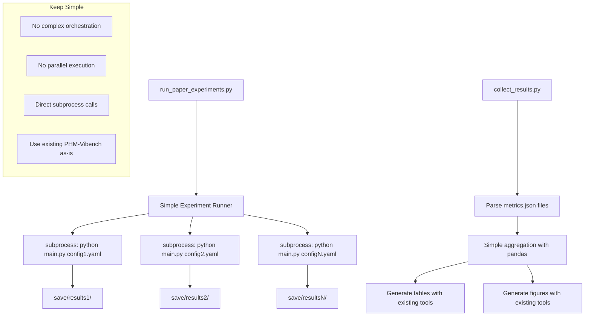

# Design Document - HSE Paper Pipeline

## Overview

The HSE Paper Pipeline system transforms the existing `unified_metric` infrastructure into a comprehensive research automation platform. The system orchestrates the complete workflow from experiment execution to publication-ready outputs, integrating seamlessly with PHM-Vibench's factory patterns and configuration system.

The design follows a modular architecture with clear separation of concerns: experiment orchestration, parallel execution, metrics collection, statistical analysis, and visualization generation. Each component leverages existing PHM-Vibench utilities while adding specialized functionality for research pipeline automation.

## Steering Document Alignment

### Technical Standards Alignment
The design adheres to established PHM-Vibench technical patterns observed in the codebase:
- **Factory Pattern Integration**: All new components follow existing factory registration patterns seen in model_factory, task_factory, trainer_factory
- **Configuration-Driven Design**: Uses existing YAML configuration system and load_config() infrastructure from src/configs/
- **PyTorch Lightning Integration**: Leverages existing trainer factory and Pipeline_03 workflows
- **Modular Architecture**: Follows established separation between data, model, task, and trainer factories
- **Error Handling**: Uses existing logging and error reporting mechanisms

### Project Structure Alignment  
The implementation follows observed PHM-Vibench organization patterns:
- **script/unified_metric/**: Contains all pipeline components, extending existing sota_comparison.py and paper_visualization.py
- **configs/demo/**: Houses experiment matrix definitions using existing YAML patterns (following configs/demo/ structure)
- **tests/**: Unit and integration tests following existing pytest structure
- **save/**: Results stored in established save/{metadata}/{model}/{task}_{trainer}_{timestamp}/ hierarchy
- **src/utils/**: Utility functions integrate with existing configuration helpers and training utilities

## Code Reuse Analysis

### Existing Components to Leverage

- **script/unified_metric/paper_visualization.py**:
  - Reuse existing matplotlib/seaborn plotting functions
  - Use existing publication-quality formatting settings
  - Leverage color schemes and figure size configurations

- **src/configs/load_config()**:
  - Use existing YAML configuration loading
  - Apply existing configuration validation
  - Use standard PHM-Vibench config format

- **Existing PHM-Vibench main.py**:
  - Use as-is for all experiment execution
  - No modifications needed - just call via subprocess
  - Leverage existing factory pattern registrations

- **Standard save/ directory structure**:
  - Use existing save/{metadata}/{model}/{task}_{trainer}_{timestamp}/ format
  - Parse existing metrics.json files
  - Read existing checkpoint files

### Integration Points

- **PHM-Vibench main.py**: Execute experiments through existing entry point without modification
- **Factory Systems**: Use existing B_08_PatchTST, E_01_HSE_v2, H_01_Linear_cla components
- **Configuration System**: Use standard YAML files with existing load_config() system
- **Save Directory Structure**: Use established save/{metadata}/{model}/{task}_{trainer}_{timestamp} hierarchy

## Technical Architecture Specification

### Backbone: PatchTST (B_08_PatchTST)
```yaml
model:
  backbone: B_08_PatchTST
  embedding: E_01_HSE_v2  # HSE prompt-guided embedding  
  task_head: H_01_Linear_cla
  
  # PatchTST Configuration
  patch_size_L: 256        # Length of each patch
  patch_size_C: 1          # Channel dimension per patch
  num_patches: 16          # Number of patches per signal
  d_model: 512             # Model dimension
  num_heads: 8             # Multi-head attention heads
  num_layers: 4            # Transformer layers
  
  # HSE Prompt Configuration
  system_prompt_dim: 128   # System-level prompt embedding dimension
  sample_prompt_dim: 64    # Sample-level prompt embedding dimension
  fusion_type: attention  # concat/attention/gating
```

### Two-Stage Training Workflow
```yaml
# Stage 1: Unsupervised Pretraining
pretraining:
  datasets: [CWRU, XJTU, THU, Ottawa, JNU]  # All 5 datasets
  task_type: contrastive_learning
  loss_function: hse_contrastive  # InfoNCE + system-level contrastive
  epochs: 100
  batch_size: 64
  learning_rate: 0.001
  save_checkpoint: save/pretrain/hse_backbone.ckpt
  
# Stage 2: Supervised Fine-tuning  
finetuning:
  load_checkpoint: save/pretrain/hse_backbone.ckpt
  freeze_backbone: true    # Only train classification head
  datasets: [target_dataset]  # Single target dataset
  task_type: classification
  loss_function: cross_entropy
  epochs: 30
  batch_size: 32
  learning_rate: 0.0001
```

## Architecture

Simple sequential pipeline with direct experiment execution:



## Components (Simplified)

### run_experiments.py
- **Purpose:** Simple script that runs experiments one by one
- **Function:** 
  - Read list of config files from YAML
  - For each config: `subprocess.run(['python', 'main.py', '--config', config_path])`
  - Print progress and log results
- **Dependencies:** subprocess, yaml
- **Reuses:** Existing main.py exactly as-is

### collect_results.py  
- **Purpose:** Parse all experiment results from save/ directory
- **Function:**
  - Walk through save/ directory structure
  - Read metrics.json files
  - Create simple pandas DataFrame with all results
  - Save aggregated results to CSV/Excel
- **Dependencies:** pandas, json, os.walk
- **Reuses:** Existing save directory structure

### make_tables.py
- **Purpose:** Generate paper tables from collected results
- **Function:**
  - Load results CSV
  - Group by method/dataset
  - Create simple tables with mean ± std
  - Output LaTeX and Markdown formats
- **Dependencies:** pandas, basic string formatting
- **Reuses:** Existing paper_visualization.py table formatting if available

### make_figures.py
- **Purpose:** Generate paper figures from collected results
- **Function:**
  - Load results CSV
  - Create bar charts, line plots using matplotlib
  - Save as PDF with publication settings
- **Dependencies:** matplotlib, seaborn, pandas
- **Reuses:** Existing paper_visualization.py plotting methods

### simple_stats.py
- **Purpose:** Basic statistical analysis
- **Function:**
  - Read results CSV
  - Compute t-tests between methods
  - Add significance stars to tables
  - Keep it simple - just p-values
- **Dependencies:** scipy.stats
- **Reuses:** Standard statistical libraries

## Configuration Schema

### Unified Metric Learning Experimental Matrix (script/unified_metric/experiments.yaml)
```yaml
# Five Target Datasets for Unified Training
datasets:
  - CWRU    # Case Western Reserve University
  - XJTU    # Xi'an Jiaotong University  
  - THU     # Tsinghua University
  - Ottawa  # University of Ottawa
  - JNU     # Jiangnan University

# Two-Stage Experimental Design
experiments:
  # Stage 1: Unified Pretraining (1 experiment)
  unified_pretraining:
    - name: unified_pretrain_all_datasets
      datasets: [CWRU, XJTU, THU, Ottawa, JNU]  # Train on ALL datasets simultaneously
      method: HSE-CL-Pretrain
      config: hse_pretrain_unified.yaml
      task_type: contrastive_learning
      epochs: 100
      output_checkpoint: unified_backbone.ckpt
  
  # Stage 2: Dataset-Specific Fine-tuning (5 experiments)
  dataset_finetuning:
    - name: finetune_CWRU
      dataset: CWRU
      pretrained_checkpoint: unified_backbone.ckpt
      method: HSE-CL-Finetune
      config: hse_finetune_CWRU.yaml
      task_type: classification
      epochs: 30
      
    - name: finetune_XJTU
      dataset: XJTU
      pretrained_checkpoint: unified_backbone.ckpt
      method: HSE-CL-Finetune
      config: hse_finetune_XJTU.yaml
      task_type: classification
      epochs: 30
      
    - name: finetune_THU
      dataset: THU
      pretrained_checkpoint: unified_backbone.ckpt
      method: HSE-CL-Finetune
      config: hse_finetune_THU.yaml
      task_type: classification
      epochs: 30
      
    - name: finetune_Ottawa
      dataset: Ottawa
      pretrained_checkpoint: unified_backbone.ckpt
      method: HSE-CL-Finetune
      config: hse_finetune_Ottawa.yaml
      task_type: classification
      epochs: 30
      
    - name: finetune_JNU
      dataset: JNU
      pretrained_checkpoint: unified_backbone.ckpt
      method: HSE-CL-Finetune
      config: hse_finetune_JNU.yaml
      task_type: classification
      epochs: 30

# Settings  
settings:
  repeat_runs: 5                    # 5 random seeds per experiment
  total_experiments: 6              # 1 pretrain + 5 finetune = 6 base experiments  
  total_runs: 30                    # 6 × 5 = 30 total runs
  results_dir: results/paper_hse_2025/
  
  # Evaluation metrics
  zero_shot_evaluation: true        # Evaluate pretrained model before fine-tuning
  ablation_studies: true           # Compare unified vs. single-dataset training
```

## Simple Data Structures

### Results DataFrame (CSV format)
```
experiment_type,method,dataset,accuracy,f1_score,precision,recall,run_id,config_path,checkpoint_used
pretraining,HSE-CL-Pretrain,ALL,0.82,0.80,0.79,0.83,1,hse_pretrain_unified.yaml,none
pretraining,HSE-CL-Pretrain,ALL,0.84,0.82,0.81,0.85,2,hse_pretrain_unified.yaml,none
finetuning,HSE-CL-Finetune,CWRU,0.96,0.95,0.94,0.97,1,hse_finetune_CWRU.yaml,unified_backbone.ckpt
finetuning,HSE-CL-Finetune,CWRU,0.97,0.96,0.95,0.98,2,hse_finetune_CWRU.yaml,unified_backbone.ckpt
finetuning,HSE-CL-Finetune,XJTU,0.94,0.93,0.92,0.95,1,hse_finetune_XJTU.yaml,unified_backbone.ckpt
finetuning,HSE-CL-Finetune,XJTU,0.95,0.94,0.93,0.96,2,hse_finetune_XJTU.yaml,unified_backbone.ckpt
```

### Simple Python Dictionaries
```python
# No complex classes - just use simple dictionaries and pandas DataFrames
pretrain_experiment = {
    'name': 'unified_pretrain_all_datasets',
    'config': 'hse_pretrain_unified.yaml', 
    'method': 'HSE-CL-Pretrain',
    'datasets': ['CWRU', 'XJTU', 'THU', 'Ottawa', 'JNU']
}

finetune_experiment = {
    'name': 'finetune_CWRU',
    'config': 'hse_finetune_CWRU.yaml', 
    'method': 'HSE-CL-Finetune',
    'dataset': 'CWRU',
    'checkpoint': 'unified_backbone.ckpt'
}

result = {
    'experiment_type': 'finetuning',
    'method': 'HSE-CL-Finetune',
    'dataset': 'CWRU', 
    'accuracy': 0.96,
    'f1_score': 0.95,
    'run_id': 1,
    'checkpoint_used': 'unified_backbone.ckpt'
}

# Use pandas for everything else - no custom classes
df = pd.DataFrame(results)
grouped = df.groupby(['experiment_type', 'method', 'dataset']).agg(['mean', 'std'])
```

## Simple Error Handling

### Basic Error Handling
1. **Experiment fails:** Print error, log to file, continue with next experiment
2. **Missing file:** Print clear error message with file path
3. **Bad config:** Check config exists before running, fail early with message
4. **Results parsing fails:** Skip that result, print warning, continue

### Keep It Simple
```python
try:
    subprocess.run(['python', 'main.py', '--config', config_path], check=True)
    print(f"✓ {experiment_name} completed")
except subprocess.CalledProcessError:
    print(f"✗ {experiment_name} failed - check logs")
    continue
```

## Simple Testing

### Basic Testing Approach
- **Manual testing:** Run the scripts with small examples first
- **Check outputs:** Verify CSV files are created correctly
- **Validate tables:** Check that LaTeX tables look reasonable
- **Test with existing data:** Use already completed experiments to test parsing

### No Complex Test Framework
- Just create a few test experiments and verify they work
- Use existing experiment data to test result parsing
- Keep testing simple and practical