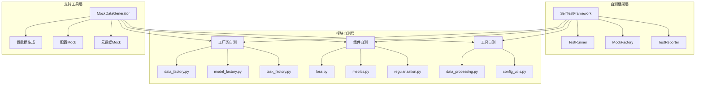

# 设计文档：模块自测环节功能

## 概述

本文档描述了为PHM-Vibench所有Python模块添加标准化 `if __name__ == "__main__"` 自测功能的技术设计。该设计基于现有107个模块的成功实践，建立统一的自测框架，确保代码质量和开发效率。

## 设计理念

### 核心原则

1. **简洁实用**：避免"炫技式"复杂度，专注于实际的测试需求
2. **一致性**：所有模块遵循相同的自测模式和输出格式
3. **独立性**：每个模块的自测不依赖外部资源
4. **可维护性**：使用标准化模板，便于编写和维护

### 设计哲学
- **渐进式改进**：在现有成功模式基础上标准化
- **最小侵入**：不改变模块的正常功能和导入方式
- **开发者友好**：提供清晰的反馈和有用的信息
- **遵循CLAUDE.md**：每个模块都有独立的自测能力

## 架构概览

### 系统架构图



### 分层设计

1. **自测框架层**：提供统一的测试基础设施
2. **模块自测层**：具体模块的自测实现
3. **支持工具层**：Mock对象和测试数据生成

## 详细设计

### 核心组件设计

#### 1. SelfTestFramework（自测框架核心）

```python
# src/utils/self_test_framework.py
class SelfTestFramework:
    """统一的自测框架"""
    
    def __init__(self, module_name: str):
        self.module_name = module_name
        self.start_time = None
        self.results = []
        
    def run_test(self, test_func: callable, test_name: str, *args, **kwargs):
        """执行单个测试并记录结果"""
        try:
            print(f"  → Testing {test_name}...")
            result = test_func(*args, **kwargs)
            self.results.append({'name': test_name, 'status': 'PASS', 'result': result})
            print(f"    ✅ PASS")
            return result
        except Exception as e:
            self.results.append({'name': test_name, 'status': 'FAIL', 'error': str(e)})
            print(f"    ❌ FAIL: {e}")
            return None
    
    def print_header(self):
        """打印测试开始信息"""
        print(f"\n{'='*60}")
        print(f"🧪 Self-Test: {self.module_name}")
        print(f"{'='*60}")
        self.start_time = time.time()
    
    def print_summary(self):
        """打印测试摘要"""
        elapsed = time.time() - self.start_time
        passed = sum(1 for r in self.results if r['status'] == 'PASS')
        failed = len(self.results) - passed
        
        print(f"\n{'='*60}")
        print(f"📊 Test Summary for {self.module_name}")
        print(f"   Tests Run: {len(self.results)}")
        print(f"   Passed: {passed} ✅")
        print(f"   Failed: {failed} ❌")
        print(f"   Time: {elapsed:.2f}s")
        
        if failed == 0:
            print(f"🎉 All tests passed!")
        else:
            print(f"⚠️  Some tests failed. See details above.")
        
        print(f"{'='*60}\n")
        return failed == 0
```

#### 2. MockFactory（Mock对象工厂）

```python
# src/utils/mock_factory.py
class MockFactory:
    """创建用于测试的Mock对象"""
    
    @staticmethod
    def create_mock_config(**overrides):
        """创建Mock配置对象"""
        defaults = {
            'window_size': 128,
            'stride': 64,
            'num_window': 5,
            'batch_size': 16,
            'd_model': 64,
            'num_heads': 4,
            'num_layers': 2,
            'lr': 0.001,
            'dropout': 0.1
        }
        defaults.update(overrides)
        
        class MockConfig:
            def __init__(self, **kwargs):
                for k, v in kwargs.items():
                    setattr(self, k, v)
        
        return MockConfig(**defaults)
    
    @staticmethod
    def create_mock_metadata():
        """创建Mock元数据对象"""
        return {
            'dataset_info': {
                'Sample_num': 1000,
                'Sample_length': 1024,
                'Channel_num': 1,
                'Label_num': 10,
                'System_id': 1
            },
            'feature_info': {
                'input_dim': 1,
                'output_dim': 10
            }
        }
    
    @staticmethod
    def create_sample_tensor(shape=(16, 1, 128), device='cpu'):
        """创建样本张量数据"""
        return torch.randn(shape, device=device)
    
    @staticmethod
    def create_sample_batch(batch_size=8, seq_len=128, channels=1, num_classes=10):
        """创建样本批次数据"""
        x = torch.randn(batch_size, channels, seq_len)
        y = torch.randint(0, num_classes, (batch_size,))
        return (x, y), 'mock_dataset'
```

#### 3. 标准化自测模板

```python
# 标准自测模板结构
def self_test_template():
    """
    标准化的模块自测模板
    每个模块应该遵循这个基本结构
    """
    
    # 1. 导入必要模块
    from src.utils.self_test_framework import SelfTestFramework
    from src.utils.mock_factory import MockFactory
    
    # 2. 创建自测框架实例
    tester = SelfTestFramework("ModuleName")
    tester.print_header()
    
    # 3. 定义测试函数
    def test_basic_functionality():
        """测试基本功能"""
        # 测试逻辑
        return "success"
    
    def test_edge_cases():
        """测试边界情况"""
        # 边界测试逻辑
        return "success"
    
    def test_integration():
        """测试集成兼容性"""
        # 集成测试逻辑
        return "success"
    
    # 4. 执行测试
    tester.run_test(test_basic_functionality, "Basic Functionality")
    tester.run_test(test_edge_cases, "Edge Cases")
    tester.run_test(test_integration, "Integration Compatibility")
    
    # 5. 打印摘要
    success = tester.print_summary()
    
    if not success:
        print("⚠️  模块存在问题，请检查上述失败的测试")
    else:
        print("✅ 模块功能正常")
```

## 具体模块设计

### 工厂类自测设计

#### data_factory.py自测实现

```python
if __name__ == "__main__":
    from src.utils.self_test_framework import SelfTestFramework
    from src.utils.mock_factory import MockFactory
    
    tester = SelfTestFramework("data_factory")
    tester.print_header()
    
    def test_factory_import():
        """测试工厂导入功能"""
        # 测试data_factory函数是否可以正常导入
        from . import data_factory
        return "data_factory imported successfully"
    
    def test_mock_data_creation():
        """测试使用Mock配置创建数据加载器"""
        args_data = MockFactory.create_mock_config(
            data_dir="./test",
            metadata_file="test_metadata.xlsx",
            batch_size=8
        )
        metadata = MockFactory.create_mock_metadata()
        
        # 这里可以测试轻量级的数据工厂创建逻辑
        print(f"    Mock config created: batch_size={args_data.batch_size}")
        print(f"    Mock metadata: {len(metadata)} fields")
        return "mock_data_creation_success"
    
    def test_available_readers():
        """测试可用的数据读取器列表"""
        # 检查注册的读取器
        from .reader import __all__ as available_readers
        print(f"    Available readers: {len(available_readers)}")
        for reader in available_readers[:5]:  # 显示前5个
            print(f"      - {reader}")
        return f"{len(available_readers)} readers available"
    
    # 执行测试
    tester.run_test(test_factory_import, "Factory Import")
    tester.run_test(test_mock_data_creation, "Mock Data Creation")
    tester.run_test(test_available_readers, "Available Readers")
    
    # 打印摘要
    tester.print_summary()
```

#### model_factory.py自测实现

```python
if __name__ == "__main__":
    from src.utils.self_test_framework import SelfTestFramework
    from src.utils.mock_factory import MockFactory
    
    tester = SelfTestFramework("model_factory")
    tester.print_header()
    
    def test_model_factory_import():
        """测试模型工厂导入"""
        from . import model_factory
        return "model_factory imported"
    
    def test_mock_model_creation():
        """测试Mock模型创建"""
        args_model = MockFactory.create_mock_config(
            name="mock_model",
            d_model=64,
            num_layers=2
        )
        metadata = MockFactory.create_mock_metadata()
        
        print(f"    Mock model config: {args_model.name}")
        print(f"    d_model: {args_model.d_model}, layers: {args_model.num_layers}")
        return "mock_model_config_created"
    
    def test_available_models():
        """测试可用模型列表"""
        # 检查不同类型的模型
        model_types = ['CNN', 'RNN', 'Transformer', 'ISFM']
        for model_type in model_types:
            print(f"    Model type: {model_type}")
        return f"{len(model_types)} model types available"
    
    # 执行测试
    tester.run_test(test_model_factory_import, "Model Factory Import")
    tester.run_test(test_mock_model_creation, "Mock Model Creation")
    tester.run_test(test_available_models, "Available Models")
    
    tester.print_summary()
```

### 组件自测设计

#### loss.py自测实现

```python
if __name__ == "__main__":
    import torch
    from src.utils.self_test_framework import SelfTestFramework
    from src.utils.mock_factory import MockFactory
    
    tester = SelfTestFramework("Components/loss")
    tester.print_header()
    
    def test_loss_functions_import():
        """测试损失函数导入"""
        from . import get_loss_fn, loss_functions
        available_losses = list(loss_functions.keys())
        print(f"    Available loss functions: {available_losses}")
        return f"{len(available_losses)} loss functions imported"
    
    def test_cross_entropy_loss():
        """测试交叉熵损失函数"""
        loss_fn = get_loss_fn("CE")
        
        # 创建测试数据
        batch_size, num_classes = 8, 10
        logits = torch.randn(batch_size, num_classes)
        targets = torch.randint(0, num_classes, (batch_size,))
        
        # 计算损失
        loss = loss_fn(logits, targets)
        
        print(f"    Input shape: {logits.shape}")
        print(f"    Target shape: {targets.shape}")
        print(f"    Loss value: {loss.item():.4f}")
        
        assert loss > 0, "Loss should be positive"
        return f"CrossEntropy loss: {loss.item():.4f}"
    
    def test_mse_loss():
        """测试均方误差损失"""
        loss_fn = get_loss_fn("MSE")
        
        # 创建回归测试数据
        batch_size = 8
        pred = torch.randn(batch_size, 1)
        target = torch.randn(batch_size, 1)
        
        loss = loss_fn(pred, target)
        print(f"    MSE loss: {loss.item():.4f}")
        
        assert loss >= 0, "MSE loss should be non-negative"
        return f"MSE loss: {loss.item():.4f}"
    
    # 执行测试
    tester.run_test(test_loss_functions_import, "Loss Functions Import")
    tester.run_test(test_cross_entropy_loss, "CrossEntropy Loss")
    tester.run_test(test_mse_loss, "MSE Loss")
    
    tester.print_summary()
```

### 工具函数自测设计

#### data_processing.py自测实现

```python
if __name__ == "__main__":
    import numpy as np
    from src.utils.self_test_framework import SelfTestFramework
    from src.utils.mock_factory import MockFactory
    
    tester = SelfTestFramework("utils/data_processing")
    tester.print_header()
    
    def test_create_windows():
        """测试窗口创建函数"""
        from .data_processing import create_windows
        
        # 创建测试数据
        data = np.random.randn(1000, 2)  # 1000个时间步，2个通道
        
        args_data = MockFactory.create_mock_config(
            window_size=128,
            stride=64,
            num_window=5,
            window_sampling_strategy='evenly_spaced'
        )
        
        windows = create_windows(data, args_data)
        
        print(f"    Input data shape: {data.shape}")
        print(f"    Window size: {args_data.window_size}")
        print(f"    Number of windows created: {len(windows)}")
        print(f"    Window shape: {windows[0].shape if windows else 'N/A'}")
        
        assert len(windows) > 0, "Should create at least one window"
        return f"{len(windows)} windows created"
    
    def test_normalization():
        """测试数据归一化"""
        from .data_processing import normalize_data
        
        # 创建测试数据
        data = np.random.randn(100, 3) * 10 + 5  # 有偏移和缩放的数据
        
        normalized = normalize_data(data, method='standardization')
        
        print(f"    Original data - Mean: {data.mean():.3f}, Std: {data.std():.3f}")
        print(f"    Normalized data - Mean: {normalized.mean():.3f}, Std: {normalized.std():.3f}")
        
        # 验证标准化结果
        assert abs(normalized.mean()) < 0.1, "Mean should be close to 0"
        assert abs(normalized.std() - 1.0) < 0.1, "Std should be close to 1"
        
        return "normalization successful"
    
    # 执行测试
    tester.run_test(test_create_windows, "Create Windows")
    tester.run_test(test_normalization, "Data Normalization")
    
    tester.print_summary()
```

## 实施策略

### 分阶段实施计划

#### 第一阶段：框架建设
1. **创建自测框架**（SelfTestFramework, MockFactory）
2. **建立标准模板**（自测代码模板）
3. **验证框架功能**（在现有模块上测试）

#### 第二阶段：核心模块
1. **工厂类自测**（4个核心工厂）
2. **关键组件**（loss, metrics, regularization）
3. **核心工具**（data_processing, config_utils）

#### 第三阶段：扩展模块
1. **任务实现类**（各种具体任务）
2. **模型组件**（embedding, backbone, head）
3. **数据处理**（readers, datasets）

#### 第四阶段：完善优化
1. **性能优化**（减少执行时间）
2. **文档完善**（使用指南）
3. **质量验证**（全面测试）

### 代码组织结构

```
src/
├── utils/
│   ├── self_test_framework.py    # 自测框架核心
│   ├── mock_factory.py          # Mock对象工厂
│   └── test_templates.py        # 自测模板
├── data_factory/
│   ├── data_factory.py          # 添加自测
│   ├── reader/
│   │   └── RM_*.py             # 各reader添加自测
│   └── ...
├── model_factory/
│   ├── model_factory.py         # 添加自测
│   ├── ISFM/
│   │   ├── backbone/B_*.py     # 各backbone添加自测
│   │   └── ...
│   └── ...
├── task_factory/
│   ├── task_factory.py          # 添加自测
│   ├── Components/
│   │   ├── loss.py             # 添加自测
│   │   ├── metrics.py          # 添加自测
│   │   └── ...
│   └── ...
└── trainer_factory/
    └── trainer_factory.py       # 添加自测
```

## 质量保证

### 测试模式统一

#### 输出格式标准
```
============================================================
🧪 Self-Test: module_name
============================================================
  → Testing Basic Functionality...
    ✅ PASS
  → Testing Edge Cases...
    ✅ PASS
  → Testing Integration...
    ❌ FAIL: Mock dependency not found

============================================================
📊 Test Summary for module_name
   Tests Run: 3
   Passed: 2 ✅
   Failed: 1 ❌
   Time: 0.15s
⚠️  Some tests failed. See details above.
============================================================
```

#### 性能基准
- **执行时间**：< 10秒（单个模块）
- **内存使用**：< 100MB（避免加载大型模型）
- **启动时间**：< 2秒（框架初始化）

### 代码质量标准

#### 自测代码要求
1. **简洁明了**：每个测试函数职责单一
2. **良好命名**：函数名清楚描述测试内容
3. **适当注释**：关键逻辑有注释说明
4. **错误处理**：优雅处理异常情况

#### 测试覆盖原则
- **核心功能**：必须测试模块的主要功能
- **典型用法**：展示常见的使用场景
- **边界情况**：测试重要的边界条件
- **集成兼容**：验证与其他模块的兼容性

## 维护和扩展

### 维护策略
1. **定期更新**：随着模块功能更新自测代码
2. **性能监控**：监控自测执行时间和资源使用
3. **用户反馈**：收集开发者使用体验
4. **持续改进**：根据反馈优化框架

### 扩展机制
1. **插件式测试**：支持添加自定义测试类型
2. **配置驱动**：通过配置控制测试行为
3. **报告增强**：支持更丰富的测试报告格式
4. **工具集成**：与CI/CD和IDE集成

## 技术决策记录

### ADR-001：使用统一框架而非独立实现
**决策**：创建SelfTestFramework统一管理所有自测  
**原因**：确保一致性，减少重复代码，便于维护  
**后果**：增加框架复杂度，但显著提高代码质量

### ADR-002：Mock对象策略
**决策**：使用MockFactory创建测试所需的假对象  
**原因**：避免依赖外部资源，提高测试独立性  
**后果**：需要维护Mock对象与真实对象的一致性

### ADR-003：渐进式实施策略
**决策**：分阶段添加自测功能，而非一次性完成  
**原因**：降低风险，便于质量控制和问题修复  
**后果**：实施周期较长，但质量更有保障

### ADR-004：保持现有自测兼容性
**决策**：新框架与现有107个自测模块兼容  
**原因**：避免破坏现有功能，减少迁移成本  
**后果**：框架设计需要更加灵活，支持多种模式