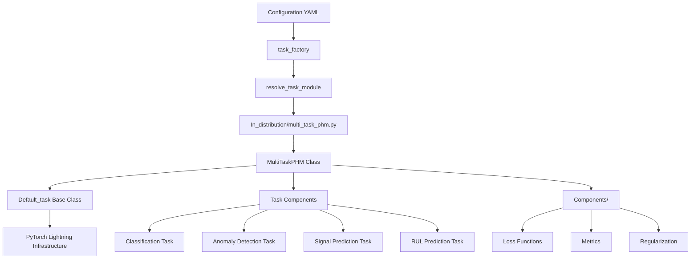
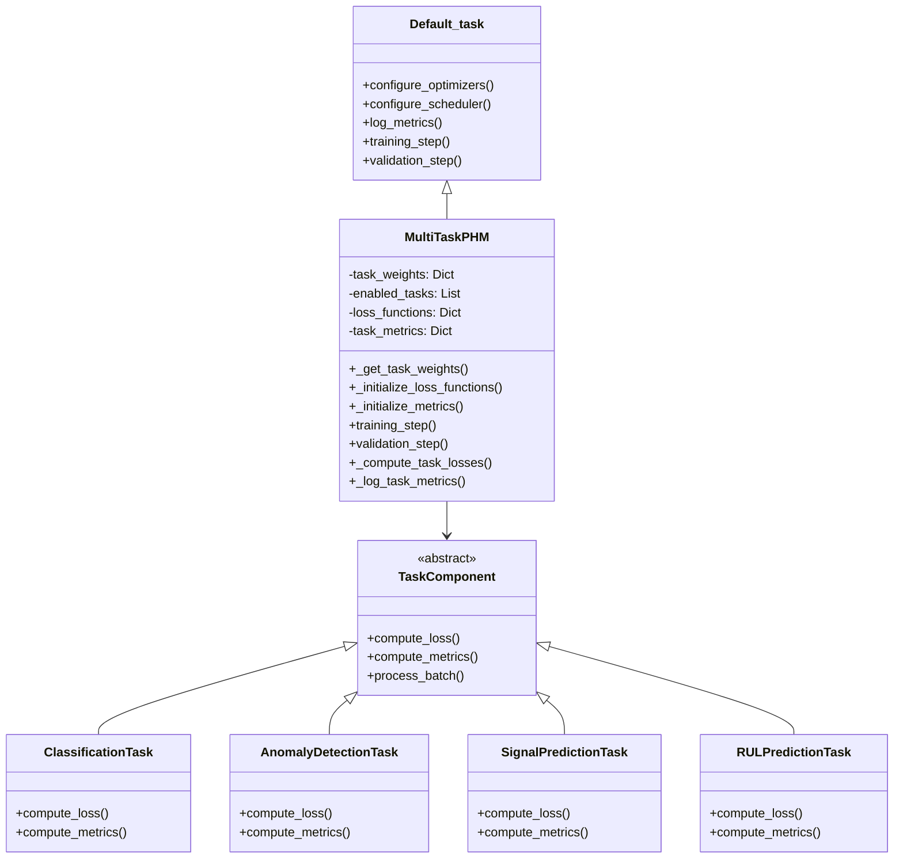
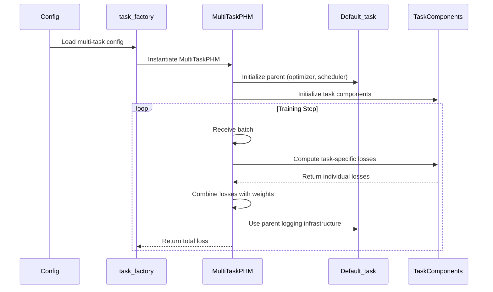
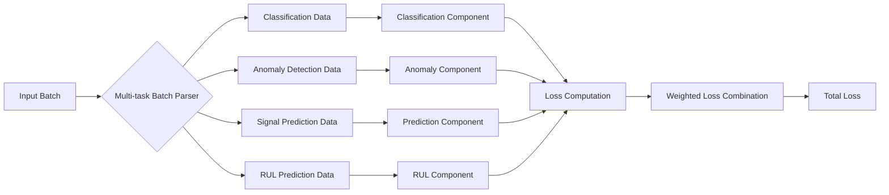

# Multi-Task Refactor Design Document

## Introduction

This design document outlines the architectural approach for refactoring PHM-Vibench's multi-task learning implementation from a standalone module (`multi_task_lightning.py`) into the standardized task factory architecture. The design ensures consistency with existing patterns while maintaining all current functionality.

## Steering Document Alignment

### PHM-Vibench Architectural Patterns

This design aligns with PHM-Vibench's documented architectural principles from the project CLAUDE.md:

1. **Factory Pattern Consistency**: Follows the modular factory design pattern used throughout PHM-Vibench for maximum modularity
2. **Configuration-Driven Experiments**: All behavior controlled through YAML configuration files, consistent with the v5.0 configuration system
3. **Inheritance Hierarchy**: Leverages Default_task infrastructure following established patterns
4. **Modular Components**: Utilizes existing Components/ directory utilities for loss functions, metrics, and regularization

### Code Reuse Analysis

**Existing Components to Leverage:**
- `Components/loss.py`: Contains `get_loss_fn()` supporting CE, MSE, MAE, BCE for multi-task loss functions
- `Components/metrics.py`: Provides `get_metrics()` with torchmetrics integration for accuracy, F1, precision, recall
- `Components/regularization.py`: Contains `calculate_regularization()` for consistent regularization across tasks
- `Default_task.py`: Provides optimizer configuration, learning rate scheduling, and logging infrastructure
- Task factory registry pattern: Uses existing `@register_task` decorator and `TASK_REGISTRY` system

**Integration Points:**
- **Task Factory**: Integrates through existing `task_factory.py` module resolution and instantiation
- **Pipeline System**: Compatible with `Pipeline_03_multitask_pretrain_finetune` through factory interface
- **Configuration System**: Uses existing ConfigWrapper and load_config() patterns from v5.0 system
- **Logging Infrastructure**: Inherits wandb/swanlab integration from Default_task
- **ISFM Models**: Direct compatibility through network parameter passing to parent class

**Components NOT to Reuse:**
- `multi_task_lightning.py`: Will be completely removed (no backward compatibility)
- Domain-specific components (DG_loss.py, metric_loss_cross_domain.py): Not applicable to In_distribution tasks

### Current Multi-Task Analysis

**Existing Implementation Issues**:
- Located at root level (`src/task_factory/multi_task_lightning.py`) instead of organized task structure
- Directly inherits `pl.LightningModule`, bypassing `Default_task` infrastructure
- Missing task export variable for factory loading
- Duplicates optimizer, scheduler, and logging code already in `Default_task`

**Functionality to Preserve**:
- Simultaneous training on 4 task types: classification, anomaly detection, signal prediction, RUL prediction
- Configurable task weights for loss balancing
- Task-specific loss functions and metrics
- Multi-task batch processing and label handling

## System Architecture

### High-Level Architecture



### Component Architecture



## Detailed Design

### File Organization

```
src/task_factory/
├── task/
│   └── In_distribution/
│       ├── __init__.py                  # Empty init file
│       └── multi_task_phm.py           # New multi-task implementation
├── Components/
│   ├── multi_task_components.py        # Task-specific components
│   └── ...                             # Existing components
├── Default_task.py                     # Base class (unchanged)
└── multi_task_lightning.py             # DELETE - no longer needed
```

### Core Classes

#### MultiTaskPHM Class

```python
@register_task("In_distribution", "multi_task_phm")
class MultiTaskPHM(Default_task):
    """
    Multi-task PHM implementation inheriting Default_task infrastructure.
    
    Supports simultaneous training on:
    - Fault classification
    - Anomaly detection  
    - Signal prediction
    - RUL prediction
    """
    
    def __init__(self, network, args_data, args_model, args_task, 
                 args_trainer, args_environment, metadata):
        # Initialize parent class
        super().__init__(network, args_data, args_model, args_task, 
                        args_trainer, args_environment, metadata)
        
        # Multi-task specific initialization
        self.enabled_tasks = self._get_enabled_tasks()
        self.task_weights = self._get_task_weights()
        self.task_components = self._initialize_task_components()
        
    def training_step(self, batch, batch_idx):
        # Override for multi-task training
        total_loss = self._compute_multi_task_loss(batch)
        self._log_task_metrics(batch, mode='train')
        return total_loss
        
    def validation_step(self, batch, batch_idx):
        # Override for multi-task validation
        val_loss = self._compute_multi_task_loss(batch)
        self._log_task_metrics(batch, mode='val')
        return val_loss
```

#### Task Components

```python
class TaskComponentBase:
    """Base class for individual task components"""
    
    def __init__(self, config):
        self.config = config
        self.loss_fn = get_loss_fn(config.loss)
        self.metrics = get_metrics(config.metrics)
    
    def compute_loss(self, outputs, targets):
        """Compute task-specific loss"""
        raise NotImplementedError
    
    def compute_metrics(self, outputs, targets):
        """Compute task-specific metrics"""
        raise NotImplementedError

class ClassificationComponent(TaskComponentBase):
    """Handles fault classification task"""
    
    def compute_loss(self, outputs, targets):
        return self.loss_fn(outputs['classification_logits'], targets['labels'])
    
    def compute_metrics(self, outputs, targets):
        preds = torch.argmax(outputs['classification_logits'], dim=1)
        return self.metrics(preds, targets['labels'])

# Similar implementations for other task components...
```

## Data Models

### Configuration Schema

```python
@dataclass
class MultiTaskConfig:
    """Multi-task configuration data model"""
    type: str = "In_distribution"
    name: str = "multi_task_phm"
    enabled_tasks: List[str] = field(default_factory=lambda: [
        "classification", "anomaly_detection", 
        "signal_prediction", "rul_prediction"
    ])
    task_weights: Dict[str, float] = field(default_factory=dict)
    
    # Task-specific configurations
    classification: Dict[str, Any] = field(default_factory=dict)
    anomaly_detection: Dict[str, Any] = field(default_factory=dict) 
    signal_prediction: Dict[str, Any] = field(default_factory=dict)
    rul_prediction: Dict[str, Any] = field(default_factory=dict)
```

### Batch Data Models

```python
class MultiTaskBatch:
    """Data structure for multi-task training batches"""
    
    def __init__(self, batch_data):
        self.x, self.y_dict = batch_data[0], batch_data[1]
        self.data_name = batch_data[2] if len(batch_data) > 2 else None
        
    @property
    def classification_labels(self) -> torch.Tensor:
        """Extract classification labels"""
        return self.y_dict.get('labels', None)
    
    @property
    def anomaly_labels(self) -> torch.Tensor:
        """Extract anomaly detection labels"""
        return self.y_dict.get('anomaly', None)
        
    @property
    def rul_targets(self) -> torch.Tensor:
        """Extract RUL prediction targets"""
        return self.y_dict.get('rul', None)
        
    @property
    def signal_targets(self) -> torch.Tensor:
        """Extract signal prediction targets"""
        return self.y_dict.get('signal', None)
```

### Configuration Interface

#### Updated Configuration Format

```yaml
# New configuration format
task:
  type: "In_distribution"               # Standard task type
  name: "multi_task_phm"               # Specific task name
  
  # Multi-task specific configuration
  enabled_tasks: 
    - "classification"
    - "anomaly_detection"
    - "signal_prediction"
    - "rul_prediction"
  
  task_weights:
    classification: 1.0
    anomaly_detection: 0.6
    signal_prediction: 0.7
    rul_prediction: 0.8
  
  # Task-specific configurations
  classification:
    loss: "CE"
    num_classes: auto
    metrics: ["accuracy", "f1"]
    
  anomaly_detection:
    loss: "BCE"
    threshold: 0.5
    metrics: ["f1", "precision", "recall"]
    
  signal_prediction:
    loss: "MSE"
    pred_len: 96
    metrics: ["mse", "mae"]
    
  rul_prediction:
    loss: "MSE"
    max_rul_value: 2000.0
    metrics: ["mse", "mae", "r2"]
```

### Task Factory Integration

#### Module Resolution Update

```python
def resolve_task_module(args_task: Namespace) -> str:
    """Return the Python import path for the task module."""
    task_name = args_task.name
    task_type = args_task.type
    
    if task_type == "Default_task" or task_name == "Default_task":
        return f"src.task_factory.{task_name}"
    elif task_type == "In_distribution":
        return f"src.task_factory.task.In_distribution.{task_name}"
    # ... existing logic for other task types
    return f"src.task_factory.task.{task_type}.{task_name}"
```

#### Task Registration

```python
# In multi_task_phm.py
from ...task_factory import register_task
from ...Default_task import Default_task

@register_task("In_distribution", "multi_task_phm")
class MultiTaskPHM(Default_task):
    # Implementation...

# Module export for factory compatibility
task = MultiTaskPHM
```

## Data Flow Design

### Multi-Task Training Flow



### Batch Processing Flow



## Implementation Strategy

### Phase 1: Foundation Setup
1. Create `In_distribution` directory structure
2. Implement `MultiTaskPHM` class skeleton inheriting from `Default_task`
3. Add task registration decorator
4. Update `resolve_task_module` logic

### Phase 2: Task Components Migration
1. Extract task-specific logic from original `MultiTaskLightningModule`
2. Create modular task components
3. Implement loss computation and metrics calculation
4. Ensure batch processing compatibility

### Phase 3: Integration and Testing
1. Test factory loading and instantiation
2. Verify configuration compatibility
3. Run performance benchmarks
4. Remove original `multi_task_lightning.py`

### Phase 4: Validation
1. End-to-end pipeline testing
2. Multi-task training validation
3. Metric logging verification
4. Documentation updates

## Integration Points

### Existing System Integration

1. **Pipeline_03_multitask_pretrain_finetune**: No changes required - works through task_factory
2. **ISFM Foundation Models**: Direct compatibility through network parameter
3. **Wandb/Swanlab Logging**: Inherited from Default_task infrastructure
4. **Configuration System**: Uses existing configuration parsing

### Backward Compatibility

**Migration Required**:
- Configuration files must update `type: "multi_task"` to `type: "In_distribution"`
- Configuration files must update `name: "multi_task_phm"`

**Migration Example**:
```yaml
# OLD format (will break)
task:
  type: "multi_task"
  name: "multi_task_phm"

# NEW format (required)
task:
  type: "In_distribution" 
  name: "multi_task_phm"
```

## Performance Considerations

### Benchmarking Methodology

**Performance Measurement Approach**:
```python
class PerformanceBenchmark:
    def benchmark_training_speed(self, config_path, num_epochs=5):
        """Measure training throughput"""
        start_time = time.time()
        trainer = self._setup_trainer(config_path)
        trainer.fit(model, dataloader)
        total_time = time.time() - start_time
        return total_time / num_epochs  # Time per epoch
        
    def benchmark_memory_usage(self, config_path):
        """Measure peak GPU memory usage"""
        torch.cuda.reset_peak_memory_stats()
        self._run_single_batch(config_path)
        return torch.cuda.max_memory_allocated() / 1024**3  # GB
```

### Expected Performance Impact

**Detailed Performance Analysis**:
1. **Initialization Overhead**: 
   - **Measurement**: Task component object creation and Default_task inheritance
   - **Estimate**: 200-500ms additional initialization time
   - **Justification**: Creating 4 task component objects + Default_task setup
   
2. **Training Speed**: 
   - **Target**: >= 95% of original implementation throughput
   - **Analysis**: Default_task inheritance adds optimizer/scheduler setup but eliminates duplicate code execution
   - **Risk Factors**: Additional method calls for task component dispatch
   
3. **Memory Usage**: 
   - **Target**: <= 110% of original implementation
   - **Analysis**: Task component objects (~50MB) + Default_task state vs. eliminated duplicate objects
   - **Memory Profile**: Expected +100-200MB for component objects

### Optimization Strategies

**Implementation Optimizations**:
1. **Lazy Task Loading**: 
   ```python
   def _initialize_task_components(self):
       return {task: self._create_component(task) 
               for task in self.enabled_tasks}  # Only enabled tasks
   ```
   
2. **Shared Network Forward Pass**: 
   ```python
   def training_step(self, batch):
       outputs = self.network(batch.x)  # Single forward pass
       losses = {task: comp.compute_loss(outputs, batch) 
                for task, comp in self.task_components.items()}
   ```
   
3. **Efficient Metric Logging**:
   ```python
   def _log_task_metrics(self, metrics_dict):
       # Batch all metrics into single log call
       self.log_dict(metrics_dict, on_step=True, on_epoch=True)
   ```

**Performance Monitoring**:
- Continuous benchmarking during development
- Memory profiling with torch.profiler
- Training speed regression testing
- GPU utilization monitoring

## Error Handling

### Configuration Validation Errors

**Error Scenario**: Missing required multi-task configuration fields
```python
class ConfigurationError(Exception):
    """Raised when multi-task configuration is invalid"""
    pass

def _validate_multi_task_config(self):
    """Validate multi-task configuration completeness"""
    required_fields = ['enabled_tasks', 'task_weights']
    
    for field in required_fields:
        if not hasattr(self.args_task, field):
            raise ConfigurationError(
                f"Missing required multi-task field: {field}. "
                f"Please add '{field}' to your task configuration."
            )
    
    # Validate task weights
    weights_sum = sum(self.task_weights.values())
    if not (0.1 <= weights_sum <= 10.0):
        raise ConfigurationError(
            f"Task weights sum ({weights_sum:.2f}) outside reasonable range [0.1, 10.0]. "
            f"Please adjust task_weights in configuration."
        )
```
**Handling Approach**: Fail fast during initialization with clear error messages
**User Impact**: Prevents silent failures, provides actionable error messages

### Runtime Task Component Errors

**Error Scenario**: Individual task component fails during training
```python
def _compute_task_loss_safe(self, task_name, outputs, targets):
    """Compute task loss with error handling"""
    try:
        return self.task_components[task_name].compute_loss(outputs, targets)
    except Exception as e:
        self.log(f"WARNING: {task_name} loss computation failed: {e}")
        # Return zero loss for failed task
        return torch.tensor(0.0, device=outputs.device, requires_grad=True)
```
**Handling Approach**: Continue training other tasks, log warnings, zero out failed task contribution
**User Impact**: Training continues, user alerted to component failures

### Loss Computation Errors

**Error Scenario**: NaN or infinite loss values
```python
def _handle_invalid_loss(self, task_losses):
    """Handle NaN or infinite loss values"""
    for task_name, loss in task_losses.items():
        if torch.isnan(loss) or torch.isinf(loss):
            self.log(f"ERROR: Invalid {task_name} loss: {loss}. Falling back to uniform weights.")
            # Reset to uniform weights
            uniform_weight = 1.0 / len(self.enabled_tasks)
            self.task_weights = {t: uniform_weight for t in self.enabled_tasks}
            break
```
**Handling Approach**: Fallback to uniform task weights, continue training
**User Impact**: Training stability maintained, user alerted to weight adjustment

### Module Loading Errors

**Error Scenario**: task_factory fails to load multi-task module
```python
# In task_factory.py
try:
    task_cls = task_module.task
except AttributeError as e:
    raise ImportError(
        f"Multi-task module {module_path} missing 'task' export. "
        f"Ensure module ends with 'task = MultiTaskPHM'."
    ) from e
```
**Handling Approach**: Fail fast with specific guidance
**User Impact**: Clear debugging information for module structure issues

## Testing Strategy

### Unit Testing

**Component Isolation Testing**:
```python
class TestMultiTaskComponents(unittest.TestCase):
    def test_classification_component_initialization(self):
        """Test classification component setup"""
        config = {'loss': 'CE', 'metrics': ['accuracy', 'f1']}
        component = ClassificationComponent(config)
        self.assertIsInstance(component.loss_fn, nn.CrossEntropyLoss)
        
    def test_task_loss_computation(self):
        """Test individual task loss calculation"""
        # Mock outputs and targets for each task type
        outputs = {'classification_logits': torch.randn(32, 10)}
        targets = {'labels': torch.randint(0, 10, (32,))}
        loss = self.classification_component.compute_loss(outputs, targets)
        self.assertFalse(torch.isnan(loss))
        
    def test_configuration_validation(self):
        """Test multi-task configuration validation"""
        with self.assertRaises(ConfigurationError):
            MultiTaskPHM._validate_config({'enabled_tasks': []})
```

**Test Coverage Areas**:
- Task component initialization and configuration
- Loss computation for each task type (classification, anomaly detection, signal prediction, RUL)
- Configuration validation with valid/invalid inputs
- Error handling scenarios (NaN losses, missing components)
- Metric calculation accuracy
- Task weight application and normalization

### Integration Testing

**End-to-End Pipeline Testing**:
```python
class TestMultiTaskIntegration(unittest.TestCase):
    def test_factory_loading(self):
        """Test task_factory can load multi-task module"""
        config = self._create_test_config()
        task = task_factory(**config)
        self.assertIsInstance(task, MultiTaskPHM)
        
    def test_pipeline_compatibility(self):
        """Test compatibility with Pipeline_03_multitask"""
        # Run Pipeline_03 with new multi-task configuration
        result = run_pipeline(config_path='test_multitask_config.yaml')
        self.assertTrue(result['success'])
        
    def test_training_convergence(self):
        """Test multi-task training reduces losses"""
        initial_losses = self._run_single_epoch()
        final_losses = self._run_full_training()
        for task in initial_losses:
            self.assertLess(final_losses[task], initial_losses[task])
```

**Integration Test Scenarios**:
- Task factory module loading and instantiation
- Pipeline_03_multitask_pretrain_finetune compatibility
- ISFM foundation model integration
- Wandb/swanlab logging integration
- Configuration file processing
- Multi-GPU training setup (if applicable)

### End-to-End Testing

**Performance Validation Testing**:
```python
class TestMultiTaskPerformance(unittest.TestCase):
    def test_training_throughput(self):
        """Verify training speed meets requirements"""
        baseline_time = self._benchmark_original_implementation()
        new_time = self._benchmark_new_implementation()
        # Requirement: >= 95% of original performance
        self.assertGreaterEqual(baseline_time / new_time, 0.95)
        
    def test_memory_usage(self):
        """Verify memory usage within limits"""
        baseline_memory = self._measure_original_memory()
        new_memory = self._measure_new_memory() 
        # Requirement: <= 110% of original memory
        self.assertLessEqual(new_memory / baseline_memory, 1.10)
```

**End-to-End Test Coverage**:
- Performance benchmarking against original implementation
- Memory usage profiling and comparison
- Training convergence verification across different datasets
- Configuration migration testing (old → new format)
- Multi-task metric accuracy validation
- Integration with existing experiment workflows

## Future Extensibility

### Adding New Task Types

```python
class NewTaskComponent(TaskComponentBase):
    """Template for adding new task types"""
    
    def compute_loss(self, outputs, targets):
        # Implement new task loss
        pass
    
    def compute_metrics(self, outputs, targets):
        # Implement new task metrics
        pass
```

### Configuration Extension

```yaml
task:
  enabled_tasks:
    - "classification"
    - "new_task_type"    # Easy to add new tasks
  
  new_task_type:
    loss: "custom_loss"
    metrics: ["custom_metric"]
```

The design ensures that new task types can be added with minimal changes to the core multi-task infrastructure, following the established component pattern.