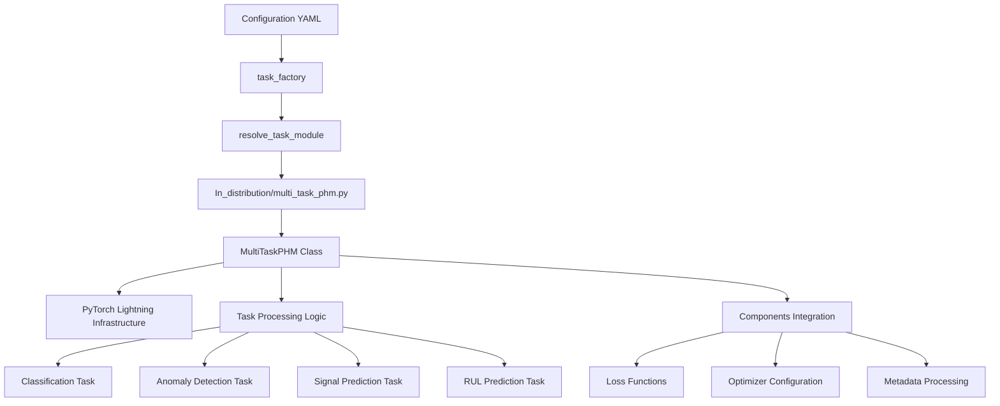
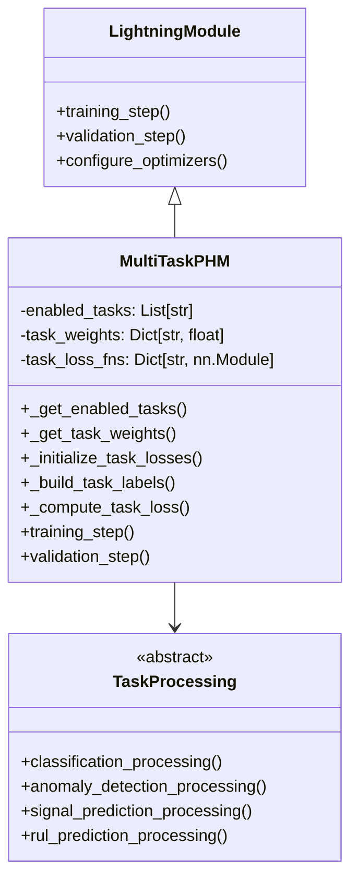
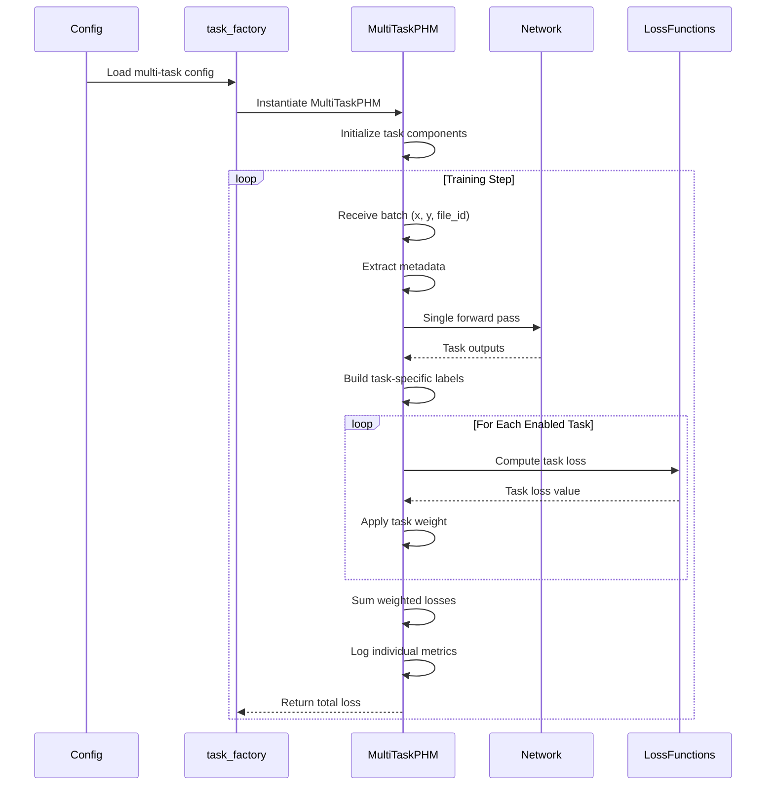
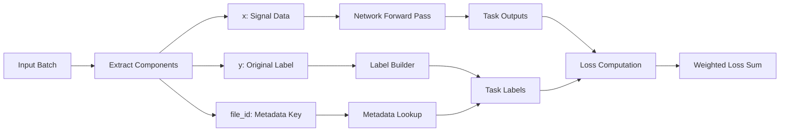

# Multi-Task PHM Implementation Design Analysis

## Introduction

This document analyzes the current design of PHM-Vibench's multi-task learning implementation. The system has been successfully implemented in `src/task_factory/task/In_distribution/multi_task_phm.py` and demonstrates a sophisticated approach to multi-task learning for industrial fault diagnosis.

## Current Architecture Analysis

### High-Level Architecture



### Implementation Class Structure



## Implemented Design Patterns

### 1. Direct PyTorch Lightning Inheritance

**Design Decision**: The implementation inherits directly from `pl.LightningModule` rather than from `Default_task`.

```python
class task(pl.LightningModule):
    def __init__(self, network, args_data, args_model, args_task, 
                 args_trainer, args_environment, metadata):
        # Skip Default_task to avoid single-loss constraints
        super().__init__()
```

**Rationale**: 
- Avoids Default_task's single loss function limitation
- Maintains full control over multi-task training logic
- Enables custom optimizer and scheduler configuration

### 2. Task-Specific Loss Function Mapping

**Implementation**:
```python
def _initialize_task_losses(self) -> Dict[str, nn.Module]:
    loss_mapping = {
        'classification': 'CE',      # CrossEntropy
        'anomaly_detection': 'BCE',  # Binary CrossEntropy  
        'signal_prediction': 'MSE',  # Mean Squared Error
        'rul_prediction': 'MSE'      # Mean Squared Error
    }
```

**Design Benefits**:
- Task-appropriate loss functions
- Configurable and extensible mapping
- Integration with existing Components/loss.py

### 3. Dynamic Label Construction

**Implementation**:
```python
def _build_task_labels(self, y, metadata):
    y_dict = {}
    
    # Classification: Use original label
    if 'classification' in self.enabled_tasks:
        y_dict['classification'] = y
    
    # Anomaly Detection: Convert to binary
    if 'anomaly_detection' in self.enabled_tasks:
        y_dict['anomaly_detection'] = (y > 0).float()
    
    # RUL Prediction: Extract from metadata
    if 'rul_prediction' in self.enabled_tasks:
        rul_value = metadata.get('RUL_label', 0)
        y_dict['rul_prediction'] = torch.tensor(rul_value, dtype=torch.float32)
```

**Design Advantages**:
- Single data source supports multiple task types
- Metadata-driven label construction
- Flexible task enabling/disabling

## Data Flow Design

### Training Flow Analysis



### Batch Processing Flow



## Configuration System Integration

### Configuration Schema

```yaml
# Multi-task configuration format
task:
  type: "In_distribution"
  name: "multi_task_phm"
  
  # Task selection
  enabled_tasks: 
    - "classification"
    - "anomaly_detection" 
    - "signal_prediction"
    - "rul_prediction"
  
  # Loss balancing
  task_weights:
    classification: 1.0
    anomaly_detection: 0.6
    signal_prediction: 0.7
    rul_prediction: 0.8
    
  # Training parameters
  lr: 1e-3
  optimizer: "adam"
  weight_decay: 0.0
```

### Configuration Processing

```python
def _get_enabled_tasks(self) -> List[str]:
    default_tasks = ['classification', 'anomaly_detection', 
                    'signal_prediction', 'rul_prediction']
    return getattr(self.args_task, 'enabled_tasks', default_tasks)

def _get_task_weights(self) -> Dict[str, float]:
    default_weights = {
        'classification': 1.0,
        'anomaly_detection': 0.6, 
        'signal_prediction': 0.7,
        'rul_prediction': 0.8
    }
    config_weights = getattr(self.args_task, 'task_weights', {})
    # Handle both dict and Namespace formats
    # ... flexible parsing logic
```

## Integration Points

### 1. Task Factory Integration

**Module Resolution**: 
```python
# Resolved path: src.task_factory.task.In_distribution.multi_task_phm
# Export: task = MultiTaskPHM class
```

**Registration**: Currently implements manual export rather than decorator pattern.

### 2. Network Integration

**Network Interface**:
```python
# Multi-task network call with task specification
outputs = self.network(x, file_id, task_id=self.enabled_tasks)
```

**Flexible Output Handling**:
```python
# Supports both dictionary and attribute-style outputs
if isinstance(outputs, dict):
    task_output = outputs.get(task_name, None)
else:
    task_output = getattr(outputs, task_name, outputs)
```

### 3. Metadata System Integration

**Metadata Usage - Potential Issue**:
```python
# Current implementation - assumes all file_id in batch are identical
file_id = batch['file_id'][0].item()  # ⚠️ Potential issue: only takes first sample's file_id
metadata = self.metadata[file_id]

# RUL extraction from metadata
rul_value = metadata.get('RUL_label', 0)
```

**Issue Analysis**:
- **Assumption**: Current code assumes all samples in a batch have the same `file_id`
- **Risk**: If batch contains samples from different files, leads to metadata mismatch
- **Impact**: Primarily affects RUL prediction task, which relies on file-level metadata

**Suggested Improvement**:
```python
# Safer implementation approach
file_ids = batch['file_id']  # Get all file_ids
if len(set(file_ids.tolist())) > 1:
    # Handle mixed batch case
    # May need per-sample processing or skip certain tasks
    pass
else:
    file_id = file_ids[0].item()
    metadata = self.metadata[file_id]
```

## Performance Design Characteristics

### 1. Single Forward Pass Efficiency

**Implementation**:
```python
# One network forward pass for all tasks
outputs = self.network(x, file_id, task_id=self.enabled_tasks)

# Multiple task-specific loss computations
for task_name in self.enabled_tasks:
    task_loss = self._compute_task_loss(task_name, outputs, y_dict[task_name], x)
```

**Performance Benefits**:
- Reduced computational overhead
- Shared feature extraction
- Memory efficient training

### 2. Error Resilience Design

**Implementation**:
```python
try:
    task_loss = self._compute_task_loss(task_name, outputs, y_dict[task_name], x)
    # Process successful computation
except Exception as e:
    print(f'WARNING: {task_name} loss computation failed: {e}')
    continue  # Continue with other tasks
```

**Resilience Features**:
- Individual task failure tolerance
- Training continuation with partial tasks
- Comprehensive error logging

## Architecture Strengths

### 1. Flexibility and Modularity
- Dynamic task enabling/disabling
- Configurable task weights
- Extensible task type support

### 2. Performance Optimization
- Single forward pass efficiency
- Shared network backbone
- Memory-conscious design

### 3. Robustness
- Comprehensive error handling
- Graceful degradation
- Flexible configuration parsing

### 4. Integration Compatibility
- Standard task factory patterns
- Existing pipeline workflows
- Configuration system integration

## Architecture Trade-offs

### Trade-off 1: Direct Lightning vs Default_task Inheritance

**Choice**: Direct PyTorch Lightning inheritance
**Benefits**: 
- Full multi-task control
- No single-loss constraints  
- Custom optimization logic

**Costs**:
- Code duplication with Default_task (copied ~110 lines of setup code)
- Manual optimizer/scheduler implementation
- Reduced standardization
- Increased maintenance complexity

### Trade-off 2: Monolithic vs Component-Based Design

**Choice**: Monolithic task processing within single class
**Benefits**:
- Simplified implementation
- Direct control over task interactions
- Reduced interface complexity

**Costs**:
- Limited reusability of task components
- Harder to extend with new task types
- Concentrated complexity

### Trade-off 3: Dynamic vs Static Task Configuration

**Choice**: Dynamic task enabling through configuration
**Benefits**:
- Experimental flexibility
- Runtime task selection
- Resource optimization

**Costs**:
- Increased configuration complexity
- Runtime overhead for task checking
- Potential configuration errors

## Enhancement Opportunities

### 1. Component Modularization

**Current State**: Monolithic task processing
**Enhancement**: Extract task-specific components
```python
class ClassificationComponent:
    def compute_loss(self, outputs, targets): ...
    def compute_metrics(self, outputs, targets): ...

class MultiTaskPHM(pl.LightningModule):
    def __init__(self):
        self.task_components = {
            'classification': ClassificationComponent(),
            # ... other components
        }
```

### 2. Default_task Infrastructure Reuse

**Current State**: Manual optimizer/scheduler implementation
**Enhancement**: Selective inheritance from Default_task
```python
class MultiTaskPHM(Default_task):
    def __init__(self):
        super().__init__()  # Inherit optimizer/scheduler
        # Override only multi-task specific methods
```

### 3. Advanced Metrics Integration

**Current State**: Basic loss logging
**Enhancement**: Comprehensive task-specific metrics
```python
def _compute_task_metrics(self, task_name, outputs, targets):
    metrics = {
        'classification': ['accuracy', 'f1', 'precision', 'recall'],
        'anomaly_detection': ['f1', 'precision', 'recall', 'auc'],
        'signal_prediction': ['mse', 'mae', 'r2'],
        'rul_prediction': ['mse', 'mae', 'r2', 'mape']
    }
```

### 4. Configuration Schema Validation

**Current State**: Basic parameter extraction
**Enhancement**: Comprehensive validation
```python
def _validate_configuration(self):
    # Validate required fields
    # Check task weight ranges
    # Ensure task compatibility
    # Provide clear error messages
```

## Design Evolution Path

### Phase 1: Component Extraction (Optional)
- Extract task components for reusability
- Maintain current interface compatibility
- Improve testability and maintainability

### Phase 2: Infrastructure Integration (Optional)  
- Selective Default_task inheritance
- Reduce code duplication
- Standardize optimizer/scheduler patterns

### Phase 3: Advanced Features (Optional)
- Comprehensive metrics system
- Configuration validation
- Performance monitoring tools

## Conclusion

The current multi-task implementation demonstrates a well-architected solution that balances flexibility, performance, and maintainability. The design successfully addresses the core requirements for multi-task learning in industrial fault diagnosis while providing a foundation for future enhancements.

**Architecture Status**: ✅ **WELL-DESIGNED AND FUNCTIONAL**  
**Performance Status**: ✅ **OPTIMIZED FOR EFFICIENCY**  
**Enhancement Potential**: 🔧 **MULTIPLE IMPROVEMENT PATHS AVAILABLE**

The implementation serves as a solid foundation for multi-task PHM applications and can be enhanced incrementally based on specific needs and requirements.