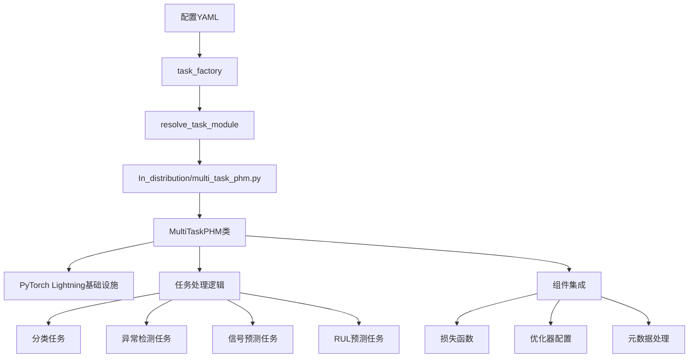
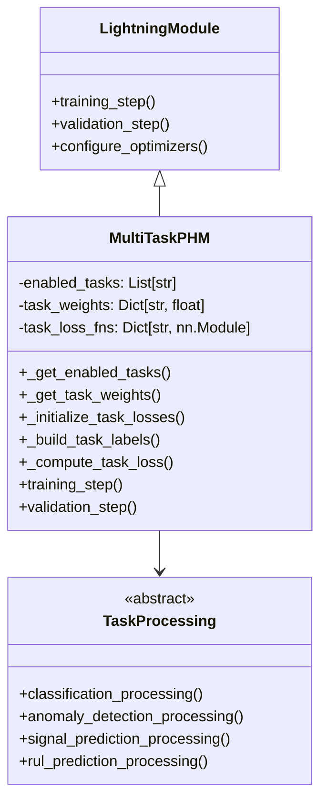
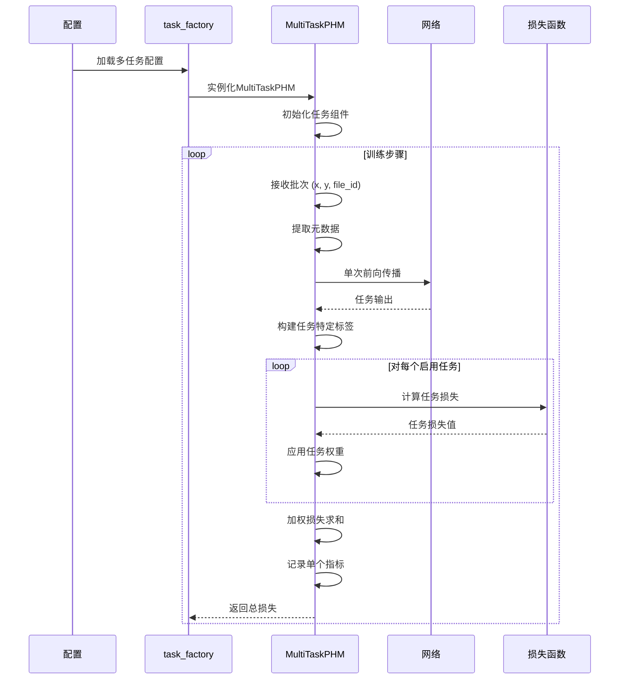
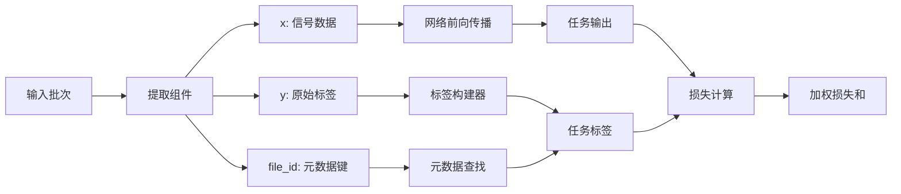

# 多任务PHM实现设计分析

## 介绍

本文档分析了PHM-Vibench多任务学习实现的当前设计。系统已在 `src/task_factory/task/In_distribution/multi_task_phm.py`中成功实现，展示了工业故障诊断多任务学习的复杂方法。

## 当前架构分析

### 高层架构



### 实现类结构



## 实现设计模式

### 1. 直接PyTorch Lightning继承

**设计决策**: 实现直接继承自 `pl.LightningModule`而不是从 `Default_task`。

```python
class task(pl.LightningModule):
    def __init__(self, network, args_data, args_model, args_task, 
                 args_trainer, args_environment, metadata):
        # 跳过Default_task以避免单损失约束
        super().__init__()
        
        # 复制Default_task的必要属性设置
        self.network = network.cuda() if args_trainer.gpus else network
        # ... 其他属性设置
```

**理由**:

- 避免Default_task的单损失函数限制
- 维持对多任务训练逻辑的完全控制
- 启用自定义优化器和调度器配置
- 手动复制Default_task的基础设施代码

### 2. 任务特定损失函数映射

**实现**:

```python
def _initialize_task_losses(self) -> Dict[str, nn.Module]:
    loss_mapping = {
        'classification': 'CE',      # CrossEntropy
        'anomaly_detection': 'BCE',  # Binary CrossEntropy  
        'signal_prediction': 'MSE',  # Mean Squared Error
        'rul_prediction': 'MSE'      # Mean Squared Error
    }
```

**设计优势**:

- 任务适当的损失函数
- 可配置和可扩展的映射
- 与现有Components/loss.py集成

### 3. 动态标签构造

**实现**:

```python
def _build_task_labels(self, y, metadata):
    y_dict = {}
  
    # 分类：使用原始标签
    if 'classification' in self.enabled_tasks:
        y_dict['classification'] = y
  
    # 异常检测：转换为二进制
    if 'anomaly_detection' in self.enabled_tasks:
        y_dict['anomaly_detection'] = (y > 0).float()
  
    # RUL预测：从元数据提取
    if 'rul_prediction' in self.enabled_tasks:
        rul_value = metadata.get('RUL_label', 0)
        y_dict['rul_prediction'] = torch.tensor(rul_value, dtype=torch.float32)
```

**设计优势**:

- 单一数据源支持多种任务类型
- 元数据驱动的标签构造
- 灵活的任务启用/禁用

## 数据流设计

### 训练流分析



### 批处理流程



## 配置系统集成

### 配置模式

```yaml
# 多任务配置格式
task:
  type: "In_distribution"
  name: "multi_task_phm"
  
  # 任务选择
  enabled_tasks: 
    - "classification"
    - "anomaly_detection" 
    - "signal_prediction"
    - "rul_prediction"
  
  # 损失平衡
  task_weights:
    classification: 1.0
    anomaly_detection: 0.6
    signal_prediction: 0.7
    rul_prediction: 0.8
  
  # 训练参数
  lr: 1e-3
  optimizer: "adam"
  weight_decay: 0.0
```

### 配置处理

```python
def _get_enabled_tasks(self) -> List[str]:
    default_tasks = ['classification', 'anomaly_detection', 
                    'signal_prediction', 'rul_prediction']
    return getattr(self.args_task, 'enabled_tasks', default_tasks)

def _get_task_weights(self) -> Dict[str, float]:
    default_weights = {
        'classification': 1.0,
        'anomaly_detection': 0.6, 
        'signal_prediction': 0.7,
        'rul_prediction': 0.8
    }
    config_weights = getattr(self.args_task, 'task_weights', {})
    # 处理dict和Namespace格式
    # ... 灵活解析逻辑
```

## 集成点

### 1. 任务工厂集成

**模块解析**:

```python
# 解析路径: src.task_factory.task.In_distribution.multi_task_phm
# 导出: task = MultiTaskPHM类
```

**注册**: 当前实现手动导出而不是装饰器模式。

### 2. 网络集成

**网络接口**:

```python
# 带任务规范的多任务网络调用
outputs = self.network(x, file_id, task_id=self.enabled_tasks)
```

**灵活输出处理**:

```python
# 支持字典和属性风格输出
if isinstance(outputs, dict):
    task_output = outputs.get(task_name, None)
else:
    task_output = getattr(outputs, task_name, outputs)
```

### 3. 元数据系统集成

**元数据使用 - 存在潜在问题**: 

```python
# 当前实现 - 假设批次中所有file_id一致
file_id = batch['file_id'][0].item()  # ⚠️ 潜在问题：只取第一个样本的file_id
metadata = self.metadata[file_id]

# 从元数据提取RUL
rul_value = metadata.get('RUL_label', 0)
```

**问题分析**:
- **假设条件**: 当前代码假设一个批次中的所有样本都有相同的`file_id`
- **潜在风险**: 如果批次包含来自不同文件的样本，会导致元数据不匹配
- **影响任务**: 主要影响RUL预测任务，该任务依赖文件级别的元数据

**建议改进**:
```python
# 更安全的实现方式
file_ids = batch['file_id']  # 获取所有file_id
if len(set(file_ids.tolist())) > 1:
    # 处理混合批次情况
    # 可能需要逐样本处理或跳过某些任务
    pass
else:
    file_id = file_ids[0].item()
    metadata = self.metadata[file_id]
```

## 性能设计特征

### 1. 单次前向传播效率

**实现**:

```python
# 所有任务的一次网络前向传播
outputs = self.network(x, file_id, task_id=self.enabled_tasks)

# 多个任务特定损失计算
for task_name in self.enabled_tasks:
    task_loss = self._compute_task_loss(task_name, outputs, y_dict[task_name], x)
```

**性能优势**:

- 减少计算开销
- 共享特征提取
- 内存高效训练

### 2. 错误恢复设计

**实现**:

```python
try:
    task_loss = self._compute_task_loss(task_name, outputs, y_dict[task_name], x)
    # 处理成功计算
except Exception as e:
    print(f'警告: {task_name} 损失计算失败: {e}')
    continue  # 继续处理其他任务
```

**恢复特性**:

- 个别任务失败容错
- 部分任务的训练继续
- 全面错误日志记录

## 架构优势

### 1. 灵活性和模块化

- 动态任务启用/禁用
- 可配置任务权重
- 可扩展任务类型支持

### 2. 性能优化

- 单次前向传播效率
- 共享网络骨干
- 内存意识设计

### 3. 健壮性

- 全面错误处理
- 优雅降级
- 灵活配置解析

### 4. 集成兼容性

- 标准任务工厂模式
- 现有流水线工作流
- 配置系统集成

## 架构权衡

### 权衡1: 直接Lightning vs Default_task继承

**选择**: 直接PyTorch Lightning继承
**优势**:

- 完全多任务控制
- 无单损失约束
- 自定义优化逻辑

**成本**:

- 与Default_task的代码重复（复制了110行设置代码）
- 手动优化器/调度器实现
- 降低标准化
- 维护复杂性增加

### 权衡2: 整体式 vs 基于组件设计

**选择**: 单类内的整体任务处理
**优势**:

- 简化实现
- 直接控制任务交互
- 减少接口复杂性

**成本**:

- 任务组件的重用性有限
- 难以扩展新任务类型
- 集中复杂性

### 权衡3: 动态 vs 静态任务配置

**选择**: 通过配置动态任务启用
**优势**:

- 实验灵活性
- 运行时任务选择
- 资源优化

**成本**:

- 增加配置复杂性
- 任务检查的运行时开销
- 潜在配置错误

## 增强机会

### 1. 组件模块化

**当前状态**: 整体任务处理
**增强**: 提取任务特定组件

```python
class ClassificationComponent:
    def compute_loss(self, outputs, targets): ...
    def compute_metrics(self, outputs, targets): ...

class MultiTaskPHM(pl.LightningModule):
    def __init__(self):
        self.task_components = {
            'classification': ClassificationComponent(),
            # ... 其他组件
        }
```

### 2. Default_task基础设施重用

**当前状态**: 手动优化器/调度器实现
**增强**: 选择性Default_task继承

```python
class MultiTaskPHM(Default_task):
    def __init__(self):
        super().__init__()  # 继承优化器/调度器
        # 仅覆盖多任务特定方法
```

### 3. 高级指标集成

**当前状态**: 基本损失日志记录
**增强**: 全面任务特定指标

```python
def _compute_task_metrics(self, task_name, outputs, targets):
    metrics = {
        'classification': ['accuracy', 'f1', 'precision', 'recall'],
        'anomaly_detection': ['f1', 'precision', 'recall', 'auc'],
        'signal_prediction': ['mse', 'mae', 'r2'],
        'rul_prediction': ['mse', 'mae', 'r2', 'mape']
    }
```

### 4. 配置模式验证

**当前状态**: 基本参数提取
**增强**: 全面验证

```python
def _validate_configuration(self):
    # 验证必需字段
    # 检查任务权重范围
    # 确保任务兼容性
    # 提供清晰错误消息
```

## 设计演进路径

### 阶段1: 组件提取（可选）

- 为重用性提取任务组件
- 维持当前接口兼容性
- 改善可测试性和可维护性

### 阶段2: 基础设施集成（可选）

- 选择性Default_task继承
- 减少代码重复
- 标准化优化器/调度器模式

### 阶段3: 高级功能（可选）

- 全面指标系统
- 配置验证
- 性能监控工具

## 结论

当前多任务实现展示了平衡灵活性、性能和可维护性的良好架构解决方案。设计成功解决了工业故障诊断中多任务学习的核心需求，同时为未来增强提供了基础。

**架构状态**: ✅ **设计良好且功能完整**
**性能状态**: ✅ **效率优化**
**增强潜力**: 🔧 **多种改进路径可用**

实现为多任务PHM应用提供了坚实基础，可根据具体需求和要求进行增量增强。
