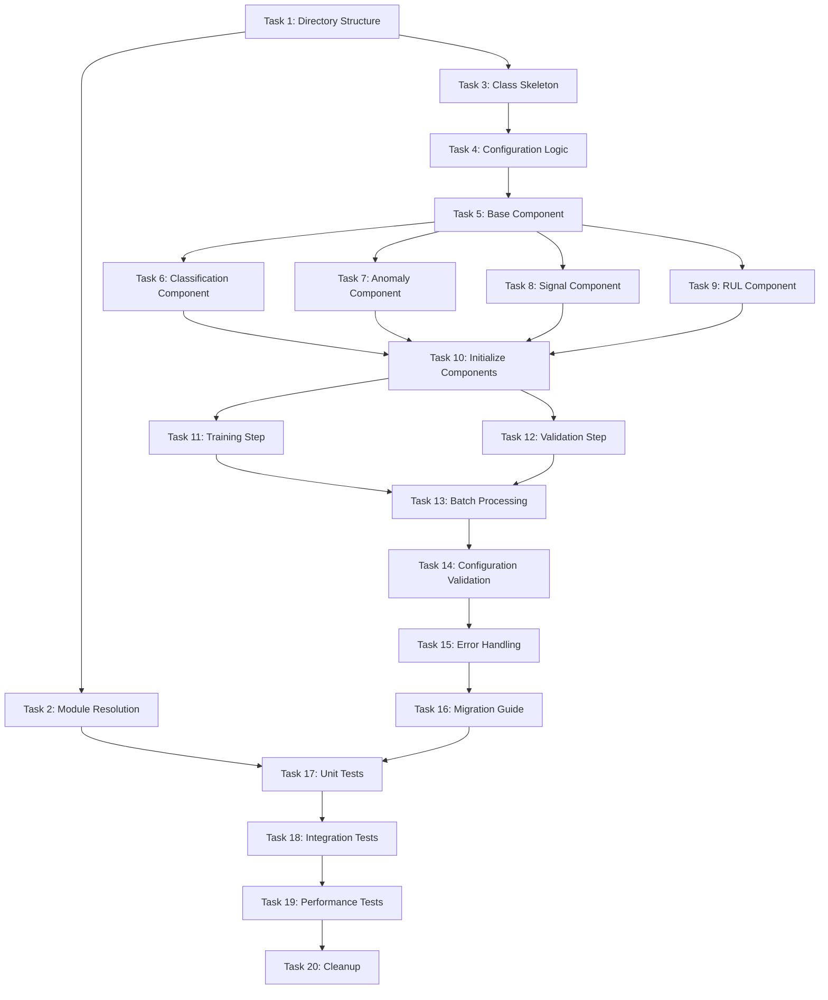

# Multi-Task Refactor Implementation Tasks

## Overview

This document breaks down the multi-task refactor implementation into atomic, executable tasks. Each task is designed to be completed in 15-30 minutes by an experienced developer and touches 1-3 related files maximum.

## Task Breakdown

### Phase 1: Foundation Setup

#### Task 1: Create Directory Structure
**Requirement Reference**: Requirement 1 (Module Structure Reorganization)
**Files to Modify**: Directory structure
**Description**: Set up the standardized directory structure for In_distribution multi-task implementation

- [ ] 1.1 Create `src/task_factory/task/In_distribution/` directory
- [ ] 1.2 Create empty `src/task_factory/task/In_distribution/__init__.py` file
- [ ] 1.3 Verify directory structure matches design specification

**Existing Code to Leverage**: None - directory creation
**Validation**: Directory exists and is accessible by Python imports

#### Task 2: Update Task Factory Module Resolution
**Requirement Reference**: Requirement 1 (Module Structure Reorganization), Technical Requirement 1
**Files to Modify**: `src/task_factory/task_factory.py`
**Description**: Extend resolve_task_module function to handle In_distribution task type

- [ ] 2.1 Read existing `resolve_task_module` function in `task_factory.py`
- [ ] 2.2 Add conditional branch for `task_type == "In_distribution"`
- [ ] 2.3 Return path `f"src.task_factory.task.In_distribution.{task_name}"` for In_distribution tasks
- [ ] 2.4 Test module path resolution with mock arguments

**Existing Code to Leverage**: Current `resolve_task_module` logic for other task types
**Validation**: Function returns correct path for In_distribution task type

#### Task 3: Create MultiTaskPHM Class Skeleton
**Requirement Reference**: Requirement 2 (Default_task Infrastructure Inheritance)
**Files to Modify**: `src/task_factory/task/In_distribution/multi_task_phm.py` (create)
**Description**: Create basic class structure inheriting from Default_task

- [ ] 3.1 Import Default_task and register_task decorator
- [ ] 3.2 Create MultiTaskPHM class inheriting from Default_task
- [ ] 3.3 Add @register_task("In_distribution", "multi_task_phm") decorator
- [ ] 3.4 Implement __init__ method calling super().__init__
- [ ] 3.5 Add task export variable at module end: `task = MultiTaskPHM`

**Existing Code to Leverage**: `src/task_factory/task/DG/classification.py` inheritance pattern
**Validation**: Class can be imported and instantiated without errors

### Phase 2: Multi-Task Components

#### Task 4: Extract Multi-Task Configuration Logic
**Requirement Reference**: Requirement 3 (Multi-Task Training Support)
**Files to Modify**: `src/task_factory/task/In_distribution/multi_task_phm.py`
**Description**: Add multi-task specific initialization logic to MultiTaskPHM

- [ ] 4.1 Add `_get_enabled_tasks()` method to parse enabled_tasks from config
- [ ] 4.2 Add `_get_task_weights()` method to parse task_weights from config
- [ ] 4.3 Call multi-task initialization methods in __init__
- [ ] 4.4 Store enabled_tasks and task_weights as instance variables

**Existing Code to Leverage**: Original `multi_task_lightning.py` configuration parsing patterns
**Validation**: Configuration values are correctly extracted and stored

#### Task 5: Create Task Component Base Class
**Requirement Reference**: Requirement 3 (Multi-Task Training Support)
**Files to Modify**: `src/task_factory/Components/multi_task_components.py` (create)
**Description**: Create base class for individual task components

- [ ] 5.1 Create TaskComponentBase abstract class
- [ ] 5.2 Add __init__ method accepting configuration
- [ ] 5.3 Add abstract methods: compute_loss, compute_metrics
- [ ] 5.4 Import and initialize loss function using existing get_loss_fn
- [ ] 5.5 Import and initialize metrics using existing get_metrics

**Existing Code to Leverage**: `Components/loss.py` get_loss_fn, `Components/metrics.py` get_metrics
**Validation**: Base class can be subclassed and configured

#### Task 6: Implement Classification Task Component
**Requirement Reference**: Requirement 3 (Multi-Task Training Support)
**Files to Modify**: `src/task_factory/Components/multi_task_components.py`
**Description**: Create classification task component implementation

- [ ] 6.1 Create ClassificationComponent class inheriting TaskComponentBase
- [ ] 6.2 Implement compute_loss method for classification labels
- [ ] 6.3 Implement compute_metrics method for classification predictions
- [ ] 6.4 Handle label extraction from multi-task batch format
- [ ] 6.5 Add input validation and error handling

**Existing Code to Leverage**: Original multi_task_lightning.py classification logic
**Validation**: Component correctly computes classification loss and metrics

#### Task 7: Implement Anomaly Detection Task Component
**Requirement Reference**: Requirement 3 (Multi-Task Training Support)
**Files to Modify**: `src/task_factory/Components/multi_task_components.py`
**Description**: Create anomaly detection task component implementation

- [ ] 7.1 Create AnomalyDetectionComponent class inheriting TaskComponentBase
- [ ] 7.2 Implement compute_loss method for binary anomaly labels
- [ ] 7.3 Implement compute_metrics method for anomaly predictions
- [ ] 7.4 Handle anomaly label extraction from multi-task batch
- [ ] 7.5 Add threshold handling for anomaly detection

**Existing Code to Leverage**: Original multi_task_lightning.py anomaly detection logic
**Validation**: Component correctly computes anomaly detection loss and metrics

#### Task 8: Implement Signal Prediction Task Component
**Requirement Reference**: Requirement 3 (Multi-Task Training Support)
**Files to Modify**: `src/task_factory/Components/multi_task_components.py`
**Description**: Create signal prediction task component implementation

- [ ] 8.1 Create SignalPredictionComponent class inheriting TaskComponentBase
- [ ] 8.2 Implement compute_loss method for signal prediction targets
- [ ] 8.3 Implement compute_metrics method for prediction accuracy
- [ ] 8.4 Handle prediction length configuration (pred_len parameter)
- [ ] 8.5 Add signal target extraction from multi-task batch

**Existing Code to Leverage**: Original multi_task_lightning.py signal prediction logic, Components/prediction_loss.py
**Validation**: Component correctly computes signal prediction loss and metrics

#### Task 9: Implement RUL Prediction Task Component
**Requirement Reference**: Requirement 3 (Multi-Task Training Support)
**Files to Modify**: `src/task_factory/Components/multi_task_components.py`
**Description**: Create RUL prediction task component implementation

- [ ] 9.1 Create RULPredictionComponent class inheriting TaskComponentBase
- [ ] 9.2 Implement compute_loss method for RUL targets
- [ ] 9.3 Implement compute_metrics method for RUL predictions
- [ ] 9.4 Handle max_rul_value normalization
- [ ] 9.5 Add RUL target extraction from multi-task batch

**Existing Code to Leverage**: Original multi_task_lightning.py RUL prediction logic
**Validation**: Component correctly computes RUL prediction loss and metrics

### Phase 3: Training Integration

#### Task 10: Initialize Task Components in MultiTaskPHM
**Requirement Reference**: Requirement 3 (Multi-Task Training Support)
**Files to Modify**: `src/task_factory/task/In_distribution/multi_task_phm.py`
**Description**: Add task component initialization to MultiTaskPHM class

- [ ] 10.1 Import all task component classes from Components/multi_task_components
- [ ] 10.2 Add `_initialize_task_components()` method
- [ ] 10.3 Create component instances based on enabled_tasks configuration
- [ ] 10.4 Store components in self.task_components dictionary
- [ ] 10.5 Call initialization in __init__ method

**Existing Code to Leverage**: Task component classes created in previous tasks
**Validation**: Components are correctly initialized based on configuration

#### Task 11: Implement Multi-Task Training Step
**Requirement Reference**: Requirement 3 (Multi-Task Training Support)
**Files to Modify**: `src/task_factory/task/In_distribution/multi_task_phm.py`
**Description**: Override training_step for multi-task loss computation

- [ ] 11.1 Override training_step method from Default_task
- [ ] 11.2 Extract network outputs using single forward pass
- [ ] 11.3 Compute loss for each enabled task using task components
- [ ] 11.4 Apply task weights and sum losses
- [ ] 11.5 Log individual task losses

**Existing Code to Leverage**: Default_task.training_step structure, original multi_task_lightning.py logic
**Validation**: Training step correctly computes and returns weighted multi-task loss

#### Task 12: Implement Multi-Task Validation Step
**Requirement Reference**: Requirement 3 (Multi-Task Training Support)
**Files to Modify**: `src/task_factory/task/In_distribution/multi_task_phm.py`
**Description**: Override validation_step for multi-task validation

- [ ] 12.1 Override validation_step method from Default_task
- [ ] 12.2 Compute validation losses for each enabled task
- [ ] 12.3 Compute and log validation metrics for each task
- [ ] 12.4 Return total validation loss
- [ ] 12.5 Ensure metrics are properly aggregated

**Existing Code to Leverage**: Default_task.validation_step structure, task component metric computation
**Validation**: Validation step correctly computes multi-task validation metrics

#### Task 13: Add Multi-Task Batch Processing
**Requirement Reference**: Requirement 3 (Multi-Task Training Support)
**Files to Modify**: `src/task_factory/task/In_distribution/multi_task_phm.py`
**Description**: Add helper methods for processing multi-task batch data

- [ ] 13.1 Add `_parse_multi_task_batch()` method to extract data and labels
- [ ] 13.2 Add `_extract_task_targets()` method for each task type
- [ ] 13.3 Handle missing labels gracefully (skip tasks with no labels)
- [ ] 13.4 Add batch validation and error handling
- [ ] 13.5 Ensure compatibility with existing data loader formats

**Existing Code to Leverage**: Original batch processing patterns from multi_task_lightning.py
**Validation**: Batch processing correctly extracts labels for each task type

### Phase 4: Configuration and Validation

#### Task 14: Add Configuration Validation
**Requirement Reference**: Requirement 4 (Task Registration and Discovery)
**Files to Modify**: `src/task_factory/task/In_distribution/multi_task_phm.py`
**Description**: Add comprehensive configuration validation

- [ ] 14.1 Create `_validate_multi_task_config()` method
- [ ] 14.2 Check for required fields: enabled_tasks, task_weights
- [ ] 14.3 Validate task weight values and ranges
- [ ] 14.4 Ensure enabled tasks have corresponding configurations
- [ ] 14.5 Add clear error messages for configuration issues

**Existing Code to Leverage**: Configuration validation patterns from other PHM-Vibench modules
**Validation**: Invalid configurations raise clear, actionable errors

#### Task 15: Add Error Handling and Logging
**Requirement Reference**: Requirement 3 (Multi-Task Training Support)
**Files to Modify**: `src/task_factory/task/In_distribution/multi_task_phm.py`
**Description**: Add robust error handling for multi-task training

- [ ] 15.1 Add safe loss computation with fallback for failed tasks
- [ ] 15.2 Handle NaN and infinite loss values
- [ ] 15.3 Add warning logs for task component failures
- [ ] 15.4 Implement graceful degradation (continue with remaining tasks)
- [ ] 15.5 Add comprehensive logging for debugging

**Existing Code to Leverage**: Default_task logging infrastructure
**Validation**: Training continues even when individual tasks fail

#### Task 16: Update Configuration Migration
**Requirement Reference**: Technical Requirement 3 (Configuration Format Compatibility)
**Files to Modify**: Configuration documentation or migration guide
**Description**: Document configuration format changes and provide migration examples

- [ ] 16.1 Document old vs new configuration format differences
- [ ] 16.2 Provide specific migration examples for existing configurations
- [ ] 16.3 Create migration validation checklist
- [ ] 16.4 Update relevant YAML configuration files to new format
- [ ] 16.5 Test configuration parsing with new format

**Existing Code to Leverage**: Existing multitask_*.yaml configuration files
**Validation**: New configurations parse correctly and maintain same functionality

### Phase 5: Testing and Cleanup

#### Task 17: Create Unit Tests
**Requirement Reference**: Testing strategy from design document
**Files to Modify**: `tests/test_multi_task_phm.py` (create)
**Description**: Create comprehensive unit tests for multi-task implementation

- [ ] 17.1 Test MultiTaskPHM class initialization
- [ ] 17.2 Test task component creation and configuration
- [ ] 17.3 Test multi-task loss computation
- [ ] 17.4 Test configuration validation with valid/invalid inputs
- [ ] 17.5 Test error handling scenarios

**Existing Code to Leverage**: Existing test patterns from PHM-Vibench test suite
**Validation**: All unit tests pass and provide good coverage

#### Task 18: Integration Testing
**Requirement Reference**: Requirement 5 (Pipeline Integration)
**Files to Modify**: `tests/test_multi_task_integration.py` (create)
**Description**: Test integration with task factory and pipeline system

- [ ] 18.1 Test task_factory can load and instantiate MultiTaskPHM
- [ ] 18.2 Test integration with Pipeline_03_multitask_pretrain_finetune
- [ ] 18.3 Test ISFM foundation model compatibility
- [ ] 18.4 Test end-to-end training with multi-task configuration
- [ ] 18.5 Verify logging and metrics collection

**Existing Code to Leverage**: Existing pipeline test patterns, task factory test utilities
**Validation**: Integration tests pass and demonstrate full functionality

#### Task 19: Performance Benchmarking
**Requirement Reference**: Performance requirements from requirements document
**Files to Modify**: `benchmarks/multi_task_performance.py` (create)
**Description**: Benchmark new implementation against original

- [ ] 19.1 Create performance benchmarking script
- [ ] 19.2 Measure training throughput (batches/second)
- [ ] 19.3 Measure memory usage (GPU memory profiling)
- [ ] 19.4 Compare against baseline original implementation
- [ ] 19.5 Verify performance meets requirements (>=95% throughput, <=110% memory)

**Existing Code to Leverage**: Original multi_task_lightning.py for baseline measurements
**Validation**: Performance requirements are met or exceeded

#### Task 20: Remove Original Implementation
**Requirement Reference**: Constraint 1 (No Backward Compatibility Required)
**Files to Modify**: `src/task_factory/multi_task_lightning.py` (delete)
**Description**: Clean up by removing original multi-task implementation

- [ ] 20.1 Verify all functionality has been migrated to new implementation
- [ ] 20.2 Run full test suite to ensure no regressions
- [ ] 20.3 Update any remaining imports or references
- [ ] 20.4 Delete `src/task_factory/multi_task_lightning.py` file
- [ ] 20.5 Clean up any unused imports or dependencies

**Existing Code to Leverage**: None - cleanup task
**Validation**: System works without original file, no broken imports

## Task Dependencies

## Validation Criteria

Each task must meet these criteria before marking as complete:

1. **Functionality**: Code works as specified and passes basic smoke tests
2. **Integration**: Changes don't break existing functionality
3. **Code Quality**: Follows PHM-Vibench coding standards and patterns
4. **Testing**: Adequate test coverage for new functionality
5. **Documentation**: Code is properly documented with docstrings
6. **Requirements**: Task addresses specified requirements and acceptance criteria

## Risk Mitigation

- **Task Blocking**: If a task is blocked, document the issue and continue with independent tasks
- **Integration Issues**: Test integration points early and frequently
- **Performance Problems**: Monitor performance throughout development, not just at the end
- **Configuration Compatibility**: Validate configuration changes with existing experiment setups

## Success Metrics

- All 20 tasks completed successfully
- Full test suite passes (unit, integration, performance)
- Performance requirements met (>=95% throughput, <=110% memory)
- Zero regressions in existing multi-task functionality
- Clean removal of original implementation without breaking changes