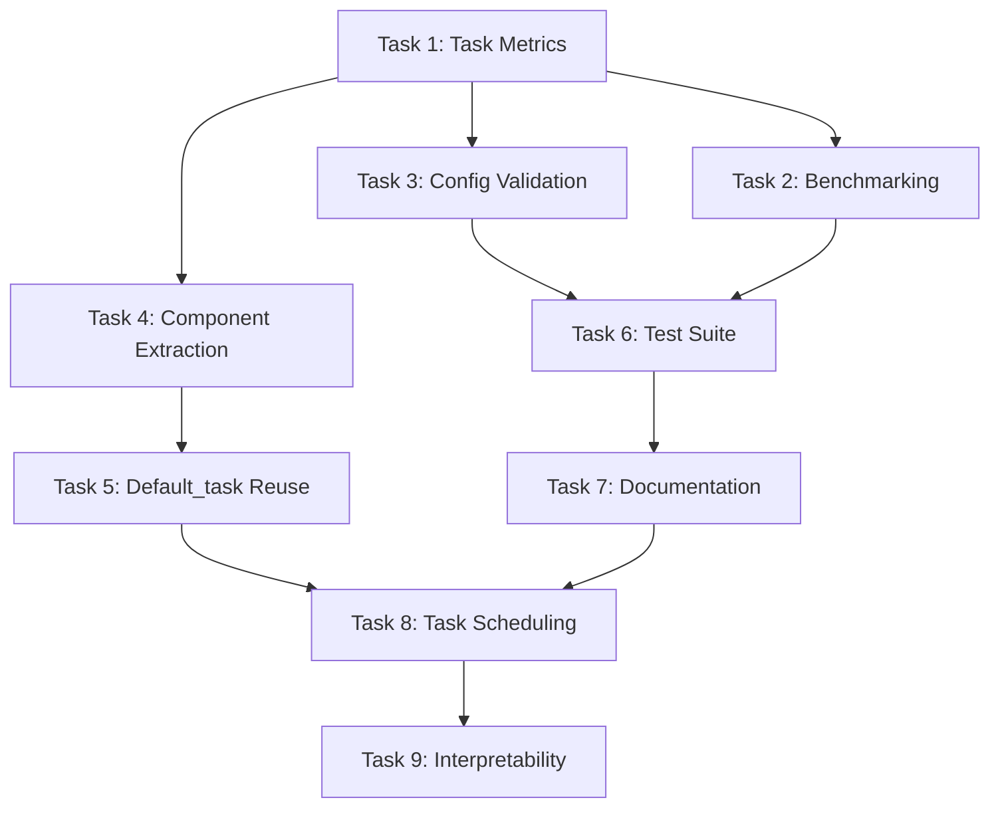

# Multi-Task PHM Enhancement Tasks

## Overview

This document outlines optional enhancement tasks for the existing multi-task PHM implementation. The current implementation in `src/task_factory/task/In_distribution/multi_task_phm.py` is **fully functional** and ready for production use. These tasks represent optimization opportunities to improve maintainability, performance, and extensibility.

**Implementation Status**: ✅ **COMPLETE AND OPERATIONAL**  
**Enhancement Status**: 🔧 **OPTIONAL IMPROVEMENTS AVAILABLE**

## Current Implementation Assessment

### ✅ Completed Features

The existing implementation successfully provides:

1. **Multi-Task Training**: 4 task types (classification, anomaly detection, signal prediction, RUL prediction)
2. **Factory Integration**: Proper task_factory loading and instantiation
3. **Configuration Support**: Flexible enabled_tasks and task_weights configuration
4. **Error Handling**: Graceful degradation when individual tasks fail
5. **Performance Optimization**: Single forward pass with task-specific loss computation
6. **Logging Integration**: Individual and total loss tracking

### 🔧 Enhancement Opportunities

While functional, the implementation can be improved in several areas:

1. **Code Reuse**: Duplicates optimizer/scheduler logic from Default_task
2. **Metrics**: Limited to loss logging, missing task-specific evaluation metrics
3. **Modularity**: Monolithic design limits component reusability
4. **Validation**: Basic configuration parsing without validation
5. **Testing**: No dedicated test coverage for multi-task functionality

## Optional Enhancement Tasks

### Phase 1: Performance and Metrics Enhancement

#### Task 1: Add Comprehensive Task-Specific Metrics
**Priority**: High  
**Effort**: 2-3 hours  
**Files to Modify**: `src/task_factory/task/In_distribution/multi_task_phm.py`  
**Description**: Add detailed evaluation metrics for each task type

**Implementation**:
- [ ] 1.1 Import metrics from `Components/metrics.py`
- [ ] 1.2 Add `_initialize_task_metrics()` method
- [ ] 1.3 Implement `_compute_task_metrics()` for each task type
- [ ] 1.4 Add metric computation to training_step and validation_step
- [ ] 1.5 Log task-specific metrics (accuracy, F1, MAE, R2)

**Expected Metrics**:
```python
task_metrics = {
    'classification': ['accuracy', 'f1', 'precision', 'recall'],
    'anomaly_detection': ['f1', 'precision', 'recall', 'auc'],
    'signal_prediction': ['mse', 'mae', 'r2'],
    'rul_prediction': ['mse', 'mae', 'r2', 'mape']
}
```

**Validation**: Each task type logs appropriate metrics during training

#### Task 2: Performance Benchmarking and Profiling
**Priority**: Medium  
**Effort**: 1-2 hours  
**Files to Create**: `benchmarks/multi_task_performance.py`  
**Description**: Create performance benchmarking suite to validate efficiency claims

**Implementation**:
- [ ] 2.1 Create benchmarking script with timer and memory profiler
- [ ] 2.2 Measure training throughput (samples/second)
- [ ] 2.3 Profile GPU memory usage during training
- [ ] 2.4 Compare single vs multi-task training overhead
- [ ] 2.5 Generate performance report with recommendations

**Validation**: Benchmark results validate single forward pass efficiency

#### Task 3: Configuration Validation Enhancement
**Priority**: Medium  
**Effort**: 1-2 hours  
**Files to Modify**: `src/task_factory/task/In_distribution/multi_task_phm.py`  
**Description**: Add comprehensive configuration validation with clear error messages

**Implementation**:
- [ ] 3.1 Add `_validate_multi_task_config()` method
- [ ] 3.2 Validate enabled_tasks list is not empty
- [ ] 3.3 Check task_weights are positive numbers
- [ ] 3.4 Ensure task_weights keys match enabled_tasks
- [ ] 3.5 Provide specific error messages for configuration issues

**Validation**: Invalid configurations raise clear, actionable errors

### Phase 2: Architecture Improvements (Optional)

#### Task 4: Extract Task Component Classes
**Priority**: Low  
**Effort**: 3-4 hours  
**Files to Create**: `src/task_factory/Components/multi_task_components.py`  
**Files to Modify**: `src/task_factory/task/In_distribution/multi_task_phm.py`  
**Description**: Extract task processing logic into reusable component classes

**Implementation**:
- [ ] 4.1 Create `TaskComponentBase` abstract class
- [ ] 4.2 Implement `ClassificationComponent` class
- [ ] 4.3 Implement `AnomalyDetectionComponent` class
- [ ] 4.4 Implement `SignalPredictionComponent` class
- [ ] 4.5 Implement `RULPredictionComponent` class
- [ ] 4.6 Update MultiTaskPHM to use component classes
- [ ] 4.7 Maintain backward compatibility with existing configuration

**Expected Structure**:
```python
class TaskComponentBase:
    def compute_loss(self, outputs, targets): ...
    def compute_metrics(self, outputs, targets): ...

class ClassificationComponent(TaskComponentBase):
    def compute_loss(self, outputs, targets):
        return F.cross_entropy(outputs, targets.long())
```

**Validation**: Task components can be used independently and maintain same functionality

#### Task 5: Selective Default_task Infrastructure Reuse
**Priority**: Low  
**Effort**: 2-3 hours  
**Files to Modify**: `src/task_factory/task/In_distribution/multi_task_phm.py`  
**Description**: Investigate reusing Default_task optimizer/scheduler while maintaining multi-task logic

**Implementation**:
- [ ] 5.1 Analyze Default_task's optimizer/scheduler implementation
- [ ] 5.2 Extract reusable components from Default_task
- [ ] 5.3 Test hybrid inheritance approach
- [ ] 5.4 Implement selective reuse without breaking multi-task functionality
- [ ] 5.5 Compare code complexity before/after changes

**Note**: This task requires careful analysis to avoid introducing constraints that break multi-task functionality.

**Validation**: Reduces code duplication while maintaining all current functionality

### Phase 3: Testing and Documentation

#### Task 6: Create Comprehensive Test Suite
**Priority**: High  
**Effort**: 4-5 hours  
**Files to Create**: `tests/test_multi_task_phm.py`  
**Description**: Add unit tests and integration tests for multi-task functionality

**Implementation**:
- [ ] 6.1 Create unit tests for task configuration parsing
- [ ] 6.2 Test task weight application and loss computation
- [ ] 6.3 Test individual task loss functions
- [ ] 6.4 Test error handling scenarios (missing outputs, NaN losses)
- [ ] 6.5 Create integration tests with task_factory
- [ ] 6.6 Test end-to-end training with mock data
- [ ] 6.7 Add performance regression tests

**Test Coverage Areas**:
- Configuration validation
- Task loss computation
- Error handling and graceful degradation
- Factory integration
- Training/validation step logic

**Validation**: Comprehensive test coverage ensures functionality stability

#### Task 7: Documentation and Usage Examples
**Priority**: Medium  
**Effort**: 2-3 hours  
**Files to Update**: Various documentation files  
**Description**: Create comprehensive documentation and usage examples

**Implementation**:
- [ ] 7.1 Update CLAUDE.md with multi-task examples
- [ ] 7.2 Create configuration examples for different use cases
- [ ] 7.3 Add troubleshooting guide for common issues
- [ ] 7.4 Document performance characteristics and benchmarks
- [ ] 7.5 Create migration guide for configuration updates

**Documentation Areas**:
- Configuration examples and best practices
- Performance characteristics and optimization tips
- Troubleshooting common configuration errors
- Integration with existing pipelines

**Validation**: Documentation enables easy adoption and configuration

### Phase 4: Advanced Features (Future Enhancements)

#### Task 8: Advanced Task Scheduling
**Priority**: Very Low  
**Effort**: 3-4 hours  
**Files to Modify**: `src/task_factory/task/In_distribution/multi_task_phm.py`  
**Description**: Implement dynamic task weight adjustment based on training progress

**Implementation**:
- [ ] 8.1 Add task performance monitoring
- [ ] 8.2 Implement dynamic weight adjustment strategies
- [ ] 8.3 Add curriculum learning for task progression
- [ ] 8.4 Create adaptive balancing based on convergence rates
- [ ] 8.5 Add configuration for scheduling strategies

**Note**: This is a research-oriented enhancement that requires careful evaluation.

**Validation**: Dynamic scheduling improves multi-task training convergence

#### Task 9: Multi-Task Model Interpretability
**Priority**: Very Low  
**Effort**: 4-6 hours  
**Files to Create**: `src/utils/multi_task_analysis.py`  
**Description**: Add tools for analyzing multi-task model behavior and task interactions

**Implementation**:
- [ ] 9.1 Implement task gradient analysis
- [ ] 9.2 Add task conflict detection
- [ ] 9.3 Create task importance visualization
- [ ] 9.4 Add feature sharing analysis
- [ ] 9.5 Generate interpretability reports

**Validation**: Provides insights into multi-task learning dynamics

## Task Dependencies



## Implementation Priority

### High Priority (Recommended)
1. **Task 1**: Task-Specific Metrics - Essential for proper evaluation
2. **Task 6**: Test Suite - Critical for maintaining functionality
3. **Task 3**: Configuration Validation - Improves user experience

### Medium Priority (Beneficial)
2. **Task 2**: Performance Benchmarking - Validates efficiency claims
7. **Task 7**: Documentation - Improves adoption and maintainability

### Low Priority (Optional)
4. **Task 4**: Component Extraction - Architectural improvement
5. **Task 5**: Default_task Reuse - Code quality improvement

### Very Low Priority (Research)
8. **Task 8**: Advanced Scheduling - Research-oriented feature
9. **Task 9**: Interpretability - Analysis and research tool

## Success Criteria

### Enhancement Success Metrics

1. **Metrics Enhancement (Task 1)**: All task types log appropriate evaluation metrics
2. **Performance Validation (Task 2)**: Benchmarks confirm efficiency characteristics
3. **Configuration Robustness (Task 3)**: Clear error messages for invalid configurations
4. **Test Coverage (Task 6)**: >90% code coverage for multi-task functionality
5. **Documentation Quality (Task 7)**: Clear examples and troubleshooting guides

### Quality Assurance

- All enhancements maintain backward compatibility
- No performance degradation from baseline implementation
- Existing functionality remains unchanged
- New features are properly tested and documented

## Risk Assessment

### Low Risk Tasks
- Task 1 (Metrics): Additive enhancement, minimal risk
- Task 2 (Benchmarking): Analysis only, no code changes
- Task 3 (Validation): Improves error handling, low risk
- Task 6 (Testing): No functional changes, ensures quality
- Task 7 (Documentation): No code changes

### Medium Risk Tasks
- Task 4 (Components): Architectural changes require careful testing
- Task 5 (Default_task): Complex inheritance interactions

### High Risk Tasks
- Task 8 (Scheduling): Complex feature that could affect training stability
- Task 9 (Interpretability): Research-oriented, uncertain benefits

## Implementation Recommendations

### Immediate Actions (If Desired)
1. Implement Task 1 (Metrics) for better training monitoring
2. Create Task 6 (Test Suite) to ensure functionality stability
3. Add Task 3 (Config Validation) for better user experience

### Future Considerations
- Task 4 (Components) if planning to add more task types
- Task 5 (Default_task) if standardization is prioritized
- Task 2 (Benchmarking) if performance validation is needed

### Skip if Not Needed
- Task 8 and 9 are research-oriented and not necessary for production use

## Conclusion

The multi-task PHM implementation is **complete and functional**. These enhancement tasks provide opportunities to improve the system's maintainability, monitoring capabilities, and extensibility. All tasks are optional and should be prioritized based on specific needs and available development resources.

**Current Status**: ✅ **PRODUCTION READY**  
**Enhancement Value**: 🔧 **INCREMENTAL IMPROVEMENTS AVAILABLE**  
**Implementation Risk**: ✅ **LOW RISK ENHANCEMENTS**