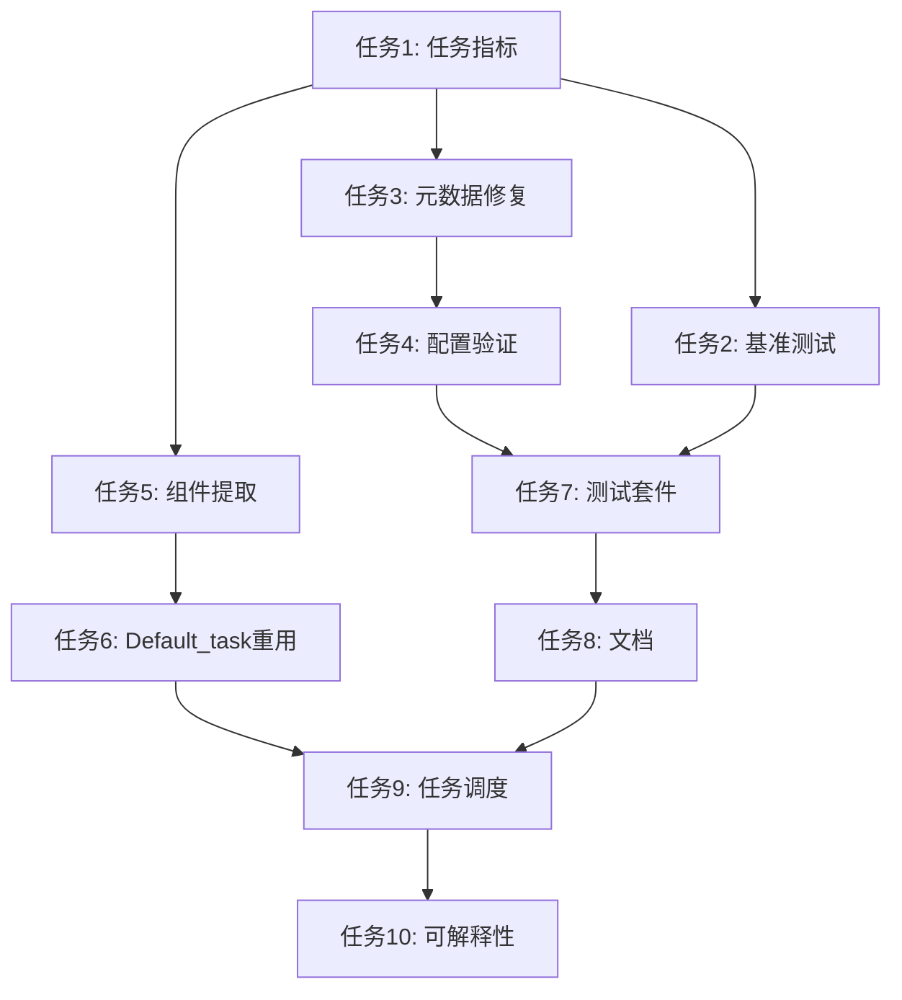

# 多任务PHM增强任务

## 概述

本文档概述了现有多任务PHM实现的可选增强任务。`src/task_factory/task/In_distribution/multi_task_phm.py`中的当前实现**功能完全**，准备用于生产。这些任务代表改进可维护性、性能和可扩展性的优化机会。

**实现状态**: ✅ **完整且可运行**
**增强状态**: 🔧 **可选改进可用**

## 当前实现评估

### ✅ 已完成功能

现有实现成功提供：

1. **多任务训练**: 4种任务类型（分类、异常检测、信号预测、RUL预测）
2. **工厂集成**: 适当的task_factory加载和实例化
3. **配置支持**: 灵活的enabled_tasks和task_weights配置
4. **错误处理**: 个别任务失败时的优雅降级
5. **性能优化**: 单次前向传播与任务特定损失计算
6. **日志集成**: 个人和总损失跟踪

### 🔧 增强机会

虽然功能完整，实现可以在几个方面改进：

1. **代码重用**: 复制了Default_task的优化器/调度器逻辑
2. **指标**: 仅限于损失日志记录，缺少任务特定评估指标
3. **模块化**: 整体设计限制了组件重用性
4. **验证**: 基本配置解析，没有验证
5. **测试**: 没有多任务功能的专门测试覆盖

## 可选增强任务

### 阶段1: 性能和指标增强

#### 任务1: 添加全面的任务特定指标

**优先级**: 高
**工作量**: 2-3小时
**要修改的文件**: `src/task_factory/task/In_distribution/multi_task_phm.py`
**描述**: 为每种任务类型添加详细评估指标

**实现**:

- [ ] 1.1 从 `Components/metrics.py`导入指标
- [ ] 1.2 添加 `_initialize_task_metrics()`方法
- [ ] 1.3 为每种任务类型实现 `_compute_task_metrics()`
- [ ] 1.4 在training_step和validation_step中添加指标计算
- [ ] 1.5 记录任务特定指标（准确率、F1、MAE、R2）

**预期指标**:

```python
task_metrics = {
    'classification': ['accuracy', 'f1', 'precision', 'recall'],
    'anomaly_detection': ['f1', 'precision', 'recall', 'auc'],
    'signal_prediction': ['mse', 'mae', 'r2'],
    'rul_prediction': ['mse', 'mae', 'r2', 'mape']
}
```

**验证**: 每种任务类型在训练期间记录适当的指标

#### 任务2: 性能基准测试和分析

**优先级**: 中
**工作量**: 1-2小时
**要创建的文件**: `benchmarks/multi_task_performance.py`
**描述**: 创建性能基准测试套件以验证效率声明

**实现**:

- [ ] 2.1 创建带计时器和内存分析器的基准测试脚本
- [ ] 2.2 测量训练吞吐量（样本/秒）
- [ ] 2.3 分析训练期间的GPU内存使用
- [ ] 2.4 比较单任务与多任务训练开销
- [ ] 2.5 生成带建议的性能报告

**验证**: 基准测试结果验证单次前向传播效率

#### 任务3: 修复批次元数据处理问题

**优先级**: 高
**工作量**: 1-2小时
**要修改的文件**: `src/task_factory/task/In_distribution/multi_task_phm.py`
**描述**: 修复假设批次中所有file_id一致的潜在问题

**实现**:

- [ ] 3.1 更新`_build_task_labels()`方法处理混合批次
- [ ] 3.2 添加批次file_id一致性检查
- [ ] 3.3 为混合批次实现逐样本元数据查找
- [ ] 3.4 添加警告日志用于混合批次情况
- [ ] 3.5 测试混合批次场景的处理

**当前问题**:
```python
# 有问题的代码
file_id = batch['file_id'][0].item()  # 只取第一个
metadata = self.metadata[file_id]
```

**修复后**:
```python
# 安全的处理方式
file_ids = batch['file_id']
if len(set(file_ids.tolist())) > 1:
    # 处理混合批次：逐样本处理或跳过依赖元数据的任务
    pass
else:
    file_id = file_ids[0].item()
    metadata = self.metadata[file_id]
```

**验证**: 混合批次不会导致元数据错误

#### 任务4: 配置验证增强

**优先级**: 中
**工作量**: 1-2小时
**要修改的文件**: `src/task_factory/task/In_distribution/multi_task_phm.py`
**描述**: 添加全面配置验证与清晰错误消息

**实现**:

- [ ] 4.1 添加 `_validate_multi_task_config()`方法
- [ ] 4.2 验证enabled_tasks列表非空
- [ ] 4.3 检查task_weights为正数
- [ ] 4.4 确保task_weights键匹配enabled_tasks
- [ ] 4.5 为配置问题提供具体错误消息

**验证**: 无效配置引发清晰可操作的错误

### 阶段2: 架构改进（可选）

#### 任务5: 提取任务组件类

**优先级**: 低
**工作量**: 3-4小时
**要创建的文件**: `src/task_factory/Components/multi_task_components.py`
**要修改的文件**: `src/task_factory/task/In_distribution/multi_task_phm.py`
**描述**: 将任务处理逻辑提取到可重用的组件类中

**实现**:

- [ ] 5.1 创建 `TaskComponentBase`抽象类
- [ ] 5.2 实现 `ClassificationComponent`类
- [ ] 5.3 实现 `AnomalyDetectionComponent`类
- [ ] 5.4 实现 `SignalPredictionComponent`类
- [ ] 5.5 实现 `RULPredictionComponent`类
- [ ] 5.6 更新MultiTaskPHM以使用组件类
- [ ] 5.7 保持与现有配置的向后兼容性

**预期结构**:

```python
class TaskComponentBase:
    def compute_loss(self, outputs, targets): ...
    def compute_metrics(self, outputs, targets): ...

class ClassificationComponent(TaskComponentBase):
    def compute_loss(self, outputs, targets):
        return F.cross_entropy(outputs, targets.long())
```

**验证**: 任务组件可以独立使用并保持相同功能

#### 任务6: 选择性Default_task基础设施重用

**优先级**: 低
**工作量**: 2-3小时
**要修改的文件**: `src/task_factory/task/In_distribution/multi_task_phm.py`
**描述**: 调研重用Default_task优化器/调度器同时保持多任务逻辑

**实现**:

- [ ] 6.1 分析Default_task的优化器/调度器实现
- [ ] 6.2 从Default_task提取可重用组件
- [ ] 6.3 测试混合继承方法
- [ ] 6.4 实现选择性重用而不破坏多任务功能
- [ ] 6.5 比较更改前后的代码复杂性

**注意**: 此任务需要仔细分析以避免引入破坏多任务功能的约束。

**验证**: 减少代码重复同时保持所有当前功能

### 阶段3: 测试和文档

#### 任务7: 创建全面测试套件

**优先级**: 高
**工作量**: 4-5小时
**要创建的文件**: `tests/test_multi_task_phm.py`
**描述**: 为多任务功能添加单元测试和集成测试

**实现**:

- [ ] 7.1 为任务配置解析创建单元测试
- [ ] 7.2 测试任务权重应用和损失计算
- [ ] 7.3 测试单个任务损失函数
- [ ] 7.4 测试错误处理场景（缺失输出、NaN损失）
- [ ] 7.5 创建与task_factory的集成测试
- [ ] 7.6 使用模拟数据测试端到端训练
- [ ] 7.7 添加批次元数据处理测试

**测试覆盖领域**:

- 配置验证
- 任务损失计算
- 错误处理和优雅降级
- 工厂集成
- 训练/验证步骤逻辑

**验证**: 全面测试覆盖确保功能稳定性

#### 任务8: 文档和使用示例

**优先级**: 中
**工作量**: 2-3小时
**要更新的文件**: 各种文档文件
**描述**: 创建全面文档和使用示例

**实现**:

- [ ] 8.1 更新CLAUDE.md包含多任务示例
- [ ] 8.2 为不同用例创建配置示例
- [ ] 8.3 添加常见问题的故障排除指南
- [ ] 8.4 记录性能特征和基准
- [ ] 8.5 创建配置更新的迁移指南

**文档领域**:

- 配置示例和最佳实践
- 性能特征和优化技巧
- 常见配置错误的故障排除
- 与现有流水线的集成

**验证**: 文档使易于采用和配置

### 阶段4: 高级功能（未来增强）

#### 任务9: 高级任务调度

**优先级**: 很低
**工作量**: 3-4小时
**要修改的文件**: `src/task_factory/task/In_distribution/multi_task_phm.py`
**描述**: 基于训练进度实现动态任务权重调整

**实现**:

- [ ] 9.1 添加任务性能监控
- [ ] 9.2 实现动态权重调整策略
- [ ] 9.3 为任务进展添加课程学习
- [ ] 9.4 基于收敛速率创建自适应平衡
- [ ] 9.5 为调度策略添加配置

**注意**: 这是面向研究的增强，需要仔细评估。

**验证**: 动态调度改善多任务训练收敛

#### 任务10: 多任务模型可解释性

**优先级**: 很低
**工作量**: 4-6小时
**要创建的文件**: `src/utils/multi_task_analysis.py`
**描述**: 添加分析多任务模型行为和任务交互的工具

**实现**:

- [ ] 10.1 实现任务梯度分析
- [ ] 10.2 添加任务冲突检测
- [ ] 10.3 创建任务重要性可视化
- [ ] 10.4 添加特征共享分析
- [ ] 10.5 生成可解释性报告

**验证**: 提供多任务学习动态洞察

## 任务依赖



## 实现优先级

### 高优先级（推荐）

1. **任务1**: 任务特定指标 - 适当评估的基础
2. **任务3**: 元数据处理修复 - 修正潜在错误
3. **任务7**: 测试套件 - 维持功能的关键

### 中优先级（有益）

4. **任务2**: 性能基准测试 - 验证效率声明
5. **任务4**: 配置验证 - 改善用户体验
6. **任务8**: 文档 - 改善采用和可维护性

### 低优先级（可选）

7. **任务5**: 组件提取 - 架构改进
8. **任务6**: Default_task重用 - 代码质量改进

### 很低优先级（研究）

9. **任务9**: 高级调度 - 面向研究的功能
10. **任务10**: 可解释性 - 分析和研究工具

## 成功标准

### 增强成功指标

1. **指标增强（任务1）**: 所有任务类型记录适当的评估指标
2. **性能验证（任务2）**: 基准测试确认效率特征
3. **配置健壮性（任务3）**: 无效配置的清晰错误消息
4. **测试覆盖（任务6）**: 多任务功能>90%代码覆盖
5. **文档质量（任务7）**: 清晰示例和故障排除指南

### 质量保证

- 所有增强保持向后兼容性
- 从基线实现无性能下降
- 现有功能保持不变
- 新功能得到适当测试和文档化

## 风险评估

### 低风险任务

- 任务1（指标）: 加法增强，最小风险
- 任务2（基准测试）: 仅分析，无代码更改
- 任务3（验证）: 改善错误处理，低风险
- 任务6（测试）: 无功能更改，确保质量
- 任务7（文档）: 无代码更改

### 中风险任务

- 任务4（组件）: 架构更改需要仔细测试
- 任务5（Default_task）: 复杂继承交互

### 高风险任务

- 任务8（调度）: 可能影响训练稳定性的复杂功能
- 任务9（可解释性）: 面向研究，收益不确定

## 实现建议

### 即时行动（如需要）

1. 实现任务1（指标）以更好地监控训练
2. 创建任务6（测试套件）以确保功能稳定性
3. 添加任务3（配置验证）以改善用户体验

### 未来考虑

- 如计划添加更多任务类型，考虑任务4（组件）
- 如优先考虑标准化，考虑任务5（Default_task）
- 如需性能验证，考虑任务2（基准测试）

### 如不需要可跳过

- 任务8和9面向研究，不是生产使用必需

## 结论

多任务PHM实现是**完整且功能性的**。这些增强任务提供改进系统可维护性、监控能力和可扩展性的机会。所有任务都是可选的，应根据具体需求和可用开发资源确定优先级。

**当前状态**: ✅ **生产就绪**
**增强价值**: 🔧 **增量改进可用**
**实现风险**: ✅ **低风险增强**
