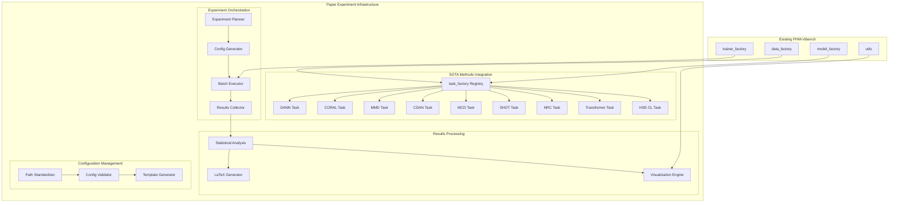
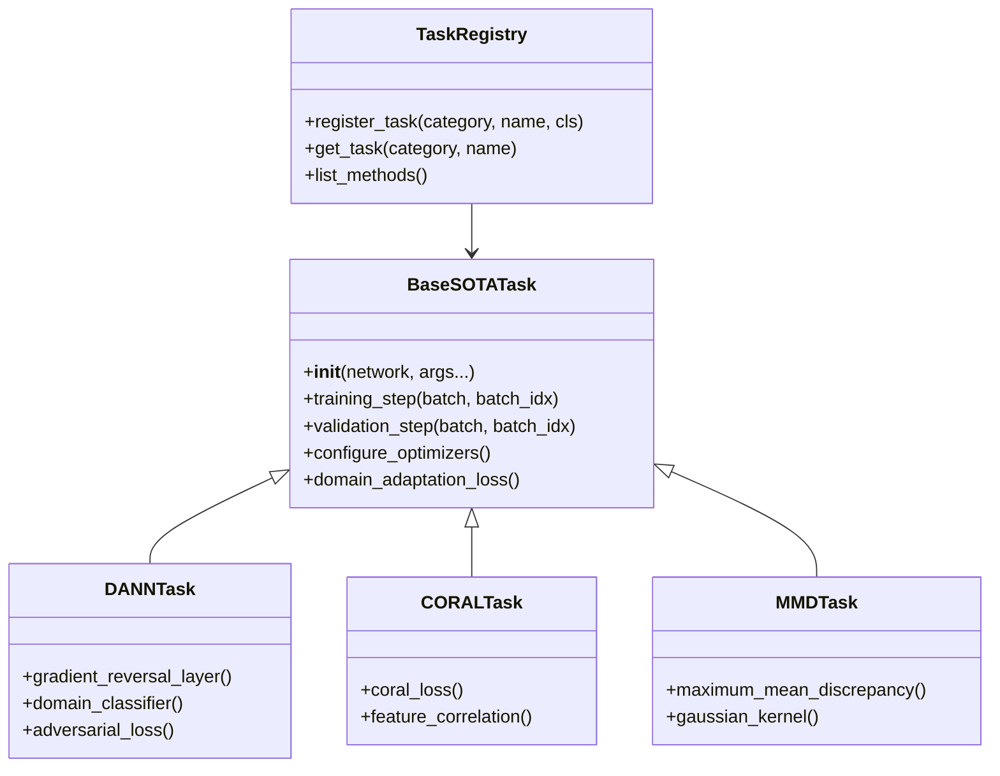
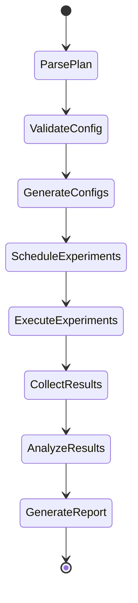

# Design Document: Paper Experiment Infrastructure

## Introduction

This document presents the technical design for reorganizing SOTA comparison methods into PHM-Vibench's modular architecture and establishing a comprehensive paper experiment infrastructure. The design integrates 8 state-of-the-art domain adaptation methods into the existing task_factory system while maintaining architectural consistency and enabling systematic academic experimentation.

## Steering Document Alignment

This design aligns with PHM-Vibench's architectural principles as documented in the existing codebase:

**Factory Design Pattern Compliance**: 
- Follows established registry patterns from `src/task_factory/task_factory.py`
- Uses `register_task` decorator pattern consistent with existing implementations
- Maintains modular component separation following factory architecture

**Configuration System Integration**:
- Leverages existing ConfigWrapper utilities from `src/configs/`
- Maintains YAML-based configuration following established patterns
- Supports hierarchical configuration override capabilities

**Code Organization Standards**:
- Places new components in appropriate `src/` module hierarchy
- Follows existing naming conventions and module structure
- Maintains backward compatibility with existing interfaces

## Code Reuse Analysis

**Existing Components to Leverage**:

1. **Task Factory Infrastructure**:
   - Reuse: `TASK_REGISTRY`, `register_task`, `task_factory` functions
   - Location: `src/task_factory/task_factory.py`
   - Integration: Extend registry with SOTA method registrations

2. **Configuration System**:
   - Reuse: `load_config()`, ConfigWrapper class
   - Location: `src/configs/`
   - Integration: Use existing config loading for path standardization

3. **Loss Functions Framework**:
   - Reuse: Loss function registry from `src/task_factory/Components/loss.py`
   - Integration: Add domain adaptation losses to existing registry

4. **Lightning Module Patterns**:
   - Reuse: `Default_task` base class structure
   - Location: `src/task_factory/Default_task.py`  
   - Integration: Inherit training/validation step patterns

5. **Visualization Utilities**:
   - Reuse: Existing plotting functions from `plot/` directory
   - Integration: Refactor into new module structure while preserving functionality

**New Components Required**:
- Domain adaptation specific loss functions (CORAL, MMD, adversarial)
- Experiment orchestration framework
- Results collection and analysis pipeline
- LaTeX generation utilities

## Architecture Overview

The paper experiment infrastructure follows PHM-Vibench's factory design pattern, extending the existing modular architecture to support comprehensive baseline comparisons and automated experiment orchestration.



## Component Design

### 1. SOTA Methods Integration Layer

#### 1.1 Task Factory Extension

**Purpose**: Integrate comparison methods into unified task_factory architecture

**Implementation Strategy**:
- Extend existing task registration system in `src/task_factory/task_factory.py`
- Create dedicated SOTA task implementations in `src/task_factory/task/SOTA/`
- Maintain compatibility with existing PyTorch Lightning patterns



#### 1.2 Domain Adaptation Components

**Location**: `src/task_factory/Components/domain_adaptation.py`

**Components**:
- **GradientReversalLayer**: For adversarial training (DANN, CDAN)
- **CORALLoss**: Deep correlation alignment loss
- **MMDLoss**: Maximum mean discrepancy implementation
- **DomainDiscriminator**: Adversarial domain classifier

#### 1.3 Configuration Templates

**Location**: `configs/templates/sota_methods/`

**Template Structure**:
```yaml
# Template: configs/templates/sota_methods/{method_name}.yaml
data:
  data_dir: "/home/user/data/PHMbenchdata/PHM-Vibench"
  metadata_file: "metadata_6_1.xlsx"
  # Standard data configuration

model:
  name: "M_01_ISFM"  # Consistent backbone
  # Model-specific parameters

task:
  type: "SOTA"
  name: "{method_name}"
  # Method-specific parameters
  
trainer:
  # Standard training configuration
```

### 2. Experiment Orchestration System

#### 2.1 Experiment Planner

**Location**: `src/experiment/experiment_planner.py`

**Responsibilities**:
- Parse paper experiment plan markdown
- Generate experiment configurations
- Manage experiment dependencies and sequencing
- Handle parameter sweeps and ablation studies



#### 2.2 Batch Execution Engine

**Location**: `src/experiment/batch_executor.py`

**Features**:
- Parallel experiment execution
- Resource management and scheduling
- Error handling and retry logic
- Progress monitoring and logging

#### 2.3 Results Collection Framework

**Location**: `src/experiment/results_collector.py`

**Data Schema**:
```python
@dataclass
class ExperimentResult:
    method_name: str
    dataset: str
    source_domains: List[str]
    target_domain: str
    accuracy: float
    f1_score: float
    precision: float
    recall: float
    training_time: float
    inference_time: float
    memory_usage: float
    convergence_epoch: int
    hyperparameters: Dict[str, Any]
    run_id: int
    timestamp: datetime
    config_hash: str
```

### 3. Configuration Management System

#### 3.1 Path Standardization Module (Requirement 3 Implementation)

**Location**: `src/utils/config/path_standardizer.py`

**Detailed Implementation**:

```python
import os
import yaml
import shutil
from pathlib import Path
from typing import Dict, List, Optional
from src.configs import load_config, ConfigWrapper

class PathStandardizer:
    """Centralized path management for PHM-Vibench experiments."""
    
    STANDARD_PATHS = {
        'data_dir': '/home/user/data/PHMbenchdata/PHM-Vibench',
        'metadata_file': 'metadata_6_1.xlsx',
        'results_dir': 'results/paper_experiments',
        'figures_dir': 'figures/paper',
        'tables_dir': 'tables/paper'
    }
    
    def __init__(self):
        self.backup_dir = Path('.claude/backups/configs')
        self.backup_dir.mkdir(parents=True, exist_ok=True)
    
    def standardize_config(self, config_path: str) -> bool:
        """Update configuration file with standard paths."""
        try:
            # Create backup
            backup_path = self.backup_dir / f"{Path(config_path).name}.backup"
            shutil.copy2(config_path, backup_path)
            
            # Load existing config
            with open(config_path, 'r') as f:
                config = yaml.safe_load(f)
            
            # Update paths
            if 'data' in config:
                config['data']['data_dir'] = self.STANDARD_PATHS['data_dir']
                config['data']['metadata_file'] = self.STANDARD_PATHS['metadata_file']
            
            # Validate paths before saving
            if self.validate_paths(config):
                with open(config_path, 'w') as f:
                    yaml.dump(config, f, default_flow_style=False, sort_keys=False)
                return True
            return False
            
        except Exception as e:
            print(f"Error standardizing {config_path}: {e}")
            return False
    
    def batch_standardize(self, config_dirs: List[str]) -> Dict[str, bool]:
        """Update all configuration files in specified directories."""
        results = {}
        
        for config_dir in config_dirs:
            config_files = list(Path(config_dir).glob('**/*.yaml'))
            for config_file in config_files:
                if self._should_update_config(config_file):
                    results[str(config_file)] = self.standardize_config(str(config_file))
        
        return results
    
    def validate_paths(self, config: Dict) -> bool:
        """Verify all paths are accessible."""
        if 'data' in config:
            data_dir = Path(config['data'].get('data_dir', ''))
            metadata_file = config['data'].get('metadata_file', '')
            
            # Check data directory exists
            if not data_dir.exists():
                print(f"Warning: Data directory does not exist: {data_dir}")
                return False
            
            # Check metadata file exists
            metadata_path = data_dir / metadata_file
            if not metadata_path.exists():
                print(f"Warning: Metadata file does not exist: {metadata_path}")
                return False
                
        return True
    
    def _should_update_config(self, config_file: Path) -> bool:
        """Determine if config file should be updated."""
        # Skip backup files and template files
        if config_file.suffix == '.backup' or 'template' in config_file.name:
            return False
        return True
    
    def generate_migration_report(self, config_dirs: List[str]) -> str:
        """Generate report of required configuration changes."""
        report = []
        total_files = 0
        needs_update = 0
        
        for config_dir in config_dirs:
            config_files = list(Path(config_dir).glob('**/*.yaml'))
            total_files += len(config_files)
            
            for config_file in config_files:
                if self._needs_path_update(config_file):
                    needs_update += 1
                    report.append(f"UPDATE NEEDED: {config_file}")
        
        summary = f"Migration Report: {needs_update}/{total_files} files need updating\n"
        return summary + "\n".join(report)
```

**Migration Automation**:

```python
# Automated migration script
def migrate_all_configs():
    """Migrate all PHM-Vibench configuration files."""
    standardizer = PathStandardizer()
    
    config_directories = [
        'configs/demo',
        'configs/templates',
        'configs/experiments'
    ]
    
    # Generate pre-migration report
    print(standardizer.generate_migration_report(config_directories))
    
    # Execute migration
    results = standardizer.batch_standardize(config_directories)
    
    # Report results
    success_count = sum(1 for success in results.values() if success)
    print(f"Migration completed: {success_count}/{len(results)} files updated successfully")
    
    return results
```

#### 3.2 Configuration Validation

**Location**: `src/utils/config/config_validator.py`

**Validation Rules**:
- Path accessibility verification
- Parameter consistency checks
- Required field validation
- Cross-configuration compatibility

### 4. Visualization System Reorganization (Requirement 5 Implementation)

#### 4.1 Detailed Migration Plan

**Current State Analysis**:
```
plot/
├── A1_plot_config.py     → src/utils/visualization/core/config_plots.py
├── A5_plot_filters.py    → src/utils/visualization/core/filter_plots.py  
├── A6_plot_signals.py    → src/utils/visualization/core/signal_plots.py
├── pretraining_plot.py   → src/utils/visualization/paper/pretraining_plots.py
script/unified_metric/
├── paper_visualization.py → src/utils/visualization/paper/comparison_plots.py
└── sota_comparison.py    → (results processing, not visualization)
```

**Target Module Structure**:
```
src/utils/visualization/
├── __init__.py              # Public API exports
├── paper/                   # Paper-specific visualizations
│   ├── __init__.py
│   ├── comparison_plots.py  # SOTA method comparisons
│   ├── ablation_plots.py    # Ablation study figures  
│   ├── tsne_analysis.py     # Feature space visualization
│   ├── performance_radar.py # Multi-metric radar charts
│   └── pretraining_plots.py # Pretraining analysis plots
├── core/                    # Core analysis plots
│   ├── __init__.py
│   ├── signal_plots.py      # Signal analysis and waveforms
│   ├── filter_plots.py      # Filter response analysis
│   └── config_plots.py      # Configuration visualization
└── utils/                   # Plotting utilities
    ├── __init__.py
    ├── plot_utils.py        # Common plotting functions
    ├── style_config.py      # Publication style settings
    └── latex_generator.py   # LaTeX integration
```

#### 4.2 API Standardization Implementation

**Unified Plotting Interface**:

```python
# src/utils/visualization/__init__.py
"""
PHM-Vibench Visualization Package

Provides unified API for all visualization needs following factory patterns.
"""

from .core import SignalPlotter, FilterPlotter, ConfigPlotter
from .paper import ComparisonPlotter, AblationPlotter, TSNEPlotter, RadarPlotter
from .utils import PlotStyleManager, LaTeXGenerator

class VisualizationFactory:
    """Factory for creating visualization components."""
    
    _plotters = {
        'signal': SignalPlotter,
        'filter': FilterPlotter, 
        'config': ConfigPlotter,
        'comparison': ComparisonPlotter,
        'ablation': AblationPlotter,
        'tsne': TSNEPlotter,
        'radar': RadarPlotter
    }
    
    @classmethod
    def create_plotter(cls, plotter_type: str, **kwargs):
        """Create plotter instance following factory pattern."""
        if plotter_type not in cls._plotters:
            raise ValueError(f"Unknown plotter type: {plotter_type}")
        
        return cls._plotters[plotter_type](**kwargs)
    
    @classmethod
    def list_plotters(cls) -> list:
        """List available plotter types."""
        return list(cls._plotters.keys())

# Public API
__all__ = [
    'VisualizationFactory',
    'SignalPlotter', 'FilterPlotter', 'ConfigPlotter',
    'ComparisonPlotter', 'AblationPlotter', 'TSNEPlotter', 'RadarPlotter',
    'PlotStyleManager', 'LaTeXGenerator'
]
```

**Migration Implementation**:

```python
# src/utils/visualization/migration/migrate_plots.py
"""
Automated migration tool for reorganizing plot code.
"""

import ast
import re
from pathlib import Path
from typing import List, Dict, Tuple

class PlotCodeMigrator:
    """Migrate existing plot code to new module structure."""
    
    def __init__(self):
        self.source_files = {
            'plot/A1_plot_config.py': 'src/utils/visualization/core/config_plots.py',
            'plot/A5_plot_filters.py': 'src/utils/visualization/core/filter_plots.py',
            'plot/A6_plot_signals.py': 'src/utils/visualization/core/signal_plots.py',
            'plot/pretraining_plot.py': 'src/utils/visualization/paper/pretraining_plots.py'
        }
        
    def analyze_dependencies(self, source_file: str) -> Dict[str, List[str]]:
        """Analyze dependencies in source file."""
        with open(source_file, 'r') as f:
            tree = ast.parse(f.read())
        
        imports = []
        functions = []
        classes = []
        
        for node in ast.walk(tree):
            if isinstance(node, ast.Import):
                imports.extend([alias.name for alias in node.names])
            elif isinstance(node, ast.ImportFrom):
                imports.append(f"{node.module}.{','.join(alias.name for alias in node.names)}")
            elif isinstance(node, ast.FunctionDef):
                functions.append(node.name)
            elif isinstance(node, ast.ClassDef):
                classes.append(node.name)
        
        return {
            'imports': imports,
            'functions': functions, 
            'classes': classes
        }
    
    def extract_functions(self, source_file: str) -> Dict[str, str]:
        """Extract individual functions from source file."""
        with open(source_file, 'r') as f:
            content = f.read()
        
        # Parse function definitions using AST
        tree = ast.parse(content)
        functions = {}
        
        for node in ast.walk(tree):
            if isinstance(node, ast.FunctionDef):
                # Extract function source code
                func_lines = content.split('\n')[node.lineno-1:node.end_lineno]
                functions[node.name] = '\n'.join(func_lines)
        
        return functions
    
    def generate_new_module(self, target_file: str, functions: Dict[str, str], 
                          dependencies: Dict[str, List[str]]) -> str:
        """Generate new module code with standardized API."""
        
        module_template = f'''"""
{target_file.split('/')[-1].replace('.py', '').title()} visualization module.

Migrated from original plot utilities with standardized API.
"""

import matplotlib.pyplot as plt
import numpy as np
import pandas as pd
from typing import Optional, Dict, Any, List
from pathlib import Path

# Import common utilities
from ..utils.plot_utils import setup_publication_style, save_figure
from ..utils.style_config import get_style_config

class {self._get_class_name(target_file)}:
    """Standardized plotter class following PHM-Vibench patterns."""
    
    def __init__(self, style='publication', **kwargs):
        """Initialize plotter with style configuration."""
        self.style_config = get_style_config(style)
        self.setup_style()
    
    def setup_style(self):
        """Apply publication-ready styling."""
        setup_publication_style(self.style_config)
    
{self._format_functions(functions)}
    
    def save_figure(self, fig, filename: str, **kwargs):
        """Save figure with standardized settings."""
        return save_figure(fig, filename, **kwargs)
'''
        return module_template
    
    def _get_class_name(self, target_file: str) -> str:
        """Generate class name from target file path."""
        name = target_file.split('/')[-1].replace('.py', '')
        return ''.join(word.capitalize() for word in name.split('_')) + 'Plotter'
    
    def _format_functions(self, functions: Dict[str, str]) -> str:
        """Format functions as class methods."""
        formatted = []
        for func_name, func_code in functions.items():
            # Convert to method (add self parameter, proper indentation)
            method_code = self._convert_to_method(func_code)
            formatted.append(method_code)
        
        return '\n\n'.join(formatted)
    
    def _convert_to_method(self, func_code: str) -> str:
        """Convert standalone function to class method."""
        lines = func_code.split('\n')
        
        # Update function signature to include self
        if lines[0].strip().startswith('def '):
            func_line = lines[0]
            func_name = func_line.split('(')[0].replace('def ', '')
            params = func_line.split('(', 1)[1]
            
            if params.startswith(')'):
                new_signature = f"    def {func_name}(self):"
            else:
                new_signature = f"    def {func_name}(self, {params}"
                
            lines[0] = new_signature
        
        # Re-indent all lines
        formatted_lines = [lines[0]]  # Keep signature as is
        for line in lines[1:]:
            if line.strip():  # Only indent non-empty lines
                formatted_lines.append('    ' + line)
            else:
                formatted_lines.append(line)
        
        return '\n'.join(formatted_lines)
    
    def migrate_file(self, source_file: str) -> bool:
        """Migrate single file to new structure."""
        try:
            target_file = self.source_files.get(source_file)
            if not target_file:
                return False
            
            # Create target directory
            Path(target_file).parent.mkdir(parents=True, exist_ok=True)
            
            # Analyze source
            dependencies = self.analyze_dependencies(source_file)
            functions = self.extract_functions(source_file)
            
            # Generate new module
            new_code = self.generate_new_module(target_file, functions, dependencies)
            
            # Write to target file
            with open(target_file, 'w') as f:
                f.write(new_code)
            
            print(f"Migrated: {source_file} → {target_file}")
            return True
            
        except Exception as e:
            print(f"Error migrating {source_file}: {e}")
            return False
    
    def migrate_all(self) -> Dict[str, bool]:
        """Migrate all identified plot files."""
        results = {}
        
        for source_file in self.source_files:
            if Path(source_file).exists():
                results[source_file] = self.migrate_file(source_file)
            else:
                print(f"Source file not found: {source_file}")
                results[source_file] = False
        
        return results

# Usage
def run_migration():
    """Execute plot code migration."""
    migrator = PlotCodeMigrator()
    results = migrator.migrate_all()
    
    success_count = sum(1 for success in results.values() if success)
    total_count = len(results)
    
    print(f"Migration completed: {success_count}/{total_count} files migrated successfully")
    return results
```

#### 4.3 API Compatibility Layer

**Backward Compatibility**:

```python
# src/utils/visualization/compat.py
"""
Compatibility layer for existing plot imports.

Provides aliases for old import paths to maintain compatibility.
"""

import warnings
from .core.signal_plots import SignalPlotter
from .core.filter_plots import FilterPlotter
from .core.config_plots import ConfigPlotter

def deprecated_import_warning(old_path: str, new_path: str):
    """Issue deprecation warning for old import paths."""
    warnings.warn(
        f"Importing from '{old_path}' is deprecated. "
        f"Use '{new_path}' instead. "
        f"Old import will be removed in future version.",
        DeprecationWarning,
        stacklevel=3
    )

# Compatibility aliases
def plot_signals(*args, **kwargs):
    deprecated_import_warning('plot.A6_plot_signals', 'src.utils.visualization.core.signal_plots')
    plotter = SignalPlotter()
    return plotter.plot_signals(*args, **kwargs)

def plot_filters(*args, **kwargs):
    deprecated_import_warning('plot.A5_plot_filters', 'src.utils.visualization.core.filter_plots')
    plotter = FilterPlotter()
    return plotter.plot_filters(*args, **kwargs)

def plot_config(*args, **kwargs):
    deprecated_import_warning('plot.A1_plot_config', 'src.utils.visualization.core.config_plots')
    plotter = ConfigPlotter()
    return plotter.plot_config(*args, **kwargs)
```

### 5. Results Analysis Pipeline

#### 5.1 Statistical Analysis Engine

**Location**: `src/analysis/statistical_analysis.py`

**Features**:
- Paired t-tests for method comparisons
- Effect size calculations (Cohen's d)
- Confidence interval estimation
- Multiple comparison corrections (Bonferroni, FDR)

#### 5.2 LaTeX Generation System

**Location**: `src/utils/latex/`

**Generators**:
- **TableGenerator**: Automated comparison tables
- **FigureGenerator**: Publication-ready figure formatting
- **ReportGenerator**: Complete experimental results compilation

```python
class ComparisonTableGenerator:
    """Generate LaTeX tables for SOTA method comparisons."""
    
    def generate_accuracy_table(self, results: List[ExperimentResult]) -> str:
        """Create accuracy comparison table with statistical significance."""
        
    def generate_ablation_table(self, ablation_results: Dict) -> str:
        """Create ablation study results table."""
        
    def format_for_journal(self, table: str, journal: str) -> str:
        """Format table for specific journal requirements."""
```

### 6. Paper Experiment Plan Integration

#### 6.1 Experiment Plan Parser

**Location**: `src/experiment/plan_parser.py`

**Plan Structure**:
```markdown
# Paper Experiment Plan

## 1. Baseline Comparisons
- [ ] DANN vs HSE-CL on CWRU→XJTU
- [ ] CORAL vs HSE-CL on FEMTO→Paderborn
- [ ] MMD vs HSE-CL on all cross-dataset pairs

## 2. Ablation Studies  
- [ ] Temperature parameter sweep (0.01-1.0)
- [ ] Contrast weight analysis (0.01-1.0)
- [ ] Momentum encoder effectiveness

## 3. Statistical Analysis
- [ ] Significance testing across all comparisons
- [ ] Effect size calculations
- [ ] Confidence interval reporting
```

#### 6.2 Automated Execution

**Features**:
- Markdown parsing to extract experiment definitions
- Dependency resolution between experiments
- Progress tracking with checkpoints
- Failure recovery and retry logic

## Implementation Strategy

### Phase 1: Core Infrastructure
1. Extend task_factory registry for SOTA methods
2. Implement base domain adaptation components
3. Create configuration templates and validation
4. Set up basic results collection framework

### Phase 2: Method Integration
1. Implement individual SOTA method tasks
2. Create method-specific configuration files
3. Test integration with existing data/model factories
4. Validate result consistency with original implementations

### Phase 3: Experiment System
1. Develop experiment planning and execution framework
2. Implement batch processing and parallel execution
3. Create results analysis and statistical testing pipeline
4. Build LaTeX generation and visualization tools

### Phase 4: Migration and Testing
1. Reorganize visualization code following new structure
2. Migrate existing plot utilities to new module locations
3. Update all configuration files with standardized paths
4. Comprehensive integration testing and validation

## Integration Points

### With Existing Systems

**task_factory Integration**:
- Extend `TASK_REGISTRY` in `src/task_factory/task_factory.py`
- Follow existing registration patterns using `register_task` decorator
- Maintain compatibility with `build_task` function interface

**data_factory Integration**:
- Use existing data loading infrastructure without modification
- Support all 30+ industrial datasets through existing readers
- Maintain compatibility with H5 file processing and metadata system

**model_factory Integration**:
- Support all existing backbone networks and foundation models
- Use consistent model instantiation through `build_model` function
- Maintain compatibility with ISFM architectures

**trainer_factory Integration**:
- Use existing PyTorch Lightning trainer configurations
- Support distributed training and GPU utilization
- Maintain logging and checkpoint management compatibility

## Configuration Schema

### SOTA Method Configuration Template

```yaml
# Standard configuration structure for SOTA methods
experiment:
  name: "HSE_vs_DANN_CWRU_to_XJTU"
  description: "Baseline comparison between HSE-CL and DANN"
  
data:
  data_dir: "/home/user/data/PHMbenchdata/PHM-Vibench"
  metadata_file: "metadata_6_1.xlsx"
  source_domains: [1]  # CWRU
  target_domain: 5     # XJTU
  
model:
  name: "M_01_ISFM"
  backbone_config: "default"
  
task:
  type: "SOTA"
  name: "dann"
  domain_loss_weight: 0.1
  gradient_reversal_alpha: 1.0
  
trainer:
  max_epochs: 100
  devices: 1
  accelerator: "gpu"
  
environment:
  seed: 42
  output_dir: "results/paper_experiments/dann"
```

## Error Handling

### SOTA Method Integration Errors

**Task Registration Failures**:
- **Error**: Duplicate task names in registry
- **Detection**: Registry validation at startup
- **Recovery**: Use versioned naming scheme (dann_v1, dann_v2)
- **Prevention**: Automated conflict detection in CI/CD

**Configuration Loading Errors**:
- **Error**: Missing required parameters in SOTA method configs
- **Detection**: Schema validation using existing ConfigWrapper
- **Recovery**: Auto-populate with default values and warning
- **Prevention**: Comprehensive configuration templates with validation

**Model Compatibility Issues**:
- **Error**: SOTA method incompatible with backbone model
- **Detection**: Model architecture validation at task instantiation
- **Recovery**: Graceful degradation to compatible backbone
- **Prevention**: Compatibility matrix documentation and checking

### Experiment Execution Errors

**Resource Exhaustion**:
- **Error**: Out of memory during batch experiment execution
- **Detection**: Memory monitoring with thresholds
- **Recovery**: Automatic batch size reduction and retry
- **Prevention**: Memory profiling and resource estimation

**Configuration Path Errors**:
- **Error**: Invalid data paths or missing metadata files
- **Detection**: Path validation before experiment start
- **Recovery**: Interactive path correction prompt
- **Prevention**: Automated path verification in configuration validation

**Experiment Interruption**:
- **Error**: System shutdown or network interruption during long experiments
- **Detection**: Heartbeat monitoring and checkpoint detection
- **Recovery**: Resume from last checkpoint with state restoration
- **Prevention**: Regular checkpointing and progress persistence

### Results Collection Errors

**Data Corruption**:
- **Error**: Incomplete or corrupted experimental results
- **Detection**: Result validation checksums and completeness verification
- **Recovery**: Re-run failed experiments automatically
- **Prevention**: Atomic write operations and backup mechanisms

**Statistical Analysis Failures**:
- **Error**: Insufficient data for significance testing
- **Detection**: Sample size validation before analysis
- **Recovery**: Collect additional experimental runs automatically
- **Prevention**: Power analysis and minimum sample size calculation

## Testing Strategy

### Unit Testing Framework

**Component Testing**:
- **SOTA Method Implementations**: Isolated testing of each domain adaptation method
  - Test loss function computations against reference implementations
  - Validate gradient flow in adversarial training components
  - Verify parameter updates and optimization behavior

- **Configuration System**: 
  - Path standardization utilities with various input formats
  - Configuration validation with malformed inputs
  - Template generation with different parameter combinations

- **Results Collection**:
  - Statistical analysis functions with known datasets
  - LaTeX generation with various table formats
  - Visualization utilities with edge cases

### Integration Testing Framework

**End-to-End Workflows**:
- **Single Method Experiments**: Complete workflow from config to results
  - Load configuration → Initialize method → Train → Evaluate → Collect results
  - Test with all 8 SOTA methods on subset of datasets
  - Verify result consistency and format compliance

- **Batch Experiment Execution**:
  - Multi-method comparison on single dataset pair
  - Parallel execution with resource constraints
  - Error recovery and retry mechanisms

- **Migration Testing**:
  - Configuration path updates with backup/restore
  - Visualization code migration with API compatibility
  - Results format conversion between versions

### Performance Testing Framework

**Scalability Testing**:
- **Memory Usage Profiling**: Monitor peak memory during experiments
  - Single vs batch execution comparison
  - Different dataset sizes and model complexities
  - Memory leak detection over extended runs

- **Execution Time Benchmarking**: Compare against original implementations
  - Method-by-method performance comparison
  - Parallel vs sequential execution efficiency
  - Optimization impact measurement

### Compatibility Testing Framework

**System Integration**:
- **PHM-Vibench Version Compatibility**: Test against different framework versions
- **PyTorch Lightning Integration**: Verify trainer compatibility
- **Dataset Compatibility**: Validate with all 30+ supported datasets
- **Hardware Compatibility**: Test on different GPU/CPU configurations

### Quality Assurance

**Unit Testing**:
- Individual SOTA method implementations
- Domain adaptation loss functions
- Configuration validation logic
- Results processing utilities

**Integration Testing**:
- End-to-end experiment execution
- Multi-method comparison workflows
- Results consistency validation
- Configuration migration testing

**Performance Testing**:
- Memory usage profiling
- Execution time benchmarking
- Parallel processing efficiency
- Resource utilization monitoring

### Validation Criteria

**Result Consistency**:
- SOTA method results within 1% of original implementations
- Statistical significance preservation
- Reproducibility across multiple runs

**Performance Requirements**:
- Single experiment execution < 30 minutes
- Batch processing efficiency > 80% utilization
- Memory usage < 16GB per concurrent experiment

## Risk Mitigation

### Technical Risks

**Integration Complexity**:
- Mitigation: Incremental integration with comprehensive testing
- Fallback: Maintain original script-based implementations during transition

**Performance Regression**:
- Mitigation: Continuous benchmarking against baseline implementations
- Monitoring: Automated performance regression detection

**Configuration Conflicts**:
- Mitigation: Comprehensive validation and migration utilities
- Recovery: Automated backup and rollback mechanisms

### Operational Risks

**Experiment Reproducibility**:
- Mitigation: Comprehensive logging and environment documentation
- Verification: Automated reproducibility testing framework

**Result Interpretation**:
- Mitigation: Statistical analysis automation with confidence intervals
- Documentation: Clear methodology documentation and analysis guidelines

This design provides a robust, extensible foundation for academic paper experimentation while maintaining full compatibility with PHM-Vibench's existing architecture and enabling systematic comparison of state-of-the-art methods.