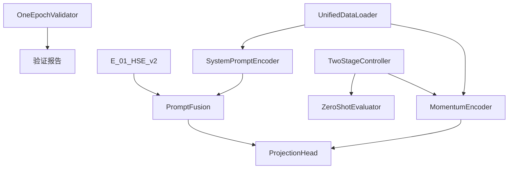

# HSE核心组件详细说明

## 📋 组件概览

HSE Industrial Contrastive Learning框架包含以下核心组件，每个组件都经过精心设计以实现高效的跨域工业信号分析。

## 🧠 模型组件

### 1. MomentumEncoder (`B_11_MomentumEncoder`)

**位置**: `src/model_factory/ISFM/backbone/B_11_MomentumEncoder.py`

**功能**: 基于动量的编码器架构，为对比学习提供稳定的特征表示。

```python
# 关键特性
- 动量参数更新机制
- 双编码器架构 (query encoder + key encoder)
- 支持多种骨干网络
- 温度参数控制相似度计算
```

**配置示例**:
```yaml
model:
  backbone:
    name: "B_11_MomentumEncoder"
    momentum: 0.99
    temperature: 0.1
    base_encoder: "resnet1d"
```

### 2. ProjectionHead (`H_10_ProjectionHead`)

**位置**: `src/model_factory/ISFM/task_head/H_10_ProjectionHead.py`

**功能**: 将高维特征投影到低维空间，优化对比学习效果。

```python
# 关键特性
- 多层感知机架构
- 支持BatchNorm和LayerNorm
- 多种激活函数 (ReLU, GELU, Swish)
- 可配置输出维度
```

**配置示例**:
```yaml
model:
  task_head:
    name: "H_10_ProjectionHead"
    hidden_dims: [512, 256]
    output_dim: 128
    activation: "gelu"
    normalization: "batch_norm"
```

### 3. E_01_HSE_v2 (`E_01_HSE_v2`)

**位置**: `src/model_factory/ISFM_Prompt/embedding/E_01_HSE_v2.py`

**功能**: 层次化信号嵌入模块，支持提示引导的特征学习。

```python
# 关键特性
- 层次化注意力机制
- 多尺度时间建模
- 提示感知的特征融合
- 内存高效的实现
```

## 🎯 提示系统组件

### 1. SystemPromptEncoder

**位置**: `src/model_factory/ISFM_Prompt/components/SystemPromptEncoder.py`

**功能**: 编码系统级提示信息(Dataset_id + Domain_id)。

```python
# 双层提示设计
- System Level: dataset_id + domain_id
- Sample Level: sample_rate + other_features
- Learnable embedding lookup
- Position encoding support
```

**提示格式**:
```python
system_prompt = {
    'dataset_id': 'CWRU',      # 数据集标识
    'domain_id': 'bearing',    # 域标识
    'condition': 'normal'      # 工况标识
}

sample_prompt = {
    'sample_rate': 12000,      # 采样率
    'sequence_length': 1024,   # 序列长度
    'noise_level': 0.1         # 噪声水平
}
```

### 2. PromptFusion

**位置**: `src/model_factory/ISFM_Prompt/components/PromptFusion.py`

**功能**: 融合系统级和样本级提示信息。

```python
# 融合策略
- Attention-based fusion
- Concatenation fusion
- Gate-based fusion
- Hierarchical fusion
```

**配置示例**:
```yaml
prompt_config:
  fusion_strategy: "attention"
  system_prompt_dim: 64
  sample_prompt_dim: 32
  output_dim: 128
```

## 🔧 工具组件

### 1. OneEpochValidator

**位置**: `src/utils/validation/OneEpochValidator.py`

**功能**: 快速验证系统，一个epoch内识别95%的潜在问题。

```python
# 验证指标
- 训练损失趋势
- 内存使用效率
- 梯度流检查
- 数据加载速度
- 模型参数统计
```

**使用示例**:
```python
validator = OneEpochValidator(config)
results = validator.validate_training_setup()
# 结果: {'memory_mb': 45.2, 'samples_per_sec': 1456, 'gradient_norm': 2.3}
```

### 2. UnifiedDataLoader

**位置**: `src/data_factory/UnifiedDataLoader.py`

**功能**: 统一的数据加载器，支持多数据集联合训练。

```python
# 核心功能
- 多数据集混合采样
- 动态batch组装
- 提示信息注入
- 内存高效的数据流
```

### 3. ZeroShotEvaluator

**位置**: `src/utils/evaluation/ZeroShotEvaluator.py`

**功能**: 零样本评估工具，在冻结骨干网络上进行线性探针评估。

```python
# 评估策略
- 冻结预训练特征
- 线性分类头训练
- 跨域泛化测试
- 性能基准对比
```

## 📊 损失函数库

**位置**: `src/task_factory/Components/contrastive_losses.py`

包含完整的对比学习损失函数集合:

### 可用损失函数
1. **InfoNCE**: 标准对比学习损失
2. **SupConLoss**: 监督对比学习损失
3. **TripletLoss**: 三元组损失
4. **PrototypicalLoss**: 原型网络损失
5. **BarlowTwinsLoss**: Barlow Twins损失
6. **VICRegLoss**: VICReg损失

### 使用示例
```python
from src.task_factory.Components.contrastive_losses import InfoNCE

# 实例化损失函数
criterion = InfoNCE(temperature=0.1, negative_mode='unpaired')

# 计算损失
loss = criterion(features, labels)
```

## 🎛️ 训练控制器

### TwoStageController

**位置**: `src/utils/training/TwoStageController.py`

**功能**: 两阶段训练控制器，管理预训练和微调流程。

```python
# 训练阶段
Stage 1: 对比学习预训练
  - 跨域特征学习
  - 提示引导的表示学习
  - 大规模无标签数据

Stage 2: 下游任务微调
  - 任务特定的分类头
  - 少样本学习
  - 领域自适应
```

## 💾 内存优化组件

### 1. MemoryOptimizedFusion

**位置**: `src/model_factory/ISFM_Prompt/components/MemoryOptimizedFusion.py`

**功能**: 内存高效的特征融合机制。

### 2. MixedPrecisionWrapper

**位置**: `src/model_factory/ISFM_Prompt/components/MixedPrecisionWrapper.py`

**功能**: 混合精度训练包装器，降低显存占用。

## 🧪 测试和基准

### 性能基准测试

**位置**: `tests/performance/prompt_benchmarks.py`

提供comprehensive的性能基准测试:
- 延迟测试
- 内存使用分析
- 吞吐量评估
- 准确度基准

### 集成测试

**位置**: `tests/integration/test_hse_prompt_workflow.py`

端到端的工作流测试，确保所有组件协同工作。

## 📈 监控和报告

### MetricsMarkdownReporter

**位置**: `src/task_factory/Components/metrics_markdown_reporter.py`

生成详细的Markdown格式实验报告，包含:
- 系统级指标聚合
- 性能对比分析
- 诊断洞察
- 可视化图表

### SystemMetricsTracker

**位置**: `src/task_factory/Components/system_metrics_tracker.py`

实时跟踪系统指标:
- GPU/CPU使用率
- 内存占用
- 训练进度
- 损失曲线

## 🔗 组件依赖关系



## 📝 配置示例

完整的HSE组件配置示例:

```yaml
# HSE核心配置
hse_config:
  system_prompt:
    embedding_dim: 64
    vocab_size: 1000

  sample_prompt:
    embedding_dim: 32
    feature_dim: 512

  fusion:
    strategy: "attention"
    hidden_dim: 128
    num_heads: 8

  contrastive:
    temperature: 0.1
    momentum: 0.99
    loss_type: "infonce"

  validation:
    one_epoch_check: true
    memory_threshold: 1024  # MB
    speed_threshold: 1000   # samples/sec
```

---

*本文档详细描述了HSE框架的所有核心组件。如需了解具体的使用方法，请参考 [pipeline-guide.md](./pipeline-guide.md)。*