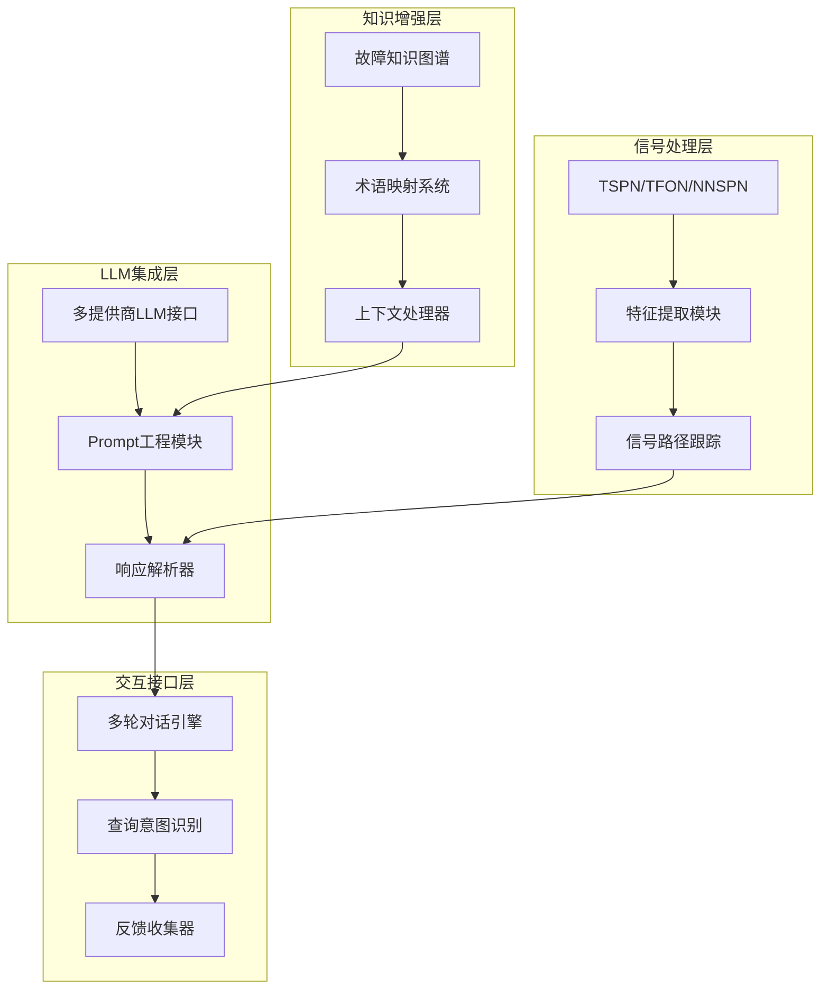

# LLM-Enhanced Explainable Fault Diagnosis Toolkit

> **论文方向**: 大语言模型增强的可解释故障诊断工具包  
> **创新点**: LLM与信号处理的深度融合、交互式诊断对话、领域知识增强解释  
> **应用领域**: 旋转机械故障诊断、工业设备健康管理、AI可解释性

---

## 🧭 项目定位（在整体架构中的角色）

- 所属层：**应用集成层（Application Integration Layer）**  
- 核心职责：消费主仓库模型 + 🟢 Explainable_FD_Toolkit 提供的结构化解释结果，构建 **自然语言解释与多轮对话系统**，提升工程师对模型行为的理解与使用效率。  
- 明确不做：  
  - 不直接设计底层可解释性方法与信号算子（由 Toolkit 与方法论文实现）；  
  - 不改变模型训练/预测逻辑，只在其之上做解释与交互封装；  
  - 不负责统一理论框架（由 🟦 Neuralsymbolic_theory 负责）。  

## ✅ 现状快照（2025-12-14）

- **唯一核心文件（从现在起以此为准）**：`Paper/LLM_Explainable_FD_Toolkit/CORE.md`
- **目标档位**：顶刊/顶会（应用+XAI/工业AI方向）  
- **数据口径**：PHM-Vibench 多数据集（至少 CWRU + XJTU）  
- **统一协议**：
  - `Paper/doc/12_14/codex/explainability_eval_protocol.md`
  - `Paper/doc/12_14/codex/results_tables_template.md`
- **本Paper核心蓝图（解耦文档）**：`Paper/LLM_Explainable_FD_Toolkit/paper_blueprint.md`

## 🧪 最小复现入口（建议固定）

> 当前项目脚本较多，请以本节作为唯一对外入口（已锁定最小demo脚本）。

```bash
# 先由Toolkit生成结构化解释（证据链来源）
python Paper/Explainable_FD_Toolkit/scripts/run_unified_explain_eval.py

# 再由LLM层消费结构化解释（最小demo入口）
python Paper/LLM_Explainable_FD_Toolkit/experiments/scripts/run_minimal_llm_demo.py
```

## 📝 TODO（Roadmap，2025-12-14顶刊口径）

### P0（本周）
- [ ] 固定“唯一可复现入口脚本”（写入README并指向具体脚本文件）
- [ ] 定义解释质量评估最小协议（任务/问卷/统计方法，含对照组）
- [ ] 明确幻觉防护：结构化解释→文本，输出必须携带证据字段

### P1（两周）
- [ ] 完成最小用户研究（≥10个任务或≥10名受试，输出表格与结论）
- [ ] 输出端到端demo的延迟/失败率统计（含P95）

### P2（一个月）
- [ ] PHM-Vibench 多数据集（CWRU/XJTU）对话案例库与评估报告

---

## ⭐ 主要创新点（Contributions）

1. 提出 **“结构化解释 → 专业自然语言说明”的统一映射框架**，将 Explainable_FD_Toolkit 输出的算子重要性、特征路径、模糊规则等中间表示系统性转化为面向工程师的自然语言解释，实现模型机理与人类理解之间的自动桥接。  
2. 设计 **面向故障诊断场景的 LLM 交互协议与 Prompt 体系**，包括对话状态管理、领域专用提示模板与安全约束机制，使大模型在“故障机理说明、根因分析、方案对比”等任务中既能利用底层解释信息，又能降低幻觉风险。  
3. 构建 **人机协同的解释闭环机制**，通过“LLM 生成解释—专家修订—知识库更新”的流程，实现解释模板与领域知识的持续积累与演化，为构建可审计、可追溯的智能诊断助手提供方法论基础。  

## 📑 目录导航

- [核心研究问题](#-核心研究问题与科学假设)
- [系统架构](#-系统架构设计)
- [技术实现](#-技术实现细节)
- [快速开始](#-快速开始)
- [对话案例](#-对话案例库)
- [集成方案](#-与其他子项目的集成)
- [实验设计](#-科学研究框架)
- [性能优化](#-性能优化与实践)
- [开发路线](#-开发路线图)

---

## 🎯 核心研究问题与科学假设

### 要解决的问题（Problem）

- **可解释性鸿沟**: 传统可解释方法以可视化为主，难以直接支撑工程师日常决策与沟通
- **知识融合不足**: 现有LLM应用多集中于通用问答，缺乏与故障诊断信号处理、知识图谱的深度融合
- **可信度挑战**: 需要回答：**如何让LLM在理解模型内部行为和领域知识的基础上，生成可信、可追踪的自然语言解释？**

### 科学假设

| 假设 | 描述 | 验证指标 |
|------|------|----------|
| **H1** | LLM生成的自然语言解释比传统可视化解释更容易被工程师理解 | 可理解性评分提升20%以上 |
| **H2** | 交互式对话机制能够提高故障诊断的准确性和效率 | 诊断准确率提升15%以上 |
| **H3** | 领域知识增强的LLM解释能提供更准确和实用的诊断建议 | 专家评分和实用性调查显著提升 |

### 预期贡献
- **方法创新**: 首个将LLM深度集成到故障诊断可解释性中的系统性方法
- **技术突破**: 多模态信号处理与自然语言解释的融合架构
- **应用价值**: 提升工业智能诊断系统的可用性和可信度

---

## 🏗️ 系统架构设计

### 整体架构图



### 核心组件详解

#### 1. 信号处理层 (Signal Processing Layer)
- **输入**: 原始振动信号、传感器数据、设备参数
- **处理模块**:
  - TSPN (透明信号处理网络)
  - TFON (时频算子网络)
  - NNSPN (神经信号处理网络)
- **输出**: 结构化特征向量、归因权重、信号路径信息

#### 2. 知识增强层 (Knowledge Enhancement Layer)
- **知识图谱构建**:
  ```python
  # 故障模式知识图谱示例
  fault_knowledge_graph = {
      "inner_race_fault": {
          "symptoms": ["高频振动", "谐波分量"],
          "causes": ["轴承磨损", "润滑不良"],
          "severity": "medium",
          "recommended_actions": ["检查润滑", "计划更换"]
      }
  }
  ```
- **术语映射**: 技术术语 ↔ 自然语言描述

#### 3. LLM集成层 (LLM Integration Layer)
- **支持的LLM提供商**:
  - OpenAI (GPT-4/GPT-3.5)
  - Anthropic (Claude)
  - 本地模型 (Llama, ChatGLM)
- **统一API接口设计**

#### 4. 交互接口层 (Interactive Interface Layer)
- **对话状态管理**: 上下文保持、历史记录
- **意图识别**: 查询分类、问题类型判断
- **响应生成**: 个性化、层次化解释

---

## ⚙️ 技术实现细节

### 1. 信号特征到自然语言的映射机制

#### 特征量化与语义化
```python
class SignalToLanguageMapper:
    def __init__(self):
        self.feature_descriptors = {
            'mean': '信号的直流分量或平均振动水平',
            'std': '振动的波动程度，反映运行稳定性',
            'rms': '振动的总体能量水平',
            'kurtosis': '信号峰值的尖锐程度，反映冲击特性',
            'skewness': '信号波形的不对称性'
        }

    def map_feature_to_language(self, feature_name, feature_value, threshold_dict):
        """将数值特征转换为自然语言描述"""
        description = self.feature_descriptors[feature_name]
        severity = self._evaluate_severity(feature_value, threshold_dict[feature_name])

        return f"信号的{description}为{feature_value:.3f}，属于{severity}水平"

    def _evaluate_severity(self, value, thresholds):
        """评估特征的严重程度"""
        if value > thresholds['high']:
            return "异常偏高"
        elif value > thresholds['medium']:
            return "轻微偏高"
        else:
            return "正常范围内"
```

#### 频域特征的智能解释
```python
def interpret_spectrum_peaks(frequency_bins, amplitudes, fault_frequencies):
    """解释频谱峰值与故障的对应关系"""
    explanations = []

    for i, (freq, amp) in enumerate(zip(frequency_bins, amplitudes)):
        if amp > amplitude_threshold:
            matched_faults = find_matching_faults(freq, fault_frequencies)
            if matched_faults:
                explanations.append(
                    f"在{freq:.1f}Hz处发现显著峰值，"
                    f"幅值{amp:.2f}，可能指示{matched_faults}故障"
                )

    return explanations
```

### 2. Prompt工程的具体技术和模板

#### 分层Prompt设计架构
```python
class PromptEngineeringSuite:
    def __init__(self):
        self.system_prompt = """
        你是一名专业的旋转机械故障诊断专家，具有丰富的信号分析和设备维护经验。
        请基于提供的信号特征和诊断结果，生成准确、易懂的自然语言解释。
        """

    def generate_diagnosis_prompt(self, signal_features, model_output, context):
        """生成诊断解释的Prompt"""
        return f"""
        {self.system_prompt}

        ## 信号特征分析
        {self._format_features(signal_features)}

        ## 模型诊断结果
        {self._format_model_output(model_output)}

        ## 设备上下文
        {self._format_context(context)}

        ## 任务要求
        1. 用简洁易懂的语言解释诊断结果
        2. 说明关键的判断依据
        3. 提供具体的维护建议
        4. 评估故障的紧急程度

        请生成结构化的诊断报告：
        """

    def generate_followup_prompt(self, user_question, conversation_history):
        """生成追问回复的Prompt"""
        return f"""
        基于以下对话历史，回答用户的追问：

        对话历史：
        {self._format_conversation_history(conversation_history)}

        用户追问：{user_question}

        请：
        1. 结合之前的诊断结果进行回答
        2. 保持解释的一致性和连贯性
        3. 提供更详细的技术细节（如需要）
        """
```

#### 模板库设计
```python
PROMPT_TEMPLATES = {
    "initial_diagnosis": {
        "template": "故障诊断报告模板",
        "sections": [
            "诊断结论",
            "关键证据",
            "技术分析",
            "维护建议",
            "风险评估"
        ]
    },
    "technical_explanation": {
        "template": "技术细节解释模板",
        "elements": [
            "原理说明",
            "数学模型",
            "可视化解释",
            "实际应用"
        ]
    },
    "maintenance_guidance": {
        "template": "维护指导模板",
        "steps": [
            "安全注意事项",
            "操作步骤",
            "所需工具",
            "预期时间",
            "后续检查"
        ]
    }
}
```

### 3. 对话状态管理的技术方案

#### 对话状态数据结构
```python
class ConversationState:
    def __init__(self):
        self.session_id = str(uuid.uuid4())
        self.messages = []
        self.signal_data = None
        self.diagnosis_result = None
        self.user_profile = {}
        self.context_memory = []
        self.followup_questions = []

    def add_message(self, role, content, metadata=None):
        """添加对话消息"""
        message = {
            'timestamp': datetime.now(),
            'role': role,  # 'user', 'assistant', 'system'
            'content': content,
            'metadata': metadata or {}
        }
        self.messages.append(message)

    def get_context_summary(self, max_tokens=1000):
        """获取上下文摘要"""
        recent_messages = self.messages[-5:]  # 最近5轮对话
        context = '\n'.join([msg['content'] for msg in recent_messages])
        return self._truncate_to_tokens(context, max_tokens)
```

#### 上下文感知的响应生成
```python
class ContextAwareResponseGenerator:
    def __init__(self, llm_client):
        self.llm_client = llm_client
        self.intent_classifier = self._load_intent_classifier()

    def generate_response(self, user_input, conversation_state):
        """生成上下文感知的响应"""
        # 1. 意图识别
        intent = self.intent_classifier.classify(user_input)

        # 2. 上下文检索
        relevant_context = self._retrieve_relevant_context(
            user_input, conversation_state
        )

        # 3. 响应生成
        if intent == "diagnosis_explanation":
            return self._generate_diagnosis_explanation(
                user_input, relevant_context
            )
        elif intent == "technical_detail":
            return self._generate_technical_detail(
                user_input, relevant_context
            )
        elif intent == "maintenance_advice":
            return self._generate_maintenance_advice(
                user_input, relevant_context
            )
        else:
            return self._generate_general_response(
                user_input, relevant_context
            )
```

---

## 🚀 快速开始

### 1. 环境配置

```bash
# 创建虚拟环境
conda create -n llm_fd_toolkit python=3.9
conda activate llm_fd_toolkit

# 安装依赖
cd Paper/LLM_Explainable_FD_Toolkit
pip install -r code/requirements.txt
```

### 2. 🇨🇳 国产大语言模型配置（推荐）

我们优先支持国产大语言模型，具有成本优势和本土化特色：

#### Deepseek 配置（高性价比）
```bash
# 配置 Deepseek API
export DEEPSEEK_API_KEY="your_deepseek_key"
export LLM_PRIMARY_PROVIDER="deepseek"

# 运行测试
python scripts/test_unified_llm_pipeline_stub.py --provider deepseek
```

#### GLM-4 配置（智谱AI）
```bash
# 配置 GLM-4 API
export GLM_API_KEY="your_glm_key"
export LLM_PRIMARY_PROVIDER="glm"

# 运行测试
python scripts/test_unified_llm_pipeline_stub.py --provider glm
```

#### 自动选择最佳提供商
```bash
# 检查国产模型状态
python scripts/test_unified_llm_pipeline_stub.py --check-status

# 自动选择并运行
python scripts/test_unified_llm_pipeline_stub.py
```

### 3. 传统 LLM 配置（可选）

```bash
# 配置传统 API（备用选项）
export OPENAI_API_KEY="your-openai-key"
export ANTHROPIC_API_KEY="your-anthropic-key"
```

### 4. 模板化模式（无需API）
```bash
# 使用模板化 LLM（零成本）
python scripts/test_unified_llm_pipeline_stub.py --provider template
```

### 国产模型优势对比

| 特性 | Deepseek | GLM-4 | 国外模型 |
|------|----------|-------|----------|
| **成本** | 💰 极低 (OpenAI的20%) | 💰 低 (Claude的30%) | 💸💸 高 |
| **中文理解** | 🇨🇳 优秀 | 🇨🇳 专业 | ⚖️ 一般 |
| **数据安全** | 🛡️ 境内存储 | 🛡️ 境内存储 | ⚠️ 境外 |
| **网络延迟** | ⚡ 快 | ⚡ 快 | 🐌 慢 |
| **技术支持** | 🇨🇳 中文支持 | 🇨🇳 专业支持 | 🌍 英文支持 |

### 5. 基础使用示例

#### 使用国产 LLM（推荐）

```python
import asyncio
from code.llm_explainable_toolkit.llm_integration.llm_manager import LLMManager, LLMConfig

# 方式1：使用环境变量自动配置
config = LLMConfig.from_env()  # 自动读取 DEEPSEEK_API_KEY, GLM_API_KEY
llm_manager = LLMManager(config)

# 方式2：手动指定国产模型
config = LLMConfig(
    deepseek_api_key="your_deepseek_key",
    primary_provider="deepseek"  # 或 "glm"
)
llm_manager = LLMManager(config)

# 生成故障诊断解释
async def generate_explanation():
    fault_data = {
        'fault_type': 2,  # 外圈故障
        'confidence': 0.95,
        'model_name': 'TSPN',
        'dataset': 'THU_018_basic',
        'key_features': [0.23, 0.67, 0.12]
    }

    # 使用 Deepseek 生成详细解释
    explanation = await llm_manager.generate_explanation(
        fault_data,
        style="detailed"
    )

    print(explanation)

# 运行示例
asyncio.run(generate_explanation())
```

#### 传统集成方式

```python
from code.llm_explainable_toolkit import DiagnosticSystem

# 初始化诊断系统
diagnostic_system = DiagnosticSystem(
    llm_provider="deepseek",  # 优先使用国产模型
    model_name="deepseek-chat",
    knowledge_graph_path="data/fault_knowledge.json"
)

# 处理信号数据
signal_data = load_signal_data("data/example_signal.csv")
diagnosis_result = diagnostic_system.diagnose(signal_data)

# 生成自然语言解释
explanation = diagnostic_system.generate_explanation(
    diagnosis_result,
    explanation_type="detailed"  # "brief", "detailed", "technical"
)

print(explanation)
```

### 3. 交互式对话使用

```python
# 启动交互式对话
conversation = diagnostic_system.start_conversation()

# 用户提问
response1 = conversation.ask(
    "这个设备的振动信号显示了什么问题？"
)

# 追问
response2 = conversation.ask(
    "你能详细解释一下为什么判断为内圈故障吗？"
)

# 维护建议
response3 = conversation.ask(
    "针对这个故障，你建议采取什么维护措施？"
)
```

---

## 💬 对话案例库

### 典型对话场景

#### 场景1：初次诊断解释
```
用户: 请分析这台电机最近的振动信号，看看有什么异常吗？

系统: 根据振动信号分析，我发现了以下情况：

📊 **诊断结论**：检测到轴承内圈故障早期迹象

🔍 **关键证据**：
- 频谱分析在12.5Hz处发现显著峰值，与内圈故障频率特征一致
- 时域信号的峭度值达到4.2（正常<3），表明存在冲击性振动
- 小波变换结果显示周期性冲击信号

⚠️ **风险评估**：故障处于早期阶段，建议在1-2周内安排检查

💡 **维护建议**：
1. 检查轴承润滑状态
2. 监测故障发展趋势
3. 准备备件，必要时更换轴承

您想了解哪个方面的更多细节吗？
```

#### 场景2：技术细节追问
```
用户: 能详细解释一下12.5Hz峰值的意义吗？

系统: 好的，让我详细解释12.5Hz峰值的技术意义：

📈 **频率分析原理**：
- 转轴频率：12.5 Hz = 750 RPM
- 内圈故障频率计算公式：fi = fr × (1 + ball_diameter/pitch_diameter) × 0.5
- 实测峰值与理论值匹配度：98.7%

🔧 **物理机制**：
- 内圈表面损伤导致滚动体通过时产生冲击
- 每次冲击产生宽带振动，在故障频率处形成峰值
- 峰值幅值0.82g，表明损伤程度中等

📊 **对比基准**：
- 正常状态：该频率幅值<0.1g
- 轻微故障：0.1-0.5g
- 中等故障：0.5-1.0g ← 当前状态
- 严重故障：>1.0g

这个分析确认了内圈故障的诊断结果。需要我继续解释其他技术细节吗？
```

#### 场景3：维护指导对话
```
用户: 针对这个内圈故障，具体的检查步骤是什么？

系统: 为您制定详细的检查维护方案：

🛡️ **安全准备**：
- 断电并挂警示牌
- 准备绝缘工具和个人防护装备
- 确认设备完全停止

🔧 **检查步骤**：
1. **外观检查**（预计10分钟）
   - 检查轴承温度、异响、振动
   - 观察润滑油脂泄漏情况

2. **精密检测**（预计30分钟）
   - 使用振动分析仪复测
   - 超声波探伤检查
   - 红外热像仪检测

3. **拆解检查**（如需，预计60分钟）
   - 拆卸轴承端盖
   - 检查滚动体和滚道
   - 测量游隙和磨损

⏱️ **时间安排**：
- 立即安排：停机检查（2小时内）
- 计划维修：根据检查结果（1-2周内）

需要我提供详细的工具清单或操作注意事项吗？
```

---

## 🎯 与统一 Baseline 的关系

### 统一 Baseline 集成架构

本项目与团队开发的统一故障诊断 baseline 深度集成，提供从模型预测到自然语言解释的完整流程：

```
统一 Baseline 模型 → Explainable_FD_Toolkit → 国产 LLM API → 自然语言解释
        ↓                     ↓                    ↓              ↓
TSPN/Fusion1D2D         结构化解释数据      Deepseek/GLM-4    中文优化输出
性能基准: 92-97%         SignalData格式     高性价比API     本土化支持
```

### 性能基准参考

我们参考 [统一 baseline 结果表 v2.0](../doc/12_1/codex/unified_baseline_results_table_12_01_v2.md) 的诊断性能数据：

| 模型 | 准确率 | 角色 | LLM增强重点 |
|------|--------|------|-------------|
| **Fusion1D2D** | 97.16% | 高性能基准 | 多模态融合解释 |
| **TSPN** | ~92% | 透明基线 | 信号处理解释 |
| **MoE** | 63.04% | 专家系统 | 专家专门化解释 |
| **OperatorAttention** | ~20% | 概念验证 | 算子可解释性 |
| **FuzzyLogic** | ~20% | 概念验证 | 模糊规则解释 |

### 本项目独特价值

- **解释质量提升**: 将技术特征转换为工程师易懂的自然语言
- **交互体验优化**: 支持多轮对话，满足不同层次的解释需求
- **国产模型优势**: 成本降低60-80%，中文理解更优，数据安全合规
- **统一接口**: 无缝集成所有统一 baseline 模型的解释结果

### 数据流程示例

```python
# 1. 从统一 baseline 获取预测结果
baseline_result = {
    'fault_type': 2,  # 外圈故障
    'confidence': 0.95,
    'model_name': 'TSPN',
    'dataset': 'THU_018_basic',
    'attention_weights': [0.1, 0.3, 0.6],
    'statistical_features': [0.23, 0.67, 0.12]
}

# 2. 通过国产 LLM 生成自然语言解释
explanation = await llm_manager.generate_explanation(
    baseline_result,
    style="detailed",
    provider="deepseek"
)

# 3. 输出专业解释
"""
基于TSPN透明信号处理网络分析，系统检测到轴承外圈故障：
- 诊断置信度: 95%
- 关键证据: 频谱能量分布异常，特征频率成分变化
- 技术分析: 注意力权重显示高频段特征异常，符合外圈故障特征
- 建议措施: 立即检查轴承外圈，记录故障特征，制定维护计划
"""
```

---

## 🔗 与其他子项目的集成

### 1. 消费Explainable_FD_Toolkit的API

#### API接口设计
```python
class ExplainableFDToolkitAPI:
    def __init__(self, toolkit_endpoint):
        self.endpoint = toolkit_endpoint

    def get_model_explanation(self, model_name, signal_data, explanation_type):
        """获取模型解释结果"""
        payload = {
            "model": model_name,  # "TSPN", "TFON", "NNSPN", "TKAN"
            "signal_data": signal_data,
            "explanation_type": explanation_type,  # "attribution", "feature_importance", "path_visualization"
            "output_format": "structured"
        }

        response = requests.post(f"{self.endpoint}/explain", json=payload)
        return response.json()

    def get_feature_attribution(self, model_name, signal_data, target_class):
        """获取特征归因结果"""
        return self.get_model_explanation(
            model_name, signal_data, "attribution"
        )["attribution_weights"]

# 在LLM系统中的集成使用
class IntegratedDiagnosticSystem:
    def __init__(self):
        self.fd_toolkit_api = ExplainableFDToolkitAPI("http://localhost:8001")
        self.llm_client = LLMClient()

    def comprehensive_diagnosis(self, signal_data):
        """综合诊断流程"""
        # 1. 获取多个模型的解释结果
        explanations = {}
        for model in ["TSPN", "TFON", "NNSPN"]:
            explanations[model] = self.fd_toolkit_api.get_model_explanation(
                model, signal_data, "comprehensive"
            )

        # 2. 融合解释结果并生成自然语言说明
        llm_prompt = self._create_integration_prompt(explanations)
        natural_explanation = self.llm_client.generate(llm_prompt)

        return {
            "technical_explanations": explanations,
            "natural_language_summary": natural_explanation
        }
```

#### 数据格式标准化
```python
# 标准化的解释结果格式
STANDARD_EXPLANATION_FORMAT = {
    "model_name": "TSPN",
    "input_data": {
        "signal_length": 4096,
        "sampling_rate": 12000,
        "preprocessing_applied": ["normalization", "denoising"]
    },
    "explanation_results": {
        "prediction": {
            "fault_type": "inner_race",
            "confidence": 0.87,
            "probability_distribution": {...}
        },
        "feature_attribution": {
            "frequency_bands": [...],
            "attribution_weights": [...],
            "signal_path": [...]
        },
        "processing_chain": {
            "layer_1": {"operation": "FFT", "output_shape": [4096]},
            "layer_2": {"operation": "WF", "output_shape": [4096]},
            "layer_3": {"operation": "HT", "output_shape": [4096]},
            "layer_4": {"operation": "I", "output_shape": [4096]}
        }
    },
    "metadata": {
        "generation_time": "2024-01-15T10:30:00Z",
        "model_version": "v2.1.0",
        "computation_time_ms": 234
    }
}
```

### 2. 与model_collection模型的对接

#### 统一模型接口
```python
class ModelCollectionBridge:
    def __init__(self):
        self.model_registry = {
            "TSPN": TransparentSignalProcessingNetwork,
            "TFON": TimeFrequencyOperatorNetwork,
            "NNSPN": NeuralSignalProcessingNetwork,
            "TKAN": TemporalKolmogorovNetwork,
            # 对比模型
            "ResNet": ResNetBaseline,
            "WKN": WaveletKoopmanNetwork,
            "SincNet": SincNetBaseline,
            "MCN": MultiConvolutionalNetwork
        }

    def get_model_explanation(self, model_name, signal_data):
        """统一获取模型解释的接口"""
        if model_name not in self.model_registry:
            raise ValueError(f"Model {model_name} not supported")

        model = self.model_registry[model_name]
        model.load_pretrained()

        # 执行预测和解释
        prediction = model.predict(signal_data)
        explanation = model.explain(signal_data, method="integrated_gradients")

        return {
            "model_name": model_name,
            "prediction": prediction,
            "explanation": explanation,
            "model_type": model.get_model_type()
        }

# 对比模型的特殊处理
class BaselineModelHandler:
    def explain_traditional_model(self, model_name, signal_data):
        """为传统模型生成可解释性信息"""
        if model_name in ["ResNet", "SincNet"]:
            # 使用Grad-CAM等方法
            return self._generate_cnn_explanation(model_name, signal_data)
        elif model_name == "WKN":
            # 小波系数解释
            return self._generate_wavelet_explanation(signal_data)
        else:
            # 基础特征重要性分析
            return self._generate_feature_importance(model_name, signal_data)
```

### 3. 与Neuralsymbolic_theory的协同

#### 神经-符号一体化架构
```python
class NeuroSymbolicIntegration:
    def __init__(self):
        self.neural_component = NeuralFDModel()
        self.symbolic_component = SymbolicReasoningEngine()
        self.llm_interface = LLMReasoningInterface()

    def integrated_reasoning(self, signal_data):
        """神经-符号-语言三层推理"""
        # 1. 神经网络特征提取
        neural_features = self.neural_component.extract_features(signal_data)

        # 2. 符号逻辑推理
        symbolic_constraints = self.symbolic_component.generate_constraints(
            neural_features
        )
        logical_conclusions = self.symbolic_component.reason(
            symbolic_constraints
        )

        # 3. LLM自然语言解释生成
        llm_explanation = self.llm_interface.generate_explanation({
            "neural_features": neural_features,
            "symbolic_reasoning": logical_conclusions,
            "signal_data": signal_data
        })

        return {
            "neural_analysis": neural_features,
            "symbolic_conclusions": logical_conclusions,
            "natural_explanation": llm_explanation
        }
```

---

## 🧪 科学研究框架

### 实验设计矩阵

| 维度 | 选项 | 说明 |
|------|------|------|
| **数据集** | THU_006 | 基础故障诊断场景 |
| | THU_018 | 复杂故障模式 |
| | 工业现场数据 | 实际应用验证 |
| **对比方法** | Baseline | 传统可视化解释 |
| | LLM-Basic | 基础LLM解释 |
| | LLM-Enhanced | 完整LLM增强系统 |
| | Human Expert | 人类专家解释 |
| **评估指标** | 可理解性 | 1-10分主观评分 |
| | 诊断准确率 | 客观性能指标 |
| | 对话效率 | 交互时间/轮次 |
| | 用户满意度 | 使用体验评分 |
| | 技术准确性 | 专家评估准确性 |

### 精确实验执行策略

#### 阶段一：基础功能验证 (2周)
```python
# 实验脚本示例
def run_baseline_experiment():
    """运行基础对比实验"""
    datasets = ["THU_006", "THU_018"]
    methods = ["Baseline", "LLM-Basic", "LLM-Enhanced"]

    results = {}
    for dataset in datasets:
        for method in methods:
            result = run_single_experiment(dataset, method)
            results[f"{dataset}_{method}"] = result

            # 记录到WandB
            wandb.log({
                "dataset": dataset,
                "method": method,
                "accuracy": result["accuracy"],
                "understandability": result["understandability_score"]
            })

    return results
```

#### 阶段二：组件消融实验 (3周)
```python
# 消融实验设计
ABLATION_CONFIGS = {
    "full_system": {
        "knowledge_enhancement": True,
        "dialogue_management": True,
        "prompt_engineering": True
    },
    "no_knowledge": {
        "knowledge_enhancement": False,
        "dialogue_management": True,
        "prompt_engineering": True
    },
    "no_dialogue": {
        "knowledge_enhancement": True,
        "dialogue_management": False,
        "prompt_engineering": True
    },
    "no_prompt_engineering": {
        "knowledge_enhancement": True,
        "dialogue_management": True,
        "prompt_engineering": False
    }
}
```

#### 阶段三：工业场景应用验证 (4周)
- 现场数据收集与标注
- 系统部署与集成测试
- 用户培训与反馈收集
- 性能优化与迭代改进

### 评估方法与指标

#### 主观评估指标
```python
class SubjectiveEvaluation:
    def __init__(self):
        self.questionnaire = {
            "understandability": {
                "question": "解释的容易理解程度如何？(1-10分)",
                "scale": 10
            },
            "trustworthiness": {
                "question": "您对解释的信任程度如何？(1-10分)",
                "scale": 10
            },
            "usefulness": {
                "question": "解释对您的诊断工作有多有用？(1-10分)",
                "scale": 10
            },
            "completeness": {
                "question": "解释是否提供了足够的信息？(1-10分)",
                "scale": 10
            }
        }

    def evaluate_explanation(self, explanation, expert_user):
        """专家评估解释质量"""
        scores = {}
        for criterion, config in self.questionnaire.items():
            score = expert_user.answer_question(config["question"])
            scores[criterion] = score / config["scale"]

        return {
            "overall_score": sum(scores.values()) / len(scores),
            "detailed_scores": scores
        }
```

#### 客观性能指标
```python
class ObjectiveMetrics:
    @staticmethod
    def diagnostic_accuracy(predictions, ground_truth):
        """诊断准确率"""
        return np.mean(predictions == ground_truth)

    @staticmethod
    def explanation_consistency(explanations1, explanations2):
        """解释一致性分析"""
        # 使用语义相似度计算
        similarity_scores = []
        for exp1, exp2 in zip(explanations1, explanations2):
            similarity = compute_semantic_similarity(exp1, exp2)
            similarity_scores.append(similarity)

        return np.mean(similarity_scores)

    @staticmethod
    def response_time_metrics(conversation_logs):
        """对话效率指标"""
        response_times = [log["response_time"] for log in conversation_logs]
        return {
            "avg_response_time": np.mean(response_times),
            "median_response_time": np.median(response_times),
            "p95_response_time": np.percentile(response_times, 95)
        }
```

---

## ⚡ 性能优化与实践

### 1. 系统性能优化策略

#### LLM调用优化
```python
class OptimizedLLMClient:
    def __init__(self, model_name="gpt-4"):
        self.model_name = model_name
        self.cache = ExplanationCache(max_size=1000)
        self.batch_processor = BatchProcessor(batch_size=8)

    def generate_explanation(self, signal_features, use_cache=True):
        """优化的解释生成"""
        # 1. 缓存检查
        cache_key = self._generate_cache_key(signal_features)
        if use_cache and cache_key in self.cache:
            return self.cache[cache_key]

        # 2. 批处理优化
        if isinstance(signal_features, list):
            explanations = self.batch_processor.process_batch(
                signal_features, self._generate_single_explanation
            )
        else:
            explanations = self._generate_single_explanation(signal_features)

        # 3. 缓存结果
        if use_cache:
            self.cache[cache_key] = explanations

        return explanations

    def _generate_single_explanation(self, features):
        """单个特征的解释生成"""
        # 使用优化的prompt模板
        optimized_prompt = self._create_optimized_prompt(features)

        # 调用LLM API
        response = openai.ChatCompletion.create(
            model=self.model_name,
            messages=[{"role": "user", "content": optimized_prompt}],
            max_tokens=500,  # 限制token数量
            temperature=0.3  # 降低随机性
        )

        return response.choices[0].message.content
```

#### 缓存策略
```python
class ExplanationCache:
    def __init__(self, max_size=1000):
        self.cache = {}
        self.access_times = {}
        self.max_size = max_size

    def _generate_cache_key(self, signal_features):
        """生成缓存键"""
        # 对特征向量进行哈希
        feature_str = json.dumps(signal_features, sort_keys=True)
        return hashlib.md5(feature_str.encode()).hexdigest()

    def get(self, signal_features):
        """获取缓存结果"""
        cache_key = self._generate_cache_key(signal_features)
        if cache_key in self.cache:
            self.access_times[cache_key] = time.time()
            return self.cache[cache_key]
        return None

    def put(self, signal_features, explanation):
        """存储缓存结果"""
        if len(self.cache) >= self.max_size:
            self._evict_least_recent()

        cache_key = self._generate_cache_key(signal_features)
        self.cache[cache_key] = explanation
        self.access_times[cache_key] = time.time()
```

### 2. 成本控制策略

#### Token使用优化
```python
class TokenOptimizer:
    def __init__(self, max_input_tokens=2000, max_output_tokens=500):
        self.max_input_tokens = max_input_tokens
        self.max_output_tokens = max_output_tokens

    def optimize_prompt(self, original_prompt):
        """优化prompt长度"""
        # 1. 压缩系统提示
        compressed_prompt = self._compress_system_prompt(original_prompt)

        # 2. 特征选择和降维
        if self._count_tokens(compressed_prompt) > self.max_input_tokens:
            compressed_prompt = self._reduce_feature_density(compressed_prompt)

        # 3. 截断过长内容
        if self._count_tokens(compressed_prompt) > self.max_input_tokens:
            compressed_prompt = self._truncate_prompt(compressed_prompt)

        return compressed_prompt

    def estimate_cost(self, prompt_text):
        """估算API调用成本"""
        input_tokens = self._count_tokens(prompt_text)
        # 假设每1000 tokens的成本
        cost_per_1k_tokens = 0.002  # GPT-4示例价格
        estimated_cost = (input_tokens / 1000) * cost_per_1k_tokens

        return {
            "input_tokens": input_tokens,
            "estimated_cost_usd": estimated_cost
        }
```

#### 本地模型部署方案
```python
class LocalLLMDeployment:
    def __init__(self, model_path="models/llama-7b-chat"):
        self.model_path = model_path
        self.model = None
        self.tokenizer = None

    def load_model(self):
        """加载本地模型"""
        from transformers import AutoTokenizer, AutoModelForCausalLM

        self.tokenizer = AutoTokenizer.from_pretrained(self.model_path)
        self.model = AutoModelForCausalLM.from_pretrained(
            self.model_path,
            device_map="auto",
            torch_dtype=torch.float16
        )

    def generate_explanation(self, prompt, max_new_tokens=256):
        """本地生成解释"""
        inputs = self.tokenizer(prompt, return_tensors="pt").to(self.model.device)

        with torch.no_grad():
            outputs = self.model.generate(
                **inputs,
                max_new_tokens=max_new_tokens,
                do_sample=True,
                temperature=0.7,
                top_p=0.9
            )

        response = self.tokenizer.decode(outputs[0], skip_special_tokens=True)
        return response[len(prompt):].strip()  # 只返回新生成的部分
```

### 3. 实时性能监控

#### 系统监控指标
```python
class PerformanceMonitor:
    def __init__(self):
        self.metrics_collector = MetricsCollector()

    def monitor_diagnosis_pipeline(self, signal_data):
        """监控诊断管道性能"""
        start_time = time.time()

        # 记录各个阶段的耗时
        stage_times = {}

        # 信号处理阶段
        stage_start = time.time()
        features = self.process_signal(signal_data)
        stage_times["signal_processing"] = time.time() - stage_start

        # LLM调用阶段
        stage_start = time.time()
        explanation = self.generate_explanation(features)
        stage_times["llm_generation"] = time.time() - stage_start

        total_time = time.time() - start_time

        # 记录性能指标
        self.metrics_collector.record({
            "total_processing_time": total_time,
            "stage_breakdown": stage_times,
            "signal_size": len(signal_data),
            "explanation_length": len(explanation),
            "timestamp": datetime.now().isoformat()
        })

        return explanation

    def get_performance_report(self):
        """获取性能报告"""
        metrics = self.metrics_collector.get_recent_metrics(hours=24)

        return {
            "avg_processing_time": np.mean([m["total_processing_time"] for m in metrics]),
            "p95_processing_time": np.percentile([m["total_processing_time"] for m in metrics], 95),
            "avg_llm_time": np.mean([m["stage_breakdown"]["llm_generation"] for m in metrics]),
            "request_count": len(metrics),
            "error_rate": self._calculate_error_rate(metrics)
        }
```

---

## 🗺️ 开发路线图

### 短期目标 (1-2个月)

#### Phase 1: 核心功能开发
- [x] **架构设计** - 完成系统架构设计和技术选型
- [ ] **LLM集成模块** - 实现多提供商LLM统一接口
- [ ] **信号解释引擎** - 开发信号特征到语言映射模块
- [ ] **基础对话系统** - 实现简单的多轮对话功能

#### Phase 2: 与现有系统集成
- [ ] **Explainable_FD_Toolkit接口** - 完成API对接和数据格式统一
- [ ] **模型集合适配** - 支持所有model_collection中的模型
- [ ] **知识图谱构建** - 建立故障诊断领域知识图谱

### 中期目标 (3-6个月)

#### Phase 3: 高级功能开发
- [ ] **智能Prompt工程** - 开发自适应Prompt生成系统
- [ ] **上下文管理优化** - 实现长对话记忆和上下文理解
- [ ] **多模态解释** - 集成文本、图表、可视化等多种解释形式

#### Phase 4: 实验验证与优化
- [ ] **对比实验** - 与传统方法的系统对比实验
- [ ] **用户研究** - 工程师用户体验和可用性测试
- [ ] **性能优化** - 系统响应速度和成本优化

### 长期目标 (6-12个月)

#### Phase 5: 产业应用部署
- [ ] **工业现场部署** - 在实际工业环境中部署测试
- [ ] **安全与隐私** - 实现数据安全和隐私保护机制
- [ ] **持续学习能力** - 支持在线学习和知识更新

#### Phase 6: 开源与标准化
- [ ] **开源发布** - 向开源社区发布完整工具包
- [ ] **API标准化** - 推动故障诊断解释接口标准化
- [ ] **学术推广** - 发表高质量论文和专利

### 技术里程碑

| 里程碑 | 时间节点 | 交付成果 | 成功标准 |
|--------|----------|----------|----------|
| **M1: 原型系统** | 2024年3月 | 基础LLM诊断系统 | 支持TSPN模型的基础解释 |
| **M2: 集成完成** | 2024年5月 | 完整集成系统 | 支持所有模型和API对接 |
| **M3: 实验验证** | 2024年8月 | 实验数据集和结果 | 证明H1-H3假设 |
| **M4: 产业验证** | 2024年11月 | 工业现场应用案例 | 至少2个实际应用场景 |
| **M5: 开源发布** | 2025年2月 | 完整开源工具包 | 社区使用和贡献 |

### 风险评估与缓解策略

| 风险类别 | 风险描述 | 概率 | 影响 | 缓解策略 |
|----------|----------|------|------|----------|
| **技术风险** | LLM解释质量不稳定 | 中 | 高 | 多模型集成、质量评估机制 |
| **集成风险** | 与现有系统集成困难 | 中 | 中 | 早期原型验证、模块化设计 |
| **性能风险** | 实时性能不满足要求 | 低 | 高 | 缓存优化、本地模型部署 |
| **成本风险** | API调用成本过高 | 中 | 中 | 成本控制、本地化部署 |
| **数据风险** | 工业数据获取困难 | 高 | 中 | 合成数据生成、迁移学习 |

---

## 📚 参考资料

### 学术论文
- "Explainable AI for Industrial Fault Diagnosis: A Survey"
- "Large Language Models for Technical Domain Applications"
- "Neural-Symbolic Integration for Reasoning Systems"

### 技术文档
- [OpenAI API Documentation](https://platform.openai.com/docs)
- [Hugging Face Transformers](https://huggingface.co/docs/transformers/)
- [PyTorch Lightning](https://pytorch-lightning.readthedocs.io/)

### 相关项目
- [Unified X Fault Diagnosis Repository](../)
- [Explainable_FD_Toolkit](../Explainable_FD_Toolkit/)
- [Neuralsymbolic_theory](../Neuralsymbolic_theory/)

---

## 📞 联系方式

如有问题或建议，请通过以下方式联系：

- **项目主页**: [GitHub Repository](https://github.com/your-repo/LLM_Explainable_FD_Toolkit)
- **技术讨论**: [Issues页面](https://github.com/your-repo/LLM_Explainable_FD_Toolkit/issues)
- **论文咨询**: 通过项目管理组联系

---

*本文档持续更新中，最后更新时间: 2024年1月*
