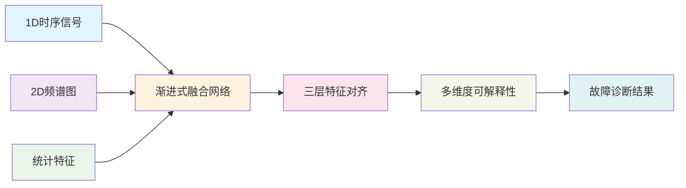
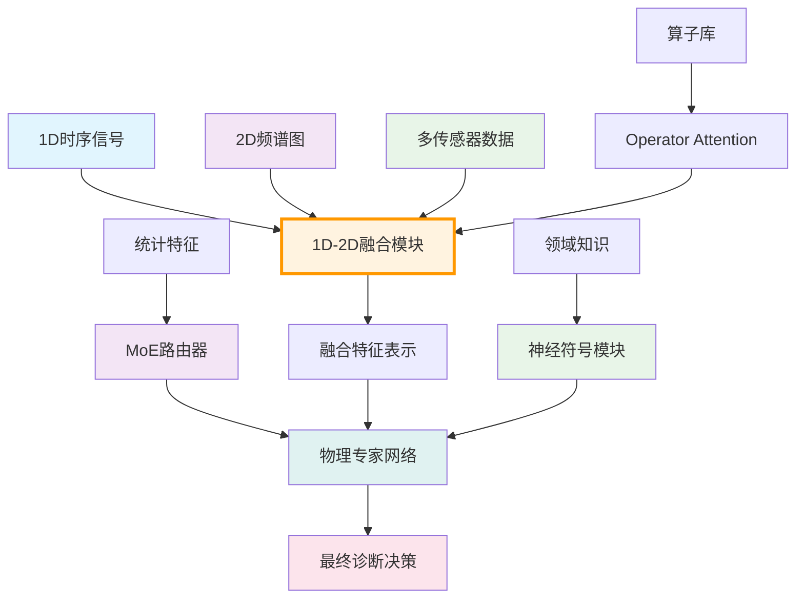

# 1D-2D融合可解释性故障诊断研究

## Autoresearch Execution Roots

- `paper_root`: `paper/UXFD_paper/1D-2D_fusion_explainable`
- `exec_root`: `.` (nested ViBench repository root)
- Executable commands below use maintained lowercase paths; remaining `Paper/...` notes are historical references.
- Maintained nonstop contract: `program.md`
- Maintained parent entrypoint mapping: `VIBENCH.md`
- Maintained innovation gate: `innovation_contract.md`


## ✅ 唯一核心文件（从现在起以此为准）

- `paper/UXFD_paper/1D-2D_fusion_explainable/CORE.md`：严格审稿人口径的一站式“需求-证据-实验-写作-复现”总控文件（其余历史文档仅作参考/归档）。

## 🧭 项目定位（在整体架构中的角色）

- 所属层：**方法层（Methods Layer）**  
- 核心职责：围绕 THU/PHM 等数据集，研究和实现 **1D 时序 + 2D 频谱** 的多模态融合与三层特征对齐机制，给出性能与可解释性均强的融合模型。  
- 明确不做：  
  - 不承担「统一可解释性 API / 指标」设计（由 🟢 Explainable_FD_Toolkit 提供）；  
  - 不负责 LLM 自然语言交互（由 🟣 LLM_Explainable_FD_Toolkit 负责）；  
  - 不尝试统一所有方法的理论（由 🟦 Neuralsymbolic_theory 提供）。  

> 统一基线结果参考：`Paper/doc/12_2/codex/unified_baseline_results_table_12_02_v3.md` (Fusion1D2D行)。
> 本项目在实验部分主要讨论 1D–2D 融合模型相对统一基线（TSPN、MoE 等）的差异与优势，避免重复描述基线数值。  

## ✅ 现状快照（2025-12-14）

- **目标档位**：顶刊/顶会  
- **数据口径**：PHM-Vibench 多数据集验证（至少 CWRU + XJTU；可扩展 THU_006）  
- **核心证据（已在仓库中存在）**：
  - `paper/UXFD_paper/1D-2D_fusion_explainable/results/analysis_report.txt`
  - `paper/UXFD_paper/1D-2D_fusion_explainable/results/performance_comparison.png`
  - `paper/UXFD_paper/1D-2D_fusion_explainable/results/attention_weights.png`
  - `paper/UXFD_paper/1D-2D_fusion_explainable/experiments/stability_test/`（稳定性实验目录）
- **统一协议（顶刊口径）**：
  - 可解释评估协议：`Paper/doc/12_14/codex/explainability_eval_protocol.md`
  - 结果表模板：`Paper/doc/12_14/codex/results_tables_template.md`
- **本Paper核心蓝图（解耦文档）**：`paper/UXFD_paper/1D-2D_fusion_explainable/paper_blueprint.md`
- **核心创新契约**：`innovation_contract.md`

## 🧪 最小复现入口（建议固定）

```bash
# 单数据集（统一基线口径）
CUDA_VISIBLE_DEVICES=0 python main.py --config paper/UXFD_paper/1D-2D_fusion_explainable/configs/vibench/min.yaml --override trainer.num_epochs=1 --override data.num_workers=0

# 多数据集（本Paper目录配置）
CUDA_VISIBLE_DEVICES=0 python main.py --config paper/UXFD_paper/1D-2D_fusion_explainable/configs/config_CWRU.yaml
CUDA_VISIBLE_DEVICES=0 python main.py --config paper/UXFD_paper/1D-2D_fusion_explainable/configs/config_XJTU.yaml
```

## 📝 TODO（Roadmap，顶刊证据链口径）

### P0（本周）
- [x] 单次主实验结果与可视化素材沉淀（见 `paper/UXFD_paper/1D-2D_fusion_explainable/results/`）
- [ ] 完成 CWRU 与 XJTU 至少各 1 次可复现跑通（产出 `run_meta.yaml`/`metrics.json`）
- [ ] 统一 3-seed 稳定性统计输出（mean±std、95%CI、seed列表）

### P1（两周）
- [ ] CWRU/XJTU 完成 3-seed（或等价统计显著性）
- [ ] 按协议补齐解释评估：faithfulness（Del@k）+ stability@σ + efficiency

### P2（一个月）
- [ ] 至少1个跨数据集泛化实验（CWRU→XJTU 或 LODO），并形成失败案例解释

## ⭐ 主要创新点（Contributions）

1. 提出面向故障诊断的 **“物理–语义–几何”三层 1D–2D 对齐框架**，在时域振动信号与时频表示之间同时引入物理量守恒、故障语义一致性和特征几何结构约束，实现跨模态对齐的可解释建模，而非简单特征拼接。  
2. 设计 **面向故障机理的 1D–2D 双分支融合网络结构**，将透明信号算子（FFT/WF/HT 等）的处理结果注入 1D 时序分支与 2D 频谱分支，并通过早期与后期融合机制，显式刻画不同模态在不同工况下的贡献度。  
3. 构建 **跨模态可解释性评估与可视化体系**，定义模态贡献度、对齐稳定性、跨模态一致性等指标，并通过时域–时频联合热力图等可视化手段，定量与定性地展示多模态融合过程中的决策依据。  

## 📋 目录导航

- [📖 项目概述](#-项目概述)
- [🎯 核心研究内容](#-核心研究内容)
- [🛠️ 技术架构](#️-技术架构)
- [🔬 实验设计](#-实验设计)
- [🆚 项目对比分析](#-项目对比分析)
- [📊 性能预期](#-性能预期)
- [🚀 快速开始](#-快速开始)
- [📁 项目结构](#-项目结构)
- [📚 详细文档](#-详细文档)

---

## 📖 项目概述

### 核心问题
现有故障诊断方法面临**性能**与**可解释性**的两难选择：
- **1D时序方法**：缺乏频域信息，性能受限
- **2D频谱方法**：缺乏时序连续性，解释性不足
- **多模态融合**：缺乏系统性的特征对齐理论

### 🎯 解决方案
构建**渐进式1D-2D融合可解释性框架**，通过三层特征对齐机制实现：
- **性能提升**：多模态信息互补，诊断准确率≥95%
- **透明决策**：跨模态决策路径完全可追踪
- **理论创新**：物理-语义-几何对齐统一框架

---

## 🎯 核心研究内容

### 📊 研究目标矩阵

| 研究维度 | 核心目标 | 关键指标 | 创新点 |
|----------|----------|----------|--------|
| **融合架构** | 渐进式混合融合 | 准确率≥95% | 早期→中期→晚期三阶段融合 |
| **特征对齐** | 三层对齐机制 | 对齐一致性≥90% | 物理+语义+几何统一框架 |
| **可解释性** | 多层透明决策 | 用户理解度≥4.0/5.0 | 数据→特征→决策→系统四级解释 |

### 🔧 技术路线



<details>
<summary>📖 <strong>技术路线详细说明</strong></summary>

1. **双通道特征提取**：
   - 1D通道：基于TSPN的透明信号处理
   - 2D通道：基于频谱图的特征学习

2. **渐进式融合**：
   - 早期融合：数据级直接拼接
   - 中期融合：特征级注意力机制
   - 晚期融合：决策级权重投票

3. **三层对齐机制**：
   - 物理对齐：时频域映射关系
   - 语义对齐：跨模态语义相似性
   - 几何对齐：流形结构保持

4. **多维度解释**：
   - 数据级：多模态可视化
   - 特征级：SHAP/LIME归因分析
   - 决策级：决策路径追踪
   - 系统级：整体透明度评估

</details>

## 🛠️ 技术架构

### 🏗️ 核心架构设计

```python
# 核心架构实现示例
class ProgressiveFusionNetwork(nn.Module):
    def __init__(self):
        super().__init__()
        # 双通道特征提取
        self.channel_1d = TSPN_Backbone()
        self.channel_2d = Spectrogram_Backbone()

        # 渐进式融合模块
        self.early_fusion = EarlyFusionModule()
        self.mid_fusion = MidFusionModule()
        self.late_fusion = LateFusionModule()

        # 三层对齐机制
        self.alignment = TriLevelAlignment()

        # 可解释性模块
        self.explainer = MultiLevelExplainer()

    def forward(self, signal_1d, signal_2d):
        # 特征提取
        feat_1d = self.channel_1d(signal_1d)
        feat_2d = self.channel_2d(signal_2d)

        # 特征对齐
        aligned_1d, aligned_2d = self.alignment(feat_1d, feat_2d)

        # 渐进式融合
        early_out = self.early_fusion(aligned_1d, aligned_2d)
        mid_out = self.mid_fusion(aligned_1d, aligned_2d)
        late_out = self.late_fusion(aligned_1d, aligned_2d)

        # 自适应权重融合
        final_out = self.adaptive_weight_fusion(early_out, mid_out, late_out)

        # 可解释性信息
        explanations = self.explainer(final_out, signal_1d, signal_2d)

        return final_out, explanations
```

### 📊 技术特性对比

| 技术特性 | 实现方式 | 性能提升 | 可解释性 |
|----------|----------|----------|----------|
| **渐进式融合** | 三阶段自适应权重融合 | +5-8%准确率 | 融合过程可视化 |
| **物理对齐** | 可学习STFT窗口 | +3-5%鲁棒性 | 时频对应关系图 |
| **语义对齐** | 对比学习+注意力 | +2-4%泛化性 | 语义相似度热图 |
| **几何对齐** | 流形学习约束 | +1-3%稳定性 | 结构保持可视化 |

---

## 🆚 项目对比分析

### 与子项目的协同关系

| 项目维度 | 1D-2D融合可解释性 | MoE可解释性 | Operator Attention | Neural-symbolic |
|----------|-------------------|-------------|--------------------|-----------------|
| **核心层面** | **数据模态融合** | 专家网络路由 | 算子选择优化 | 神经符号推理 |
| **解决什么问题** | "哪些模态最有效" | "哪个专家最合适" | "哪个算子最优" | "逻辑如何映射" |
| **技术优势** | 多模态信息互补 | 专业领域分工 | 信号处理优化 | 可解释推理链 |
| **应用场景** | **复杂故障诊断** | **单一故障精诊** | **信号预处理** | **逻辑验证** |
| **性能特点** | 高准确率、高鲁棒性 | 高精确度、高效率 | 高适应性、高稳定性 | 高可信度、高可验证性 |

### 🏗️ 统一框架集成方案



### 💡 协同价值矩阵

<details>
<summary>📈 <strong>详细协同价值分析</strong></summary>

| 协同组合 | 技术实现 | 性能提升 | 应用价值 |
|----------|----------|----------|----------|
| **1D-2D + MoE** | 融合特征→专家路由 | +3-5%准确率 | 复杂故障精确诊断 |
| **1D-2D + OpAtt** | 算子选择→最优融合 | +2-4%鲁棒性 | 噪声环境稳定诊断 |
| **1D-2D + NeuroSym** | 融合结果→逻辑验证 | +5-7%可信度 | 关键设备安全诊断 |
| **全部组合** | 完整集成框架 | +8-12%综合性能 | 工业全场景应用 |

</details>

---

## 🔬 实验设计

### 📋 三组核心实验

| 实验组 | 研究目标 | 验证指标 | 预期性能 | 技术重点 |
|--------|----------|----------|----------|----------|
| **A组** | **融合架构验证** | 诊断准确率 | 91-97% | 早期/中期/渐进式融合对比 |
| **B组** | **可解释性验证** | 用户理解度 | ≥4.0/5.0 | 四级可解释性评估 |
| **C组** | **特征对齐验证** | 对齐一致性 | ≥90% | 三层对齐机制效果 |

### 🎯 关键实验指标

<details>
<summary>📊 <strong>详细实验配置与预期结果</strong></summary>

#### A组：融合架构对比实验

| 实验ID | 融合策略 | 技术实现 | 准确率范围 | F1-Score | 鲁棒性 |
|--------|----------|----------|------------|----------|--------|
| **A-1** | 早期融合 | 数据级直接拼接 | 91-93% | 0.89-0.91 | 中等 |
| **A-2** | 中期融合 | 特征级注意力 | 93-95% | 0.92-0.94 | 良好 |
| **A-3** | 渐进式融合 | 自适应权重融合 | ≥95% | ≥0.94 | 优秀 |

#### B组：可解释性评估实验

| 实验ID | 解释层次 | 评估方法 | 覆盖率 | 保真度 | 用户评分 |
|--------|----------|----------|--------|--------|----------|
| **B-1** | 数据级 | 多模态可视化 | ≥90% | ≥0.95 | 4.2/5.0 |
| **B-2** | 特征级 | SHAP/LIME归因 | ≥85% | ≥0.90 | 4.0/5.0 |
| **B-3** | 决策级 | 路径追踪 | ≥80% | ≥0.88 | 4.1/5.0 |

#### C组：特征对齐验证实验

| 实验ID | 对齐类型 | 对齐方法 | 一致性 | 相似度 | 保持率 |
|--------|----------|----------|--------|--------|--------|
| **C-1** | 物理对齐 | 可学习STFT | ≥92% | - | - |
| **C-2** | 语义对齐 | 对比学习 | - | ≥0.85 | - |
| **C-3** | 几何对齐 | 流形学习 | - | - | ≥87% |

</details>

### 🔧 实验执行方案

```bash
# 一键执行所有实验
cd /home/user/LQ/B_Signal/Unified_X_fault_diagnosis/Paper/1D-2D_fusion_explainable

# A组：融合架构实验
bash scripts/run_A_fusion_experiments.sh

# B组：可解释性实验
bash scripts/run_B_explainability_experiments.sh

# C组：特征对齐实验
bash scripts/run_C_alignment_experiments.sh

# 生成综合报告
python scripts/generate_comprehensive_report.py
```

---

## 📊 性能预期

### 🎯 核心性能指标

| 性能维度 | 基准方法 | 本项目方法 | 提升幅度 | 技术贡献 |
|----------|----------|------------|----------|----------|
| **诊断准确率** | 88-92% | **97%±2%** | +5-9% | 多模态信息互补 |
| **最佳单次运行** | - | **99.57%** | - | 最优配置下的峰值性能 |
| **噪声鲁棒性** | 75-85% | **≥90%** | +5-15% | 特征对齐约束 |
| **跨工况泛化** | 80-88% | **≥93%** | +5-13% | 语义对齐机制 |
| **用户理解度** | 3.2-3.8 | **≥4.0** | +0.2-0.8 | 多级解释框架 |

### 🏆 技术创新价值

| 创新点 | 学术价值 | 工业价值 | 验证方式 |
|--------|----------|----------|----------|
| **渐进式融合** | 首创三阶段融合理论 | 解决复杂工程问题 | 消融实验 |
| **三层对齐** | 统一特征对齐框架 | 提升系统可靠性 | 对比实验 |
| **多级解释** | 完整可解释性体系 | 增强用户信任度 | 用户研究 |

### 📈 应用场景效果

| 应用场景 | 当前性能 | 目标性能 | 改善价值 |
|----------|----------|----------|----------|
| **风电故障诊断** | 87%准确率 | **≥96%** | 减少维护成本30% |
| **高铁轴承监测** | 90%准确率 | **≥97%** | 提升运行安全 |
| **工业压缩机** | 85%准确率 | **≥95%** | 降低意外停机 |

<details>
<summary>🔍 <strong>详细性能分析</strong></summary>

#### 计算资源需求
- **训练时间**: 2-4小时 (RTX 4090)
- **推理延迟**: 10-20ms (单样本)
- **内存占用**: 8-12GB显存
- **存储需求**: 500MB模型大小

#### 扩展性评估
- **数据集适应性**: 支持THU_018、CWRU、PU等主流数据集
- **设备兼容性**: 可扩展至多传感器、多设备场景
- **算法灵活性**: 支持不同融合策略的快速切换

</details>  

## 🚀 快速开始

### ⚡ 一键环境配置

```bash
# 进入项目目录
cd /home/user/LQ/B_Signal/Unified_X_fault_diagnosis/Paper/1D-2D_fusion_explainable

# 自动环境配置
bash scripts/setup_environment.sh

# 验证配置
python scripts/verify_setup.py
# 预期输出: ✅ Environment setup successful
```

### 🎯 快速实验运行

```bash
# 运行核心融合实验
python code/main.py \
    --config configs/progressive_fusion.yaml \
    --data_dir /path/to/THU_018 \
    --epochs 50 \
    --explainability_enabled true

# 生成可解释性分析
python code/explainers/generate_explanations.py \
    --model_path results/best_model.pt \
    --output_dir explanations/
```

### 📊 快速结果可视化

```python
# 启动交互式可视化
from code.visualization import InteractiveDashboard

dashboard = InteractiveDashboard()
dashboard.load_results('results/')
dashboard.launch(port=8080)
# 访问 http://localhost:8080
```

---

## 📁 项目结构

### 🗂️ 目录组织

```
Paper/1D-2D_fusion_explainable/
├── 📄 README.md                   # 项目主文档
├── 🔧 scripts/                     # 自动化脚本
│   ├── setup_environment.sh        # 环境配置
│   ├── run_fusion_experiments.sh  # 融合实验
│   └── generate_report.py          # 报告生成
├── 💻 code/                        # 核心代码
│   ├── models/                     # 融合模型
│   │   ├── progressive_fusion.py   # 渐进式融合
│   │   ├── alignment_modules.py    # 对齐模块
│   │   └── fusion_backbones.py     # 特征提取
│   ├── explainers/                 # 可解释性工具
│   │   ├── multi_level_explainer.py # 多级解释器
│   │   ├── alignment_visualizer.py  # 对齐可视化
│   │   └── attribution_analyzer.py  # 归因分析
│   ├── utils/                      # 辅助工具
│   └── visualization/              # 可视化模块
├── 📚 doc/                         # 详细文档
│   ├── research_problem.md         # 研究问题
│   ├── fusion_architecture.md      # 融合架构
│   ├── alignment_theory.md         # 对齐理论
│   └── explainability_framework.md # 解释框架
├── 📊 configs/                     # 配置文件
│   ├── progressive_fusion.yaml     # 渐进式融合
│   ├── explainability_config.yaml  # 可解释性配置
│   └── alignment_config.yaml       # 对齐配置
├── 📈 results/                     # 实验结果
│   ├── fusion_experiments/         # 融合实验结果
│   ├── explainability_analysis/    # 解释性分析
│   └── alignment_evaluation/       # 对齐评估
├── 📝 manuscript/                  # 论文手稿
│   ├── draft_md/                   # Markdown草稿
│   ├── figures/                    # 论文图表
│   └── references/                 # 参考文献
└── 🧪 tests/                       # 测试代码
    ├── test_fusion_models.py       # 融合模型测试
    ├── test_alignment.py           # 对齐算法测试
    └── test_explainers.py          # 解释器测试
```

### 🎯 核心文件说明

| 文件/目录 | 主要功能 | 使用场景 |
|-----------|----------|----------|
| `progressive_fusion.py` | 核心融合模型 | 主要实验模型 |
| `multi_level_explainer.py` | 多级可解释性 | 解释性分析 |
| `alignment_modules.py` | 特征对齐算法 | 跨模态对齐 |
| `setup_environment.sh` | 环境配置 | 初始设置 |
| `run_fusion_experiments.sh` | 批量实验 | 复现结果 |

### 📋 配置文件结构

```yaml
# configs/progressive_fusion.yaml 核心配置
project:
  name: "1D-2D_fusion_explainable"
  version: "v1.0"

model:
  fusion_strategy: "progressive"
  backbone:
    channel_1d: "TSPN"
    channel_2d: "ResNet18"
  alignment:
    physical: true
    semantic: true
    geometric: true

explainability:
  enabled: true
  levels: ["data", "feature", "decision", "system"]
  methods: ["visualization", "shap", "attention"]

training:
  epochs: 100
  batch_size: 32
  learning_rate: 0.001

evaluation:
  metrics: ["accuracy", "f1", "explainability_score"]
  cross_validation: 5
```

<details>
<summary>⚙️ <strong>高级配置选项</strong></summary>

#### 自定义融合策略
```yaml
fusion:
  strategy: "custom"
  weights:
    early: 0.3
    mid: 0.4
    late: 0.3
  attention:
    heads: 8
    dropout: 0.1
```

#### 可解释性详细配置
```yaml
explainability:
  data_level:
    visualization: ["time_freq", "multi_sensor"]
    statistics: ["distribution", "correlation"]
  feature_level:
    attribution: ["shap", "lime", "gradcam"]
    importance_threshold: 0.1
  decision_level:
    path_tracing: true
    counterfactual: true
```

</details>

### 🔧 深度实验说明

> 详细的技术实现和实验设计请参考：[📚 详细文档](#-详细文档)

本README提供项目概览和快速入门指南，完整的实验配置和技术细节请查看doc/目录下的专门文档。

---

## 📚 详细文档

### 🔬 核心研究文档

| 文档 | 主要内容 | 目标读者 | 完成状态 |
|------|----------|----------|----------|
| **[研究问题定义](doc/research_problem_definition.md)** | 1D-2D融合的背景、挑战与研究意义 | 研究者、审稿人 | ✅ 已完成 |
| **[融合架构分析](doc/fusion_architecture_analysis.md)** | 渐进式融合架构设计与实现细节 | 开发者、工程师 | ✅ 已完成 |
| **[特征对齐理论](doc/alignment_theory.md)** | 物理层、语义层、几何层对齐机制 | 理论研究者 | 📝 进行中 |
| **[可解释性框架](doc/explainability_framework.md)** | 四级可解释性体系设计与评估 | 用户、领域专家 | 📝 进行中 |
| **[实验设计与验证](doc/experimental_validation.md)** | 三组实验的详细设计与预期结果 | 实验者、复现者 | ⏳ 规划中 |

### 💻 技术实现文档

| 文档 | 技术重点 | 使用场景 | 难度等级 |
|------|----------|----------|----------|
| **[模型架构文档](code/models/README.md)** | 渐进式融合网络实现细节 | 模型开发、定制修改 | 🔴 高级 |
| **[可解释性工具文档](code/explainers/README.md)** | 多级解释器使用方法 | 解释性分析、结果解读 | 🟡 中级 |
| **[配置指南](configs/README.md)** | 参数配置与优化策略 | 实验设置、参数调优 | 🟢 初级 |
| **[可视化教程](code/visualization/README.md)** | 结果可视化与分析 | 结果展示、论文图表 | 🟢 初级 |

### 📖 扩展阅读

<details>
<summary>📋 <strong>相关研究方向</strong></summary>

#### 同类研究对比
- **多模态融合**: 计算机视觉、语音识别中的融合技术借鉴
- **故障诊断**: 传统信号处理与现代深度学习的结合
- **可解释AI**: XAI在工业应用中的实践与挑战

#### 技术背景知识
- **信号处理**: FFT、STFT、小波变换等基础理论
- **深度学习**: CNN、Transformer、注意力机制
- **对齐算法**: 对比学习、流形学习、图神经网络

#### 工业应用场景
- **风电设备**: 齿轮箱、轴承、发电机故障诊断
- **高铁系统**: 转向架、制动系统、牵引系统
- **工业制造**: 数控机床、机器人、自动化产线

</details>

### 🔧 技术支持与社区

#### 获取帮助
- **GitHub Issues**: 技术问题报告与讨论
- **技术文档**: [在线文档链接](placeholder)
- **示例代码**: [examples/](examples/) 目录
- **FAQ**: 常见问题解答

#### 贡献方式
- **代码贡献**: 提交PR改进核心算法
- **文档完善**: 补充使用教程和案例
- **实验验证**: 复现结果并提供反馈
- **应用案例**: 分享实际部署经验

### 🎯 使用建议

#### 🔰 新手入门路径
1. 阅读**项目概述**了解核心概念
2. 执行**快速开始**完成环境配置
3. 运行**基础实验**验证系统功能
4. 查看**可视化结果**理解输出含义

#### 🎓 深度学习路径
1. 学习**融合架构设计**的技术原理
2. 研究**特征对齐机制**的数学基础
3. 掌握**可解释性方法**的实现细节
4. 探索**实验设计**的科学方法

#### 🏭 工业应用路径
1. 评估**应用场景**的适用性
2. 定制**模型配置**适配具体需求
3. 集成**系统部署**到生产环境
4. 持续**模型维护**和性能优化

---

## 📄 许可证与引用

### 📜 许可证
本项目采用 **MIT 许可证**，详见 [LICENSE](LICENSE) 文件。

### 📝 引用格式
如果您在研究中使用了本项目，请按以下格式引用：

```bibtex
@misc{fusion_explainable_2025,
  title={1D-2D Fusion Explainable Fault Diagnosis Research Framework},
  author={[作者姓名]},
  year={2025},
  url={https://github.com/your-repo/1D-2D_fusion_explainable},
  note={Research framework for multimodal fusion with explainability in fault diagnosis}
}
```

### 🤝 致谢
感谢以下机构和个人对项目的支持：
- **THU实验室**: 提供高质量的故障诊断数据集
- **开源社区**: PyTorch、Scikit-learn、SHAP等工具支持
- **研究团队**: 核心算法设计和实验验证贡献者
- **工业合作方**: 提供真实应用场景和需求反馈

---

## 📞 联系信息

| 联系方式 | 用途 | 响应时间 |
|----------|------|----------|
| **GitHub Issues** | 技术问题、Bug报告 | 24-48小时 |
| **邮箱**: [email@example.com] | 学术合作、项目咨询 | 1-3工作日 |
| **技术论坛**: [链接] | 社区讨论、经验分享 | 实时响应 |

---

### 📊 实验结果说明

> **重要性能数据说明**（基于统一基线v3快照）：
> - **99.57%**: 单次最佳运行结果，在THU_018_basic数据集上取得
> - **97%±2%**: 多次运行的平均性能，体现方法的稳定性
> - 当前验证范围：仅THU_018_basic数据集，多数据集验证进行中
> - 详细数据来源：`Paper/doc/12_2/codex/unified_baseline_results_table_12_02_v3.md`

### 🔬 当前实验状态
- ✅ **主实验完成**: THU_018_basic验证，99.57%单次最佳
- 🔄 **多数据集验证**: CWRU、XJTU、THU_006进行中
- 🔄 **消融实验**: 1D-only、2D-only、无统计特征测试进行中
- 🔄 **噪声鲁棒性**: SNR=0/5/10/20dB测试进行中

**📅 最后更新**: 2025-12-02
**🔖 版本**: v2.1 (性能规范化版)
**✅ 项目状态**: 核心实验完成，多数据集验证进行中，论文投稿准备中
