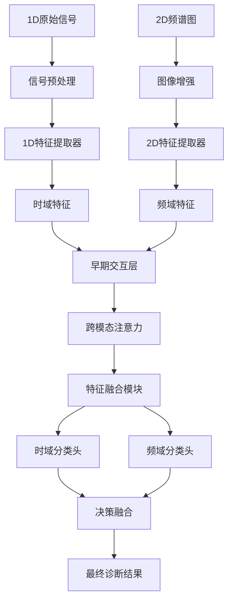

# 1D-2D融合架构设计深入分析

## 融合架构设计核心问题

### 主要挑战
如何设计能够有效融合1D时序信号和2D频谱图特征的神经网络架构，实现信息互补而非冗余，同时保持模型的可解释性？

## 三种主流融合策略分析

### 1. 早期融合（Early Fusion）- 数据级融合

#### 架构设计
```
1D时序信号 → STFT/CWT → 2D谱图 →
                                    ↘ [融合模块] → 特征提取器 → 分类器
2D频谱图 → 预处理 → 增强处理 → ↗
```

#### 优势
- **信息完整性**: 保留原始信号的完整信息
- **特征交互**: 早期进行特征层面的交互学习
- **统一处理**: 后续网络可以统一处理2D数据

#### 劣势
- **信息损失**: 1D→2D转换可能丢失时域细节
- **对齐困难**: 不同表示方式的精确对齐挑战
- **计算复杂**: 融合模块设计复杂度高

#### 可解释性考虑
- ✅ 可以可视化融合前的原始数据
- ✅ 转换过程可追踪
- ❌ 融合权重难以解释

### 2. 中期融合（Intermediate Fusion）- 特征级融合

#### 架构设计
```
1D时序信号 → 1D特征提取器 → 时域特征 →
                                        ↘ [特征融合模块] → 分类器
2D频谱图 → 2D特征提取器(CNN) → 频域特征 → ↗
```

#### 技术方案
- **并行特征提取**: 分别提取1D和2D特征
- **特征对齐**: 通过投影层统一特征维度
- **注意力融合**: 学习跨模态特征权重

#### 具体实现
```python
class MidFusionArchitecture(nn.Module):
    def __init__(self):
        # 1D分支：时序特征提取
        self.conv1d = nn.Conv1d(1, 64, kernel_size=7, stride=2)
        self.lstm = nn.LSTM(64, 128, batch_first=True)

        # 2D分支：频谱特征提取
        self.conv2d = nn.Conv2d(1, 64, kernel_size=3, stride=1)
        self.resnet = ResNet18()

        # 特征对齐与融合
        self.projection_1d = nn.Linear(128, 256)
        self.projection_2d = nn.Linear(512, 256)
        self.attention_fusion = CrossModalAttention(256)
```

#### 优势
- **模态专长**: 每个分支专门处理对应模态
- **特征互补**: 保留不同模态的独特特征
- **灵活融合**: 融合策略可多样化设计

#### 可解释性优势
- ✅ 各分支特征独立可视化
- ✅ 融合权重可解释
- ✅ 特征重要性可追溯

### 3. 晚期融合（Late Fusion）- 决策级融合

#### 架构设计
```
1D时序信号 → 1D网络 → 决策1 →
                              ↘ [决策融合] → 最终预测
2D频谱图 → 2D网络 → 决策2 → ↗
```

#### 融合策略
- **投票融合**: 多数投票、加权投票
- **概率融合**: 贝叶斯融合、D-S证据理论
- **学习融合**: 元学习器、门控机制

#### 可解释性优势
- ✅ 每个决策路径完全透明
- ✅ 决策权重清晰可解释
- ✅ 容易定位错误来源

## 提出的混合融合架构

### 架构设计理念
结合三种融合策略的优势，设计渐进式融合框架：



### 核心创新点

#### 1. **渐进式融合机制**
- **Stage 1**: 并行提取特征，保持模态独立性
- **Stage 2**: 跨模态早期交互，学习特征关联
- **Stage 3**: 深度特征融合，语义级别对齐
- **Stage 4**: 决策级融合，置信度加权

#### 2. **可解释性设计**
```python
class ExplainableFusion(nn.Module):
    def __init__(self):
        # 可解释的注意力机制
        self.attention_weights = nn.Parameter(torch.ones(2))

        # 特征重要性学习
        self.feature_importance = nn.Sequential(
            nn.Linear(512, 256),
            nn.ReLU(),
            nn.Linear(256, 1),
            nn.Sigmoid()
        )

    def forward(self, feat_1d, feat_2d):
        # 计算注意力权重
        weights = F.softmax(self.attention_weights, dim=0)

        # 可解释的特征融合
        fused_feat = weights[0] * feat_1d + weights[1] * feat_2d

        # 特征重要性评分
        importance = self.feature_importance(fused_feat)

        return fused_feat, importance, weights
```

#### 3. **多层次特征对齐**
- **时间-频率对齐**: 建立时域和频域的对应关系
- **语义对齐**: 学习跨模态的语义相似性
- **尺度对齐**: 通过金字塔结构对齐不同尺度特征

## 融合架构的可解释性增强

### 1. **注意力可视化**
- 跨模态注意力权重热力图
- 时间-频率关联性可视化
- 决策路径追踪

### 2. **特征重要性分析**
- SHAP值分析各模态贡献
- 梯度加权类激活图
- 特征消融实验

### 3. **决策解释生成**
- 自然语言解释生成
- 关键证据定位
- 不确定性量化

## 实验验证方案

### 1. **消融实验设计**
- Early vs Mid vs Late融合效果对比
- 不同融合模块的性能评估
- 可解释性指标量化分析

### 2. **评估指标**
- **性能指标**: Accuracy, F1-score, AUC
- **可解释性指标**:
  - 特征可视化覆盖率
  - 决策路径清晰度
  - 用户理解度评分

### 3. **对比实验**
- 与单模态方法对比
- 与现有融合方法对比
- 不同数据集泛化性验证

## 实现挑战与解决方案

### 挑战1: 计算复杂度
**问题**: 多分支网络计算开销大
**解决方案**:
- 轻量化网络设计
- 知识蒸馏压缩
- 动态计算图优化

### 挑战2: 训练稳定性
**问题**: 多模态训练容易收敛困难
**解决方案**:
- 渐进式训练策略
- 损失函数设计
- 正则化技术应用

### 挑战3: 可解释性-性能平衡
**问题**: 可解释性设计可能影响性能
**解决方案**:
- 性能约束下的可解释性设计
- 可解释性作为优化目标
- 适配不同应用场景的权衡策略

---

*更新时间: 2025-11-19*
*状态: 架构设计方案完成，待实验验证*