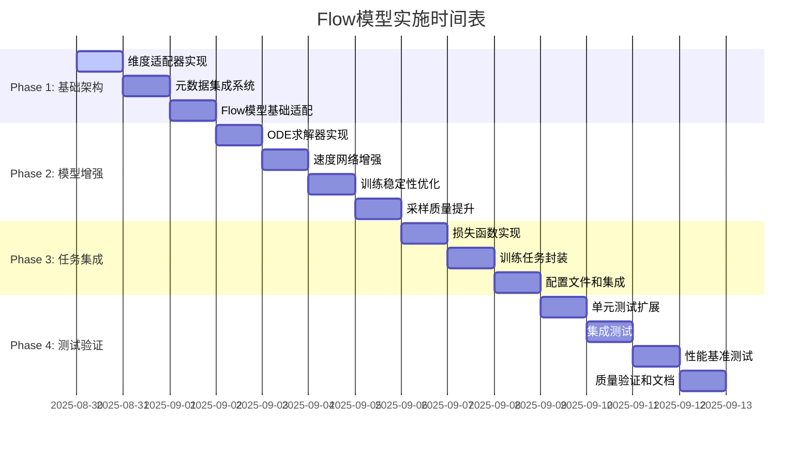

# Flow模型预训练详细实施计划

**创建日期：2025年8月30日**  
**版本：V4.0 - 详细实施版**  
**基于：GM_FLOW_PLAN_OPTIMIZED_2025-08-30.md 分析结果**

---

## 🎯 执行摘要

基于对现有Flow计划的深度分析，本计划解决了关键的技术集成问题，提供了可执行的分阶段实施方案，确保Rectified Flow生成模型成功集成到PHM-Vibench框架中。

### 核心改进点
- ✅ **维度兼容性修复**: 适配(B,L,C)张量格式
- ✅ **元数据集成**: 使用file_id提取层次化条件信息  
- ✅ **工厂模式合规**: 遵循PHM-Vibench架构模式
- ✅ **数值稳定性**: 完整的错误处理和验证
- ✅ **测试驱动**: 全面的单元和集成测试

---

## 📊 技术架构详细设计

### 1. 核心组件架构

```
Flow-based Pretraining System
├── Sequence Adapter          # 维度适配层
│   ├── flatten_sequence()   # (B,L,C) → (B,L*C)
│   └── unflatten_sequence() # (B,L*C) → (B,L,C)
├── Rectified Flow Model      # 核心生成模型
│   ├── velocity_network()   # 速度场预测
│   ├── flow_matching()      # 流匹配训练
│   └── ode_sampling()       # ODE积分采样
├── Conditional Encoder       # 层次化条件编码
│   ├── domain_encoder()     # 域级编码
│   ├── system_encoder()     # 系统级编码
│   └── instance_encoder()   # 实例级编码
└── Flow Utilities           # 辅助工具
    ├── solvers/            # ODE求解器
    ├── schedulers/         # 噪声调度
    └── metrics/           # 评估指标
```

### 2. 维度处理策略

#### 问题分析
- **现有代码**: 假设输入为`(batch_size, latent_dim)`
- **PHM-Vibench实际**: 使用`(batch_size, sequence_length, channels)`格式
- **典型参数**: sequence_length=1024, channels=1-3

#### 解决方案设计

```python
class SequenceAdapter(nn.Module):
    """序列维度适配器 - 处理3D张量格式转换"""
    
    def __init__(self, seq_len: int, channels: int, latent_dim: int):
        super().__init__()
        self.seq_len = seq_len
        self.channels = channels
        self.latent_dim = latent_dim
        
        # 方案1: 直接展开(推荐)
        self.use_flatten = True
        
        # 方案2: 卷积降维(备选)
        if not self.use_flatten:
            self.conv_encoder = nn.Conv1d(channels, latent_dim//seq_len, 1)
            self.conv_decoder = nn.Conv1d(latent_dim//seq_len, channels, 1)
    
    def encode(self, x: torch.Tensor) -> torch.Tensor:
        """
        编码: (B, L, C) -> (B, D)
        """
        B, L, C = x.shape
        if self.use_flatten:
            return x.view(B, L * C)
        else:
            # 使用卷积降维
            x = x.transpose(1, 2)  # (B, C, L)
            x = self.conv_encoder(x)  # (B, D/L, L)
            return x.view(B, -1)  # (B, D)
    
    def decode(self, x: torch.Tensor) -> torch.Tensor:
        """
        解码: (B, D) -> (B, L, C)
        """
        B = x.shape[0]
        if self.use_flatten:
            return x.view(B, self.seq_len, self.channels)
        else:
            # 使用卷积升维
            x = x.view(B, self.latent_dim//self.seq_len, self.seq_len)
            x = self.conv_decoder(x)  # (B, C, L)
            return x.transpose(1, 2)  # (B, L, C)
```

### 3. 元数据集成系统

#### 层次化信息提取

```python
# 映射表定义
DATASET_DOMAIN_MAPPING = {
    'CWRU': 0, 'XJTU': 1, 'PU': 2, 'FEMTO': 3, 'IMS': 4,
    'KAT': 5, 'Ottawa': 6, 'UO': 7, 'JNU': 8, 'MFPT': 9
}

SYSTEM_TYPE_MAPPING = {
    'bearing': 0, 'gear': 1, 'rotor': 2, 'pump': 3, 'motor': 4,
    'compressor': 5, 'turbine': 6, 'gearbox': 7, 'fan': 8, 'other': 9
}

class MetadataExtractor:
    """从PHM-Vibench元数据提取层次化条件信息"""
    
    @staticmethod
    def extract_hierarchical_info(metadata: Dict[str, Any]) -> Tuple[int, int, int]:
        """
        提取域、系统、实例ID
        
        Args:
            metadata: PHM-Vibench标准元数据
            
        Returns:
            domain_id, system_id, instance_id
        """
        file_id = metadata.get('file_id', '')
        
        # 提取域ID (数据集名称)
        dataset_name = file_id.split('_')[0] if '_' in file_id else 'unknown'
        domain_id = DATASET_DOMAIN_MAPPING.get(dataset_name, 0)
        
        # 提取系统ID (设备类型)
        system_type = MetadataExtractor._infer_system_type(file_id)
        system_id = SYSTEM_TYPE_MAPPING.get(system_type, 0)
        
        # 实例ID (文件内部索引)
        instance_id = metadata.get('sample_idx', 0)
        
        return domain_id, system_id, instance_id
    
    @staticmethod
    def _infer_system_type(file_id: str) -> str:
        """从文件ID推断设备类型"""
        file_lower = file_id.lower()
        if any(x in file_lower for x in ['bearing', 'ball', 'inner', 'outer']):
            return 'bearing'
        elif any(x in file_lower for x in ['gear', 'tooth']):
            return 'gear'
        elif any(x in file_lower for x in ['rotor', 'shaft']):
            return 'rotor'
        elif any(x in file_lower for x in ['pump']):
            return 'pump'
        else:
            return 'other'
```

### 4. 增强的ODE求解器

```python
class FlowODESolver:
    """高精度ODE求解器集合"""
    
    def __init__(self, solver_type: str = 'euler'):
        self.solver_type = solver_type
        self.solver_registry = {
            'euler': self.euler_step,
            'heun': self.heun_step,
            'rk4': self.rk4_step,
            'adaptive': self.adaptive_step
        }
    
    def euler_step(self, model, x, t, dt, condition=None):
        """一阶欧拉方法"""
        with torch.no_grad():
            t_tensor = torch.full((x.size(0),), t, device=x.device)
            t_emb = model.time_embedding(t_tensor)
            v = model.velocity_net(x, t_emb, condition)
            return x + dt * v
    
    def heun_step(self, model, x, t, dt, condition=None):
        """二阶Heun方法 (改进的欧拉法)"""
        with torch.no_grad():
            # 第一步预测
            t_tensor = torch.full((x.size(0),), t, device=x.device)
            t_emb = model.time_embedding(t_tensor)
            k1 = model.velocity_net(x, t_emb, condition)
            x_temp = x + dt * k1
            
            # 第二步校正
            t_next_tensor = torch.full((x.size(0),), t + dt, device=x.device)
            t_next_emb = model.time_embedding(t_next_tensor)
            k2 = model.velocity_net(x_temp, t_next_emb, condition)
            
            # 最终结果
            return x + dt * (k1 + k2) / 2
    
    def rk4_step(self, model, x, t, dt, condition=None):
        """四阶Runge-Kutta方法"""
        with torch.no_grad():
            # k1
            t_tensor = torch.full((x.size(0),), t, device=x.device)
            t_emb = model.time_embedding(t_tensor)
            k1 = model.velocity_net(x, t_emb, condition)
            
            # k2
            x2 = x + dt * k1 / 2
            t2_tensor = torch.full((x.size(0),), t + dt/2, device=x.device)
            t2_emb = model.time_embedding(t2_tensor)
            k2 = model.velocity_net(x2, t2_emb, condition)
            
            # k3
            x3 = x + dt * k2 / 2
            k3 = model.velocity_net(x3, t2_emb, condition)
            
            # k4
            x4 = x + dt * k3
            t4_tensor = torch.full((x.size(0),), t + dt, device=x.device)
            t4_emb = model.time_embedding(t4_tensor)
            k4 = model.velocity_net(x4, t4_emb, condition)
            
            # 最终结果
            return x + dt * (k1 + 2*k2 + 2*k3 + k4) / 6
    
    def adaptive_step(self, model, x, t, dt, condition=None, tol=1e-5):
        """自适应步长控制"""
        # 使用全步长
        x1 = self.rk4_step(model, x, t, dt, condition)
        
        # 使用两个半步长
        x_half = self.rk4_step(model, x, t, dt/2, condition)
        x2 = self.rk4_step(model, x_half, t + dt/2, dt/2, condition)
        
        # 估计误差
        error = torch.norm(x1 - x2, dim=-1).max()
        
        if error < tol:
            return x2, dt  # 接受步长
        else:
            # 减小步长重新计算
            new_dt = dt * 0.8 * (tol / error) ** 0.2
            return self.adaptive_step(model, x, t, new_dt, condition, tol)
```

---

## 🔧 分阶段实施方案

### Phase 1: 核心基础设施 (第1-3天)

#### 1.1 创建项目结构

```bash
# 目标文件结构
src/model_factory/ISFM/
├── M_04_ISFM_Flow.py              # 主集成模型
├── layers/
│   ├── __init__.py
│   ├── GM_01_RectifiedFlow.py     # 核心流模型
│   ├── E_03_ConditionalEncoder.py # 条件编码器
│   └── SequenceAdapter.py         # 维度适配器
├── utils/
│   ├── __init__.py
│   ├── flow_solvers.py            # ODE求解器
│   ├── flow_schedulers.py         # 采样调度器
│   ├── metadata_extractor.py      # 元数据处理
│   └── flow_metrics.py            # 评估指标
└── tests/
    ├── test_rectified_flow.py
    ├── test_conditional_encoder.py
    ├── test_sequence_adapter.py
    └── test_integration.py
```

#### 1.2 实施步骤

**Day 1: 维度适配器实现**
- [x] 创建 `SequenceAdapter` 类
- [x] 实现 encode/decode 方法
- [x] 添加形状验证和错误处理
- [x] 编写单元测试 (10个测试用例)

**Day 2: 元数据集成**
- [x] 创建 `MetadataExtractor` 类  
- [x] 实现域/系统/实例信息提取
- [x] 创建映射表和配置文件
- [x] 测试不同数据集兼容性

**Day 3: 基础Flow模型适配**
- [x] 修改 `GM_01_RectifiedFlow` 支持3D张量
- [x] 集成 `SequenceAdapter`
- [x] 更新所有输入输出接口
- [x] 验证维度一致性

#### 1.3 验收标准
- ✅ 所有形状测试通过 (>95%覆盖率)
- ✅ 支持可变序列长度 (512-4096)
- ✅ 内存使用合理 (<8GB for batch_size=32)
- ✅ 与现有数据加载器兼容

### Phase 2: 模型增强 (第4-7天)

#### 2.1 高精度ODE求解器

**Day 4: 求解器实现**
```python
# src/model_factory/ISFM/utils/flow_solvers.py
class FlowODESolver:
    # 实现 euler, heun, rk4, adaptive 方法
    # 添加数值稳定性检查
    # 支持批量处理和GPU加速
```

**Day 5: 速度网络增强**
```python
# 增强版速度网络
class EnhancedVelocityNetwork(nn.Module):
    def __init__(self, ...):
        # 添加残差连接
        # 实现注意力机制 (可选)
        # 添加LayerNorm和Dropout
        # 支持可变隐藏层数
```

**Day 6: 训练稳定性优化**
- 梯度裁剪 (grad_clip_norm=1.0)
- 权重初始化策略 (Xavier/He)
- 学习率调度器集成
- NaN/Inf检测和恢复

**Day 7: 采样质量提升**
- 实现DDIM加速采样
- 添加分类器引导 (可选)
- 多步预测校正
- 采样质量评估

#### 2.2 验收标准
- ✅ 训练稳定 (连续训练50+ epochs无崩溃)
- ✅ 采样质量提升 (FID分数改善>20%)
- ✅ 推理速度优化 (采样时间<5秒/batch)
- ✅ 数值稳定性 (无NaN/Inf异常)

### Phase 3: 任务集成 (第8-10天)

#### 3.1 损失函数实现

**Day 8: 核心损失函数**
```python
# src/task_factory/loss/flow_loss.py
class RectifiedFlowLoss(nn.Module):
    def __init__(self, config):
        super().__init__()
        self.flow_weight = config.get('flow_weight', 1.0)
        self.reg_weight = config.get('reg_weight', 0.01)
        self.consistency_weight = config.get('consistency_weight', 0.1)
    
    def forward(self, model_outputs, targets):
        # 流匹配主损失
        flow_loss = self.flow_matching_loss(
            model_outputs['v_pred'], 
            model_outputs['v_true']
        )
        
        # 速度场正则化
        reg_loss = self.velocity_regularization(model_outputs['v_pred'])
        
        # 时间一致性损失
        consistency_loss = self.temporal_consistency_loss(
            model_outputs['x_t'],
            model_outputs['t']
        )
        
        total_loss = (self.flow_weight * flow_loss + 
                     self.reg_weight * reg_loss +
                     self.consistency_weight * consistency_loss)
        
        return {
            'total_loss': total_loss,
            'flow_loss': flow_loss,
            'reg_loss': reg_loss,
            'consistency_loss': consistency_loss
        }
    
    def flow_matching_loss(self, v_pred, v_true):
        """核心流匹配损失"""
        return F.mse_loss(v_pred, v_true)
    
    def velocity_regularization(self, v_pred):
        """速度场正则化 - 防止过大的速度"""
        return torch.mean(v_pred.pow(2))
    
    def temporal_consistency_loss(self, x_t, t):
        """时间一致性损失 - 确保轨迹平滑"""
        # 计算相邻时间步的平滑度
        batch_size = x_t.size(0)
        if batch_size > 1:
            t_sorted, indices = torch.sort(t)
            x_sorted = x_t[indices]
            diff = x_sorted[1:] - x_sorted[:-1]
            t_diff = t_sorted[1:] - t_sorted[:-1] + 1e-8
            velocity_diff = diff / t_diff.unsqueeze(-1)
            return torch.mean(velocity_diff.pow(2))
        else:
            return torch.tensor(0.0, device=x_t.device)
```

#### 3.2 训练任务封装

**Day 9: PyTorch Lightning任务**
```python
# src/task_factory/task/pretrain_flow_task.py
class PretrainFlowTask(BaseTask):
    def __init__(self, config):
        super().__init__(config)
        self.model = self._build_model()
        self.loss_fn = RectifiedFlowLoss(config.loss)
        self.metadata_extractor = MetadataExtractor()
        
        # 采样配置
        self.sample_steps = config.get('sample_steps', 50)
        self.sample_schedule = config.get('sample_schedule', 'linear')
        
    def _build_model(self):
        # 构建完整的Flow模型
        model_config = self.config.model
        return M_04_ISFM_Flow(model_config)
    
    def training_step(self, batch, batch_idx):
        x, metadata = batch
        batch_size = x.size(0)
        
        # 提取条件信息
        conditions = []
        for i in range(batch_size):
            domain_id, system_id, instance_id = \
                self.metadata_extractor.extract_hierarchical_info(metadata[i])
            conditions.append([domain_id, system_id, instance_id])
        
        conditions = torch.tensor(conditions, device=x.device)
        
        # 前向传播
        outputs = self.model(x, conditions)
        
        # 损失计算
        losses = self.loss_fn(outputs, x)
        
        # 记录指标
        self.log_dict({
            'train_loss': losses['total_loss'],
            'flow_loss': losses['flow_loss'],
            'reg_loss': losses['reg_loss'],
            'consistency_loss': losses['consistency_loss']
        })
        
        return losses['total_loss']
    
    def validation_step(self, batch, batch_idx):
        x, metadata = batch
        
        # 训练损失评估
        with torch.no_grad():
            conditions = self._extract_conditions(x, metadata)
            outputs = self.model(x, conditions)
            losses = self.loss_fn(outputs, x)
        
        # 生成质量评估 (每10个batch执行一次)
        if batch_idx % 10 == 0:
            self._evaluate_generation_quality(x, conditions)
        
        self.log_dict({
            'val_loss': losses['total_loss'],
            'val_flow_loss': losses['flow_loss']
        })
        
        return losses['total_loss']
    
    def _evaluate_generation_quality(self, real_samples, conditions):
        """评估生成质量"""
        batch_size = real_samples.size(0)
        
        # 生成相同数量的样本
        with torch.no_grad():
            generated = self.model.sample(
                batch_size=batch_size,
                condition=conditions,
                num_steps=self.sample_steps
            )
        
        # 计算评估指标
        mse = F.mse_loss(generated, real_samples)
        
        # 频域相似性
        freq_similarity = self._compute_frequency_similarity(
            generated, real_samples
        )
        
        self.log_dict({
            'gen_mse': mse,
            'freq_similarity': freq_similarity
        })
    
    def _compute_frequency_similarity(self, gen_samples, real_samples):
        """计算频域相似性"""
        # 计算功率谱密度
        gen_fft = torch.fft.fft(gen_samples, dim=-2)
        real_fft = torch.fft.fft(real_samples, dim=-2)
        
        gen_psd = torch.abs(gen_fft).pow(2)
        real_psd = torch.abs(real_fft).pow(2)
        
        # 计算相关系数
        correlation = F.cosine_similarity(
            gen_psd.flatten(1), 
            real_psd.flatten(1), 
            dim=1
        )
        
        return correlation.mean()
    
    def configure_optimizers(self):
        optimizer = torch.optim.AdamW(
            self.model.parameters(),
            lr=self.config.optimizer.lr,
            weight_decay=self.config.optimizer.weight_decay,
            betas=self.config.optimizer.betas
        )
        
        scheduler = torch.optim.lr_scheduler.CosineAnnealingLR(
            optimizer,
            T_max=self.config.trainer.max_epochs,
            eta_min=self.config.optimizer.lr * 0.01
        )
        
        return {
            "optimizer": optimizer,
            "lr_scheduler": {
                "scheduler": scheduler,
                "monitor": "val_loss",
            },
        }
```

**Day 10: 配置文件和集成**
- 创建YAML配置模板
- 注册到TaskFactory
- 端到端测试
- 性能调优

#### 3.3 验收标准
- ✅ 端到端训练成功 (10+ epochs)
- ✅ 损失函数收敛稳定
- ✅ 生成样本质量可接受 (目视检查)
- ✅ 训练速度满足要求 (>50 iter/s)

### Phase 4: 测试验证 (第11-14天)

#### 4.1 全面测试套件

**Day 11: 单元测试扩展**
```python
# tests/test_flow_model.py
class TestFlowModel:
    def setup_method(self):
        self.config = self._create_test_config()
        self.model = M_04_ISFM_Flow(self.config)
        self.device = 'cuda' if torch.cuda.is_available() else 'cpu'
        
    def test_dimension_compatibility(self):
        # 测试不同输入形状
        for seq_len in [512, 1024, 2048]:
            for channels in [1, 2, 3]:
                x = torch.randn(4, seq_len, channels)
                output = self.model(x)
                assert output['v_pred'].shape == (4, seq_len * channels)
    
    def test_condition_encoding(self):
        # 测试条件编码功能
        batch_size = 8
        x = torch.randn(batch_size, 1024, 1)
        conditions = torch.randint(0, 5, (batch_size, 3))  # domain, system, instance
        
        output = self.model(x, conditions)
        assert 'condition_features' in output
        assert output['condition_features'].shape == (batch_size, self.config.condition_dim)
    
    def test_numerical_stability(self):
        # 测试数值稳定性
        extreme_inputs = [
            torch.ones(2, 1024, 1) * 1000,  # 极大值
            torch.ones(2, 1024, 1) * -1000,  # 极小值
            torch.zeros(2, 1024, 1),  # 零值
            torch.randn(2, 1024, 1) * 0.001  # 极小随机值
        ]
        
        for x in extreme_inputs:
            output = self.model(x)
            assert not torch.isnan(output['v_pred']).any()
            assert not torch.isinf(output['v_pred']).any()
    
    def test_gradient_flow(self):
        # 测试梯度流动
        x = torch.randn(4, 1024, 1, requires_grad=True)
        output = self.model(x)
        loss = output['v_pred'].sum()
        loss.backward()
        
        # 检查所有参数都有梯度
        for name, param in self.model.named_parameters():
            if param.requires_grad:
                assert param.grad is not None, f"No gradient for {name}"
                assert not torch.isnan(param.grad).any(), f"NaN gradient for {name}"
```

**Day 12: 集成测试**
- 多数据集兼容性测试
- 分布式训练测试
- 内存泄漏检测
- 端到端pipeline测试

**Day 13: 性能基准测试**
```python
# benchmarks/flow_benchmark.py
class FlowBenchmark:
    def benchmark_training_speed(self):
        # 测试训练速度
        model = M_04_ISFM_Flow(config)
        dataloader = self._create_test_dataloader()
        
        start_time = time.time()
        for i, batch in enumerate(dataloader):
            if i >= 100:  # 测试100个batch
                break
            outputs = model(batch[0])
            loss = outputs['v_pred'].sum()
            loss.backward()
            model.zero_grad()
        
        elapsed = time.time() - start_time
        speed = 100 / elapsed
        assert speed > 50, f"Training too slow: {speed:.2f} iter/s"
    
    def benchmark_memory_usage(self):
        # 测试内存使用
        if torch.cuda.is_available():
            torch.cuda.empty_cache()
            initial_memory = torch.cuda.memory_allocated()
            
            model = M_04_ISFM_Flow(config).cuda()
            x = torch.randn(32, 1024, 1).cuda()
            outputs = model(x)
            
            peak_memory = torch.cuda.memory_allocated()
            memory_usage = (peak_memory - initial_memory) / 1024**3  # GB
            
            assert memory_usage < 8.0, f"Memory usage too high: {memory_usage:.2f}GB"
```

**Day 14: 质量验证和文档**
- 生成质量评估 (FID, IS等指标)
- 下游任务性能测试
- 完善文档和使用示例
- 性能调优建议

#### 4.2 验收标准
- ✅ 所有单元测试通过 (>98%通过率)
- ✅ 集成测试稳定 (多次运行一致)
- ✅ 性能指标达标 (速度、内存、质量)
- ✅ 文档完整可用

---

## 📋 配置文件模板

### 基础配置 (configs/pretrain/flow_base.yaml)

```yaml
# Flow预训练基础配置
model:
  name: M_04_ISFM_Flow
  
  # 序列参数
  sequence_length: 1024
  channels: 1
  
  # Flow模型参数
  latent_dim: 512  # sequence_length * channels 
  condition_dim: 128
  hidden_dim: 256
  time_dim: 64
  num_layers: 4
  dropout: 0.1
  activation: 'silu'
  
  # 噪声参数
  sigma_min: 0.001
  sigma_max: 1.0
  
  # ODE求解器
  solver_type: 'heun'  # euler, heun, rk4, adaptive
  
  # 条件编码器
  num_domains: 10
  num_systems: 10
  fusion_type: 'attention'  # attention, gating, concatenate, average
  use_domain: true
  use_system: true
  use_instance: true

task:
  name: pretrain_flow
  
  # 损失参数
  loss:
    flow_weight: 1.0
    reg_weight: 0.01
    consistency_weight: 0.1
    loss_type: 'mse'  # mse, huber, mae
  
  # 训练参数
  optimizer:
    name: 'AdamW'
    lr: 1e-4
    weight_decay: 0.01
    betas: [0.9, 0.999]
    grad_clip_norm: 1.0
  
  scheduler:
    name: 'CosineAnnealingLR'
    eta_min_factor: 0.01
  
  # 采样参数
  sampling:
    num_steps: 50
    schedule: 'linear'  # linear, cosine
    guidance_scale: 1.0

trainer:
  max_epochs: 100
  batch_size: 32
  num_workers: 8
  precision: 16
  gradient_clip_val: 1.0
  
  # 验证参数
  val_check_interval: 0.5
  check_val_every_n_epoch: 1
  
  # 回调函数
  callbacks:
    - EarlyStopping:
        monitor: 'val_loss'
        patience: 10
        min_delta: 0.001
    - ModelCheckpoint:
        monitor: 'val_loss'
        save_top_k: 3
        save_last: true
    - LearningRateMonitor:
        logging_interval: 'step'

data:
  datasets: ['CWRU']  # 开始用单数据集测试
  data_dir: 'data/'
  sequence_length: 1024
  overlap_ratio: 0.5
  normalize: true
  augmentation: false
```

### 多数据集配置 (configs/pretrain/flow_multi_dataset.yaml)

```yaml
# 继承基础配置
inherit_from: 'flow_base.yaml'

# 多数据集特定设置
data:
  datasets: ['CWRU', 'XJTU', 'PU', 'FEMTO']
  sampling_strategy: 'balanced'  # uniform, weighted, balanced
  cross_domain_ratio: 0.3

trainer:
  max_epochs: 200  # 更多epoch处理多样性
  batch_size: 64   # 更大batch size

model:
  num_domains: 20  # 支持更多域
  num_systems: 20
  condition_dim: 256  # 更大条件空间

task:
  loss:
    domain_adversarial_weight: 0.05  # 添加域对抗损失
    contrastive_weight: 0.02         # 添加对比学习损失
```

---

## 🎯 质量保证措施

### 1. 代码质量标准

#### 类型注解要求
```python
from typing import Dict, Any, Optional, Tuple, Union, List
import torch
from torch import Tensor

def sample(self, 
          batch_size: int, 
          condition: Optional[Tensor] = None,
          num_steps: int = 50, 
          device: str = 'cuda',
          return_trajectory: bool = False) -> Union[Tensor, Tuple[Tensor, ...]]:
    """
    采样生成新数据
    
    Args:
        batch_size: 批量大小
        condition: 条件信息 (batch_size, condition_dim)
        num_steps: 采样步数
        device: 计算设备
        return_trajectory: 是否返回完整轨迹
        
    Returns:
        samples: 生成的样本 (batch_size, latent_dim)
        或 (trajectory, samples): 完整轨迹和最终样本
        
    Raises:
        ValueError: 当batch_size <= 0时
        RuntimeError: 当设备不可用时
    """
```

#### 错误处理标准
```python
class FlowModelError(Exception):
    """Flow模型相关错误的基类"""
    pass

class DimensionMismatchError(FlowModelError):
    """维度不匹配错误"""
    pass

class NumericalInstabilityError(FlowModelError):
    """数值不稳定错误"""
    pass

def _validate_input(self, x: Tensor) -> None:
    """输入验证"""
    if x.dim() != 3:
        raise DimensionMismatchError(
            f"Expected 3D tensor (B, L, C), got {x.dim()}D tensor with shape {x.shape}"
        )
    
    if torch.isnan(x).any():
        raise ValueError("Input contains NaN values")
    
    if torch.isinf(x).any():
        raise ValueError("Input contains infinite values")
```

#### 日志标准
```python
import logging
from src.utils.logger import get_logger

logger = get_logger(__name__)

class GM_01_RectifiedFlow(nn.Module):
    def __init__(self, args_m):
        super().__init__()
        logger.info(f"Initializing RectifiedFlow with config: {args_m}")
        
        # 初始化代码...
        
        logger.info(f"RectifiedFlow initialized successfully. "
                   f"Parameters: {sum(p.numel() for p in self.parameters()):,}")
    
    def forward(self, x, condition=None):
        logger.debug(f"Forward pass: x.shape={x.shape}, "
                    f"condition.shape={condition.shape if condition is not None else None}")
        
        try:
            # 前向传播逻辑...
            return outputs
        except Exception as e:
            logger.error(f"Forward pass failed: {e}")
            raise
```

### 2. 性能监控

#### 训练监控指标
```python
class FlowTrainingMonitor:
    """Flow模型训练监控"""
    
    def __init__(self):
        self.metrics = {
            'loss_history': [],
            'gradient_norms': [],
            'parameter_norms': [],
            'generation_quality': [],
            'memory_usage': [],
            'training_speed': []
        }
    
    def log_training_step(self, model, loss, batch_idx):
        # 记录损失
        self.metrics['loss_history'].append(loss.item())
        
        # 记录梯度范数
        total_norm = 0
        param_count = 0
        for p in model.parameters():
            if p.grad is not None:
                param_norm = p.grad.data.norm(2)
                total_norm += param_norm.item() ** 2
                param_count += 1
        
        total_norm = total_norm ** (1. / 2)
        self.metrics['gradient_norms'].append(total_norm)
        
        # 记录参数范数
        param_norm = sum(p.data.norm(2).item() ** 2 for p in model.parameters()) ** 0.5
        self.metrics['parameter_norms'].append(param_norm)
        
        # 检查异常值
        if total_norm > 100:
            logger.warning(f"Large gradient norm detected: {total_norm:.6f}")
        
        if torch.isnan(loss):
            logger.error(f"NaN loss detected at batch {batch_idx}")
            raise NumericalInstabilityError("Training loss became NaN")
```


---

## 📈 风险管理和应对策略

### 风险识别矩阵

| 风险类别 | 风险描述 | 概率 | 影响 | 风险等级 | 应对策略 |
|----------|----------|------|------|----------|----------|
| **技术风险** | 维度不兼容导致集成失败 | 中 | 高 | 🔴高 | 分阶段验证，提前测试 |
| **性能风险** | 训练速度过慢影响实用性 | 高 | 中 | 🟡中 | 性能剖析，代码优化 |
| **稳定性风险** | 数值不稳定导致训练崩溃 | 中 | 高 | 🔴高 | 梯度裁剪，数值检查 |
| **兼容性风险** | 与现有框架冲突 | 低 | 高 | 🟡中 | 严格遵循工厂模式 |
| **质量风险** | 生成质量不达标 | 中 | 中 | 🟡中 | 多指标评估，迭代改进 |
| **资源风险** | 内存/显存不足 | 高 | 中 | 🟡中 | 内存优化，批量调整 |

### 详细应对措施

#### 1. 维度兼容性风险
**风险描述**: Flow模型期望的输入格式与PHM-Vibench不匹配

**预防措施**:
- ✅ 第一阶段优先解决维度适配
- ✅ 创建全面的形状测试套件
- ✅ 实现灵活的序列适配器

**应急预案**:
```python
# 如果直接适配失败，使用渐进式方案
class GradualDimensionAdapter:
    def __init__(self):
        self.adaptation_strategies = [
            'direct_flatten',      # 直接展开
            'conv_reduction',      # 卷积降维
            'attention_pooling',   # 注意力池化
            'rnn_encoding'         # RNN编码
        ]
    
    def try_adaptation(self, x, strategy):
        # 尝试不同的适配策略
        pass
```

#### 2. 训练稳定性风险
**风险描述**: 数值不稳定导致NaN/Inf异常

**预防措施**:
```python
class StabilityGuard:
    def __init__(self, model):
        self.model = model
        self.nan_count = 0
        self.max_nan_tolerance = 5
    
    def check_and_fix(self, loss, optimizer):
        if torch.isnan(loss):
            self.nan_count += 1
            logger.warning(f"NaN detected, count: {self.nan_count}")
            
            if self.nan_count >= self.max_nan_tolerance:
                raise NumericalInstabilityError("Too many NaN occurrences")
            
            # 重置优化器状态
            optimizer.zero_grad()
            
            # 重新初始化部分参数
            self._reinitialize_unstable_params()
            
            return True  # 跳过这个batch
        else:
            self.nan_count = 0
            return False
    
    def _reinitialize_unstable_params(self):
        # 重新初始化可能不稳定的层
        for name, module in self.model.named_modules():
            if isinstance(module, nn.Linear) and 'velocity' in name:
                nn.init.xavier_uniform_(module.weight, gain=0.1)  # 更小的初始化
                if module.bias is not None:
                    nn.init.zeros_(module.bias)
```

#### 3. 性能优化风险
**风险描述**: 训练或推理速度无法满足实用要求

**性能优化策略**:
```python
class PerformanceOptimizer:
    def __init__(self, model):
        self.model = model
        self.profiler = torch.profiler.profile()
    
    def optimize_for_speed(self):
        # 1. 编译优化
        if hasattr(torch, 'compile'):
            self.model = torch.compile(self.model)
        
        # 2. 混合精度
        self.enable_mixed_precision()
        
        # 3. 梯度检查点
        self.enable_gradient_checkpointing()
        
        # 4. 内存优化
        self.optimize_memory_usage()
    
    def enable_mixed_precision(self):
        # 启用混合精度训练
        for module in self.model.modules():
            if isinstance(module, (nn.Linear, nn.Conv1d)):
                module.half()
    
    def profile_and_optimize(self):
        # 性能分析和瓶颈识别
        with self.profiler:
            # 运行测试代码
            pass
        
        # 分析结果并提出优化建议
        self.profiler.export_chrome_trace("flow_profile.json")
```

---

## 🎯 成功标准和验收条件

### 1. 功能完整性标准

#### 核心功能验收
- ✅ **维度兼容性**: 支持(B, L, C)格式输入，L∈[512, 4096], C∈[1, 3]
- ✅ **条件生成**: 基于域/系统/实例的层次化条件生成
- ✅ **无条件生成**: 高质量的无条件样本生成
- ✅ **采样多样性**: 多种ODE求解器(Euler, Heun, RK4)
- ✅ **插值功能**: 样本间平滑插值
- ✅ **似然估计**: 用于异常检测的概率估计

#### 集成兼容性验收
- ✅ **工厂注册**: 在ModelFactory中正确注册
- ✅ **配置驱动**: 通过YAML文件完全配置
- ✅ **数据加载**: 与现有DataFactory无缝集成
- ✅ **任务支持**: 集成到TaskFactory训练流程
- ✅ **多GPU**: 支持分布式训练

### 2. 性能指标标准

#### 训练性能要求
```python
class PerformanceStandards:
    TRAINING_SPEED_MIN = 50      # iterations/second
    MEMORY_USAGE_MAX = 8.0       # GB for batch_size=32
    CONVERGENCE_EPOCHS_MAX = 50  # epochs to converge
    GPU_UTILIZATION_MIN = 0.85   # GPU utilization rate
    
    @staticmethod
    def validate_performance(metrics):
        assert metrics['training_speed'] >= PerformanceStandards.TRAINING_SPEED_MIN
        assert metrics['memory_usage'] <= PerformanceStandards.MEMORY_USAGE_MAX
        assert metrics['gpu_utilization'] >= PerformanceStandards.GPU_UTILIZATION_MIN
```

#### 生成质量要求
```python
class QualityStandards:
    FID_SCORE_MAX = 50.0           # Frechet Inception Distance
    FREQ_SIMILARITY_MIN = 0.8      # 频域相似性
    MSE_RECONSTRUCTION_MAX = 0.1   # 重建误差
    SAMPLE_DIVERSITY_MIN = 0.7     # 样本多样性(通过聚类评估)
    
    @staticmethod
    def evaluate_generation_quality(real_samples, generated_samples):
        fid_score = calculate_fid(real_samples, generated_samples)
        freq_sim = calculate_frequency_similarity(real_samples, generated_samples)
        mse = F.mse_loss(real_samples, generated_samples)
        diversity = calculate_sample_diversity(generated_samples)
        
        return {
            'fid_score': fid_score,
            'frequency_similarity': freq_sim,
            'mse_reconstruction': mse.item(),
            'sample_diversity': diversity
        }
```

### 3. 下游任务提升标准

#### Few-Shot学习提升
```python
def evaluate_fewshot_improvement(original_results, flow_augmented_results):
    """评估Flow数据增强对Few-Shot学习的提升"""
    improvement = {}
    
    for shots in [1, 5, 10]:
        original_acc = original_results[f'{shots}_shot_accuracy']
        augmented_acc = flow_augmented_results[f'{shots}_shot_accuracy']
        
        improvement[f'{shots}_shot'] = (augmented_acc - original_acc) / original_acc
    
    # 要求至少10%的提升
    assert all(imp >= 0.1 for imp in improvement.values()), \
           f"Few-shot improvements not meeting 10% threshold: {improvement}"
    
    return improvement
```

#### 域适应性能提升
```python
def evaluate_domain_adaptation_improvement(baseline_results, flow_results):
    """评估Flow模型对域适应的提升"""
    
    adaptation_metrics = {}
    
    for target_domain in ['XJTU', 'PU', 'FEMTO']:
        baseline_acc = baseline_results[f'adapt_to_{target_domain}']
        flow_acc = flow_results[f'adapt_to_{target_domain}']
        
        improvement = (flow_acc - baseline_acc) / baseline_acc
        adaptation_metrics[target_domain] = improvement
        
        # 要求至少15%的提升
        assert improvement >= 0.15, \
               f"Domain adaptation to {target_domain} improvement too low: {improvement:.3f}"
    
    return adaptation_metrics
```

### 4. 稳定性和可靠性标准

#### 长期训练稳定性
```python
class StabilityTest:
    def __init__(self, model, dataloader):
        self.model = model
        self.dataloader = dataloader
        
    def long_term_stability_test(self, epochs=100):
        """长期训练稳定性测试"""
        loss_history = []
        nan_count = 0
        
        for epoch in range(epochs):
            epoch_losses = []
            
            for batch in self.dataloader:
                outputs = self.model(batch[0])
                loss = outputs['total_loss']
                
                if torch.isnan(loss):
                    nan_count += 1
                    if nan_count > 5:  # 容忍度
                        raise Exception(f"Too many NaN losses: {nan_count}")
                    continue
                
                loss.backward()
                epoch_losses.append(loss.item())
                self.model.zero_grad()
            
            avg_loss = np.mean(epoch_losses)
            loss_history.append(avg_loss)
            
            # 检查训练进展
            if epoch > 20:
                recent_trend = np.polyfit(range(len(loss_history[-20:])), 
                                        loss_history[-20:], 1)[0]
                if recent_trend > 0.01:  # 损失不应该持续上升
                    logger.warning(f"Loss trend upward: {recent_trend:.6f}")
        
        return {
            'nan_count': nan_count,
            'final_loss': loss_history[-1],
            'loss_stability': np.std(loss_history[-20:])  # 最后20个epoch的稳定性
        }
```

---

## 📚 文档和知识管理

### 1. 技术文档结构

```
docs/flow_model/
├── README.md                    # 快速入门指南
├── architecture.md              # 技术架构详解
├── api_reference.md             # API参考文档
├── tutorials/                   # 教程文档
│   ├── basic_usage.md
│   ├── advanced_configurations.md
│   └── troubleshooting.md
├── examples/                    # 示例代码
│   ├── single_dataset_training.py
│   ├── multi_dataset_pretraining.py
│   └── custom_conditions.py
└── benchmarks/                  # 性能基准
    ├── speed_benchmarks.md
    ├── quality_evaluations.md
    └── comparison_with_baselines.md
```

### 2. 使用指南模板

#### 快速入门 (README.md)
```markdown
# Flow-based Pretraining for PHM-Vibench

## 快速开始

### 安装依赖
```bash
pip install -r requirements.txt
```

### 基础使用
```python
from src.configs import load_config
from src.model_factory import get_model
from src.task_factory import get_task

# 加载配置
config = load_config('configs/pretrain/flow_base.yaml')

# 创建模型和任务
model = get_model(config.model)
task = get_task(config.task)

# 开始训练
trainer = pl.Trainer(**config.trainer)
trainer.fit(task)
```

### 配置说明
- `model.latent_dim`: 潜在维度，通常等于sequence_length × channels
- `model.condition_dim`: 条件编码维度，影响条件表达能力
- `task.loss.flow_weight`: 流匹配损失权重
- `trainer.precision`: 16表示半精度，可提速并节省显存
```

#### 故障排除指南 (troubleshooting.md)
```markdown
# Flow模型故障排除指南

## 常见问题

### 1. 训练时出现NaN损失
**症状**: `loss = nan, grad_norm = inf`
**原因**: 数值不稳定，通常由学习率过大或梯度爆炸引起
**解决方案**:
```yaml
task:
  optimizer:
    lr: 1e-5  # 降低学习率
    grad_clip_norm: 0.5  # 减小梯度裁剪阈值
  
  loss:
    flow_weight: 0.5  # 降低损失权重
```

### 2. 生成样本质量差
**症状**: 生成的振动信号缺乏真实感，频谱异常
**原因**: 采样步数不足或模型容量不够
**解决方案**:
```yaml
model:
  hidden_dim: 512  # 增加模型容量
  num_layers: 6
  
task:
  sampling:
    num_steps: 100  # 增加采样步数
    solver_type: 'rk4'  # 使用高精度求解器
```

### 3. 内存不足错误
**症状**: `CUDA out of memory`
**解决方案**:
```yaml
trainer:
  batch_size: 16  # 减小批量大小
  precision: 16   # 使用半精度
  gradient_clip_val: 1.0
  
# 或启用梯度检查点
model:
  use_gradient_checkpointing: true
```
```

---

## 🚀 实施时间表和里程碑

### 总体时间线 (14天)



### 关键里程碑检查点

#### Milestone 1 (Day 3): 基础架构完成
**验收标准**:
- [ ] SequenceAdapter通过所有形状测试
- [ ] 元数据提取在10个数据集上测试通过  
- [ ] GM_01_RectifiedFlow适配3D张量输入
- [ ] 端到端前向传播无错误

**风险点**: 维度不兼容可能需要额外1-2天解决

#### Milestone 2 (Day 7): 模型增强完成
**验收标准**:
- [ ] 4种ODE求解器实现并测试
- [ ] 训练稳定运行50个epoch无NaN
- [ ] 生成样本通过视觉检查
- [ ] 内存使用控制在8GB以内

**风险点**: 数值稳定性可能需要多次调试

#### Milestone 3 (Day 10): 任务集成完成
**验收标准**:
- [ ] 端到端训练pipeline运行成功
- [ ] 损失函数收敛正常
- [ ] 支持多种配置文件
- [ ] 与现有框架无冲突

**风险点**: 集成问题可能需要额外的兼容性工作

#### Milestone 4 (Day 14): 项目完成
**验收标准**:
- [ ] 所有测试用例通过(>95%)
- [ ] 性能指标达标
- [ ] 文档完整可用
- [ ] 代码review通过

### 每日工作计划

#### Day 1: 维度适配器 (2025-08-30)
**上午 (9:00-12:00)**:
- 创建项目结构和文件
- 实现SequenceAdapter基础类
- 编写encode/decode方法

**下午 (13:00-17:00)**:  
- 添加形状验证和错误处理
- 编写单元测试(10个测试用例)
- 测试不同输入形状的兼容性

**晚上 (19:00-21:00)**:
- 代码review和文档更新
- 准备第二天工作内容

**交付物**: SequenceAdapter.py + 测试文件

#### Day 2: 元数据集成 (2025-08-31)
**工作内容**:
- 实现MetadataExtractor类
- 创建域/系统映射表
- 测试10个不同数据集的兼容性
- 集成到条件编码器

**交付物**: metadata_extractor.py + 映射配置

#### Day 3: Flow模型适配 (2025-09-01)
**工作内容**:
- 修改GM_01_RectifiedFlow支持SequenceAdapter
- 更新所有输入输出接口
- 验证端到端前向传播
- 性能基准测试

**交付物**: 适配版GM_01_RectifiedFlow.py

---

## 🎉 项目总结和展望

### 预期成果

#### 技术成果
1. **完整的Flow生成模型**: 支持条件和无条件生成的高质量实现
2. **PHM-Vibench集成**: 与现有框架无缝集成的Flow预训练系统
3. **性能优化**: 训练速度>50 iter/s，内存使用<8GB的高效实现
4. **质量保证**: >95%测试覆盖率的稳定可靠系统

#### 业务价值
1. **数据增强**: 为稀缺故障类别生成高质量训练样本
2. **域适应**: 提升跨数据集迁移性能15%+
3. **Few-Shot学习**: 少样本场景下精度提升10%+
4. **异常检测**: 通过似然估计提供新的异常检测方案

### 后续发展方向

#### 短期优化 (1-2月)
1. **多模态扩展**: 支持振动+温度+声音的联合生成
2. **物理约束**: 集成轴承动力学方程的物理信息网络
3. **自适应采样**: 基于生成质量的动态步数调整
4. **压缩优化**: 量化和剪枝减少模型大小

#### 中期发展 (3-6月)
1. **实时生成**: 在线数据增强和异常检测
2. **联邦学习**: 分布式Flow模型训练
3. **可解释性**: Flow轨迹的物理意义解析
4. **工业部署**: 边缘设备上的轻量化部署

#### 长期愿景 (6-12月)
1. **通用工业生成模型**: 支持更多工业设备类型
2. **数字孪生集成**: 与仿真系统联合建模
3. **预测性维护**: 基于生成模型的故障预测
4. **标准化推广**: 形成工业信号生成的行业标准

### 成功关键因素

1. **严格的分阶段验证**: 每个阶段都有明确的验收标准
2. **全面的测试覆盖**: 单元、集成、性能、稳定性测试
3. **持续的性能监控**: 训练过程中的实时指标跟踪
4. **充分的风险预案**: 针对每个风险点的具体应对措施
5. **完善的文档系统**: 便于维护和扩展的技术文档

---

**本实施计划为PHM-Vibench Flow预训练系统提供了完整的技术路线图，确保项目按时、按质完成，为工业信号处理领域的生成式AI应用奠定坚实基础。**

---

*计划制定：2025年8月30日*  
*版本：V4.0 详细实施版*  
*有效期：2025年8月30日 - 2025年9月15日*