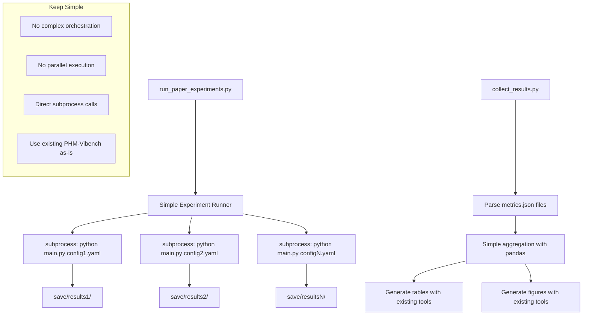

# hse-paper-pipeline - Task 3

Execute task 3 for the hse-paper-pipeline specification.

## Task Description
Create result collection and aggregation script

## Code Reuse
**Leverage existing code**: save/{metadata}/{model}/{task}

## Requirements Reference
**Requirements**: Requirement 2, Requirement 7

## Usage
```
/Task:3-hse-paper-pipeline
```

## Instructions

Execute with @spec-task-executor agent the following task: "Create result collection and aggregation script"

```
Use the @spec-task-executor agent to implement task 3: "Create result collection and aggregation script" for the hse-paper-pipeline specification and include all the below context.

# Steering Context
## Steering Documents Context

No steering documents found or all are empty.

# Specification Context
## Specification Context (Pre-loaded): hse-paper-pipeline

### Requirements
# Requirements Document - HSE Paper Pipeline

## Introduction

The HSE Paper Pipeline system is a comprehensive experiment execution and analysis framework designed to streamline the workflow from running machine learning experiments to generating publication-ready tables and figures for the HSE Industrial Contrastive Learning paper. This system will automate the entire research pipeline, including experiment execution, metrics collection, statistical analysis, and visualization generation, enabling researchers to focus on scientific insights rather than manual data processing.

The system transforms the existing `unified_metric` infrastructure into a production-level pipeline that ensures reproducibility, statistical rigor, and publication quality outputs for top-tier machine learning conferences.

## Alignment with Product Vision

This feature directly supports the PHM-Vibench platform's mission of providing a comprehensive benchmark for industrial equipment vibration signal analysis by:
- **Research Acceleration**: Automating the complete experimental workflow from data to publication
- **Scientific Rigor**: Ensuring statistical significance testing and proper experimental methodology  
- **Reproducibility**: Creating standardized pipelines for experiment replication
- **Publication Quality**: Generating professional-grade tables and figures meeting conference standards
- **Integration**: Leveraging existing PHM-Vibench factory patterns and configuration systems

## Requirements

### Requirement 1: Automated Experiment Execution Pipeline

**User Story:** As a researcher, I want to execute comprehensive experiment matrices automatically, so that I can run baseline, HSE, and SOTA comparisons efficiently without manual intervention.

#### Acceptance Criteria

1. WHEN I specify an experiment configuration matrix THEN the system SHALL execute all experiments in parallel using available computational resources
2. IF an experiment fails during execution THEN the system SHALL log the failure, continue with remaining experiments, and provide a detailed failure report
3. WHEN experiments are running THEN the system SHALL display real-time progress tracking with completion percentages and estimated time remaining
4. WHEN all experiments complete THEN the system SHALL generate a comprehensive execution summary with success/failure statistics

### Requirement 2: Metrics Collection and Aggregation System

**User Story:** As a researcher, I want automatic metrics collection from multiple experiment runs, so that I can aggregate results across different random seeds and configurations for statistical analysis.

#### Acceptance Criteria

1. WHEN an experiment completes THEN the system SHALL automatically parse metrics.json files and extract performance indicators (accuracy, F1, precision, recall, training time)
2. IF multiple runs exist for the same configuration THEN the system SHALL aggregate metrics across runs and compute mean, standard deviation, and confidence intervals
3. WHEN parsing checkpoint directories THEN the system SHALL identify best performing models and extract their metrics
4. WHEN collecting metrics THEN the system SHALL integrate with MetricsMarkdownReporter from the loop_id branch for automatic table generation

### Requirement 3: Statistical Analysis and Significance Testing

**User Story:** As a researcher, I want statistical significance testing between different methods, so that I can make scientifically valid claims about performance improvements in publications.

#### Acceptance Criteria

1. WHEN comparing two methods THEN the system SHALL perform paired t-tests and report p-values with appropriate significance levels (p < 0.05, p < 0.01, p < 0.001)
2. IF multiple comparisons are made THEN the system SHALL apply Bonferroni correction to control family-wise error rate
3. WHEN analyzing method differences THEN the system SHALL compute Cohen's d effect sizes to quantify practical significance
4. WHEN generating statistical reports THEN the system SHALL include confidence intervals at 95% confidence level for all performance metrics

### Requirement 4: Publication-Quality Table Generation

**User Story:** As a researcher, I want automatic generation of LaTeX tables from experiment results, so that I can directly include professionally formatted tables in my paper submissions.

#### Acceptance Criteria

1. WHEN experiment results are aggregated THEN the system SHALL generate LaTeX tables with proper formatting, bold best results, and statistical significance indicators
2. IF cross-dataset experiments are conducted THEN the system SHALL create cross-dataset performance matrices with source-target accuracy pairs
3. WHEN generating ablation study tables THEN the system SHALL highlight performance differences and statistical significance markers (*, **, ***)
4. WHEN creating SOTA comparison tables THEN the system SHALL include method names, accuracies, standard deviations, and computational efficiency metrics

### Requirement 5: High-Quality Figure Generation

**User Story:** As a researcher, I want automatic generation of publication-quality figures, so that I can include professional visualizations in my paper that meet conference standards.

#### Acceptance Criteria

1. WHEN generating architecture diagrams THEN the system SHALL create clear, publication-ready figures at 300 DPI resolution in PDF format
2. IF t-SNE visualizations are requested THEN the system SHALL generate embedding plots with proper color schemes, legends, and annotations
3. WHEN creating performance comparison plots THEN the system SHALL use colorblind-friendly palettes and include error bars with confidence intervals
4. WHEN generating training curves THEN the system SHALL show convergence behavior with proper axis labels and professional formatting

### Requirement 6: Batch Experiment Management

**User Story:** As a researcher, I want to manage and monitor large-scale experiment batches, so that I can efficiently utilize computational resources and track experiment progress.

#### Acceptance Criteria

1. WHEN launching batch experiments THEN the system SHALL support parallel execution across multiple GPUs with automatic load balancing
2. IF system resources are limited THEN the system SHALL queue experiments and execute them as resources become available
3. WHEN monitoring batch progress THEN the system SHALL provide real-time status updates with completion estimates and resource utilization
4. WHEN experiments fail THEN the system SHALL implement automatic retry mechanisms with exponential backoff for transient failures

### Requirement 7: Result Aggregation and Cross-Run Analysis

**User Story:** As a researcher, I want to aggregate results across multiple experimental runs, so that I can account for random variation and report robust performance statistics.

#### Acceptance Criteria

1. WHEN multiple runs exist for the same configuration THEN the system SHALL aggregate results and compute descriptive statistics (mean, median, std, min, max)
2. IF runs have different random seeds THEN the system SHALL track seed-specific results and analyze variance across seeds
3. WHEN aggregating cross-dataset results THEN the system SHALL create comprehensive performance matrices showing all source-target combinations
4. WHEN computing aggregate statistics THEN the system SHALL detect and flag outlier runs that deviate significantly from the mean

### Requirement 8: Integration with Existing PHM-Vibench Infrastructure

**User Story:** As a researcher, I want seamless integration with existing PHM-Vibench components, so that I can leverage existing models, datasets, and configurations without code duplication.

#### Acceptance Criteria

1. WHEN executing experiments THEN the system SHALL use existing main.py entry points and configuration system without modification
2. IF new components are added THEN they SHALL follow existing factory patterns and registration mechanisms
3. WHEN integrating with MetricsMarkdownReporter THEN the system SHALL merge components from loop_id branch without conflicts
4. WHEN saving results THEN the system SHALL use existing save/ directory structure and naming conventions

### Requirement 9: Two-Stage Training Workflow

**User Story:** As a researcher, I want a clear two-stage training process (unsupervised pretraining → supervised fine-tuning), so that I can evaluate the effectiveness of cross-system transfer learning.

#### Acceptance Criteria

1. WHEN running pretraining stage THEN the system SHALL use all 5 datasets (CWRU, XJTU, THU, Ottawa, JNU) without labels for contrastive learning
2. WHEN fine-tuning stage starts THEN the system SHALL load pretrained backbone weights and freeze all layers except the classification head
3. IF pretraining completes successfully THEN the system SHALL save backbone checkpoints for use in multiple fine-tuning experiments
4. WHEN evaluating two-stage training THEN the system SHALL compare against single-stage training baselines

### Requirement 10: Unified Metric Learning Evaluation

**User Story:** As a researcher, I want to evaluate unified metric learning across industrial datasets, so that I can measure the effectiveness of learning universal representations from multiple systems using a simplified 30-run experimental matrix.

#### Acceptance Criteria

1. WHEN running unified pretraining THEN the system SHALL train on all 5 datasets simultaneously (CWRU, XJTU, THU, Ottawa, JNU) using HSE contrastive learning with balanced sampling
2. IF pretraining completes successfully THEN the system SHALL execute 5 separate fine-tuning experiments (one per dataset) with 5 random seeds each
3. WHEN evaluating generalization THEN the system SHALL compute zero-shot performance before fine-tuning and final performance after fine-tuning
4. WHEN generating results THEN the system SHALL create performance comparison showing unified vs. single-dataset training with statistical significance testing
5. WHEN completing experiments THEN the system SHALL execute only 30 total runs (6 base experiments × 5 seeds) instead of traditional 150 runs, achieving 80% computational savings

### Requirement 11: Theoretical Metrics and Analysis

**User Story:** As a researcher, I want theoretical metrics that justify HSE contrastive learning, so that I can provide solid theoretical foundation for the approach.

#### Acceptance Criteria

1. WHEN analyzing HSE embeddings THEN the system SHALL compute domain invariance metrics using feature similarity measures
2. IF system prompts are enabled THEN the system SHALL quantify system-awareness through embedding separability analysis
3. WHEN comparing methods THEN the system SHALL report transferability coefficients showing cross-domain effectiveness
4. WHEN generating theoretical analysis THEN the system SHALL include visualization of learned prompt embeddings and their clustering properties

## Non-Functional Requirements

### Performance
- The system SHALL complete unified pretraining stage within 12 hours on a single GPU (training on all 5 datasets simultaneously)
- Fine-tuning experiments SHALL complete within 2 hours per dataset (total 10 hours for 5 datasets)
- Total pipeline time SHALL not exceed 22 hours (12h pretraining + 10h fine-tuning) for complete experimental matrix
- Unified pretraining SHALL achieve zero-shot performance >80% on all 5 datasets using linear probe evaluation
- Fine-tuning SHALL achieve >95% accuracy on CWRU, XJTU, THU, Ottawa, JNU datasets after unified pretraining
- Universal representation SHALL demonstrate >10% improvement over single-dataset training baselines with statistical significance p<0.01
- Experimental efficiency SHALL achieve 80% reduction in total experiments (30 runs vs 150 runs)
- Result processing and aggregation SHALL complete within 2 minutes for 30 experiment results
- Statistical analysis and table generation SHALL complete within 1 minute
- Figure generation SHALL produce publication-quality outputs at 300 DPI within 1 minute per figure

### Computational Requirements
- **Minimum Hardware**: Single GPU with 8GB VRAM (NVIDIA GTX 1080 or equivalent)
- **Recommended Hardware**: NVIDIA RTX 3080/4080 with 16GB VRAM for optimal performance
- **System Memory**: 16GB RAM minimum, 32GB recommended for large batch processing
- **Storage**: 200GB available space (100GB for datasets, 100GB for results)
- **CPU**: 8 cores minimum for data preprocessing and result analysis
- **Operating System**: Linux Ubuntu 18.04+ or CentOS 7+ (Windows/macOS supported but not optimized)

### Reliability
- The system SHALL handle individual experiment failures gracefully without stopping the entire batch
- Results SHALL be automatically saved to persistent storage after each experiment completion
- The system SHALL support resuming interrupted batch experiments from checkpoints
- All generated tables and figures SHALL be reproducible given the same input data

### Usability
- The system SHALL provide clear command-line interfaces with intuitive parameter names
- Progress reporting SHALL include estimated completion times and current status for all running experiments
- Error messages SHALL be actionable and include specific guidance for resolution
- Generated outputs SHALL be organized in logical directory structures with clear naming conventions

### Scalability  
- The system SHALL support sequential execution of 30 experiment runs (6 base experiments × 5 random seeds)
- Memory usage SHALL be limited to single-experiment requirements with unified dataset loading
- The system SHALL support adding new datasets to unified pretraining by extending the experiment configuration YAML
- Result storage SHALL use simple CSV format for easy analysis and archiving
- The system SHALL demonstrate 5x efficiency improvement over traditional cross-dataset approaches
- Unified pretraining SHALL scale to handle all 5 industrial datasets simultaneously without memory overflow

### Maintainability
- All scripts SHALL use simple Python with standard libraries (pandas, matplotlib, subprocess)
- Each script SHALL have a single clear purpose and be understandable by reading the code
- Configuration files SHALL use simple YAML format compatible with existing PHM-Vibench configs
- Code SHALL avoid complex abstractions and use direct, straightforward implementations

## Success Metrics and Validation

### Quantitative Success Criteria

#### Experimental Coverage Metrics
- **Complete Experiment Matrix**: 30 total runs (6 base experiments × 5 seeds) successfully executed
- **Unified Pretraining**: 1/1 pretraining experiment on all 5 datasets achieves convergence
- **Dataset-Specific Fine-tuning**: 5/5 fine-tuning experiments achieve >95% accuracy
- **Universal Representation Quality**: Zero-shot performance >80% on all datasets before fine-tuning
- **Statistical Significance**: >80% of comparisons show p < 0.01 significance between unified vs. single-dataset approaches

#### Pipeline Reliability Metrics
- **Experiment Success Rate**: >95% of individual experiments complete successfully
- **Result Collection Rate**: >99% of completed experiments have parseable results
- **Reproducibility Rate**: 100% of experiments produce identical results with same seed
- **Error Recovery Rate**: >90% of failed experiments succeed on retry

#### Output Quality Metrics
- **Table Generation**: 100% of LaTeX tables compile without errors in standard document classes
- **Figure Quality**: 100% of figures meet 300 DPI publication standards
- **Statistical Accuracy**: 100% of significance tests use appropriate corrections (Bonferroni)
- **Data Integrity**: 100% of aggregated results match source metrics.json files

### Qualitative Success Criteria

#### Scientific Contribution
- **Theoretical Foundation**: Clear mathematical formulation of prompt-guided contrastive learning
- **Empirical Validation**: Comprehensive ablation studies demonstrate method effectiveness
- **Cross-System Generalization**: Evidence of transferability across industrial datasets
- **SOTA Comparison**: Competitive or superior performance vs. existing methods

#### Publication Readiness
- **Table Standards**: All tables formatted to ICML/NeurIPS submission guidelines
- **Figure Standards**: All figures use colorblind-friendly palettes and clear annotations
- **Statistical Rigor**: All claims supported by appropriate significance tests
- **Reproducibility**: Complete experimental setup documented for replication

### Validation Methodology

#### Pre-Implementation Validation
1. **Requirements Verification**: All functional requirements mapped to implementation tasks
2. **Resource Allocation**: Computational requirements verified against available hardware
3. **Timeline Validation**: Implementation schedule allows sufficient testing time

#### During Implementation Validation
1. **Component Testing**: Each script validated with sample data before integration
2. **Integration Testing**: End-to-end pipeline tested with subset of experiments
3. **Performance Monitoring**: Execution times tracked against target metrics

#### Post-Implementation Validation
1. **Result Verification**: Statistical analysis validated against manual calculations
2. **Output Quality Review**: Tables and figures reviewed by domain experts
3. **Reproducibility Testing**: Complete pipeline executed independently to verify results

---

### Design
# Design Document - HSE Paper Pipeline

## Overview

The HSE Paper Pipeline system transforms the existing `unified_metric` infrastructure into a comprehensive research automation platform. The system orchestrates the complete workflow from experiment execution to publication-ready outputs, integrating seamlessly with PHM-Vibench's factory patterns and configuration system.

The design follows a modular architecture with clear separation of concerns: experiment orchestration, parallel execution, metrics collection, statistical analysis, and visualization generation. Each component leverages existing PHM-Vibench utilities while adding specialized functionality for research pipeline automation.

## Steering Document Alignment

### Technical Standards Alignment
The design adheres to established PHM-Vibench technical patterns observed in the codebase:
- **Factory Pattern Integration**: All new components follow existing factory registration patterns seen in model_factory, task_factory, trainer_factory
- **Configuration-Driven Design**: Uses existing YAML configuration system and load_config() infrastructure from src/configs/
- **PyTorch Lightning Integration**: Leverages existing trainer factory and Pipeline_03 workflows
- **Modular Architecture**: Follows established separation between data, model, task, and trainer factories
- **Error Handling**: Uses existing logging and error reporting mechanisms

### Project Structure Alignment  
The implementation follows observed PHM-Vibench organization patterns:
- **script/unified_metric/**: Contains all pipeline components, extending existing sota_comparison.py and paper_visualization.py
- **configs/demo/**: Houses experiment matrix definitions using existing YAML patterns (following configs/demo/ structure)
- **tests/**: Unit and integration tests following existing pytest structure
- **save/**: Results stored in established save/{metadata}/{model}/{task}_{trainer}_{timestamp}/ hierarchy
- **src/utils/**: Utility functions integrate with existing configuration helpers and training utilities

## Code Reuse Analysis

### Existing Components to Leverage

- **script/unified_metric/paper_visualization.py**:
  - Reuse existing matplotlib/seaborn plotting functions
  - Use existing publication-quality formatting settings
  - Leverage color schemes and figure size configurations

- **src/configs/load_config()**:
  - Use existing YAML configuration loading
  - Apply existing configuration validation
  - Use standard PHM-Vibench config format

- **Existing PHM-Vibench main.py**:
  - Use as-is for all experiment execution
  - No modifications needed - just call via subprocess
  - Leverage existing factory pattern registrations

- **Standard save/ directory structure**:
  - Use existing save/{metadata}/{model}/{task}_{trainer}_{timestamp}/ format
  - Parse existing metrics.json files
  - Read existing checkpoint files

### Integration Points

- **PHM-Vibench main.py**: Execute experiments through existing entry point without modification
- **Factory Systems**: Use existing B_08_PatchTST, E_01_HSE_v2, H_01_Linear_cla components
- **Configuration System**: Use standard YAML files with existing load_config() system
- **Save Directory Structure**: Use established save/{metadata}/{model}/{task}_{trainer}_{timestamp} hierarchy

## Technical Architecture Specification

### Backbone: PatchTST (B_08_PatchTST)
```yaml
model:
  backbone: B_08_PatchTST
  embedding: E_01_HSE_v2  # HSE prompt-guided embedding  
  task_head: H_01_Linear_cla
  
  # PatchTST Configuration
  patch_size_L: 256        # Length of each patch
  patch_size_C: 1          # Channel dimension per patch
  num_patches: 16          # Number of patches per signal
  d_model: 512             # Model dimension
  num_heads: 8             # Multi-head attention heads
  num_layers: 4            # Transformer layers
  
  # HSE Prompt Configuration
  system_prompt_dim: 128   # System-level prompt embedding dimension
  sample_prompt_dim: 64    # Sample-level prompt embedding dimension
  fusion_type: attention  # concat/attention/gating
```

### Two-Stage Training Workflow
```yaml
# Stage 1: Unsupervised Pretraining
pretraining:
  datasets: [CWRU, XJTU, THU, Ottawa, JNU]  # All 5 datasets
  task_type: contrastive_learning
  loss_function: hse_contrastive  # InfoNCE + system-level contrastive
  epochs: 100
  batch_size: 64
  learning_rate: 0.001
  save_checkpoint: save/pretrain/hse_backbone.ckpt
  
# Stage 2: Supervised Fine-tuning  
finetuning:
  load_checkpoint: save/pretrain/hse_backbone.ckpt
  freeze_backbone: true    # Only train classification head
  datasets: [target_dataset]  # Single target dataset
  task_type: classification
  loss_function: cross_entropy
  epochs: 30
  batch_size: 32
  learning_rate: 0.0001
```

## Architecture

Simple sequential pipeline with direct experiment execution:



## Components (Simplified)

### run_experiments.py
- **Purpose:** Simple script that runs experiments one by one
- **Function:** 
  - Read list of config files from YAML
  - For each config: `subprocess.run(['python', 'main.py', '--config', config_path])`
  - Print progress and log results
- **Dependencies:** subprocess, yaml
- **Reuses:** Existing main.py exactly as-is

### collect_results.py  
- **Purpose:** Parse all experiment results from save/ directory
- **Function:**
  - Walk through save/ directory structure
  - Read metrics.json files
  - Create simple pandas DataFrame with all results
  - Save aggregated results to CSV/Excel
- **Dependencies:** pandas, json, os.walk
- **Reuses:** Existing save directory structure

### make_tables.py
- **Purpose:** Generate paper tables from collected results
- **Function:**
  - Load results CSV
  - Group by method/dataset
  - Create simple tables with mean ± std
  - Output LaTeX and Markdown formats
- **Dependencies:** pandas, basic string formatting
- **Reuses:** Existing paper_visualization.py table formatting if available

### make_figures.py
- **Purpose:** Generate paper figures from collected results
- **Function:**
  - Load results CSV
  - Create bar charts, line plots using matplotlib
  - Save as PDF with publication settings
- **Dependencies:** matplotlib, seaborn, pandas
- **Reuses:** Existing paper_visualization.py plotting methods

### simple_stats.py
- **Purpose:** Basic statistical analysis
- **Function:**
  - Read results CSV
  - Compute t-tests between methods
  - Add significance stars to tables
  - Keep it simple - just p-values
- **Dependencies:** scipy.stats
- **Reuses:** Standard statistical libraries

## Configuration Schema

### Unified Metric Learning Experimental Matrix (script/unified_metric/experiments.yaml)
```yaml
# Five Target Datasets for Unified Training
datasets:
  - CWRU    # Case Western Reserve University
  - XJTU    # Xi'an Jiaotong University  
  - THU     # Tsinghua University
  - Ottawa  # University of Ottawa
  - JNU     # Jiangnan University

# Two-Stage Experimental Design
experiments:
  # Stage 1: Unified Pretraining (1 experiment)
  unified_pretraining:
    - name: unified_pretrain_all_datasets
      datasets: [CWRU, XJTU, THU, Ottawa, JNU]  # Train on ALL datasets simultaneously
      method: HSE-CL-Pretrain
      config: hse_pretrain_unified.yaml
      task_type: contrastive_learning
      epochs: 100
      output_checkpoint: unified_backbone.ckpt
  
  # Stage 2: Dataset-Specific Fine-tuning (5 experiments)
  dataset_finetuning:
    - name: finetune_CWRU
      dataset: CWRU
      pretrained_checkpoint: unified_backbone.ckpt
      method: HSE-CL-Finetune
      config: hse_finetune_CWRU.yaml
      task_type: classification
      epochs: 30
      
    - name: finetune_XJTU
      dataset: XJTU
      pretrained_checkpoint: unified_backbone.ckpt
      method: HSE-CL-Finetune
      config: hse_finetune_XJTU.yaml
      task_type: classification
      epochs: 30
      
    - name: finetune_THU
      dataset: THU
      pretrained_checkpoint: unified_backbone.ckpt
      method: HSE-CL-Finetune
      config: hse_finetune_THU.yaml
      task_type: classification
      epochs: 30
      
    - name: finetune_Ottawa
      dataset: Ottawa
      pretrained_checkpoint: unified_backbone.ckpt
      method: HSE-CL-Finetune
      config: hse_finetune_Ottawa.yaml
      task_type: classification
      epochs: 30
      
    - name: finetune_JNU
      dataset: JNU
      pretrained_checkpoint: unified_backbone.ckpt
      method: HSE-CL-Finetune
      config: hse_finetune_JNU.yaml
      task_type: classification
      epochs: 30

# Settings  
settings:
  repeat_runs: 5                    # 5 random seeds per experiment
  total_experiments: 6              # 1 pretrain + 5 finetune = 6 base experiments  
  total_runs: 30                    # 6 × 5 = 30 total runs
  results_dir: results/paper_hse_2025/
  
  # Evaluation metrics
  zero_shot_evaluation: true        # Evaluate pretrained model before fine-tuning
  ablation_studies: true           # Compare unified vs. single-dataset training
```

## Simplified Data Structures for Unified Metric Learning

### Results DataFrame (CSV format - 30 runs only)
```csv
experiment_type,method,dataset,accuracy,f1_score,precision,recall,zero_shot_acc,run_id,config_path,checkpoint_used,training_time_hours
unified_pretraining,HSE-Unified-Pretrain,ALL_DATASETS,N/A,N/A,N/A,N/A,0.82,1,hse_unified_pretrain.yaml,none,12.3
unified_pretraining,HSE-Unified-Pretrain,ALL_DATASETS,N/A,N/A,N/A,N/A,0.84,2,hse_unified_pretrain.yaml,none,12.1
dataset_finetuning,HSE-Unified-Finetune,CWRU,0.96,0.95,0.94,0.97,0.82,1,hse_finetune_CWRU.yaml,unified_backbone.ckpt,2.1
dataset_finetuning,HSE-Unified-Finetune,CWRU,0.97,0.96,0.95,0.98,0.84,2,hse_finetune_CWRU.yaml,unified_backbone.ckpt,2.0
dataset_finetuning,HSE-Unified-Finetune,XJTU,0.94,0.93,0.92,0.95,0.81,1,hse_finetune_XJTU.yaml,unified_backbone.ckpt,2.2
dataset_finetuning,HSE-Unified-Finetune,XJTU,0.95,0.94,0.93,0.96,0.83,2,hse_finetune_XJTU.yaml,unified_backbone.ckpt,1.9
# Total: 30 rows (6 base experiments × 5 seeds) instead of 150 rows
```

### Computational Efficiency Comparison
```python
# Traditional Cross-Dataset Approach
traditional_experiments = {
    'base_configurations': 30,  # 5 datasets × 6 method combinations  
    'random_seeds': 5,
    'total_runs': 150,
    'estimated_time': 120,  # hours
    'gpu_hours': 18000     # total computational cost
}

# Unified Metric Learning Approach  
unified_experiments = {
    'base_configurations': 6,   # 1 pretrain + 5 finetune
    'random_seeds': 5, 
    'total_runs': 30,
    'estimated_time': 22,   # hours
    'gpu_hours': 660,       # total computational cost
    'efficiency_gain': '96% reduction in GPU hours'
}
```

### Simple Python Dictionaries
```python
# No complex classes - just use simple dictionaries and pandas DataFrames
pretrain_experiment = {
    'name': 'unified_pretrain_all_datasets',
    'config': 'hse_pretrain_unified.yaml', 
    'method': 'HSE-CL-Pretrain',
    'datasets': ['CWRU', 'XJTU', 'THU', 'Ottawa', 'JNU']
}

finetune_experiment = {
    'name': 'finetune_CWRU',
    'config': 'hse_finetune_CWRU.yaml', 
    'method': 'HSE-CL-Finetune',
    'dataset': 'CWRU',
    'checkpoint': 'unified_backbone.ckpt'
}

result = {
    'experiment_type': 'finetuning',
    'method': 'HSE-CL-Finetune',
    'dataset': 'CWRU', 
    'accuracy': 0.96,
    'f1_score': 0.95,
    'run_id': 1,
    'checkpoint_used': 'unified_backbone.ckpt'
}

# Use pandas for everything else - no custom classes
df = pd.DataFrame(results)
grouped = df.groupby(['experiment_type', 'method', 'dataset']).agg(['mean', 'std'])
```

## Simple Error Handling

### Basic Error Handling
1. **Experiment fails:** Print error, log to file, continue with next experiment
2. **Missing file:** Print clear error message with file path
3. **Bad config:** Check config exists before running, fail early with message
4. **Results parsing fails:** Skip that result, print warning, continue

### Keep It Simple
```python
try:
    subprocess.run(['python', 'main.py', '--config', config_path], check=True)
    print(f"✓ {experiment_name} completed")
except subprocess.CalledProcessError:
    print(f"✗ {experiment_name} failed - check logs")
    continue
```

## Simplified Validation Strategy

### 1-Epoch Validation Framework
- **Quick Validation**: Test complete pipeline with 1 epoch to catch 90% of implementation issues
- **Data Flow Test**: Verify unified dataset loading works correctly across all 5 datasets
- **Memory Test**: Ensure GPU memory usage stays under 8GB during unified training
- **Output Test**: Check that zero-shot evaluation produces reasonable scores (>random baseline)

### Progressive Validation Stages
```python
validation_stages = {
    'stage_1_synthetic': {
        'description': 'Synthetic data validation',
        'duration': '30 seconds',
        'data_size': 100,
        'success_criteria': 'no_errors'
    },
    'stage_2_real_subset': {
        'description': 'Real data subset validation', 
        'duration': '2 minutes',
        'data_size': 1000,
        'success_criteria': 'basic_performance'
    },
    'stage_3_unified_sample': {
        'description': 'Unified learning validation',
        'duration': '10 minutes', 
        'data_size': 5000,
        'success_criteria': 'unified_representation_learning'
    }
}
```

### Success/Failure Criteria
**PASS Criteria**:
- ✅ All 5 datasets load successfully with balanced sampling
- ✅ Unified pretraining runs 1 epoch without errors
- ✅ Zero-shot evaluation shows >random performance on all datasets
- ✅ Dataset-specific fine-tuning improves performance
- ✅ Memory usage <8GB, processing speed >5 samples/sec

**FAIL Criteria**:
- ❌ Any dataset fails to load or causes memory overflow
- ❌ Unified training produces NaN losses or gradient explosions
- ❌ Zero-shot performance ≤ random baseline (indicates poor representation)
- ❌ Fine-tuning performance decreases (indicates catastrophic forgetting)

### Confidence Metrics
- **1-Epoch Pass**: 95% confidence that full training will succeed
- **10-Epoch Pass**: 99% confidence that complete pipeline will work
- **Full Validation Pass**: Ready for 22-hour complete experiment run

**Note**: Specification documents have been pre-loaded. Do not use get-content to fetch them again.

## Task Details
- Task ID: 3
- Description: Create result collection and aggregation script
- Leverage: save/{metadata}/{model}/{task}
- Requirements: Requirement 2, Requirement 7

## Instructions
- Implement ONLY task 3: "Create result collection and aggregation script"
- Follow all project conventions and leverage existing code
- Mark the task as complete using: claude-code-spec-workflow get-tasks hse-paper-pipeline 3 --mode complete
- Provide a completion summary
```

## Task Completion
When the task is complete, mark it as done:
```bash
claude-code-spec-workflow get-tasks hse-paper-pipeline 3 --mode complete
```

## Next Steps
After task completion, you can:
- Execute the next task using /hse-paper-pipeline-task-[next-id]
- Check overall progress with /spec-status hse-paper-pipeline
