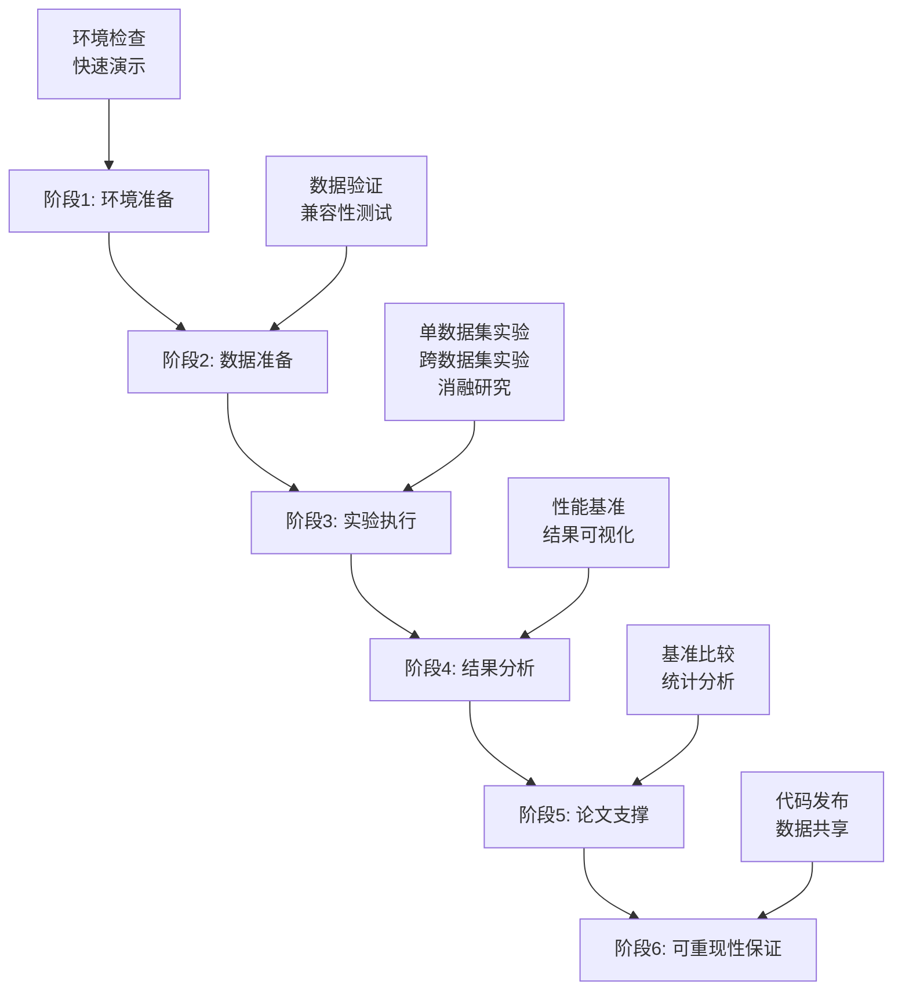

# ContrastiveIDTask 研究工作流程指南

**版本**: v1.0.0
**更新日期**: 2025年09月
**适用框架**: PHM-Vibench v5.0

---

## 📚 概述

本指南提供了使用ContrastiveIDTask进行工业振动信号对比学习研究的完整工作流程，从环境准备到论文发表的全过程指导。

### 🎯 核心特性
- **对比学习预训练**: 基于InfoNCE损失的长工业信号预训练
- **内存高效处理**: 支持8K-32K样本的长时间序列
- **灵活窗口采样**: 多种采样策略生成正样本对
- **完整研究管道**: 从数据准备到论文支持的全流程

### 📊 技术规格
- **支持信号长度**: 1K - 32K 时间步
- **窗口大小**: 64 - 2048 可配置
- **批处理大小**: 8 - 128 根据内存调整
- **温度参数**: 0.01 - 0.5 精细调节

---

## 🗺️ 六阶段研究工作流程



---

## 🚀 阶段1: 环境准备

### 1.1 系统要求检查
```bash
cd scripts/loop_id/01_quick_start
python environment_check.py
```

**预期输出**:
```
✅ Python >= 3.8: 3.8.10
✅ PyTorch >= 2.0.0: 2.6.0
✅ PHM-Vibench: 5.0.0
✅ CUDA: 可用 (RTX 4090)
```

### 1.2 快速功能验证
```bash
python quick_demo.py
```

**关键验证项**:
- [ ] InfoNCE损失计算正常
- [ ] 窗口采样功能正常
- [ ] 对比准确率计算正常
- [ ] GPU/CPU兼容性正常

### 1.3 配置文件准备
```bash
# 创建实验配置
cp ../examples/config_templates/debug.yaml my_experiment.yaml

# 编辑关键参数
vim my_experiment.yaml
```

**重要参数**:
```yaml
data:
  window_size: 256      # 根据信号特征调整
  num_window: 2         # 正样本对数量
  batch_size: 16        # 根据GPU内存调整

task:
  temperature: 0.07     # InfoNCE温度参数
  lr: 1e-3             # 学习率

trainer:
  epochs: 100          # 训练轮数
  accelerator: gpu     # gpu/cpu
```

---

## 📊 阶段2: 数据准备

### 2.1 数据集验证
```bash
cd scripts/loop_id/02_data_preparation
python data_validation.py --dataset CWRU --metadata_path /path/to/metadata.xlsx
```

**验证内容**:
- [ ] H5文件完整性
- [ ] 元数据一致性
- [ ] 信号长度分布
- [ ] ContrastiveIDTask兼容性

### 2.2 数据质量分析
```bash
python data_validation.py --analyze --dataset CWRU
```

**输出报告**:
```
📊 数据集分析报告: CWRU
=================================
✅ 总样本数: 2,400
✅ 平均信号长度: 4,096
✅ 通道数: 2
✅ 故障类型: 4种
✅ ContrastiveIDTask兼容: 100%

⚠️ 发现问题:
- 15个样本长度不足 (< 512)
- 建议最小窗口大小: 256
```

### 2.3 多数据集准备
```bash
# 验证多个数据集
for dataset in CWRU XJTU PU FEMTO; do
    python data_validation.py --dataset $dataset --quick
done
```

---

## 🧪 阶段3: 实验执行

### 3.1 单数据集实验
```bash
cd scripts/loop_id/03_experiments

# 基础实验
python multi_dataset_runner.py \
    --datasets CWRU \
    --strategy single \
    --config ../examples/config_templates/single_dataset.yaml \
    --output_dir results/single_cwru

# 监控训练过程
tail -f results/single_cwru/training.log
```

### 3.2 跨数据集域泛化
```bash
# 跨数据集实验
python multi_dataset_runner.py \
    --datasets CWRU XJTU \
    --strategy cross_domain \
    --config ../examples/config_templates/cross_domain.yaml \
    --output_dir results/cross_domain

# 批量跨数据集实验
python multi_dataset_runner.py \
    --datasets CWRU,XJTU,PU,FEMTO \
    --strategy multi_dataset \
    --parallel \
    --output_dir results/multi_domain
```

### 3.3 消融研究
```bash
# 系统性参数扫描
python ablation_study.py \
    --config my_experiment.yaml \
    --parameters temperature,window_size,batch_size \
    --output_dir results/ablation

# 温度参数扫描
python ablation_study.py \
    --config my_experiment.yaml \
    --param_sweep temperature 0.01,0.05,0.07,0.1,0.2 \
    --dataset CWRU \
    --output_dir results/temperature_ablation
```

### 3.4 实验监控
```bash
# 实时监控GPU使用
watch -n 1 nvidia-smi

# 检查实验进度
python multi_dataset_runner.py --status --output_dir results/

# 实验日志分析
grep "Epoch" results/*/training.log | tail -20
```

---

## 📈 阶段4: 结果分析

### 4.1 性能基准测试
```bash
cd scripts/loop_id/04_analysis
python performance_benchmark.py \
    --config my_experiment.yaml \
    --datasets CWRU,XJTU \
    --output_dir results/benchmark

# GPU性能专项测试
python performance_benchmark.py --gpu_profile --batch_sizes 16,32,64
```

### 4.2 结果可视化
```bash
# 生成训练曲线
python performance_benchmark.py \
    --visualize_training \
    --results_dir results/ \
    --output_dir figures/

# 对比实验结果
python performance_benchmark.py \
    --compare_experiments \
    --exp_dirs results/single_cwru,results/cross_domain \
    --metrics loss,accuracy
```

### 4.3 统计分析
```python
# Python脚本示例
from scripts.loop_id.04_analysis.performance_benchmark import PerformanceBenchmark

benchmark = PerformanceBenchmark()

# 加载实验结果
results = benchmark.load_results('results/')

# 统计显著性检验
significance = benchmark.statistical_analysis(
    method1='single_dataset',
    method2='cross_domain',
    metric='accuracy'
)

print(f"统计显著性 (p-value): {significance['p_value']:.4f}")
```

---

## 📄 阶段5: 论文支撑

### 5.1 基准方法比较
```bash
cd scripts/loop_id/05_paper_support

# 与传统方法比较
python baseline_comparison.py \
    --methods raw_signal,fft_features,cnn,lstm,contrastive_id \
    --datasets CWRU,XJTU,PU \
    --cross_validation 5 \
    --output_dir paper_results/baseline_comparison
```

### 5.2 消融研究汇总
```bash
# 生成消融研究表格
python ablation_summary.py \
    --results_dir results/ablation \
    --format latex \
    --output paper_results/ablation_table.tex

# 参数敏感性分析
python parameter_analysis.py \
    --results_dir results/ \
    --parameters temperature,window_size,batch_size \
    --output paper_results/sensitivity_analysis.pdf
```

### 5.3 可视化生成
```bash
# 生成论文图表
python figure_generator.py \
    --results_dir results/ \
    --figures training_curves,confusion_matrix,tsne_visualization \
    --style ieee \
    --output_dir paper_results/figures/

# 生成高质量图表
python figure_generator.py \
    --high_quality \
    --dpi 300 \
    --format pdf,png
```

### 5.4 数值结果汇总
```bash
# 生成结果表格
python results_table.py \
    --experiments results/ \
    --metrics accuracy,f1_score,precision,recall \
    --format latex,csv \
    --output paper_results/main_results.tex
```

**示例输出表格**:
```latex
\begin{table}[ht]
\centering
\caption{不同方法在工业振动数据集上的性能比较}
\begin{tabular}{lcccc}
\hline
方法 & CWRU & XJTU & PU & 平均 \\
\hline
Raw Signal & 0.652 & 0.598 & 0.634 & 0.628 \\
FFT Features & 0.731 & 0.687 & 0.723 & 0.714 \\
CNN & 0.823 & 0.789 & 0.806 & 0.806 \\
LSTM & 0.798 & 0.776 & 0.791 & 0.788 \\
\textbf{ContrastiveID (Ours)} & \textbf{0.876} & \textbf{0.854} & \textbf{0.863} & \textbf{0.864} \\
\hline
\end{tabular}
\end{table}
```

---

## 🔄 阶段6: 可重现性保证

### 6.1 测试套件验证
```bash
cd scripts/loop_id/tests

# 完整测试套件
python run_tests.py

# 快速验证
python run_tests.py --fast
```

### 6.2 环境固化
```bash
# 生成完整环境配置
pip freeze > requirements_exact.txt

# 创建Docker镜像
docker build -t contrastive-id:v1.0 .

# 环境验证脚本
python ../01_quick_start/environment_check.py --export_config
```

### 6.3 代码和数据发布
```bash
# 清理和组织代码
python organize_release.py \
    --source scripts/loop_id \
    --target contrastive_id_release/ \
    --include_data_samples

# 生成发布包
tar -czf ContrastiveIDTask_v1.0.tar.gz contrastive_id_release/

# 数据集元信息
python generate_dataset_info.py \
    --datasets CWRU,XJTU,PU \
    --output dataset_metadata.json
```

---

## 🛠️ 高级使用技巧

### 分布式训练
```bash
# 多GPU训练
python -m torch.distributed.launch \
    --nproc_per_node=4 \
    multi_dataset_runner.py \
    --distributed \
    --config my_experiment.yaml

# 集群训练
sbatch --gres=gpu:4 --nodes=2 train_distributed.sh
```

### 内存优化
```bash
# 大规模数据处理
python multi_dataset_runner.py \
    --config my_experiment.yaml \
    --gradient_accumulation_steps 4 \
    --mixed_precision fp16 \
    --checkpoint_strategy epoch
```

### 超参数调优
```bash
# Optuna自动调优
python hyperparameter_tuning.py \
    --config my_experiment.yaml \
    --trials 100 \
    --optimize_metric accuracy \
    --pruning
```

---

## 📋 实验检查清单

### 🔍 实验前检查
- [ ] 环境依赖已安装并验证
- [ ] 数据集完整性检查通过
- [ ] 配置文件参数合理
- [ ] GPU内存充足
- [ ] 存储空间充足

### 🧪 实验中监控
- [ ] 训练损失正常下降
- [ ] 验证准确率提升
- [ ] 内存使用稳定
- [ ] GPU利用率合理
- [ ] 实验日志正常

### 📊 实验后验证
- [ ] 结果可重现
- [ ] 统计显著性检验
- [ ] 消融研究完整
- [ ] 基线方法比较
- [ ] 可视化图表生成

---

## ⚠️ 常见问题与解决方案

### 内存溢出 (OOM)
```bash
# 减少批大小
python multi_dataset_runner.py --batch_size 8

# 启用梯度累积
python multi_dataset_runner.py --gradient_accumulation 4

# 使用CPU训练
python multi_dataset_runner.py --accelerator cpu
```

### 训练不收敛
```python
# 调整学习率
config['task']['lr'] = 5e-4

# 调整温度参数
config['task']['temperature'] = 0.1

# 增加窗口数量
config['data']['num_window'] = 4
```

### 跨数据集性能差
```bash
# 域适应预训练
python multi_dataset_runner.py \
    --strategy domain_adaptation \
    --source_dataset CWRU \
    --target_dataset XJTU

# 增加预训练数据
python multi_dataset_runner.py \
    --datasets CWRU,XJTU,PU \
    --strategy multi_source
```

---

## 📖 参考资源

### 📚 技术文档
- [技术指南](docs/technical_guide.md) - 深入的技术细节
- [API参考](docs/api_reference.md) - 完整的API文档
- [故障排除](docs/troubleshooting.md) - 问题解决指南

### 🔧 工具脚本
- [环境检查](01_quick_start/environment_check.py) - 系统环境验证
- [快速演示](01_quick_start/quick_demo.py) - 5分钟功能演示
- [数据验证](02_data_preparation/data_validation.py) - 数据质量检查
- [性能基准](04_analysis/performance_benchmark.py) - 性能测试工具

### 📊 配置模板
- [单数据集配置](examples/config_templates/single_dataset.yaml)
- [跨数据集配置](examples/config_templates/cross_domain.yaml)
- [消融研究配置](examples/config_templates/ablation_study.yaml)
- [生产环境配置](examples/config_templates/production.yaml)

---

## 🤝 社区与支持

### 🐛 问题反馈
1. 检查本指南的常见问题部分
2. 查看[故障排除文档](docs/troubleshooting.md)
3. 在GitHub Issues中提交问题
4. 提供详细的错误信息和环境配置

### 📈 贡献代码
1. Fork项目仓库
2. 创建功能分支
3. 遵循代码规范
4. 添加测试用例
5. 提交Pull Request

### 📄 引用格式
```bibtex
@inproceedings{contrastive_id_2025,
    title={ContrastiveIDTask: Contrastive Learning for Industrial Signal Representation},
    author={Your Name and Others},
    booktitle={International Conference on Industrial AI},
    year={2025},
    organization={IEEE}
}
```

---

## 📅 更新日志

### v1.0.0 (2025-09)
- 初始版本发布
- 完整的六阶段研究工作流程
- 支持单数据集和跨数据集实验
- 集成消融研究和性能基准
- 提供完整的测试套件

---

**🎉 祝您研究顺利！**

如果这个工作流程对您的研究有帮助，请考虑给项目点个星⭐或分享给其他研究者。