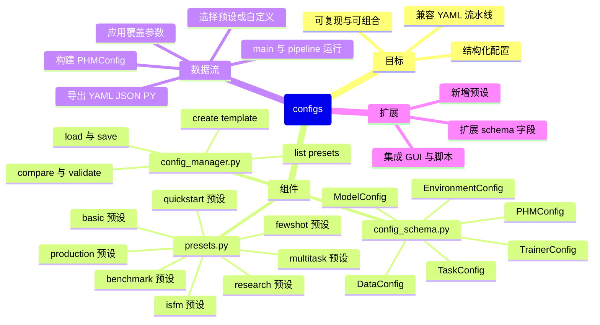

# PHM-Vibench 配置子系统（src/configs）

本页介绍配置子系统的整体设计、使用方法与最佳实践，帮助你以“结构化方式”管理实验配置，并与现有的 YAML 驱动流水线无缝衔接。

- 面向对象的配置模型（Pydantic）：`config_schema.py`
- 预设与模板：`presets.py`
- 加载/合并/导出/比较：`config_manager.py`
- 向后兼容与迁移：`legacy_compat.py`（如存在）

> 现有流水线（如 `src/Pipeline_01_default.py`）直接读取 YAML。你可以用本子系统生成/管理配置，再“导出 YAML”交给流水线运行，从而兼顾易用与可维护。

## 思维导图（Mermaid）



> 若渲染不出 Mermaid，可参考下方 ASCII 版本：

```
configs
├─ config_schema.py  (Pydantic 模型: Environment/Data/Model/Task/Trainer/PHMConfig)
├─ presets.py        (预设: quickstart/basic/isfm/benchmark/research/production/multitask/fewshot)
└─ config_manager.py (load/save/compare/validate/list_presets/create_template)
   流程: 预设/文件 -> PHMConfig -> 导出YAML -> main.py/pipeline 使用
```

## 快速上手

- 目标：用“预设 + 覆盖项”生成配置，导出 YAML，并使用现有流水线运行。

示例（Python 脚本片段）：

```python
from src.configs.config_manager import ConfigManager

# 1) 创建管理器（默认 ./configs 为工作目录）
manager = ConfigManager()

# 2) 加载预设 + 覆盖项（可使用嵌套 dict 或双下划线语法）
cfg = manager.load(
    "quickstart",
    overrides={
        "model": {"name": "ResNet1D", "type": "CNN", "num_classes": 4},
        "trainer": {"num_epochs": 12},
    },
)

# 3) 导出为 YAML（流水线可直接读取）
manager.save(cfg, "configs/tmp/quickstart.yaml")

# 4) 运行（命令行）
# python main.py --config_path configs/tmp/quickstart.yaml --pipeline Pipeline_01_default
```

等价的“双下划线”写法：
```python
cfg = manager.load(
    "quickstart",
    overrides={
        "model__name": "ResNet1D",
        "model__type": "CNN",
        "model__num_classes": 4,
        "trainer__num_epochs": 12,
    },
)
```

## 预设（presets.py）

- 可用预设：
  - `quickstart`（5分钟上手）、`basic`、`isfm`、`research`、`production`、`benchmark`、`multitask`、`fewshot`
- 查看预设清单：

```python
from src.configs.presets import list_presets
print(list_presets())
```

- 获取并自定义：

```python
from src.configs.presets import get_preset_config
cfg = get_preset_config("isfm", model__d_model=256, trainer__num_epochs=150)
```

- 创建自定义预设（基于某个预设）：

```python
from src.configs.presets import create_custom_preset
custom = create_custom_preset(
    name="my_isfm_256",
    base_preset="isfm",
    model__d_model=256,
    trainer__num_epochs=150,
)
```

## 模型与字段（config_schema.py）

- 主入口：`PHMConfig`，聚合五大区段：`environment`、`data`、`model`、`task`、`trainer`。
- 类型与验证：基于 Pydantic，字段有默认值/范围校验，并在 Model/Task/Trainer 之间做一致性同步（如 `task.epochs` 与 `trainer.num_epochs`）。
- ISFM 必填：当 `model.type == 'ISFM'` 时，需提供 `embedding/backbone/task_head`。
- 双下划线赋值规则：`section__param=value`，可与嵌套 dict 混用。

常见片段：
```python
from src.configs.config_schema import PHMConfig
cfg = PHMConfig(
    data__data_dir="./data",
    data__metadata_file="metadata.xlsx",
    model__name="M_01_ISFM",
    model__type="ISFM",
    model__embedding="E_01_HSE",
    model__backbone="B_08_PatchTST",
    model__task_head="H_01_Linear_cla",
    task__name="classification",
    task__type="DG",
    trainer__num_epochs=100,
)
```

## 管理器（config_manager.py）

- `load(source, overrides=None, validate=True)`：
  - `source` 可为 预设名/文件路径/字典
  - 自动合并覆盖项，生成 `PHMConfig`
  - `validate=True` 时运行 schema 校验并给出警告
- `save(config, path, format='auto', minimal=True, add_comments=True)`：
  - `yaml/json/py/auto`，默认最小化保存（仅非默认项）并附注释头
  - `to_legacy_dict()` 产出的 YAML 能直接被现有流水线读取
- `compare(config1, config2)`：差异统计与汇总（`added/removed/modified`）
- `validate(config, strict=False)`：返回 `(is_valid, errors, warnings)`
- `create_template(template_name, base_preset, output_path=None, **overrides)`：快速生成带注释的模板
- `list_presets()`：返回预设字典
- `get_history()`：记录每次 `load()` 的时间、来源与摘要

示例：
```python
from src.configs.config_manager import ConfigManager
m = ConfigManager()
a = m.load("quickstart")
b = m.load("isfm", overrides={"trainer": {"num_epochs": 150}})
print(m.compare(a, b))
```

## 与流水线集成

- 现状：流水线读取 YAML（`src/utils/config_utils.py:1` 的 `load_config`）。
- 推荐实践：用本子系统生成配置 → `manager.save(..., ".yaml")` → `main.py --config_path <yaml>`。
- 进阶（可选）：在 `main.py` 增加 `--preset` 参数，运行时用 `ConfigManager.load()` 生成临时 YAML 后转交流水线（保持对旧 YAML 的兼容）。

## 常见问题（FAQ）

- Q: 预设生成的 `data.metadata_file` 和 `data.data_dir` 不存在怎么办？
  - A: 这是占位默认值，请替换为本地实际路径与元数据文件名（如 `metadata_*.xlsx` 或 `metadata_dummy.csv`）。
- Q: ISFM 报“缺少必需字段”？
  - A: 当 `model.type='ISFM'` 时，必须提供 `embedding/backbone/task_head`。使用 `get_isfm_config()` 预设最方便。
- Q: 保存 YAML 太冗长？
  - A: `save(..., minimal=True)` 会仅保留非默认项；仍可设置 `add_comments=False` 进一步精简。
- Q: 如何列出或搜索预设？
  - A: `from src.configs.presets import list_presets; print(list_presets())`。

## 最佳实践清单

- 用 `presets` 起步，确保字段齐全与默认值合理。
- 使用“双下划线”覆盖关键超参，保留可追溯性。
- 在导出 YAML 前运行 `validate()`/`compare()`，控制变更范围。
- 将导出的 YAML 归档到 `configs/experiments/` 便于复现与对比。

---

- 相关文件：
  - `src/configs/config_schema.py:1`
  - `src/configs/presets.py:1`
  - `src/configs/config_manager.py:1`
  - `src/Pipeline_01_default.py:1`
  - `src/utils/config_utils.py:1`
